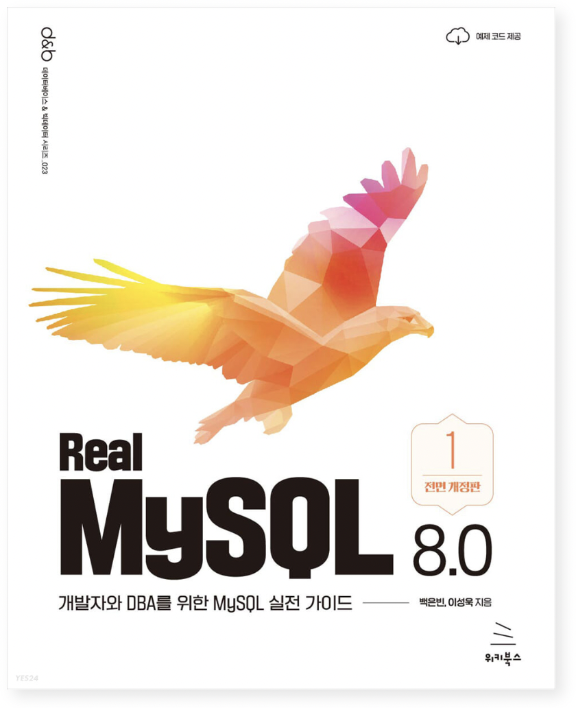

# Real MySQL 8.0 스터디

 

-----

## 📆 개요

- 기간: 2022. 12. 14.(수) ~
- 매주 수요일 15시 콘코디언 빌딩 18층에서 진행합니다.
- Real MySQL 8.0을 읽고 정리하고 모여서 공유하고 질문하고 답합니다.

 

## 📚 정리 자료

| 챕터                              | 정리 자료 |
| --------------------------------- | :-------- |
| 01장. 소개                         | - |
| 02장. 설치와 설정                    |  |

 

## 📜 진행 방식

- 주 1회 수요일에 스터디를 진행합니다.

- 정리 자료는 <u>화요일 21:00</u>까지 `main` branch로 PR을 요청합니다

- 다른 사람의 요청 PR은 스터디 주 <u>일요일 21:00</u>까지 코멘트나 이모지를 달아주세요.

  (<small>일요일 21시 이후 merge됩니다</small>)

 

## PR 규칙

- 브랜치명: `챕터번호/닉네임`(e.g. 02/sun)
- 파일명: `my-sql/chapter{N}/` 경로의 `N_제목_이름` (e.g. my-sql/chapter02/02\_설치와설정_전선규.md)
- PR: main 브랜치로 직접 pr (e.g. 02/sun -> main)
- PR명: 제목 앞에 `[N장]` 포함, 이외 자유(e.g. [2장] 설치와 설정)

 

## 기타

- git 사용 방법 및 pr 방식 등은 [git-basic](./documents/git-basic/README.md)을 참고해주세요.

