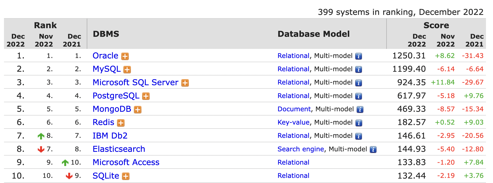

# 1. 소개

 

## 1-1. MySQL 소개

##### MySQL의 역사

- 1979년 스웨덴의 TcX 회사의 터미널 인터페이스 라이브러리인 UNIREG로부터 시작
- 1994년 UNIREG은 TcX 사내에서만 웹 시스템의 데이터베이스로 사용하기 시작하면서 MySQL 1.0이 완성
- 1996년 일반인에게 공개
- 2000년 TcX에서 MySQL을 개발한 중심인물(몬티, 데이빗)이 MySQL AB라는 회사로 독립하면서 FPL(Free Public License) 정책으로 바뀜
- 2006년 현재와 같은 두 가지 라이센스 정책을 취함
  - **MySQL Enterprise Edition** vs **MySQL Community Edition**
    - MySQL 5.5 이전 버전까지 엔터프라이즈와 커뮤니티는 소스코드는 동일하고, 차이는 얼마나 자주 패치 버전이 릴리즈되느냐의 차이였음
    - 2011년 2월 MySQL 5.5 GA(General Available) 버전부터는 엔터프라이즈 에디션의 소스코드가 더는 공개되지 않도록 바뀜
- 2008년 썬 마이크로시스템즈이 인수
- 2010년 오라클이 인수
  - MySQL 5.5 버전부터 5.7 버전까지는 안정성과 성능 개선에 집중했고, MySQL 8.0 버전부터는 상용 DBMS가 가지고 있는 기능들이 장착되기 시작

 

## 1-2. 왜 MySQL인가?

##### 왜 MySQL을 사용하는가

- MySQL과 오라클을 비교해보면, MySQL의 경랭력은 가격이나 비용으로, 초기에는 두 RDBMS의 주요 고객이 완전히 달랐음
- 하지만 이제는 금전적인 트랜잭션 처리라고 해서 MySQL 서버를 처음부터 배제하지 않음
- 국내 유명 포털 사이트도 빌링 시스템을 MySQL 서버로 구현해서 사용하고, 코어 뱅킹 시스템은 아닐지라도 국내 대형 은행 시스템에서도 MySQL 서버를 사용
- 전자 제품 발전과 서버 컴퓨터 시장의 변화는 엄청난 양의 데이터를 만들어내기 시작함
  - MySQL 서버가 오라클 RDBMS와 경쟁하지 않아도 사용될 곳이 무한정 늘어나고 있음
  - 방대한 양의 데이터를 저장하기에 오라클 RDBMS는 너무 비쌈
  - 페이스북에 근무하는 DBA는 *"페이스북이 가진 데이터를 모두 오라클 RDBMS에 저장하면 페이스북은 망할 것이다*"라고 하기도 함

 

##### 어떤 DBMS를 사용해야 하는가?

- [https://db-engines.com/en/ranking](https://db-engines.com/en/ranking)

- 자신이 가장 잘 활용할 수 있는 DBMS가 가장 좋은 DBMS

- DBMS를 선택할 때 고려하는 사항들

  성능이나 기능은 돈이나 노력으로 해결되지만 안전성을 그렇지 않다. 안전성 다음으로 성능과 기능을 고려해보고, 그다음으로는 커뮤니티나 인지도도 함께 고려해보라. 커뮤니티나 인지도가 적은 DBMS는 필요한 경험이나 지식을 구하기 어렵다.

  - 안정성
  - 성능과 기능
  - 커뮤니티와 인지도