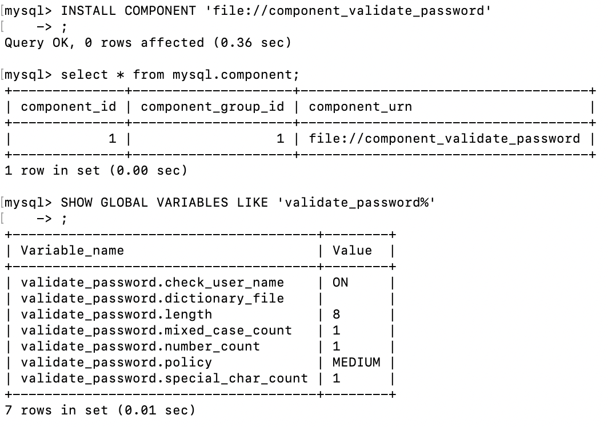

# 3. 사용자 및 권한

> [3.1 사용자 식별](#3.1-사용자-식별)
>
> [3.2 사용자 계정 관리](#3.2-사용자-계정-관리)
>
> - [3.2.1 시스템 계정과 일반 계정](#3.2.1-시스템-계정과-일반-계정)
> - [3.2.2 계정 생성](#3.2.2-계정-생성)
>
> [3.3 비밀번호 관리](#3.3-비밀번호-관리)
>
> - [3.3.1 고수준 비밀번호](#3.3.1-고수준-비밀번호)
> - [3.3.2 이중 비밀번호](#3.3.2-이중-비밀번호)
>
> [3.4 권한(Privilege)](#3.4-권한(Privilege))
>
> [3.5 역할(Role)](#3.5-역할(Role))

<br>

## 3.1 사용자 식별

- MySQL의 사용자는 다른 DBMS와는 조금 다르게 **사용자의 계정** + **사용자의 접속 지점**(클라이언트가 실행된 호스트명이나 도메인 또는 IP주소)도 계정의 일부가 됨

- 예시

  ```text
  'svc_id'@'127.0.0.1'
  ```

  - 아이디와 IP주소를 감싸는 역따옴표(`) 또는 홑따옴표(')는 MySQL에서 식별자를 감싸는 따옴표 역할
  - 로컬 호스트에서 svc_id라는아이디로 접속할 때만 사용될 수 있는 계정

  ```text
  'svc_id'@'192.168.0.10' (비밀번호 123)
  'svc_id'@'%' (비밀번호 abc)
  ```

  - 모든 외부 컴퓨터에서 접속이 가능한 사용자 계정 생성하고 싶다면 계정의 호스트 부분을 `%` 문자로 대체(`%`는 모든 IP 또는 모든 호스트명을 의미)
  - 서로 동일한 아이디가 있을 때
    - 범위가 가장 작은 것을 항상 먼저 선택
    - 위 예시에서 % 보다 범위가 적은 것이 192.168.0.10이기 때문에 해당 IP로의 svc_id 접근만 허용

<br>

## 3.2 사용자 계정 관리

#### 3.2.1 시스템 계정과 일반 계정

- 설명
  - `SYSTEM_USER` 권한을 가지고 있느냐에 따라 시스템 계정(System Account)과 일반 계정(Regular Account)로 구분
  - 시스템 계정과 일반 계정의 개념이 도입된 것은 DBA(데이터베이스 관리자) 외 일반 사용자를 위한 계정에는 SYSTEM_USER 권한을 부여하지 않게 하기 위함
- 시스템 계정
  - 서버 내부적으로 실행되는 백그라운드 스레드와는 무관하며, 일반 계정과 같이 사용자를 위한 계정
  - 데이터베이스 서버 관리자를 위한 계정
  - 관리 권한
    - 시스템 계정과 일반 계정 관리(생성, 삭제, 변경) 가능
    - 다른 세션(Connection) 또는 그 세션에서 실행 중인 쿼리를 강제 종료
    - 스토어드 프로그램 생성 시 DEFINER를 타 사용자로 설정
- 일반 계정
  - 응용 프로그램이나 개발자를 위한 계정
  - 계정 관리 불가

- MySQL 내장 계정

  - root 계정을 제외한 3개는 처음부터 잠겨(account_locked 컬럼)있는 상태이므로 의도적으로 잠긴 계정을 풀지 않느 ㄴ한 악의적인 용도로 사용할 수 없음

  - 종류

    - `'root'@'localhost'`
    - `'mysql.sys'@'localhost'`
      - MySQL 8.0부터 기본으로 내장된 sys 스키마의 객체(뷰, 함수, 프로시저)들의 DEFINER로 사용되는 계정
    - `'mysql.session'@'localhost'`
      - MySQL 플러그인이 서버로 접근할 때 사용되는 계정

    - `'mysql.infoschema'@'localhost'`
      - information_schema에 정의된 뷰의 DEFINER로 사용되는 계정

#### 3.2.2 계정 생성

- 계정 생성는 `CREATE USER` 명령으로 수행, 권한 부여는 `GRANT` 명령으로 수행

- 계정 생성 시 설정 가능 옵션

  - 계정의 인증 방식과 비밀번호
  - 비밀번호 관련 옵션
    - 비밀번호 유효 기간
    - 비밀번호 이력 개수
    - 비밀번호 재사용 불가 기간
    - 기본 역할(Role)
    - SSL 옵션
    - 계정 잠금 여부

- 명령

  ```sql
  CREATE USER 'user'@'%'
  IDENTIFIED WITH 'mysql_native_password' BY 'password'
  REQUIRE NONE
  PASSWORD EXPIRE INTERVAL 30 DAY
  ACCOUNT UNLOCK
  PASSWORD HISTORY DEFAULT
  PASSWORD REUSE INTERVAL DEFAULT
  PASSWORD REQUIRE CURRENT DEFAULT
  ;
  ```

  - IDENTIFIED WITH

    - 사용자의 인증 방식과 비밀번호 설정

    - 해당 절 뒤에는 반드시 인증 방식(인증 플러그인의 이름)을 명시해야 하고, MySQL 서버의 기본 인증 방식을 사용하고자 한다면 `IDENTIFIED BY 'password'` 형식으로 명시

    - 플러그인 형태로 제공하는 인증방식 4가지

      - **Native Pluggable Authentication**

        - 5.7버전까지 사용되던 방식으로 단순히 비밀번호에 대한 해시(SHA-1 알고리즘) 값을 저장해두고, 클라이언트가 보낸 값과 해시값이 일치하는지 비교하는 인증 방식

        - 8.0에서도 사용하려면 설정 변경 또는 my.cnf 설정 파일에 추가

          ```sql
          SET GLOBAL default_authentication_plugin="mysql_native_password"
          ```

      - **Caching SHA-2 Pluggable Authentication**

        - 5.6에 도입되고 8.0 버전에서 조금 더 보완된 인증 방식
        - 암호화 해시값 생성을 위해 SHA-2(256비트) 알고리즘 사용
        - Native Authentication과 비교해 암호화 해시 알고리즘의 차이로 저장된 해시값의 보안에 더 중점을 둔 알고리즘. Native Authentication 플러그인은 입력이 동일 해시값을 출력하지만 SHA-2 방식은 내부적으로 Salt 키를 활용하며, 수천 번의 해시 계산을 수행해서 동일한 키 값에 대해서도 결과가 달라짐
        - 시간이 많이 소모되어 성능이 떨어지는데, 이를 보완하기 위해 MySQL 서버는 해시 결과값을 메모리에 캐시해서 사용하게 됨
        - 이 인증 방식을 사용하려면 SSL/TLS 또는 RSA 키페어를 반드시 사용해야 하는데, 이를 위해 클라이언트에서 접속할 때 SSL 옵션을 활성화해야 함

      - **PAM Pluggable Authentication**

        - 유닉스나 리눅스 패스워드 또는 LDAP(Lightweight Directory Access Protocol) 같은 외부 인증을 사용할 수 있게 해주는 인증 방식
        - 엔터프라이즈 에디션에서만 사용 가능

      - **LDAP Pluggable Authentication**

        - LDAP을 이용한 외부 인증을 사용할 수 있게 해주는 인증 방식
        - 엔터프라이즈 에디션에서만 사용 가능

  - REQUIRE

    - MySQL 서버 접속 시 암호화된 SSL/TLS 채널 사용 여부
    - default 비암호화 채널 연결
    - REQUIRE 옵션을 SSL로 설정하지 않았다고 하더라도 Caching SHA-2 Authentication 인증 방식을 사용하면 암호화된 채널만으로 MySQL 서버 접속

  - PASSWORD EXPIRE

    - 비밀번호 유효 기간 설정 옵션

    - default 'default_password_lifetime' 시스템 변수에 저장된 기간으로 유효기간 설정

    - 개발자나 데이터베이스 관리자 비밀번호는 유효기간을 설정하는 것이 보안상 안전하지만, 으용 프로그램 접속용 계정에 유효기간을 설정하는 것은 위험할 수 있으니 주의

    - 옵션

      ```sql
      PASSWORD EXPIRE  -- 계정 생성과 동시에 만료
      PASSWORD EXPIRE NEVER  -- 만료 기간 없음
      PASSWORD EXPIRE DEFAULT  -- default_password_lifetime 시스템 변수값 할당
      PASSWORD EXPIRE INTERVAL n DAY  -- 유효기간을 오늘부터 n일자로 설정
      ```

  - PASSWORD HISTORY

    - 한 번 사용했던 비밀번호 재사용하지 못하게 설정

    - 이력을 기억하기 위해 mysql DB의 password_history 테이블 사용

    - 옵션

      ```sql
      PASSWORD HISTORY DEFAULT  -- password_history 시스템 변수값 할당
      PASSWORD HISTORY n  -- 비밀번호 이력 최근 n개까지만 저장
      ```

    - 확인

      ```sql
      SELECT * FROM mysql.password_history;
      ```

  - PASSWORD REUSE INTERVAL

    - 한 번 사용했던 비밀번호의 재사용 금지 기간 설정 옵션

    - 옵션

      ```sql
      PASSWORD REUSE INTERVAL DEFAULT  -- password_reuse_interval 시스템 변수값 할당
      PASSWORD REUSE INTERVAL n DAY. -- n일자 이후 비밀번호 재사용
      ```

  - PASSWORD REQUIRE

    - 비밀번호 만료되어 새로운 비밀번호 변경할 때 현재 비밀번호(변경하기 전 만료된 비밀번호)를 필요로 할지 말지를 결정하느 ㄴ옵션

    - 옵션

      ```sql
      PASSWORD REQUIRE CURRENT  -- 현재 비밀번호 먼저 입력
      PASSWORD REQUIRE OPTIONAL  -- 현재 비밀번호 입력하지 않아도 됨
      PASSWORD REQUIRE DEFAULT  -- password_require_current 시스템 변수값 할당
      ```

  - ACCOUNT LOCK / UNLOCK

    - 계정 생성 시 또는 ALTER USER 명령 사용해 계정 정보를 변경할 때 계정을 사용하지 못하게 잠글지 여부 결정

    - 옵션

      ```sql
      ACCOUNT LOCK  -- 계정을 사용하지 못하게 잠금
      ACCOUNT UNLOCK  -- 잠긴 계정을 다시 사용 가능 상태로 잠금 해제
      ```

<br>

## 3.3 비밀번호 관리

#### 3.3.1 고수준 비밀번호

- MySQL 서버 비밀번호는 유효기간이나 이력관리를 통해 재사용 금지 기능 뿐만 아니라 비밀번호를 쉽게 유추할 수 있는 단어들이 사용되지 않게 글자의 조합을 강제하거나 금칙어를 설정하는 기능도 있음

- 비밀번호 유효성 체크 규칙 적용 시 validate_password 컴포넌트 이용(서버 프로그램 내장)

  

  - 설치: `INSTALL COMPONENT 'file://component_validate_password';`
  - 확인: `SELECT * FROM mysql.component;`

  - 컴포넌트 제공 시스템 변수 확인: `SHOW GLOBAL VARIABLES LIKE 'validate_password%';`

- 비밀번호 정책

  - LOW
    - 비밀번호의 길이만 검증
  - MEDIUM
    - LOW + 숫자, 대소문자, 특수문자 배합 검증
  - STRONG
    - MEDIUM + 금칙어 포함 여부 검증

- 검증값(validate_password.{value})

  - length 길이 이상 금지

  - mixed_case_count, number_count, special_char_count  숫자 이상 포함 여부 검증

  - dictionary_file 명시 단어 포함 여부 검증

    - 금칙어들이 저장된 사전 파일을 텍스트 파일로 한 줄에 하나씩 기록

    - validate_password.policy 시스템 변수가 'STRONG' 일 때만 작동

    - 사용

      ```sql
      SET GLOBAL validate_password.dictionary_file='prohibitive_word.data';
      SET GLOBAL validate_password.policy='STRONG';
      ```

#### 3.3.2 이중 비밀번호

- 많은 응용 프로그램 서버들이 공용으로 데이터베이스 서버를 사용하므로, 서버 계정 정보는 쉽게 변경하기 어려움. 특히 db 계정의 비밀번호는 서비스가 실행 중인 상태에서 변경이 불가능했음

- Dual Password

  - 2개의 비밀번호 중 하나만 일치하면 로그인이 통과
  - Primary(최근), Secondary(이전) 구분

- 사용

  ```sql
  -- 비밀번호를 'old_password'로 설정
  ALTER USER 'root'@'localhost' IDENTIFIED BY 'old_password';
  
  -- 비밀번호를 'new_password'로 변경하면서 기존 비밀번호를 세컨더리 비밀번호로 설정
  ALTER USER 'root'@'localhost' IDENTIFIED BY 'new_password' RETAIN CURRENT PASSWORD;
  
  -- 보안을 위해 세컨더리 비밀번호는 삭제하는 편이 좋음
  ALTER USER 'root'@'localhost' DISCARD OLD PASSWORD;
  ```

<br>

## 3.4 권한(Privilege)

[https://dev.mysql.com/doc/refman/8.0/en/privileges-provided.html](https://dev.mysql.com/doc/refman/8.0/en/privileges-provided.html)

- 확인

  ```sql
  SHOW GRANTS;
  
  -- mysql DB 권한 관련 테이블 확인 방법
  -- 정적 권한
  SELECT * FROM mysql.user;
  SELECT * FROM mysql.db;
  SELECT * FROM mysql.tables_priv;
  SELECT * FROM mysql.columns_priv;
  SELECT * FROM mysql.procs_priv;
  
  -- 동적 권한
  SELECT * FROM mysql.global_grants;
  ```

  

- since 5.7(정적 권한)

  - 글로벌(Global) 권한과 객체 단위의 권한으로 구분
  - MySQL 서버 소스코드에 고정적으로 명시돼 있는 권한
    - 글로벌 권한
      - 데이터베이스나 테이블 이외의 객체에 적용되는 권한
      - GRANT 명령에서 특정 객체를 명시하지 말아야 함
    - 객체 권한
      - 데이터베이스나 테이블을 제어하는 데 필요한 권한
      - GRANT 명령으로 권한 부여 시 반드시 특정 객체 명시
    - ALL 설정 시 글로벌 또는 객체에 모든 권한 부여

- since 8.0(동적 권한)

  - 서버 시작되면서 동적으로 생성하는 권한(컴포넌트 또는 플러그인이 설치되면 그 때 등록되는 권한)

- 권한 부여

  ```sql
  GRANT privilege_list ON db.table TO 'user'@'host';
  ```

  - GRANT 명령어 사용

  - ON 절에 명시되는 오브젝트(DB나 테이블)가 각 권한의 범위에 따라 달라짐

  - 글로벌 권한 부여

    ```sql
    GRANT SUPER ON *.* TO 'user'@'host';
    ```

    - 글로벌 권한은 특정 DB나 테이블에 부여될 수 없으므로 `*.*` 사용

  - DB 권한 부여

    ```sql
    GRANT EVENT ON *.* TO 'user'@'localhost';
    GRANT EVENT ON employees.* TO 'user'@'localhost';
    ```

    - 특정 DB에 대해서만 권한을 부여하거나 서버에 존재하는 모든 DB에 대해 권한을 부여할 때 사용
    - DB 권한만 부여하는 경우(DB 권한은 테이블에 대해 부여할 수 없기 때문), 특정 테이블까지 명시할 수 없음

  - 테이블 권한

    ```sql
    GRANT SELECT,INSERT,UPDATE,DELETE ON *.* TO 'user'@'localhost';
    GRANT SELECT,INSERT,UPDATE,DELETE ON employees.* TO 'user'@'localhost';
    GRANT SELECT,INSERT,UPDATE,DELETE ON employees.department TO 'user'@'localhost';
    ```

    - 모든 DB에 대해 권한 부여 가능, 특정 DB의 오브젝트에 대해서만 권한 부여 가능, 특정 DB의 특정 테이블에 대해서만 권한 부여 가능

  - 테이블 컬럼 권한

    ```sql
    GRANT SELECT,INSERT,UPDATE(dept_name) ON employees.department TO 'user'@'localhost';
    ```

    - 컬럼에 부여할 수 있는 권한은 DELETE 제외한 INSERT, UPDATE, SELECT
    - 각 권한 뒤에 칼럼을 명시하는 형태로 부여
    - 테이블이나 칼럼 단위의 권한은 잘 사용하지 않음
      - 컬럼 단위 권한이 하나라도 설정되면 나머지 모든 테이블의 모든 컬럼에 대해서도 권한 체크를 하므로 전체적인 성능에 영향을 미칠 수 있음
      - 컬럼 단위 접근 권한이 꼭 필요하다면 GRANT 명령 보다는 테이블에서 권한을 허용하고자 하는 컬럼만 별도의 VIEW로 만들어 사용하는 방법도 있음

<br>

## 3.5 역할(Role)

- role 확인

  ```sql
  SELECT * from mysql.default_roles;
  SELECT * from mysql.role_edges;
  ```

  

- 계정 생성

  ```sql
  CREATE USER 'testReader'@'localhost' IDENTIFIED BY 'password';
  CREATE USER 'testWriter'@'localhost' IDENTIFIED BY 'password';
  ```

- role 생성

  ```sql
  -- role name 생성
  CREATE ROLE role_emp_read, role_emp_write;
  
  -- 각 role name에 GRANT 실질적 권한 부여
  GRANT SELECT ON employees.* TO role_emp_read;
  GRANT INSERT, UPDATE, DELETE ON employees.* TO role_emp_write;
  ```

- role grant 부여

  ```sql
  GRANT role_emp_read TO 'testReader'@'localhost';
  GRANT role_emp_read, role_emp_write TO 'testWriter'@'localhost';
  
  SHOW GRANTS;  -- 확인
  select current_role();  -- role 없음 확인
  ```

- role 활성화

  ```sql
  SET ROLE 'role_emp_read';
  SET ROLE 'role_emp_write';
  ```

  - 계정 로그아웃 후 로그인 시 역할 활성화되지 않고 초기화

    (로그인 시 역할을 자동으로 활성화할지 여부를 activate_all_roles_on_login 시스템 변수로 설정)

    ```sql
    SET GLOBAL activate_all_roles_on_login=ON;
    ```

- ROLE
  - MySQL 서버의 역할은 사용자 계정과 거의 같은 모습을 하고 있어, 서버 내부적으로 역할과 계정은 동일한 객체로 취급됨(단지 하나의 사용자 계정에 다른 사용자 계정이 가진 권한을 병합해서 권한 제어가 가능해졌을 뿐)
  - 내부적으로 계정과 역할은 아무런 차이가 없으므로 실제 관리자나 사용자가 볼 때도 구분하기 어려움. 따라서 'role_' 이라는 prefix 등을 붙여 구분하기도 함

