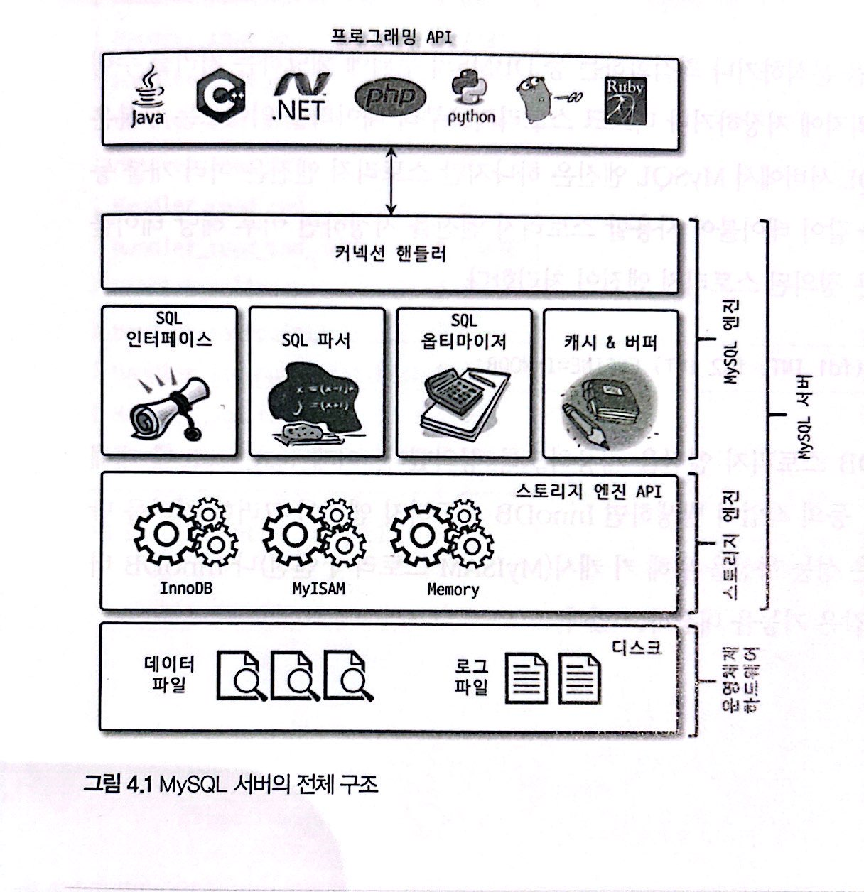
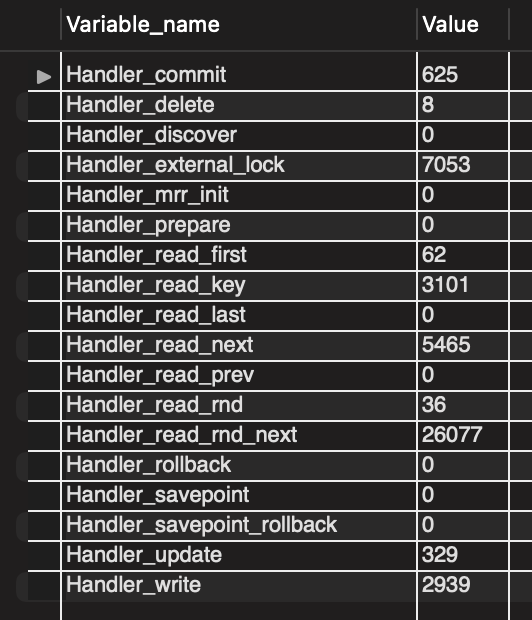
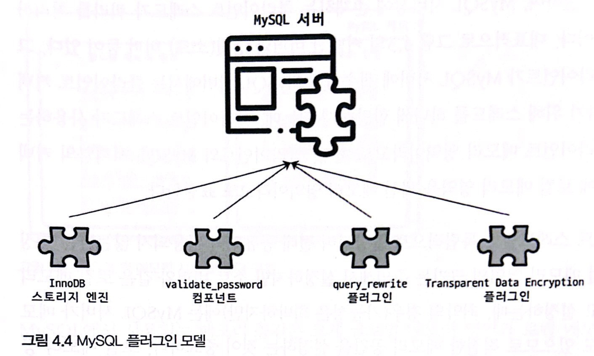
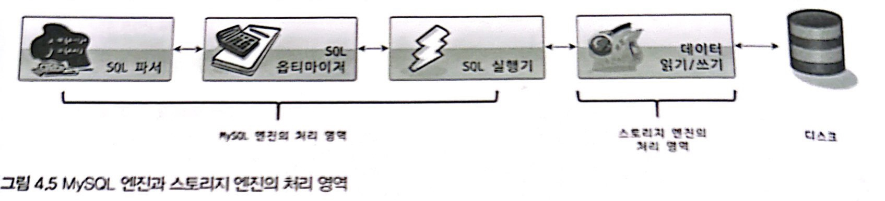
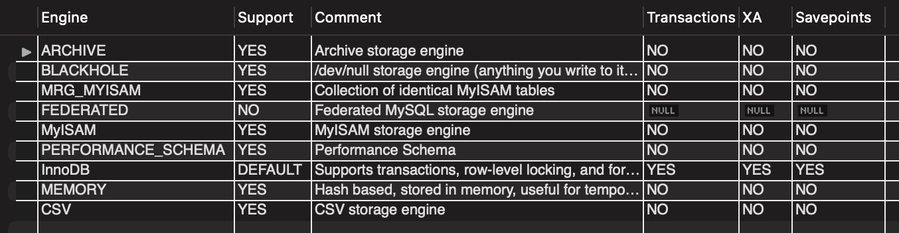
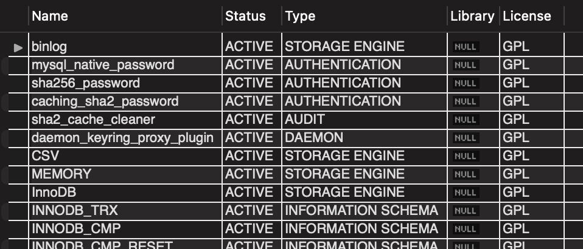
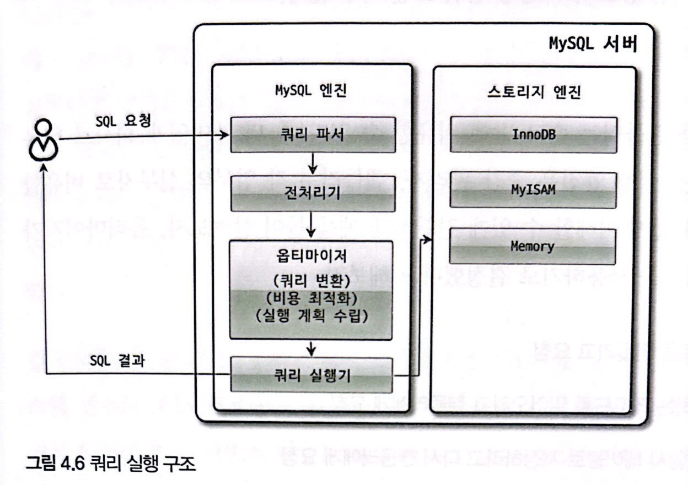

# 4. 아키텍처(MySQL 엔진)

>[4.1 MySQL 엔진 아키텍처](#4.1-MySQL-엔진-아키텍처)
>
>- [4.1.1 MySQL의 전체 구조](#4.1.1-MySQL의-전체-구조)
>   - [4.1.1.1 MySQL 엔진](#4.1.1.1-MySQL-엔진)
>   - [4.1.1.2 스토리지 엔진](#4.1.1.2-스토리지-엔진)
>   - [4.1.1.3 핸들러 API](#4.1.1.3-핸들러-API)
>- [4.1.2 MySQL 스레딩 구조](#4.1.2-MySQL-스레딩-구조)
>   - [4.1.2.1 Foreground Thread(클라이언트 스레드)](#4.1.2.1-Foreground-Thread(클라이언트-스레드))
>   - [4.1.2.2 Background Thread](#4.1.2.2-Background-Thread)
>- [4.1.3 메모리 할당 및 사용 구조](#4.1.3-메모리-할당-및-사용-구조)
>   - [4.1.3.1 글로벌 메모리 영역](#4.1.3.1-글로벌-메모리-영역)
>   - [4.1.3.2 로컬 메모리 영역](#4.1.3.2-로컬-메모리-영역)
>- [4.1.4 플러그인 스토리지 엔진 모델](#4.1.4-플러그인-스토리지-엔진-모델)
>- [4.1.5 컴포넌트](#4.1.5-컴포넌트)
>- [4.1.6 쿼리 실행 구조](#4.1.6-쿼리-실행-구조)
>   - 쿼리 파서
>   - 전처리기
>   - 옵티마이저
>   - 실행 엔진
>   - 핸들러(스토리지 엔진)
>- [4.1.7 복제](#4.1.7-복제)
>- [4.1.8 쿼리 캐시](#4.1.8-쿼리-캐시)
>- [4.1.9 스레드 풀](#4.1.9-스레드-풀)
>- [4.1.10 트랜잭션 지원 메타데이터](#4.1.10-트랜잭션-지원-메타데이터)

<br>

## 4.1 MySQL 엔진 아키텍처

### 4.1.1 MySQL의 전체 구조



- 일반 상용 RDBMS와 같이 대부분의 프로그래밍 언어로부터 접근 방법을 모두 지원
  - C, JDBC, ODBC, .NET 표준 드라이버 제공, C/C++, PHP, 자바, 펄, 파이썬, 루비, .NET, 코볼까지 쿼리 사용 가능하게 함
- MySQL 서버
  - MySQL 서버는 크게 MySQL 엔진과 스토리지 엔진으로 구분

<br>

##### 4.1.1.1 MySQL 엔진

- 커넥션 핸들러(클라이언트로부터의 접속 및 쿼리 요청을 처리), SQL 파서, 전처리기, 옵티마이저(쿼리 최적화 실행)가 중심
- 표준 SQL(ANSI SQL) 문법을 지원하므로 표준 문법으로 작성된 타 DBMS와 호환되어 실행 가능

##### 4.1.1.2 스토리지 엔진

- 실제 데이터를 디스크 스토리지에 저장 & 디스크 스토리지로부터 데이터를 읽음

- MySQL 엔진은 하나지만, 스토리지 엔진은 여러 개를 동시 사용 가능

- 테이블이 사용할 스토리지 엔진을 지정하면 이후 해당 테이블의 모든 읽기/변경 작업은 정의된 스토리지 엔진이 처리

  ```mysql
  CREATE TABLE test_table (fd1 INT, fd2 INT) ENGINE=INNODB;
  ```

  - test_table은 InnoDB 스토리지 엔진을 사용하도록 정의

- 각 스토리지 엔진은 성능 향상을 위해 키 캐시(MyISAM 스토리지 엔진)나 InnoDB 버퍼 풀(InnoDB 스토리지 엔진)과 같은 기능 내장

##### 4.1.1.3 핸들러 API

- MySQL 엔진의 쿼리 실행기에서 데이터를 쓰거나 읽을 때 각 스토리지 엔진에 쓰기 또는 읽기 요청

- 이러한 요청을 핸들러(Handler) 요청이라 하고, 여기에 사용되는 API를 핸들러 API라 함

- 핸들러 API를 통한 데이터(레코드) 작업 내역 확인

  ```sql
  SHOW GLOBAL STATUS LIKE 'Handler%'
  ```

  

<br>

### 4.1.2 MySQL 스레딩 구조


- MySQL 서버는 프로세스 기반이 아니라 스레드 기반으로 작동

- 크게 Foreground / Background Thread로 구분

- 실행 중인 스레드 목록 확인

  ```sql
  SELECT thread_id, name, type, processlist_user, processlist_host
  FROM performance_schema.threads
  ORDER BY type, thread_id;
  
  -- thread/sql/one_connection
  ```

  - `thread/sql/one_connection` 스레드가 실제 사용자의 요청 처리하는 foreground thread

  - background thread의 개수는 MySQL 서버 설정에 따라 가변적

  - 동일한 이름의 스레드가 2개 이상씩 보이는 것은 MySQL 서버의 설정 내용에 의해 여러 스레드가 동일 작업을 병렬로 처리하는 것

  - 참고

    ```text
    위 스레드 모델은 MySQL 서버가 전통적으로 가지고 있던 스레드 모델이며, MySQL 커뮤니티 에디션에서 사용되는 모델이다. MySQL 엔터프라이즈 에디션과 Percona MySQL 서버에서는 전통적인 스레드 모델뿐 아니라 스레드 풀(Thread Pool) 모델을 사용할 수도 있다. 스레드 풀과 전통적인 스레드 모델의 가장 큰 차이점은 foreground thread와 connection의 관계다. 전통 스레드 모델에서는 커넥션별로 foreground thread가 하나씩 생성되어 할당된다. 하지만 스레드 풀에서는 커넥션과 foreground thread는 1:1 관계가 아니라 하나의 스레드가 여러 개의 커넥션 요청을 전담한다. 자세한 내용은 4.1.9절 '스레드 풀' 참조
    ```

<br>

##### 4.1.2.1 Foreground Thread(클라이언트 스레드)

- 최소한 MySQL 서버에 접속된 클라이언트의 수만큼 존재

- 주로 각 클라이언트 사용자가 요청하는 쿼리 문장을 처리

  - 클라이언트 사용자가 작업을 마치고 커넥션을 종료하면 해당 커넥션 담당 스레드는 다시 스레드 캐시(Thread cache)로 돌아감

  - 이때 이미 스레드 캐시에 일정 개수 이상의 대기 중인 스레드가 있으면 스레드 캐시에 넣지 않고 스레드를 종료시켜 일정 개수의 스레드만 스레드 캐시에 존재하게 함

    (스레드 캐시 유지할 수 있는 최대 스레드 개수는 `thread_cache_size` 시스템 변수로 설정)

- 데이터를 MySQL 데이터 버퍼나 캐시로부터 가져옴

  (버퍼나 캐시에 없는 경우 직접 디스크의 데이터나 인덱스 파일로부터 데이터를 읽어와 작업 처리)

  - MyISAM 테이블은 쓰기 작업까지 foreground thread가 담당

    (지연된 쓰기가 있지만 일반적 방식은 아님)

  - InnoDB 테이블은 데이터 버퍼나 캐시까지만 foreground thread가 담당하고, 나머지 버퍼로부터 디스크까지 기록하는 작업은 background thread에서 처리

##### 4.1.2.2 Background Thread

- InnoDB는 background thread에서 다음 작업 처리
  - Insert Buffer 병합
  - **로그를 디스크로 기록**
  - **InnoDB 버퍼 풀의 데이터를 디스크에 기록**
    - 5.5 버전부터 쓰기/읽기 스레드의 개수를 2개 이상 지정할 수 있게 됨
    - `innodb_write_io_threads`, `innodb_read_io_thread` 시스템 변수로 스레드 개수 설정
      - 데이터 읽기 작업은 주로 클라이언트 스레드에서 처리되므로 읽기 스레드는 많이 설정할 필요가 없지만, 쓰기 스레드는 아주 많은 작업을 백그라운드로 처리하기 때문에 일반적 내장 디스크를 사용할 때는 2~4개 정도, DAS/SAN과 같은 스토리지 사용할 때는 디스크를 최적으로 사용할 수 있을만큼 충분히 설정하는 것이 좋음
  - 데이터를 버퍼로 읽어 옴
  - 잠금이나 데드락을 모니터링
- 지연(버퍼링)
  - 사용자 요청 처리 도중 쓰기 작업은 지연(버퍼링) 처리 가능, 읽기 작업은 절대 지연될 수 없음
  - 일반적 상용 DBMS에는 대부분 쓰기 작업을 버퍼링해서 일괄 처리하는 기능 탑재
  - InnoDB
    - 쓰기 작업 버퍼링 후 일괄 처리
  - MyISAM
    - 사용자 스레드가 쓰기 작업까지 함께 처리하도록 설계

<br>

### 4.1.3 메모리 할당 및 사용 구조


- 글로벌 메모리 영역 / 로컬 메모리 영역으로 크게 구분

##### 4.1.3.1 글로벌 메모리 영역

- MySQL 서버가 시작되면서 운영체제로부터 할당됨

  (운영체제에 따라 요청 메모리 공간을 100% 할당하기도, 그 공간만큼 예약하고 조금씩 할당하기도 함)

- MySQL 시스템 변수로 설정해 둔 만큼 운영체제로부터 메모리를 할당 받음

- 클라이언트 스레드 수와 무관하게 하나의 메모리 공간만 할당

  (필요에 따라 2개 이상의 공간 할당받을 수 있지만 모든 스레드에 의해 공유)

- 글로벌 메모리 영역
  - 테이블 캐시
  - InnoDB 버퍼 풀
  - InnoDB 어댑티브 해시 인덱스
  - InnoDB 리두 로그 버퍼

##### 4.1.3.2 로컬 메모리 영역

- *a.k.a 세션 메모리 영역* (클라이언트가 서버의 커넥션을 세션이라고 하기 때문)
- *a.k.a 클라이언트 메모리 영역* (클라이언트 스레드가 쿼리를 처리하는 데 사용하는 메모리 영역이기 때문)
- 특징
  - 각 클라이언트 스레드별로 독립적으로 할당되어 절대 공유되지 않음
  - 각 쿼리의 용도별로 필요할 때만 공간이 할당되고, 필요하지 않은 경우 MySQL이 메모리 공간을 할당조차 하지 않을 수 있음
  - 커넥션이 열려 있는 동안 계속 할당(커넥션 buffer & 결과 buffer) / 쿼리 실행 순간에만 할당 후 해제(소트 buffer & 조인 buffer)
- 로컬 메모리 영역
  - 정렬 버퍼(Sort buffer)
  - 조인 버퍼
  - 바이너리 로그 캐시
  - 네트워크 버퍼

<br>

### 4.1.4 플러그인 스토리지 엔진 모델




- MySQL의 독특한 구조 중 대표적인 플러그인 모델

- 플러그인 가능한 대상

  - 스토리지 엔진
  - 전문 검색 에진을 위한 검색어 파서(인덱싱할 키워드를 분리해내는 작업)
  - 사용자 인증을 위한 Native Authentication, Caching SHA-2 Authentication
  - 이외 사용자가 직접 스토리지 엔진을 개발하여 플러그인도 가능

- MySQL 쿼리 실행 과정

  

  - 대부분의 작업이 MySQL 엔진에서 처리

  - '데이터 읽기/쓰기' 작업만 스토리지 엔진에서 처리

    (사용자가 새로운 용도의 스토리지 엔진을 만들더라도 DBMS 전체 기능이 아닌 일부 기능만 수행하는 엔진을 작성한다는 의미)

  - 각 처리 영역에서 '데이터 읽기/쓰기' 작업은 대부분 1건의 레코드 단위로 처리

    - 예를 들어 특정 인덱스의 레코드 1건 읽기 또는 마지막으로 읽은 레코드의 다음 또는 이전 레코드 읽기

  - 핸들러

    - 프로그래밍언어에서 어떤 기능을 호출하기 위해 사용하는 운전대와 같은 역할을 하는 객체를 핸들러(또는 핸들러 객체)라 함
    - MySQL 엔진이 스토리지 엔진 조정을 위해 핸들러 사용
    - `MySQL 엔진이 각 스토리지 엔진에게 데이터를 읽어오거나 저장하도록 명령하려면 반드시 핸들러를 통해야 한다는 것을 기억하자`

  - MyISAM, InnoDB와 같이 다른 스토리지 엔진을 사용하는 테이블에 대한 쿼리를 실행하더라도 MySQL의 처리 내용은 대부분 동일하며, 단순히 '데이터 읽기/쓰기' 영역의 처리만 차이가 있을 뿐

  - 실질적인 group by, order by 등 복잡한 처리는 스토리지 엔진 영역이 아닌 MySQL 엔진의 처리 영역인 '쿼리 실행기'에서 처리

  - 쿼리 작업

    - 하나의 쿼리 작업은 여러 하위 작업으로 나뉨
    - 각 하위 작업이 MySQL 엔진 영역에서 처리되는지 스토리지 엔진 영역에서 처리되는지 구분할 줄 알아야 함

- 스토리지 엔진 목록

  ```sql
  SHOW ENGINES
  ```

  

  - Support
    - `YES`
      - MySQL 서버에 해당 스토리지 엔진이 포함되어 있고, 사용 가능으로 활성화된 상태
    - `DEFAULT`
      - 'YES'와 동일하지만, 필수 스토리지 엔진임을 의미(해당 엔진이 없으면 서버가 시작되지 않을 수 있음)
    - `NO`
      - 현재 MySQL 서버에 포함되지 않음
    - `DISABLED`
      - 현재 MySQL 서버에는 포함됐지만 파라미터에 의해 비활성화 상태
      - 다시 사용하려면 서버를 다시 빌드(컴파일) 해야 함

- 플러그인 목록

  ```sql
  SHOW PLUGINS
  ```

  

  - 스토리지 엔진 뿐 아니라 인증 및 전문 검색용 파서와 같은 플러그인도 확인 가능
  - MySQL 서버의 기능을 커스텀하여 확장할 수 있게 플러그인 API가 [매뉴얼](https://dev.mysql.com/doc/refman/8.0/en/server-plugins.html)로 공개

<br>

### 4.1.5 컴포넌트

- 8.0부터 기존 플러그인 아키텍처 대체를 위해 컴포넌트 아키텍처 지원(플러그인 단점 보완)

- 플러그인 아키텍처의 단점

  - 오직 MySQL 서버와 인터페이스할 수 있고, 플러그인끼리 통신 불가능
  - MySQL 서버의 변수나 함수를 직접 호출하기 때문에 안전하지 않음(캡슐화 안됨)
  - 상호 의존 관계를 설정할 수 없어서 초기화가 어려움

- 예시(validate_password component)

  - 컴포넌트 설치

    ```sql
    INSTALL COMPONENT 'file://component_validate_password'
    ```

  - 설치 컴포넌트 조회

    ```sql
    SELECT * FROM mysql.component
    ```

- 컴포넌트 설치 시 새로운 시스템 변수를 설정해야 할 수 있으므로 사용 전 [매뉴얼](https://dev.mysql.com/doc/refman/8.0/en/components.html) 참조

<br>

### 4.1.6 쿼리 실행 구조



##### 쿼리 파서

- 사용자 요청으로 들어온 쿼리 문장을 토큰(MySQL이 인식할 수 있는 최소단위의 어휘나 기호)으로 분리해 트리 형태의 구조로 만들어내는 작업
- 쿼리 문장의 기본 문법 오류는 이 과정에서 발견되어 사용자에게 오류 메시지 전달

##### 전처리기

- 파서 과정에서 만들어진 파서 트리를 기반으로 쿼리 문장에 구조적 문제점 있는지 확인
- 각 토큰을 테이블 이름, 칼럼 이름, 내장 함수 개체를 매핑해 해당 객체의 존재 여부와 객체의 접근 권한 등 확인
- 존재하지 않거나 권한이 없는 개체 토큰은 이 단계에서 걸러짐

##### 옵티마이저

- 사용자 요청으로 들어온 쿼리 문장을 저렴하고 빠르게 처리할지 결정(DBMS의 두뇌에 해당)
- `책의 내용은 대부분 옵티마이저가 더 나은 선택을 할 수 있게 유도하는가를 설명`

##### 실행 엔진

- 만들어진 계획대로 각 핸들러에게 요청해서 받은 결과를 또 다른 핸들러 요청의 입력으로 연결하는 역할 수행

- 예시(옵티마이저가 `GROUP BY` 처리를 위해 임시 테이블 사용 결정 시)
  - 실행 엔진이 핸들러에게 임시 테이블 만들라고 요청
  - 다시 실행 엔진은 WHERE 절에 일치하는 레코드를 읽어오라고 핸들러에게 요청
  - 읽어온 레코드들을 1번에서 준비한 임시 테이블로 저장하라고 다시 핸들러에게 요청
  - 데이터가 준비된 임시 테이블에서 필요한 방식으로 데이터를 읽어 오라고 핸들러에게 다시 요청
  - 최종적으로 실행 엔진은 결과를 사용자나 다른 모듈로 넘김

##### 핸들러(스토리지 엔진)

- MySQL 서버의 가장 밑단에서 MySQL 실행 엔진의 요청에 따라 데이터 읽기/쓰기 역할
- 핸들러는 스토리지 엔진을 의미
  - MyISAM 테이블 조작 시 핸들러가 MyISAM 스토리지의 엔진이 됨
  - InnoDB 테이블 조작 시 핸들러가 InnoDB 스토리지의 엔진이 됨

<br>

### 4.1.7 복제

- MySQL 서버에서 복제(Replication)은 매우 중요한 역할 담당
- 16장에서 구체적으로 서술

<br>

### 4.1.8 쿼리 캐시

- Query Cache는 빠른 응답을 필요로하는 웹 기반 응용 프로그램에서 중요한 역할 담당
- SQL의 실행 결과를 메모리에 캐시하고, 동일 SQL 쿼리가 실행되면 테이블을 읽지 않고 즉시 결과 반환하여 매우 빠른 성능
- 단점
  - 테이블 데이터 변경 시 캐시 저장 결과 중 변경된 테이블과 관련된 것들은 모두 삭제(invalidate)해야 해서 심각한 동시 처리 성능 저하를 유발
  - MySQL 서버 발전 시 성능 개선 과정에서 캐시는 동시 처리 성능 저하와 버그의 원인이 됨
- deprecated
  - 8.0 버전부터 기능 및 시스템 변수 완전 제거

<br>

### 4.1.9 스레드 풀

> 엔터프라이즈 에디션에서만 Thread Pool 기능 제공
>
> MySQL 엔터프라이즈에는 서버 내장 프로그램이지만, Percona에서는 플러그인 형태로 작동

- 스레드 풀은 내부적으로 사용자 요청 처리 스레드 개수를 줄임

  - 이를 통해 동시 처리되는 요청이 많아도 MySQL 서버의 CPU가 제한된 개수의 스레드 처리에만 집중할 수 있게 함
  - CPU의 프로세스 친화도(Processor affinity) 높이고, 운영체제 입장에서는 불필요한 컨텍스트 스위치를 줄여서 오버헤드를 낮출 수 있음
  - 하지만 스케줄링 과정에서 CPU 시간 확보 못할 경우 더 느려지는 경우도 발생할 수 있으므로 주의해야 함

- 스레드 그룹

  - `thread_pool_size` 시스템 변수로 조정
  - 일반적으로 CPU 코어의 개수와 스레드 그룹 수를 맞추는 것이 CPU 프로세서 친화도를 높이는 데 좋음

- 동작방식

  - MySQL 서버가 처리해야 할 요청이 생기면 스레드 풀로 처리를 이관

  - 이미 스레드 풀이 처리 중인 작업이 있는 경우

    - `thread_pool_oversubscribe` 시스템 변수(default 3)에 설정된 개수만큼 추가로 더 받아들여 처리
    - 이 값이 너무 크면 스케줄링해야 할 스레드가 많아져 스레드 풀이 비효율적으로 작동할 수 있음

  - 스레드 그룹의 모든 스레드가 일을 처리할 경우

    - 스레드 풀은 해당 스레드 그룹에 새로운 작업 스레드(Worker thread) 추가할지, 기존 작업 스레드가 처리를 완료할 때까지 기다릴지 여부 판단

    - 스레드 풀의 타이머 스레드

      - 주기적으로 스레드 그룹의 상태를 체크
      - 작업 스레드가 처리 중인 작업을 `thread_pool_stall_limit` 시스템 변수에 정의된 밀리초 내 끝내지 못하면 새로운 스레드 생성하여 스레드 그룹에 추가 

      - 이 때 전체 스레드 풀에 있는 스레드의 개수는 `thread_pool_max_threads` 설정 개수 초과 불가

    - 팁

      - 응답 시간에 아주 민감한 서비스는 `thread_pool_stall_limit`을 적절히 낮춰야 함
      - 0에 가까운 값으로 설정하는 것을 설정하는 것은 권장하지 않음

<br>

### 4.1.10 트랜잭션 지원 메타데이터

> 테이블의 구조 정보와 스토어드 프로그램 등의 정보를 데이터 딕셔너리 또는 메타데이터라 부름

- MySQL 8.0 버전부터 테이블의 구조 정보나 스토어드 프로그램의 코드 관련 정보를 모두 InnoDB 테이블에 저장하도록 개선

- 시스템 테이블을 모두 InnoDb 스토리지 엔진을 사용하도록 개선

  (시스템 테이블: MySQL 서버가 작동하는 데 기본적으로 필요한 테이블들의 묶음)

- 이를 통해 스키마 변경 작업 중간에 MySQL 서버가 비정상 종료되더라도 스키마 변경이 원자적으로 관리됨

- mysql.ibd 테이블스페이스에 저장

  (*.ibd 파일은 특별히 주의해야 함)

- InnoDB 이외 스토리지 엔진 메타 정보는 별도 공간에 저장

  - 예를 들어 *.sdi 파일 존재(SDI: Serialized Dictionary Information)
