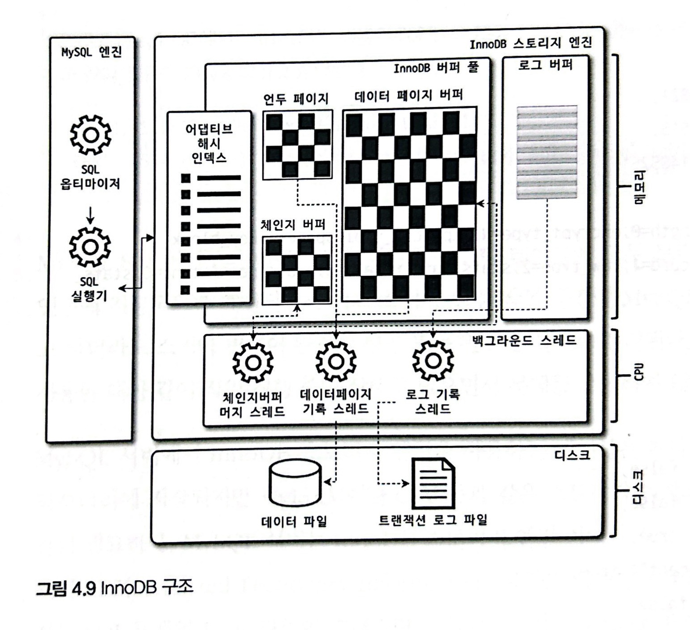
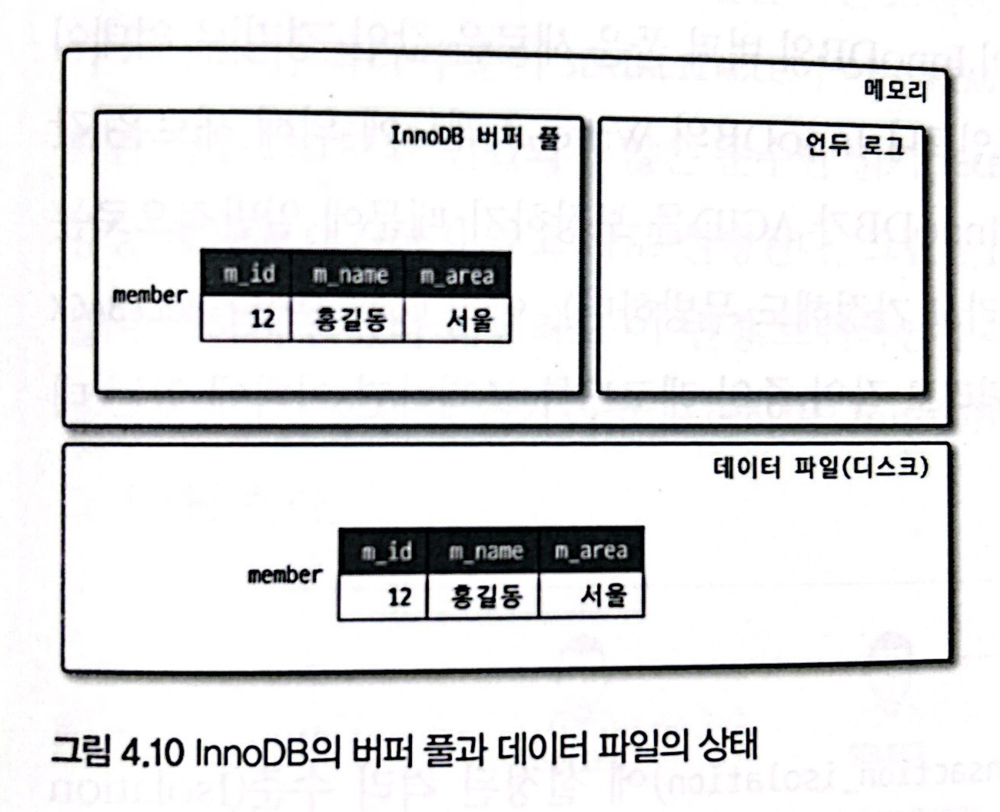
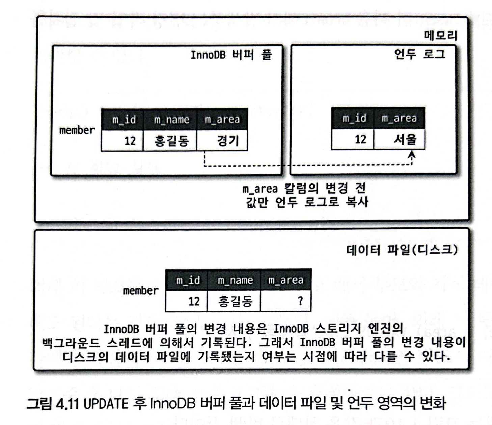
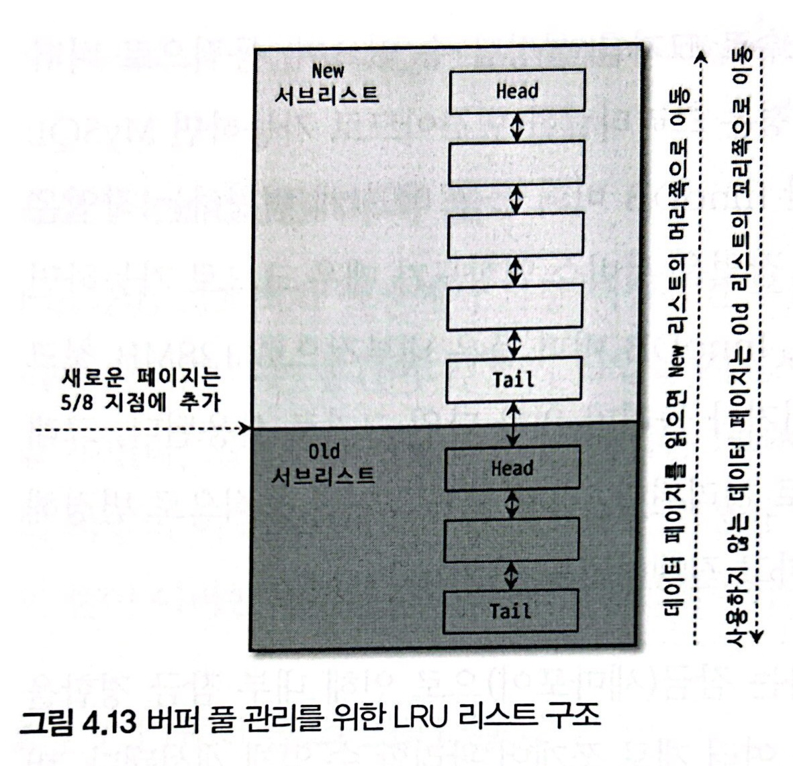
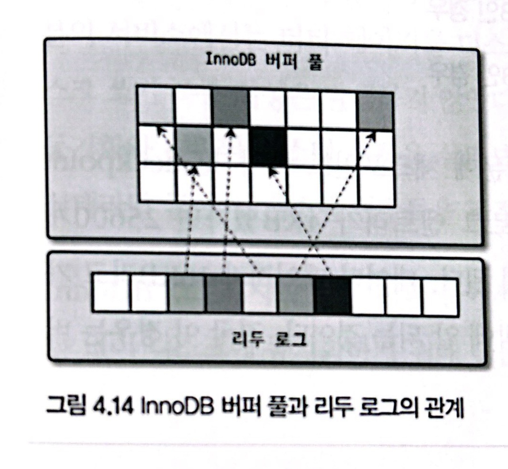
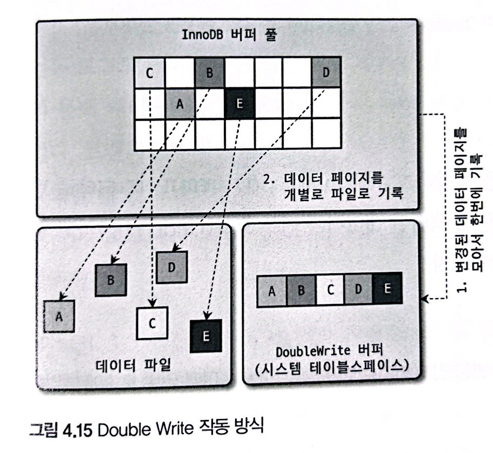
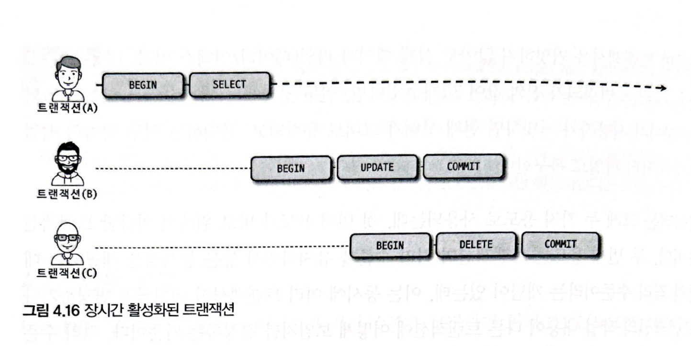
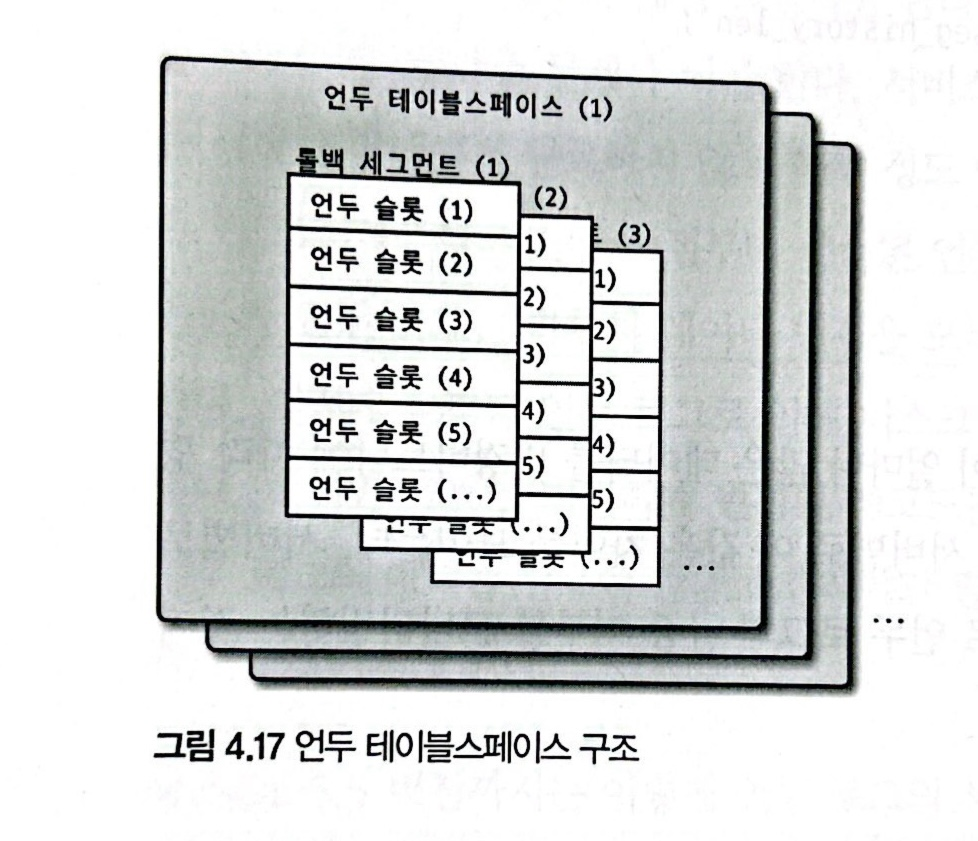

# 4. 아키텍처(InnoDB 스토리지 엔진)

> [4.2 InnoDB 스토리지 엔진 아키텍처](#4.2-InnoDB-스토리지-엔진-아키텍처)
>
> - [4.2.1 프라이머리 키에 의한 클러스터링](#4.2.1-프라이머리-키에-의한-클러스터링)
> - [4.2.2 외래 키 지원](#4.2.2-외래-키-지원)
> - [4.2.3 MVCC](#4.2.3-MVCC)
> - [4.2.4 잠금 없는 일관된 읽기(Non-Locking Consistent Read)](#4.2.4-잠금-없는-일관된-읽기(Non-Locking-Consistent-Read))
> - [4.2.5 자동 데드락 감지](#4.2.5-자동-데드락-감지)
> - [4.2.6 자동화된 장애 복구](#4.2.6-자동화된-장애-복구)
> - [4.2.7 InnoDB 버퍼 풀](#4.2.7-InnoDB-버퍼-풀)
>   - [4.2.7.1 버퍼 풀의 크기 설정](#4.2.7.1-버퍼-풀의-크기-설정)
>   - [4.2.7.2 버퍼 풀의 구조](#4.2.7.2-버퍼-풀의-구조)
>   - [4.2.7.3 버퍼 풀과 리두 로그](#4.2.7.3-버퍼-풀과-리두-로그)
>   - [4.2.7.4 버퍼 풀 플러시(Buffer Pool Flush)](#4.2.7.4-버퍼-풀-플러시(Buffer-Pool-Flush))
>     - Flush_list 플러시
>     - LRU_list 플러시
>   - [4.2.7.5 버퍼 풀 상태 백업 및 복구](#4.2.7.5-버퍼-풀-상태-백업-및-복구)
> - [4.2.8 Double Write Buffer](#4.2.8-Double-Write-Buffer)
> - [4.2.9 언두 로그](#4.2.9-언두-로그)
>   - [4.2.9.1 언두 로그 모니터링](#4.2.9.1-언두-로그-모니터링)
>   - [4.2.9.2 언두 테이블스페이스 관리](#4.2.9.2-언두-테이블스페이스-관리)
> - [4.2.10 체인지 버퍼](#4.2.10-체인지-버퍼)
> - [4.2.11 리두 로그 및 로그 버퍼](#4.2.11-리두-로그-및-로그-버퍼)
> - [4.2.12 어댑티브 해시 인덱스](#4.2.12-어댑티브-해시-인덱스)
> - [4.2.13 InnoDB와 MyISAM, MEMORY 스토리지 엔진 비교](#4.2.13-InnoDB와-MyISAM,-MEMORY-스토리지-엔진-비교)

<br>

## 4.2 InnoDB 스토리지 엔진 아키텍처



- InnoDB는 MySQL에서 사용할 수 있는 스토리지 엔진 중 거의 유일하게 레코드 기반의 잠금 제공

  (높은 동시성 처리 가능, 안정적, 고성능)

### 4.2.1 프라이머리 키에 의한 클러스터링

- InnoDB 모든 테이블은 기본적으로 PK 기준으로 클러스터링 되어 저장

  - 이는 PK 값의 순서대로 디스크에 저장된다는 뜻

  - 모든 세컨더리 인덱스는 레코드의 주소 대신 PK 값을 논리적인 주소로 사용

  - PK 이용한 range scan은 상당히 빠르게 처리 가능

  - 쿼리 실행 계획에서 PK는 기본적으로 다른 보조 인덱스에 비해 비중이 높게 설정

    (다른 보조 인덱스보다 PK가 선택될 확률이 높음)

  - MySQL의 일반적 테이블 구조가 ORACLE DBMS IOT(Index organized table)와 동일

- MyISAM 스토리지 엔진에서는 클러스터링 키 미지원

  - PK와 세컨더리 인덱스는 구조적으로 차이가 없음

    (PK는 unique 제약을 가진 세컨더리 인덱스에 불과)

  - 모든 인덱스는 물리적 레코드의 주소 값(ROWID)을 가짐

<br>

### 4.2.2 외래 키 지원

- InnoDB 스토리지 엔진 레벨에서 외래키 지원

  (MyISAM 또는 MEMORY 테이블에서 사용 불가)

- 개발 환경의 데이터베이스에서는 좋은 가이드 역할 가능

- 주의점

  - DB 서버 운영의 불편함 때문에 서비스용 DB에서는 생성하지 않는 경우도 있음

  - 부모 테이블과 자식 테이블 모두 해당 컬럼에 인덱스 생성이 필요하고, 변경 시에는 반드시 부모 테이블이나 자식 테이블에 데이터가 있는지 체크하는 작업이 필요함

    - **위 작업은 lock이 여러 테이블로 전파되고, deadlock 발생 가능성을 높임**

  - 수동으로 데이터 적재나 스키마 변경 등의 관리 작업이 실패할 수 있음

    - 외래키가 복잡하게 얽힌 경우는 쉽지 않음

    - 긴급하게 조치해야 하는 경우 주의 필요

    - 문제 발생 시 `foreign_key_checks` 시스템 변수를 OFF 설정

      ```sql
      SET foreign_key_checks=OFF
      ```

      - 외래키 관계에 대한 체크 작업을 일시 중지
      - 외래키 관계의 부모 테이블에 대한 작업(ON DELETE CASCADE, ON UPDATE CASCADE 옵션)도 무시하게 됨
      - 적용 범위를 GLOBAL, SESSION 모두 설정 가능
        - 반드시 현재 작업 실행 세션에서만 기능을 OFF 해야 함
        - default SESSION `SET (SESSION) foreign_key_checks=OFF`
      - 외래키 체크를 일시 중지한 상태에서 부모 테이블 레코드 삭제했다면, 반드시 자식 테이블의 레코드도 삭제해서 반드시 일관성을 맞춰준 후 외래키 체크 기능을 다시 활성화시켜야 함

<br>

### 4.2.3 MVCC

> MVCC(Multi Version Concurrency Control)
>
> - 일반적으로 레코드 레벨의 트랜잭션을 지원하는 DBMS가 제공하는 기능
> - MVCC 가장 큰 목적은 <b>잠금 사용하지 않는 일관된 읽기</b>를 제공하는 데 있음
> - multi version이란 하나의 레코드에 대해 여러 개의 버전이 동시에 관리된다는 의미

##### 예시(테이블 데이터 변경 시)

- InnoDB는 언두 로그(Undo log)를 이용해 mvcc 기능 구현

- MySQL서버: Isolation level -> READ_COMMITTED

- INSERT 실행

  ```sql
  INSERT INTO member (id, name, area) VALUES (12, '홍길동', '서울');
  ```

  

- UPDATE 실행

  ```sql
  UPDATE member SET area='경기' WHERE id=12;
  ```

  

  - InnoDB 버퍼 풀

    - commit 실행 여부와 관계없이 새로운 값인 '경기'로 업데이트

  - 데이터 파일(디스크)

    - 체크포인트나 write thread에 의해 새로운 값으로 업데이트 되었을 수도 아닐 수도 있음

      (InnoDB가 ACID를 보장하므로 일반적으로는 버퍼 풀과 데이터 파일은 동일한 상태라고 가정해도 무방)

  - commit or rollback 실행 전 select 시

    **시스템 변수(transaction_isolation)에 설정된 격리 수준(Isolation level)에 따라 레코드를 조회하는 메모리 영역이 다름**

    - READ_UNCOMMITTED
      - InnoDB 버퍼 풀이 가지고 있는 변경 데이터를 읽어서 반환
    - READ_COMMITTED / REPEATABLE_READ / SERIALIZABLE
      - 변경 이전의 데이터 보관하고 있는 undo log 영역의 데이터 반환

- COMMIT or ROLLBACK 실행

  - commit 시 현재 상태를 영구적인 데이터로 만듦
  - rollback 시 undo log 영역에 있는 백업 데이터를 InnoDB 버퍼 풀로 복구하고, undo log 영역 내용을 삭제 (undo log 영역 데이터를 필요로 하는 트랜잭션이 더 이상 없을 경우 삭제)

- MVCC란 위와 같은 과정에서, 하나의 레코드에 대해 2개의 버전이 유지되고, 필요에 따라 어떤 데이터가 보여지는지 상황에 따라 달라지는 구조를 말함

- 트랜잭션이 길어지면 undo log에서 관리하는 예전 데이터가 삭제되지 못하고 오랫동안 관리되어야 해서, 자연히 undo log 영역에 저장되는 시스템 테이블스페이스의 공간이 많이 늘어나는 상황 발생 가능

<br>

### 4.2.4 잠금 없는 일관된 읽기(Non-Locking Consistent Read)

- InnoDB 스토리지 엔진은 MVCC 기술을 이용해 잠금을 걸지 않고 읽기 작업 수행
- SERIALIZABLE 격리 수준이 아닐 경우 insert와 연결되지 않은 순수 읽기(select) 작업은 다른 트랜잭션의 변경 작업과 관계없이 항상 잠금을 대기하지 않고 즉시 실행
- 주의점
  - 오랜 시간 활성 상태인 트랜잭션으로 인해 MySQL 서버가 느려지거나 문제가 발생할 때는, 일관된 읽기를 위해 undo log를 삭제하지 못하고 계속 유지하기 때문일 수 있음
  - 트랜잭션이 시작되었다면 가능한 빨리 롤백이나 커밋을 통해 트랜잭션을 완료하는 것이 좋음

<br>

### 4.2.5 자동 데드락 감지

- 내부적으로 잠금이 교착 상태에 빠지지 않았는지 체크하기 위해 잠금 대기 목록을 그래프(Wait-for List) 형태로 관리
- 데드락 감지 스레드를 가지고 있어 주기적으로 잠금 대기 그래프를 검사해 교착 상태에 빠진 트랜잭션을 찾아 하나를 강제 종료
  - undo log가 적은 트랜잭션을 강제 종료
- 일반적으로 데드락 감지 스레드가 데드락 찾는 작업은 부담되지 않음
  - 하지만 동시 처리 스레드가 매우 많아지거나 각 트랜잭션이 가진 잠금의 개수가 많으면 감지 스레드가 느려짐
  - 잠금 목록 검사 시 잠금 상태가 변경되지 않도록 잠금 목록이 저장된 리스트에 새로운 lock을 걸면, 서비스 쿼리를 처리 중인 스레드는 더는 작업 진행 못하여 서비스에 악영향 있을 수도
- 주의점
  - InnoDB 스토리지 엔진은 상위 레이어인 MySQL 엔진에서 관리되는 테이블 잠금(LOCK TABLES 명령으로 잠긴 테이블) 볼 수 없어 데드락 감지가 불확실할 수도 있음
    - `innodb_table_locks` 시스템 변수 활성화 시 테이블 레벨의 잠금까지 활성화 가능(가급적 활성화 권고)
  - 동시 처리 스레드가 매우 많아지거나 각 트랜잭션이 가진 잠금의 개수가 많으면 감지 스레드가 느려짐
    - 일반적으로 데드락 감지 스레드가 데드락 찾는 작업은 부담되지 않음
    - 잠금 목록 검사 시 잠금 상태가 변경되지 않도록 잠금 목록이 저장된 리스트에 새로운 lock을 걸 때, 서비스 쿼리를 처리 중인 스레드는 더는 작업 진행 못하여 서비스에 악영향 있을 수도 있음
    - 데드락 미감지 필요 + timeout 설정
      - `innodb_deadlock_detect=OFF` 
      - `innodb_lock_wait_timeout=50`(50 보다 낮은 시간으로 변경해서 사용)

<br>

### 4.2.6 자동화된 장애 복구

> InnoDB에는 손실 및 장애로부터 데이터 보호를 위해 여러 매커니즘 탑재
>
> MySQL 서버 시작 시 완료되지 못한 트랜잭션이나 디스크에 일부만 기록된(partial write) 데이터 페이지 등에 대한 복구 작업 자동 진행
>
> 서버 시작 시 항상 자동 복구 수행하지만, 자동 복구할 수 없는 손상이 있다면 자동 복구를 멈추고 서버를 종료시킴

##### 자동 복구 미작동 시

- `innodb_force_recovery` 시스템 변수 설정(1~6)

  - 해당 설정값으로 손상 여부 검사 과정을 선별적으로 진행함
  - 값이 클수록 심각한 손상으로, 복구 가능성이 낮아짐
  - 0이 아닌 복구 모드에서는 select 외 insert, update, delete 쿼리 수행 불가

- 복구 프로세스

  - InnoDB 로그 파일이 손상되었다면 6

  - InnoDB 테이블의 데이터 파일이 손상되었다면 1

  - 어떤 부분의 손상인지 모르면 1~6으로 변경해가면서 시작해봄

  - 그래도 서버 재시작 안되면

    - 백업 후 서버 구축

    - 바이너리 로그로 최대한 장애 시점까지의 데이터 복구

      (풀 백업 보다는 바이너리 로그로 복구하는 것이 데이터 손실이 더 적을 수 있음)

##### innodb_force_recovery

- 1(SRV_FORCE_**IGNORE_CORRUPT**)
  - 테이블스페이스의 데이터나 인덱스 페이지 손상 발견되어도 무시
  - 에러 로그에 'Database page corruption on disk or a failed' 메시지 출력 시 설정
  - mysqldump 프로그램 또는 SELECT INTO OUTFILE... 명령으로 덤프하여 데이터베이스 재구축 필요

- 2(SRV_FORCE_**NO_BACKGROUND**)

  - 메인 스레드 시작하지 않고 서버 시작
  - tx commit 후 불필요 undo log 삭제(Undo purge) 시, InnoDB 메인 스레드 장애 발생하는 경우

- 3(SRV_FORCE_**NO_TRX_UNDO**)

  - commit 되지 않은 트랜잭션 작업을 롤백하지 않음
  - mysqldump 필요
  - 정상 프로세스의 경우
    - 롤백에 대비해 변경 전 데이터를 undo log에 기록
    - 서버 시작 시 undo log 데이터를 데이터 파일에 적용
    - redo log 내용을 다시 덮어써서 장애 시점의 데이터 상태를 만듦
    - 트랜잭션 롤백 수행(3 레벨 설정 시 해당 단계 생략)

- 4(SRV_FORCE_**NO_IBUF_MERGE**)

  - insert buffer 내용 무시하고 강제 서버 시작
  - insert buffer는 실제 데이터와 관련된 것이 아닌 인덱스와 관련된 부분이므로 dump 후 db 재구축하면 데이터 손실 없이 복구 가능
  - 정상 프로세스의 경우
    - insert, update, delete 등의 데이터 변경으로 인한 인덱스 변경 작업 즉시 처리하기도, insert buffer에 저장해두고 나중에 처리할 수도 있음
    - insert buffer에 기록된 내용은 언제 데이터 파일에 병합(merge)될지 알 수 없음
    - 서버 재시작 시 insert buffer 손상 감지하면 에러 발생

- 5(SRV_FORCE_**NO_UNDO_LOG_SCAN**)

  - undo log 무시하고 서버 시작
  - 종료 시점 커밋되지 않은 작업도 모두 커밋된 것처럼 처리
  - mysqldump 필요

- 6(SRV_FORCE_**NO_LOG_REDO**)

  - redo log 무시하고 서버 시작

  - commit 되었더라도 redo log에만 기록되고 데이터 파일에 기록되지 않은 데이터는 모두 무시

    (즉, 마지막 체크포인트 시점의 데이터만 남게 됨)

  - 기존 리두 로그 모두 삭제(또는 백업) 후 서버 재시작 시 서버가 자동으로 파일 생성
  - mysqldump 필요

<br>

### 4.2.7 InnoDB 버퍼 풀

> InnoDB 스토리지 엔진에서 가장 핵심적인 부분
>
> - 디스크 데이터 파일, 인덱스 정보를 메모리에 캐시해 두는 공간
> - 쓰기 작업을 지연시켜 일괄 작업을 처리할 수 있게 해주는 버퍼 역할도 함

##### 4.2.7.1 버퍼 풀의 크기 설정

변경 전 [매뉴얼](https://dev.mysql.com/doc/refman/8.0/en/innodb-buffer-pool-resize.html)을 참고

```sql
innodb_buffer_pool_size=20G  --메모리 상황에 맞게 할당
```

- 운영체제와 각 클라이언트 스레드가 사용할 메모리 고려하여 설정하여야 함

- InnoDB 버퍼 풀의 크기를 동적으로 조절하는 방법

  - 운영체제 전체 메모리 공간이 8GB 미만

    - 50%를 InnoDB 버퍼 풀로 할당

      (나머지 공간은 MySQL 서버, 운영체제, 다른 프로그램 공간으로 확보)

  - 8GB 이상

    - 전체 메모리의 50%에서 시작해 조금씩 올려가면서 최적점을 찾아야 함

  - 50GB 이상

    - 15GB ~ 30GB를 운영체제 및 다른 프로그램에 할당하고 이외를 버퍼풀로 할당

- 버퍼풀 변경은 크리티컬한 변경이므로 서버가 한가한 시점에 하는 것이 좋음

  - 버퍼 풀을 줄이는 변경이 시스템 영향도가 더 큼

    (가능하면 줄이는 변경은 하지 않는 것이 좋음)

- 버퍼풀은 내부적으로 128MB 청크 단위로 쪼개어 관리되므로 해당 단위로 크기를 조정

  - 버퍼 풀을 여러 개로 쪼개어 관리하면서, 버퍼 풀 전체를 관리하는 잠금(semaphore) 경합도 분산됨

- 버퍼 풀 인스턴스

  ```sql
  innodb_buffer_pool_instances=8
  ```

  - default 8개로 초기화
  - 버퍼 풀 메모리 크기가 1GB 미만이면 버퍼 풀 인스턴스는 1개만 생성
  - 메모리 공간 40GB 이하 수준이면 8개 유지하고, 그 이상이면 인스턴스당 5GB 정도로 갯수 조정

##### 4.2.7.2 버퍼 풀의 구조

- 버퍼 풀이라는 거대한 메모리 공간을 페이지 크기(`innodb_page_size`) 조각으로 쪼개어 관리

- 스토리지 엔진이 데이터를 필요로 할 때 해당 데이터 페이지를 읽어서 각 조각에 저장

- 페이지 크기 조각 관리 자료구조

  - **LRU(Least Recently Used) / MRU(Most Recently Used) 리스트**

    

    - LRU & MRU 리스트가 결합된 형태

    - 'Old sublist' 영역이 LRU, 'New sublist' 영역이 MRU

    - LRU 리스트 관리 목적

      - 디스크로부터 한 번 읽어온 페이지를 최대한 오랫동안 InnoDB 버퍼 풀의 메모리에 유지해서 디스크 읽기를 최소화

    - InnoDB 스토리지 엔진에서 데이터를 찾는 과정

      1. 필요한 레코드가 저장된 '데이터 페이지' 버퍼 풀에 있는지 검사

         1-1. InnoDB 어댑티브 해시 인덱스 이용해 페이지 검색

         1-2. 해당 테이블의 인덱스(B-Tree) 이용해 버퍼 풀에서 페이지 검색

         1-3. 버퍼 풀에 이미 데이터 페이지가 있었다면 해당 페이지의 포인터를 MRU 방향으로 승급

      2. 필요한 데이터페이지를 디스크에서 가져와 버퍼 풀에 적재하고, 적재된 페이지에 대한 포인터를 LRU Header에 추가

      3. LRU head 부분에 적재된 데이터 페이지가 실제로 읽히면 MRU header 부분으로 이동

         (Read Ahead와 같은 대량 읽기의 경우 디스크의 데이터 페이지가 버퍼 풀로 적재는 되지만, 실제 쿼리에서 사용되지는 않을 수 있고, 이 때는 MRU로 이동하지 않음)

      4. 버퍼 풀에 상주하는 데이터 페이지는 사용자 쿼리가 얼마나 최근에 접근했었는지에 따라 나이(age) 부여

         aging 데이터 페이지는 버퍼 풀에서 제거(eviction)

         데이터 페이지가 쿼리에 의해서 사용되면 age 초기화 및 MRU header로 옮겨짐

         `즉, 버퍼 풀 내부에서 최근 접근 여부에 따라 데이터 페이지는 서로 경쟁하며 MRU or LRU로 이동함. InnoDB 스토리지 엔진은 LRU 끝으로 밀려난 데이터 페이지를 버퍼 풀에서 제거해 새로운 데이터 페이지를 적재할 수 있는 빈 공간 준비`

      5. 필요한 데이터가 자주 접근됐다면 해당 페이지 인덱스 키를 어댑티브 해시 인덱스에 추가

  - **Flush 리스트**

    - 디스크로 동기화되지 않은 데이터를 가진 데이터 페이지(dirty page)의 변경 시점 기준 페이지 목록 관리

    - 데이터 변경이 가해진 데이터 페이지는 flush 리스트에서 관리

      (데이터 변경이 없다면 관리되지 않음)

    - 프로세스

      - 데이터 변경 시 redo log에 기록

      - 버퍼 풀의 데이터 페이지에도 변경 내용 반영

        (redo log의 각 엔트리는 특정 데이터 페이지와 연결)

      - 예외

        일반적으로 (redo log -> data page -> disk)이지만, 체크포인트(리두 로그의 어느 부분부터 복구 실행할지 판단하는 기준) 발생 시 redo log가 데이터 페이지 기준으로 변경되기도 함

  - **Free 리스트**

    - 버퍼 풀에서 실제 사용자 데이터로 채워지지 않은 비어 있는 페이지 목록
    - 사용자 쿼리가 새롭게 디스크의 데이터 페이지를 읽어올 때 사용

##### 4.2.7.3 버퍼 풀과 리두 로그



- **buffer pool**

  - InnoDB 버퍼 풀과 redo log는 매우 밀접한 관계

    - InnoDB 버퍼 풀은 서버 메모리가 허용하는 만큼 크게 설정할수록 쿼리 성능 빨라짐

      (디스크의 데이터가 버퍼 풀 메모리로 적재를 많이 될수록)

    - 하지만 버퍼 풀 메모리 공간만 단순히 늘리는 것은 데이터 캐시 기능만 향상시킴

  - InnoDB 버퍼 풀의 DB 성능 향상

    - data cache
    - write buffering

  - 버퍼 풀의 데이터 페이지
    - Clean Page: 디스크에서 읽은 상태로 전혀 변경되지 않은 페이지
    - Dirty Page: insert, update, delete 명령으로 변경된 데이터를 가진 페이지(버퍼 풀에 무한정 머무를 수 없음)

- **redo log**

  - 1개 이상의 고정 크기 파일을 연결해서 순환 고리처럼 사용

    (데이터 변경이 계속 발생하면 리두 로그 파일에 기록됐던 로그 엔트리는 어느 순간 다시 새로운 로그 엔트리로 덮어 써짐)

  - 따라서 redo log 파일에서 재사용 가능한 공간과 당장 재사용 불가능한 공간을 구분해서 관리

    - 재사용 불가능한 공간(Active Redo Log)

      (위 그림에서 화살표를 가진 엔트리)

  - LSN(Log Sequence Number)

    - 재사용되어 기록될 때마다 로그 포지션이 계속 증가된 값을 갖게 되는 것

- **checkpoint**

  - Checkpoint Event

    - redo log & buffer pool의 dirty page를 디스크로 동기화

      *checkpoint LSN보다 작은 redo log entry 및 연관 dirty page는 모두 디스크로 동기화*

    - 최근 체크포인트 지점의 LSN이 활성 리두 로그 공간의 시작점이 됨

  - Checkpoint Age

    - 최근 체크포인트의 LSN과 마지막 리두 로그 엔트리의 LSN 차이
    - 활성 리두 로그 공간의 크기가 됨

- 예제

  - buffer pool 100GB / redo log 100MB

    - redo log가 100MB 이므로 checkpoint age도 최대 100MB만 허용
    - 예를 들어 평균 redo log entry가 4KB면 25600개(100MB/4KB) dirty page만 버퍼 풀에 보관
    - 데이터 페이지가 16KB라고 가정하면, 허용 가능한 전체 dirty page 크기는 400MB 수준밖에 안되는 것
    - 이 경우 버퍼 풀의 크기는 매우 크지만, <u>실제 쓰기 버퍼링을 위한 효과는 거의 못 보는 상황</u>

  - buffer pool 100MB / redo log 100GB

    - 위와 같은 계산에서 400GB dirty page 가질 수 있지만, 버퍼 풀의 크기가 100MB이므로 최대 허용 dirty page도 100MB

  - 위 두 사례 모두 잘못된 설정

    - write buffering 성능도 같이 올리기 위해선 이론적으로 redo log 크기를 크게 가져가는 것이 좋지만 단점도 있음

    - 갑작스러운 디스크 쓰기가 발생할 가능성이 높음

      (버퍼 풀에 더티 페이지 비율이 너무 높은 상태에서 갑자기 버퍼 풀이 필요해지면 InnoDB 스토리지 엔진은 매우 많은 더티 페이지를 한 번에 기록해야 함)

    - <u>버퍼 풀의 크기가 100GB 이하</u> MySQL 서버에서는 <u>redo log 전체 크기를 대략 5~10GB 수준</u>으로 선택하고, 필요 시 조금씩 늘려 최적값을 선택

      (일반적으로 redo log는 변경분만 가지고, buffer pool은 데이터 페이지를 통째로 가지므로 redo log가 더 작은 공간만 있어도 됨)

##### 4.2.7.4 버퍼 풀 플러시(Buffer Pool Flush)

> InnoDB 스토리지 엔진은 버퍼 풀에서 아직 디스크로 기록되지 않은 dirty page들을 성능상의 악영향 없이 디스크에 동기화하기 위해 2개(Flush_list, LRU_list) 플러시 기능을 백그라운드로 실행

- **Flush_list **플러시

  - 오래된 redo log 공간이 지워지려면 반드시 buffer pool의 dirty page가 먼저 디스크로 동기화되어야 함

  - 이를 위해 주기적으로 Flush_list 플러시 함수를 호출해 플러시 리스트에서 오래전에 변경된 데이터 페이지 순서대로 디스크에 동기화 작업 수행(dirty page 양에 따라 성능 결정)

  - 시스템 변수

    - `innodb_page_cleaners`

      - cleaner thread: dirty page 디스크 동기화 스레드

      - 해당 스레드 개수 조정 변수

      - 해당 설정 값이 버퍼 풀 인스턴스 개수보다 많은 경우에는 해당 설정값으로 자동 변경

        (더 적은 경우 하나의 클리너 스레드가 여러 개의 버퍼 풀 인스턴스 처리하므로 인스턴스 개수와 동일하게 설정 권고)

    - `innodb_max_dirty_pages_pct`

      - 버퍼 풀은 dirty page를 90%까지 가질 수 있음
      - 해당 비율 조정 변수
      - 일반적으로 버퍼 풀이 dirty page를 많이 가질 경우 write buffering을 통해 디스크 쓰기 작업 횟수를 줄여 성능을 높이므로, 해당 설정값 기본값 유지 권고

    - `innodb_max_dirty_pages_pct_lwm`

      - 버퍼 풀에 dirty page가 많을수록 Disk IO Burst 현상 발생 가능성 높음
      - 일정 수준 이상 dirty page 발생 시 조금씩 버퍼 풀의 dirty page를 disk write
      - 기본값 10% 수준인데, 만약 비율이 얼마 되지 않은 상태에서 디스크 쓰기가 많이 발생하고, dirty page 비율이 너무 낮은 상태로 계속 머무르면 해당 변수를 조금 더 높은 값으로 설정

    - `innodb_io_capacity(_max)=1000(5000)`

      - DB 서버에서 디스크 read/write capacity 설정

      - 해당 값이 1000이라고해서 초당 1000번의 디스크 쓰기가 보장되지 않음

        (내부적으로 최적화 알고리즘이 있어서 설정값 기준으로 적당히 계산된 횟수만큼 dirty page write 실행)

    - `innodb_adaptive_flushing=ON`

      - default ON
      - 해당 기능 활성화 시 스토리지 엔진은 단순히 버퍼 풀의 더티 페이지 비율이나 io_capacity 설정값에 의존하지 않고 새로운 알고리즘 사용
      - redo log의 증가 속도를 분석해 적절 수준의 dirty page가 버퍼 풀에 유지될 수 있도록 디스크 쓰기 실행

    - `innodb_adaptive_flushing=10`

      - default 10(%)
      - 전체 리두 로그 공간에서 활성 리두 공간이 10% 미만이면 adaptive flush 기능 동작하지 않다가, 10% 넘어가면 동작

    - `innodb_flush_neighbors=OFF`

      - default OFF
      - dirty page disk write 시에 근접 dirty page를 디스크에 같이 쓰는 설정
      - HDD에서는 필요가 있었으나, SDD에서는 기본값 OFF로 유지하는 것을 권고

- **LRU_list** 플러시

  - LRU 리스트에서 사용 빈도가 낮은 데이터 페이지 제거하여 새로운 페이지 읽어올 공간을 만드는 함수
  - `innodb_lru_scan_depth=8`
    - LRU 리스트 끝부분부터 설정 개수만큼 페이지 스캔
    - 스캔 시 dirty page는 디스크 동기화하며, 클린 페이지는 즉시 Free list로 페이지를 옮김
    - 버퍼 풀 인스턴스별 최대 scan depth 개수만큼 스캔하므로, 실질적 개수는 buffer_pool_instances * lru_scan_depth

##### 4.2.7.5 버퍼 풀 상태 백업 및 복구

- Warming Up

  - 디스크의 데이터가 버퍼 풀에 적재되어 있는 상태

  - 서버 셧다운 후 쿼리 처리 성능이 떨어지는 것은 버퍼 풀에 데이터가 없기 때문

    (warming up 되어 있지 않으면 최대 몇십 배 성능 차이 발생)

- 버퍼 풀 덤프 및 적재 기능

  - 5.6 버전부터 도입
  - 시스템 변수
    - `innodb_buffer_pool_dump_now=ON` 서버 셧다운 전 버퍼 풀 상태 백업
    - `innodb_buffer_pool_load_now=ON` 서버 재시작 후 백업 버퍼 풀 상태 복구

- ib_buffer_pool 파일로 생성

  - 버퍼 풀이 아무리 커도 몇십 MB 이하로 유지

  - 이는 버퍼 풀의 LRU 리스트에 적재된 데이터 페이지의 메타 정보만 가져와서 저장하기 때문

  - 백업 자체는 빨리 완료되나, 복구 과정은 버퍼 풀 크기에 따라 상당한 시간이 걸릴 수도 있음

    (백업 데이터를 디스크에서 읽어와야 하므로)

  - 버퍼 풀 복구 진행상태 확인

    ```sql
    SHOW STATUS LIKE 'Innodb_buffer_pool_dump_status';
    ```

  - 버퍼 풀 적재 작업 중단

    ```sql
    SET GLOBAL innodb_buffer_pool_load_abort=ON;
    ```

    - 복구 실행 중 상태에서 서비스 재개는 좋지 않지만, 급하게 해야 한다면 활성화

- 백업과 복구 자동화

  `innodb_buffer_pool_dump_at_shutdown=ON`

  `innodb_buffer_pool_load_at_startup=ON`

- 테이블 전체(인덱스 포함) 페이지 중에서 대략 어느 정도 비율이 InnoDB 버퍼 풀에 적재돼 있는지 추측할 수도 있음

<br>

### 4.2.8 Double Write Buffer



- 문제(Partial-page or Torn-page)
  - redo log 공간 낭비 막기 위해 페이지 변경 부문만 기록
  - dirty page를 디스크 파일로 flush 할 때 일부만 기록되는 문제 발생하면, 그 페이지는 복구할 수 없을 수도 있음
  - 하드웨어 오작동 또는 시스템 비정상 종료 등으로 발생 가능

- 해결(Double-Write 기법)

  - 위 그림에서 'A' ~ 'E'까지의 dirty page를 디스크로 플러시 가정

  - 실제 데이터 파일 변경 내용 기록 전 dirty page 들을 묶어 한 번의 디스크 쓰기로 시스템 테이블 스페이스의 DoubleWrite 버퍼에 기록

  - 이후 각 dirty page를 파일의 적당한 위치에 하나씩 랜덤 쓰기 실행

  - DoubleWrite 버퍼의 내용은 실제 데이터 파일의 쓰기가 중간에 실패할 때만 사용

    - 재시작 시 항상 DoubleWrite 버퍼 내용과 데이터 파일의 페이지들을 모두 비교
    - 페이지 내용이 다르면 DoubleWrite 버퍼의 내용을 데이터 파일의 페이지로 복사

  - 시스템 변수

    `innodb_doublewrite=ON`

- 기타

  - DoubleWrite 버퍼는 데이터 안정성을 위해 사용

  - HDD처럼 자기 원판(Platter)이 회전하는 저장 시스템에서는 한 번의 순차 디스크 쓰기이므로 별로 부담되지 않지만, SSD처럼 랜덤 IO나 순차 IO의 비용이 비슷한 저장 시스템에서는 상당히 부담스러움

  - 데이터 무결성이 매우 중요한 서비스에서는 DoubleWrite 활성화 고려

  - 만약 DB 서버 성능을 위해 InnoDB 리두 로그 동기화 설정`innodb_flush_log_at_trx_commit`을 1이 아닌 값으로 설정했다면 DoubleWrite도 비활성화하는 것이 좋음

    (리두 로그는 동기화하지 않으면서 DoubleWrite만 비활성화하는 것은 맞지 않음)

<br>

### 4.2.9 언두 로그

> InnoDB 스토리지엔진은 트랜잭션과 격리 수준 보장을 위해 DML로 변경되기 이전의 데이터를 별도로 백업하고, 이렇게 백업된 데이터를 undo log라 함

##### undo log

- 트랜잭션 보장
  - 트랜잭션이 롤백되면 트랜잭션 도중 변경된 데이터를 변경 전 데이터로 복구하는데, 이 때 언두 로그에 백업해 둔 이전 버전의 데이터를 이용해 복구
- 격리 수준 보장
  - 특정 커넥션에서 데이터를 변경하는 도중에 다른 커넥션에서 데이터를 조회하면, 트랜잭션 격리 수준에 맞게 변경 중인 레코드를 읽지 않고 언두 로그에 백업해둔 데이터를 읽어 반환하기도 함

<br>

##### 4.2.9.1 언두 로그 모니터링

- 트랜잭션의 롤백 대비용

  - DML 실행 시 데이터 파일(데이터/인덱스 버퍼)은 신규 데이터로 변경되고, undo 영역에 기존 데이터 백업
  - commit 시 현재 상태 유지, rollback 시 undo 영역 백업 데이터를 복구

- 트랜잭션 격리 수준을 유지하며 높은 동시성 제공

  *5.4.3 'repeatable read' 참조*

- undo 영역

  

  - 문제점

    - 5.5 이전 버전에서는 한 번 증가한 언두 로그 공간이 줄어들지 않았음
    - 대용량의 데이터를 처리하는 트랜잭션 또는 트랜잭션이 오랫동안 실행되면 언두 로그를 삭제할 수 없어 그 양이 급격히 증가할 수 있음(그림 4.16)
    - 언두 로그가 늘어나면 디스크 사용량 뿐만 아니라, 백업 시 해당 용량만큼 더 복사해야 하는 문제점 발생

  - 해결

    - 8.0 버전부터 언두 로그를 돌아가면서 순차적으로 사용해 디스크 공간을 줄이는 것이 가능해짐
    - 때로는 MySQL 서버가 필요한 시점에 사용 공간을 자동으로 줄여줌

  - 하지만 서비스 중인 MySQL 서버에서 활성 상태의 트랜잭션이 장시간 유지되면 성능상 여전히 좋지 않음. 따라서 언두 로그가 얼마나 증가했는지 모니터링하는 것이 좋음

    - 로그 건수 확인

      ```sql
      SHOW ENGINE INNODB STATUS;
      ```

      ```txt
      =====================================
      2023-01-19 18:52:31 0x16efa3000 INNODB MONITOR OUTPUT
      =====================================
      Per second averages calculated from the last 14 seconds
      ...
      ------------
      TRANSACTIONS
      ------------
      Trx id counter 12298
      Purge done for trx's n:o < 12295 undo n:o < 0 state: running but idle
      History list length 3
      ...
      ----------------------------
      END OF INNODB MONITOR OUTPUT
      ============================
      ```

      - 서버별로 안정적 시점의 언두 로그 건수를 확인해 이를 기준으로 언두 로그의 급증 여부를 모니터링할 수 있음
      - insert 언두 로그 & update/delete 언두 로그는 별도 관리
        - update/delete는 MVCC와 롤백/데이터 복구에 모두 사용
        - insert는 롤백/데이터 복구에만 사용
        - 따라서 위 History list length 건수는 update/delete 갯수만 표시

##### 4.2.9.2 언두 테이블스페이스 관리

> undo tablespace: 언두 로그가 저장되는 공간

- 저장 장소

  - 5.6 이전: ibdata.ibd(언두 로그는 서버 초기화 시 생성되기 때문에 확장 한계)
  - 5.6: innodb_undo_tablespaces 시스템 변수 도입(2보다 큰 값 설정 시 별도 언두 로그 파일 사용)
  - 8.0.14 이후: innodb_undo_tablespaces 시스템 변수 deprecated & 항상 별도 로그 파일 사용

- 구성 형태

  

  - 1~128 rollback-segment per undo-tablespace

  - rollback-segment는 1개 이상의 undo slot을 가짐
  - rollback segment
    - InnoDB 페이지 크기를 16byte로 나눈 값의 개수만큼의 언두 슬롯을 가짐

- 최대 트랜잭션 갯수

  - 기본 설정

    `innodb_undo_tablespaces=2`

    `innodb_rollback_segments=128`

  - 최대 동시 트랜잭션 수(가장 기본적인 페이지 크기(16KB) InnoDB 가정)

    - (InnoDB 페이지 크기) / 16 * (롤백 세그먼트 수) * (언두 테이블스페이스 수)

    - 16 * 1024 / 16 * 128 * 2 / 2 개

      (undo slot(16byte) -> 하나의 트랜잭션이 필요한 언두 슬롯의 수는 insert/update/delete 문장의 특성에 따라 최대 4개까지 사용하지만, 일반적으로 트랜잭션이 임시 테이블을 사용하지 않으므로 하나의 트랜잭션 당 대략 2개 정도의 언두 슬롯을 필요로 한다고 가정할 때의 계산)

  - 동시 트랜잭션이 이만큼 필요하진 않겠지만, 기본 설정 유지 추천

    - 슬롯 부족한 경우 트랜잭션 시작할 수 없는 심각한 문제 발생

- 동적 추가/삭제

  - 8.0부터 언두 테이블스페이스 동적으로 추가/삭제 가능

    ```SQL
    # select
    SELECT TABLESPACE_NAME, FILE_NAME
    FROM INFORMATION_SCHEMA.FILES
    WHERE FILE_TYPE LIKE 'UNDO LOG';
    
    # create
    CREATE UNDO TABLESPACE {tableSpaceName:=extra_undo_003} ADD DATAFILE '/data/undo_dir/undo_003.ibu';
    
    # undo tablespace inactive
    ALTER UNDO TABLESPACE extra_undo_003 SET INACTIVE;
    
    # delete inactive undo tablespace
    DROP UNDO TABLESPACE extra_undo_003;
    ```

- undo tablespace truncate

  - 언두 테이블스페이스 공간을 필요한 만큼만 남기고 불필요하거나 과도하게 할당된 공간을 운영체제로 반납하는 것

  - 자동 모드

    - `innodb_undo_log_truncate=ON`

      **Undo Purge**: InnoDB 스토리지 엔진의 퍼지 스레드(Purge Thread)가 주기적으로 불필요한 언두 로그 삭제 작업 실행

    - `innodb_purge_rseg_truncate_frequency=128` default 128 / min 1 ~ max 128

      ```txt
      Defines the frequency with which the purge system frees rollback segments in terms of the number of times that purge is invoked. An undo tablespace cannot be truncated until its rollback segments are freed. Normally, the purge system frees rollback segments once every 128 times that purge is invoked. The default value is 128. Reducing this value increases the frequency with which the purge thread frees rollback segments.
      ```

      기본 설정 시 purge 호출 128번마다 purge system이 rollback segments를 한 번 해제

  - 수동 모드

    - `innodb_undo_log_truncate=OFF` 일 때 자동 실행 되지 않거나, 자동 undo purge가 부진할 경우 수동으로 언두 테이블스페이스를 비활성화해서 더이상 사용되지 않도록 설정

    - ```sql
      ALTER UNDO TABLESPACE {tablespace_name} SET INACTIVE
      ```

      - 더 이상 사용하지 않으므로, undo purge 되어 운영체제에 공간 반납
      - 완료되면 다시 활성화 필요
      - 수동모드는 undo tablespace가 최소 3개 이상되어야 작동

<br>

### 4.2.10 체인지 버퍼

> 인덱스 페이지를 디스크로부터 읽어와서 업데이트해야 한다면, 이를 즉시 실행시키지 않고 임시로 저장해두고 사용자에게 결과를 반환하는 메모리 공간
>
> - record insert/update 시 index 업데이트 작업도 필요
> - index 업데이트 작업
>   - 버퍼 풀에 있으면 바로 업데이트 수행
>   - 버퍼 풀에 없으면 디스크에서 랜덤하게 읽어올 때 자원 소모하므로 체인지 버퍼 메모리 활용

- 사용자에게 결과 전달 전 반드시 중복 여부 체크해야 하는 unique 인덱스는 체인지 버퍼 사용 불가

- Buffer Merge Thread

  - 체인지 버퍼에 임시로 저장된 인덱스 레코드 조각이 버퍼 머지 스레드(백그라운드 스레드)에 의해 병합

- 설정

  `innodb_change_buffering=all`

  - all: 모든 인덱스 관련 작업(inserts, deletes, purges) 버퍼링
  - none: 버퍼링 안함
  - inserts: 인덱스에 새로운 아이템 추가하는 작업
  - deletes: 인덱스에서 기존 아이템 삭제하는 작업(삭제되었다는 마킹 작업)
  - changes: 인덱스에 추가하고 삭제하는 작업(inserts, delets)
  - purges: 인덱스 아이템을 영구적으로 삭제하는 작업(백그라운드 작업)

- 메모리 사용

  - `innodb_change_buffer_max_size=25`

    - default 25% ~ max 50%까지 설정
    - 체인지 버퍼가 너무 많은 버퍼 풀 공간을 사용하지 못하도록 하거나, insert/update 등이 너무 빈번하게 실행되어 체인지 버퍼가 더 많은 버퍼 풀을 사용할 수 있게 하고자 할 때 사용

  - 체인지 버퍼가 사용 중인 메모리 공간 크기

    ```sql
    SELECT EVENT_NAME, CURRENT_NUMBER_OF_BYTES_USED
    FROM performance_schema.memory_summary_global_by_event_name
    WHERE EVENT_NAME = 'memory/innodb/ibuf0ibuf';
    
    # result
    +-------------------------|------------------------------+
    | EVENT_NAME              | CURRENT_NUMBER_OF_BYTES_USED |
    +-------------------------|------------------------------+
    | memory/innodb/ibuf0ibuf |                          136 |
    +-------------------------|------------------------------+
    ```

  - 체인지 버퍼 관련 오퍼레이션 처리 횟수

    ```sql
    SHOW ENGINE INNODB STATUS;
    
    -------------------------------------
    INSERT BUFFER AND ADAPTIVE HASH INDEX
    -------------------------------------
    Ibuf: size 1, free list len 0, seg size 2, 0 merges
    merged operations:
     insert 0, delete mark 0, delete 0
    discarded operations:
     insert 0, delete mark 0, delete 0
    ```

<br>

### 4.2.11 리두 로그 및 로그 버퍼

##### DBMS

- 거의 모든 DBMS에서 데이터 파일은 쓰기보다 읽기 성능을 고려한 자료구조 선택
  - 따라서 데이터 파일 쓰기는 디스크의 랜덤 액세스 필요
  - 성능 저하를 막기 위해 쓰기 비용이 낮은 자료 구조를 가진 메모리 필요

- MySQL 포함한 대부분 DB 서버는 데이터 변경 내용을 로그로 먼저 기록
  - 일부 DBMS에서는 리두 로그를 WAL(Write Ahead Log) 로그로 부름

##### redo log

- redo log는 하드웨어/소프트웨어 등 여러 문제로 인해 MySQL 서버 비정상 종료 시 데이터 파일에 기록되지 못한 데이터를 잃지 않게 해주는 안전장치. **ACID 중 D(Durable) 영속성과 가장 밀접하게 연관**

- MySQL 서버에서 트랜잭션이 커밋되어도 데이터 파일은 즉시 디스크로 동기화되지 않는 반면, 리두 로그(트랜잭션 로그)는 항상 디스크로 기록됨

- MySQL 서버 비정상 종료 시 InnoDB 스토리지 엔진의 비일관 데이터 파일

  - **커밋됐지만 데이터 파일에 기록되지 않은 데이터**

    - 리두 로그에 저장된 데이터를 데이터 파일에 다시 복사

  - **롤백됐지만 데이터 파일에 이미 기록된 데이터**

    - 리두 로그로는 해결할 수 없어 언두 로그의 내용을 가져와 데이터 파일에 복사

      (변경이 commit or rollback or transaction 상태였는지 확인하기 위해 redo log 필요)

- 리두 로그 디스크 동기화 주기

  - 트랜잭션 커밋 시 즉시 디스크 기록되도록 시스템 변수 설정 권장
  - 하지만 트랜잭션 커밋될 때마다 리두 로그를 디스크에 기록하면 부하 유발
  - `innodb_flush_log_at_trx_commit=1`
    - `0`: 1초에 한 번씩 리두 로그를 디스크로 기록(write)하고 동기화(sync) 실행. 따라서 최대 1초 동안의 트랜잭션은 커밋되었다고 하더라도 변경한 데이터는 사라질 수 있음
    - `1`: 트랜잭션이 커밋될 때마다 매번 디스크로 기록되고 동기화까지 수행. 따라서 일단 커밋되면 해당 트랜잭션 변경 데이터는 사라짐
    - `2`: 커밋될 때마다 디스크로 매번 기록되지만, 실질적 동기화는 1초에 한 번씩 실행. 일단 트랜잭션이 커밋되면 변경 내용이 운영체제의 메모리 버퍼로 기록되는 것이 보장됨. 따라서 MySQL 서버 비정상 종료되더라도 운영체제가 정상 동작 시에는 트랜잭션 데이터 사라지지 않음. 둘 다 비정상일 시 최대 1초 트랜잭션 데이터 사라질 수 있음

  - `innodb_flush_log_at_timeout=1`
    - 디스크 동기화 간격 조정(변경 이유가 크게 없음)

- 리두 로그 파일 크기 결정

  - 리두 로그 파일들의 전체 크기는 InnoDB 스토리지 엔진의 버퍼 풀 효율성을 결정하므로 신중히 결정해야 함
  - `innodb_log_file_size`, `innodb_log_files_in_group` 8.0.30 deprecated
  - `innodb_redo_log_capacity` = innodb_log_file_size * innodb_log_files_in_group
  - 리두 로그 파일 크기는 버퍼 풀 크기에 맞게 적절히 선택되어야 함
    - 그래야 변경된 내용을 버퍼 풀에 모았다가 한 번에 모아서 디스크에 기록할 수 있음
  - 하지만 사용량(특히 변경 작업)이 매우 많은 서버는 리두 로그 기록 작업이 큰 문제가 되므로, 최대한 ACID 속성을 보장하는 수준에서 버퍼링함

##### log buffer

- redo log 버퍼링에 사용되는 메모리
- 기본값인 16MB 수준 설정이 적합
  - 예외: BLOB, TEXT 같은 큰 데이터 자주 변경 시에는 더 크게 설정하는 것이 좋음

<br>

##### 4.2.11.1 리두 로그 아카이빙

- 8.0부터 리두 로그 아카이빙 기능 추가

- MySQL 엔터프라이즈 백업 or Xtrabackup 툴

  - 백업 시 데이터 파일 복사하는 동안 InnoDB 스토리지 엔진의 리두 로그에 쌓인 내용 계속 추적하면서 새로 추가된 리두 로그 엔트리를 복사
  - 백업하는 동안 추가된 리두 로그 엔트리가 같이 백업되지 않으면 복사된 백업 파일은 일관된 상태를 유지하지 못함
  - 데이터 변경이 너무 많으면 리두 로그가 매우 빠르게 증가하고, 백업이 되기도 전에 덮어쓰여질 수도 있음
  - 이 때 백업 툴은 리두 로그 엔트리를 복사할 수 없어 백업 실패
  - **리두 로그 아카이빙 기능은 리두 로그가 덮어쓰여져도 백업 실패하지 않게 해줌**
    - 로그 파일이 로테이션될 때 복사되는 것이 아님
    - **리두 로그 파일에 로그 엔트리가 추가될 때 함께 기록하는 방식 사용하고 있어서, 데이터 변경이 발생하면 즉시 아카이빙된 로그 파일의 크기가 조금씩 늘어남**

- 백업 툴이 리두 로그 아카이빙을 사용하게 하는 방법

  - 아카이빙된 리두 로그 저장될 디렉터리 설정

    운영체제의 MySQL 서버 실행하는 유저(일반적으로 mysql 유저)만 접근 가능해야 함

    `innodb_redo_log_archive_dirs={file_path}`

    ```shell
    linux> mkdir /var/log/mysql_redo_archive
    lunux> mkdir 20230119
    linux> chmod 700 20230119
    
    mysql> SET GLOBAL \ 
    innodb_redo_log_archive_dirs='backup:/var/log/mysql_redo_archive';
    ```

  - 리두 로그 아카이빙 시작

    ```shell
    mysql> DO innodb_redo_log_archive_start('backup', '20230119');
    ```

    - UDF(사용자 정의 함수: User Defined Function) 실행

    - 아카이빙 시작하는 UDF는 1개 또는 2개의 파라미터 입력 가능

      (첫번째: 아카이빙 디렉터리 레이블, 두번째: 서브디렉터리 이름 / 두번째 없으면 레이블 디렉터리에 바로 복사)

  - 아카이빙 정상 실행 확인(데이터 변경 작업 시 파일 확인)

  - (리두 로그 아카이빙 종료)

    ```shell
    mysql> DO innodb_redo_log_archive_stop();
    ```

    - 단, 세션 비정상 종료 시에는 리두 로그 아카이빙도 멈추고 파일도 자동 삭제

<br>

##### 4.2.11.2 리두 로그 활성화 및 비활성화

- 8.0부터 수동으로 리두 로그 활성화/비활성화 가능

- 데이터 복구나 대용량 데이터 일괄 적재 시에는 리두 로그 비활성화하여 시간 단축

- 명령어

  - 활성화/비활성화

    ```sql
    ALTER INSTANCE [ENABLE | DISABLE] INNODB REDO_LOG;
    ```

  - 확인

    ```sql
    SHOW GLOBAL STATUS LIKE 'Innodb_redo_log_enabled';
    ```

<br>

### 4.2.12 어댑티브 해시 인덱스

`innodb_adaptive_hash_index=ON|OFF`

##### 개념

- InnoDB 스토리지 엔진에서 사용자가 자주 요청하는 데이터에 대해 자동으로 생성하는 인덱스

  (일반적으로 사용자가 생성하는 B-Tree 인덱스가 아님)

- B-Tree 검색 시간을 줄여주기 위해 도입된 기능

  - B-Tree 검색 시간이 빠르기는 하지만 수천 개의 스레드로 실행하면 CPU도 엄청난 프로세스 스케줄링을 하고 자연히 쿼리의 성능도 떨어짐

##### 동작

- 자주 읽히는 데이터 페이지의 키 값을 이용해 해시 인덱스를 만듦

- 필요할 때마다 어댑티브 해시 인덱스를 검색해 레코드가 저장된 데이터 페이지를 즉시 찾음

  (B-Tree 루트-브랜치-리프 노드 탐색 비용 절약)

##### 구조

- '인덱스 키 값' - '데이터 페이지 주소' 쌍으로 관리

- 인덱스 키

  - B-Tree 인덱스 고유번호(Id)와 실제 키 값 조합으로 생성
  - Id를 조합하는 이유
    - 어댑티브 해시 인덱스가 유일
    - 특정 키 값이 어느 인덱스에 속한 것인지 구분

- 데이터 페이지 주소

  - 실제 키 값이 저장된 데이터 페이지의 메모리 주소를 가짐
    - InnoDB 버퍼 풀에 로딩된 페이지의 주소 의미
    - 따라서 어댑티브 해시 인덱스는 버퍼 풀에 올려진 데이터 페이지에 대해서만 관리됨
    - 버퍼 풀(데이터 페이지 삭제) -> 어댑티브 해시 인덱스(데이터 페이지 정보 삭제)

- 어댑티브 해시 인덱스의 파티션 기능

  `innodb_adaptive_hash_index_parts=8`

  default 8 / min 1 ~ max 512

  - 어댑티브 해시 인덱스는 하나의 메모리 객체
  - 따라서 경합(Contention)이 상당히 심함
  - 내부 잠금(세마포어) 경합을 줄이기 위해 파티션 기능 제공

##### 장단점

- 장점(성능 향상에 도움되는 경우)

  - 디스크 데이터가 InnoDB 버퍼 풀 크기와 비슷한 경우(디스크 읽기가 많지 않은 경우)
  - 동등 조건 검색(동등 비교 / IN 연산자) 많은 경우
  - 쿼리가 데이터 중에서 일부 데이터에만 집중되는 경우

- 단점(성능 향상에 도움되지 않는 경우)

  - 디스크 읽기가 많은 경우
  - 특정 패턴의 쿼리가 많은 경우(조인이나 LIKE 패턴 검색)
  - 매우 큰 데이터를 가진 테이블의 레코드를 폭넓게 읽는 경우

- 테이블 삭제 작업 영향에 많은 영향을 미침

  - 테이블을 drop/alter 할 때 InnoDB 스토리지 엔진은 이 테이블이 가진 모든 데이터 페이지의 내용을 어댑티브 해시 인덱스에서 제거해야 함
  - 이로 인해 테이블 삭제 또는 스키마 변경 동안 CPU 자원 낭비
  - **즉, 어댑티브 해시 인덱스의 도움을 많이 받을수록 테이블 삭제 또는 변경 작업(Online DDL 포함)은 더 치명적인 작업이 되는 것** 

- 사용여부 판단

  ```txt
  SHOW ENGINE INNODB STATUS;
  
  INSERT BUFFER AND ADAPTIVE HASH INDEX
  -------------------------------------
  Hash table size 34679, node heap has 0 buffer(s)
  Hash table size 34679, node heap has 0 buffer(s)
  Hash table size 34679, node heap has 4 buffer(s)
  Hash table size 34679, node heap has 0 buffer(s)
  Hash table size 34679, node heap has 0 buffer(s)
  Hash table size 34679, node heap has 0 buffer(s)
  Hash table size 34679, node heap has 1 buffer(s)
  Hash table size 34679, node heap has 0 buffer(s)
  1.03 hash searches/s, 2.64 non-hash searches/s
  ...
  ```

  - hash searches/s 값이 '0'이면 비활성화 상태

  - 위 예제에서는 초당 3.67(2.64+1.03)번의 검색 실행 중 해시 서치는 1.03초

    - searches는 쿼리 실행 횟수가 아닌 쿼리 처리를 위해 내부적으로 키 값 검색이 몇 번 실행되었는지를 의미

    - 위 예제에서 약 28%가 어댑티브 해시 인덱스 이용했음

      (CPU 사용량이 100%에 근접하다면 효율적인데, 높지 않다면 비활성화하여 InnoDB 버퍼 풀이 더 많은 메모리 사용할 수 있도록 유도하는 것도 좋은 방법)

  - 다음의 사항들을 종합적으로 고려

    - hash searches & non-hash searches의 비율(해시 인덱스 히트율)
    - 사용 메모리 공간
    - 서버 CPU 사용량 등

<br>

### 4.2.13 InnoDB와 MyISAM, MEMORY 스토리지 엔진 비교

- MyISAM
  - 8.0이전까지 시스템 테이블(사용자 인증 관련 정보와 복제 관련 정보가 저장된 mysql DB 테이블)과 전문 검색/공간 좌표 검색 기능은 MyISAM만 지원

- InnoDB
  - 5.5부터 InnoDB 스토리지 엔진이 기본 스토리지 엔진으로 채택
  - 8.0부터 시스템 테이블, 검색 기능 등 모든 것이 InnoDB 스토리지 엔진으로 교체되거나 지원됨

- Memory
  - 하나의 스레드에서만 read/write 하면 InnoDB 보다 빠를 수는 있음
  - MySQL 서버는 일반적으로 온라인 트랜잭션 처리를 위한 목적으로 사용되며, 동시 처리 성능이 매우 중요하므로 단일 스레드로 사용될 경우는 거의 없음
  - 사용자 쿼리 처리를 위한 내부 임시 테이블
    - 5.7까지는 MEMORY 스토리지 엔진이 내부 임시 테이블의 용도로 사용됨
    - 8.0 부터는 MEMORY가 가변 길이 타입의 칼럼 지원하지 않는다는 문제로 인해 TempTable 스토리지 엔진으로 대체
    - `internal_tmp_mem_storage_engine=[TempTable|MEMORY]`
  - deprecated 예상