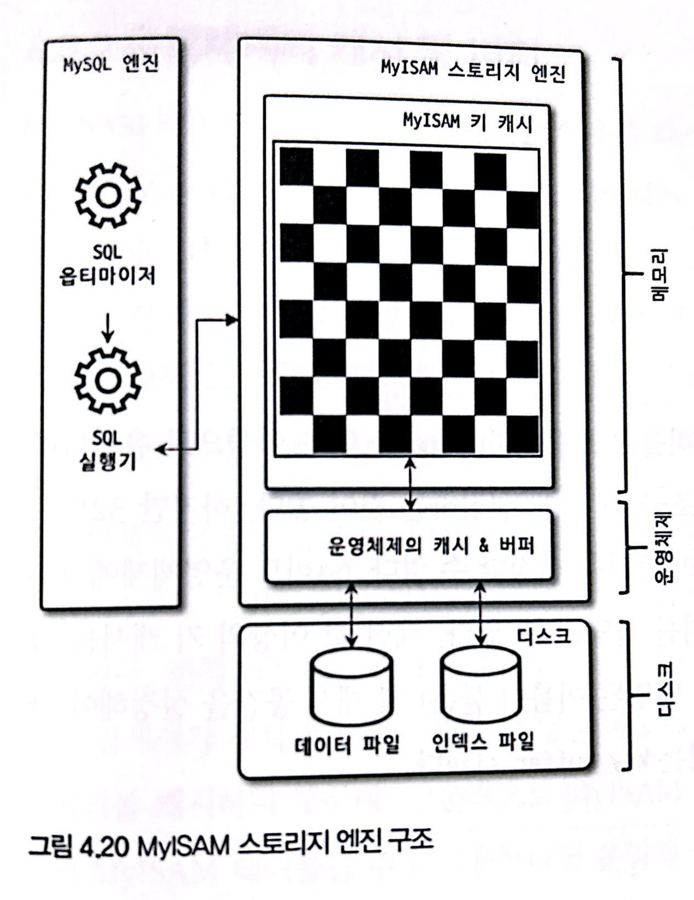

# 4. 아키텍처(MyISAM & Log)

> [4.3 MyISAM 스토리지 엔진 아키텍처](#4.3-MyISAM-스토리지-엔진-아키텍처)
>
> - 키 캐시
> - 운영체제의 캐시 및 버퍼
> - 데이터 파일과 프라이머리 키(인덱스) 구조
> 
> [4.4 MySQL 로그 파일](#4.4-MySQL-로그-파일)
> 
> - 에러 로그 파일
> - 제너럴 쿼리 로그 파일
> - 슬로우 쿼리 로그

<br>

## 4.3 MyISAM 스토리지 엔진 아키텍처



##### 키 캐시

- InnoDB 버퍼 풀과 비슷한 역할 하는 것이 Key cache(키 버퍼로도 불림)

- 인덱스만을 대상으로 작동하고, 인덱스의 디스크 쓰기 작업에 대해서만 부분적으로 버퍼링 역할

- 키 캐시 효율성

  `키 캐시 히트율(Hit reate) = 100 - (Key_reads / Key_read_requests * 100)`

  - Key_reads: 인덱스를 디스크에서 읽어 들인 횟수

  - Key_read_requests: 키 캐시로부터 인덱스를 읽은 횟수

  - 확인

    `SHOW GLOBAL STATUS LIKE 'Key%';`

- 매뉴얼에서는 Hit rate를 99% 이상으로 유지하라고 권장

  - 99% 미만이라면 키 캐시를 조금 더 크게 설정하는 것이 좋음
  - 32비트 운영체제에서는 하나의 키 캐시에 4GB 이상의 메모리 공간 설정할 수 없고, 64비트에서는 `OS_PER_PROCESS_LIMIT` 값에 설정된 크기만큼 메모리 할당 가능

- 키 캐시 생성 후 어떤 인덱스를 캐시할지 명령해야 해당 캐시를 사용하게 됨을 주의

<br>

##### 운영체제의 캐시 및 버퍼

- MyISAM 테이블의 인덱스는 키 캐시를 이용해 디스크 검색하지 않고도 빠르게 검색 가능
- 하지만 테이블 데이터는 디스크 I/O 해결을 위한 캐시,버퍼링 기능이 없음
- read/write 작업은 항상 운영체제에 작업 요청할 수밖에 없음
- 운영체제의 캐시 공간
  - 남는 메모리를 사용하는 것이 원칙
  - 남는 메모리가 없으면 MyISAM 테이블 테이블 데이터 캐시도 못함
  - 최대 물리 메모리의 40% 넘지 않게 설정하고, 나머지는 운영체제가 자체 파일 시스템을 위한 캐시 공간을 마련할 수 있게 해야함

##### 데이터 파일과 프라이머리 키(인덱스) 구조

- InnoDB 스토리지 엔진은 프라이머리 키에 의해 클러스터링되어 저장되는 반면, MyISAM 테이블은 프라이머리 키에 의한 클러스터링 없이 데이터 파일이 Heap 공간처럼 활용됨
- 즉, pk와 무관하게 insert 되는 순서대로 데이터 파일에 저장됨
- 저장 레코드는 모두 ROWID 물리 주소값을 가지는데, pk와 secondary index는 모두 데이터 파일에 저장된 레코드의 ROWID 값을 포인터로 가짐
- ROWID
  - 2가지 방법으로 저장될 수 있음
    - 고정 길이
      - `MAX_ROWS` 옵션 사용 시 최대 레코드 수가 한정된 테이블을 생성
      - 이 때 ROWID 값으로 4바이트 정수 사용
    - 가변 길이
      - `myisam_data_pointer_size=7(default)` 변수 설정 바이트 수만큼 공간 사용
      - 레코드 위치(offset)가 ROWID로 사용됨
      - default 7byte 일 때 256TB(2 ** (8 * (7 - 1)))

<br>

<br>

## 4.4 MySQL 로그 파일

### 4.4.1 에러 로그 파일

> MySQL이 실행되는 도중 발생하는 에러나 경고 메시지가 출력되는 로그 파일
>
> `log_error={file_path}` 경로에 생성

- MySQL이 시작하는 과정과 관련된 정보성 및 에러 메시지

  - 설정 파일 변경 또는 DB 비정상 종료 후 재시작 시에는 반드시 에러 로그 파일을 통해 설정된 변수의 이름이나 값이 명확하게 설정되고 의도한 대로 적용되었는지 확인 필요
  - 서버 정상 기동:  `mysqld: ready for connection ` 메시지 확인
  - 특정 변수 무시(ignore) 되었는지 확인
  - 변수명 또는 파라미터 값 인식하지 못하면 서버는 에러 메시지 및 시작하지 못했다는 메시지 출력

- 마지막으로 종료할 때 비정상적으로 종료된 경우 나타나는 InnoDB의 트랜잭션 복구 메시지

  - 비정상 또는 강제 종료 후 재시작 시 복구(완료되지 못한 트랜잭션 정리, 디스크 기록되지 못한 데이터 다시 기록)

  - 복구하지 못하면 에러 메시지 출력 후 서버 종료

    (innodb_force_recovery parameter 설정 필요할 수도 있음)

- 쿼리 처리 도중에 발생하는 문제에 대한 에러 메시지

  - 쿼리 실행 도중 또는 복제에서 문제되는 쿼리에 대한 경고메시지가 에러 로그에 기록
  - 에러 로그 파일 검토는 DB 문제 해결에 도움이 됨

- 비정상적으로 종료된 커넥션 메시지(Aborted connection)

  - 클라이언트 애플리케이션에서 정상 접속 종료하지 못할 경우

    (네트워크 접속 종료 시에도 동일)

  - 이 메시지가 많이 기록된다면, 커넥션 종료 로직 검토 필요

  - `Host {host_name} is blocked`

    - max_connect_errors 변수보다 호스트 에러(커넥션 실패 또는 강제 연결 종료) 횟수가 많아지면 발생
    - max_connect_errors 값 증가시켜야, 원인도 살펴봐야

- InnoDB의 모니터링 또는 상태 조회 명령의 결과 메시지

  ```sql
  SHOW ENGINE INNODB STATUS;  --상태 조회 명령
  ```

  - 테이블 모니터링, 락 모니터링, 엔진 상태 조회 명령은 상대적으로 큰 메시지를 에러 로그 파일에 기록
  - 모니터링 활성화한 경우 에러 로그 파일 매우 커져서 파일 시스템 공간 다 사용할 수도 있으므로, 모니터링 사용 후에는 비활성화하자

- MySQL의 종료 메시지

  - 누군가에 의해 종료될 때

    `Recieved SHUTDOWN from user...` 메시지 출력

  - 비정상 자동 종료
    - 아무런 종료 메시지가 없거나 스택 트레이스(16진수 주소값이 잔뜩 출력) 내용이 출력되면, Segmentation fault로 비정상 종료된 것으로 판단
    - 스택 트레이스 내용을 최대한 참조해 MySQL 버그와 연관 있는지 조사 후 버전 업그레이드를 하거나 회피책(WorkAround)를 찾아라

<br>

### 4.4.2 제너럴 쿼리 로그 파일

> 제너럴 로그 파일(General log)

- 경로

  - 시스템 변수: `general_log_file={file_path}`

  - 테이블 또는 파일 저장: `log_output` 설정 참조

    ```sql
    SHOW GLOBAL VARIABLES LIKE 'general_log_file';
    ```

- 실행 쿼리 전체 목록 검토 필요 시
  - 쿼리 로그 활성화하여 쿼리를 로그 파일로 기록하게 함
  - 슬로우 쿼리 로그와 다르게 제너럴 쿼리 로그는 실행되기 전 MySQL이 쿼리 요청을 받으면 바로 기록하므로, 실행 도중 에러 발생해도 일단 로그 파일에 기록됨

<br>

### 4.4.3 슬로우 쿼리 로그

- 경로
  - 시스템 변수: `slow_log_file={file_path}`
  - 테이블 또는 파일 저장: `log_output` 설정 참조

- 쿼리 튜닝은 서비스 운영 중 또는 전으로 나뉠 수 있는데, 서비스 운영 중 사용 쿼리 중에서 어떤 쿼리가 문제인지 판단하는 데 슬로우 쿼리 로그가 도움이 됨

- `long_query_time=10(default(s))` 시스템 변수 설정 시간 이상의 쿼리 모두 기록

  (소수점 사용 시 마이크로 초단위 설정 가능)

- 예시

  InnoDB의 경우 MySQL 엔진 레벨의 잠금과 스토리지 엔진 자체 잠금을 가지고 있어 슬로우 쿼리 로그 내용이 혼란스러울 수 있음

  ```txt
  # TIME: 2020-07-19T15:44:22, 178484+09:00
  # User@Host: root[root] @ localhost [] id:    14
  # Query_time: 1.180245  Lock_time: 0.002658  Rows_sent: 1  Rows_examined: 2844047
  use employees;
  SET timestamp=1595141060;
  select emp_no, max(salary) from salaries;
  ```

  - Time: 쿼리 종료 시간(시작 시점이 아님)
  - User@Host: 쿼리 실행 사용자 계정
  - Query_time: 쿼리 실행 전체 시간
  - Lock_time
    - MySQL 엔진 레벨 lock 대기 시간만 표현
    - 쿼리 실행 시 필요한 잠금 체크와 같은 코드 실행 부분의 시간도 포함되므로, 0이 아니어도 잠금이 일어난 것이 아닐 수 있음. 매우 작은 값이면 무시해도 무방
  - Rows_examined: 쿼리 처리 위해 몇 건의 레코드에 접근했는지
  - Rows_sent: 실제 몇 건의 처리 결과를 클라이언트로 반환했는지

- Percona Toolkit의 pt-query-digest 스크립트 등의 툴로 편리한 모니터링도 가능
  - 슬로우 쿼리 통계, 실행 빈도 및 누적 실행 시간순 랭킹, 쿼리별 실행 횟수 및 누적 실행 시간 상세 정보 등을 볼 수 있음


