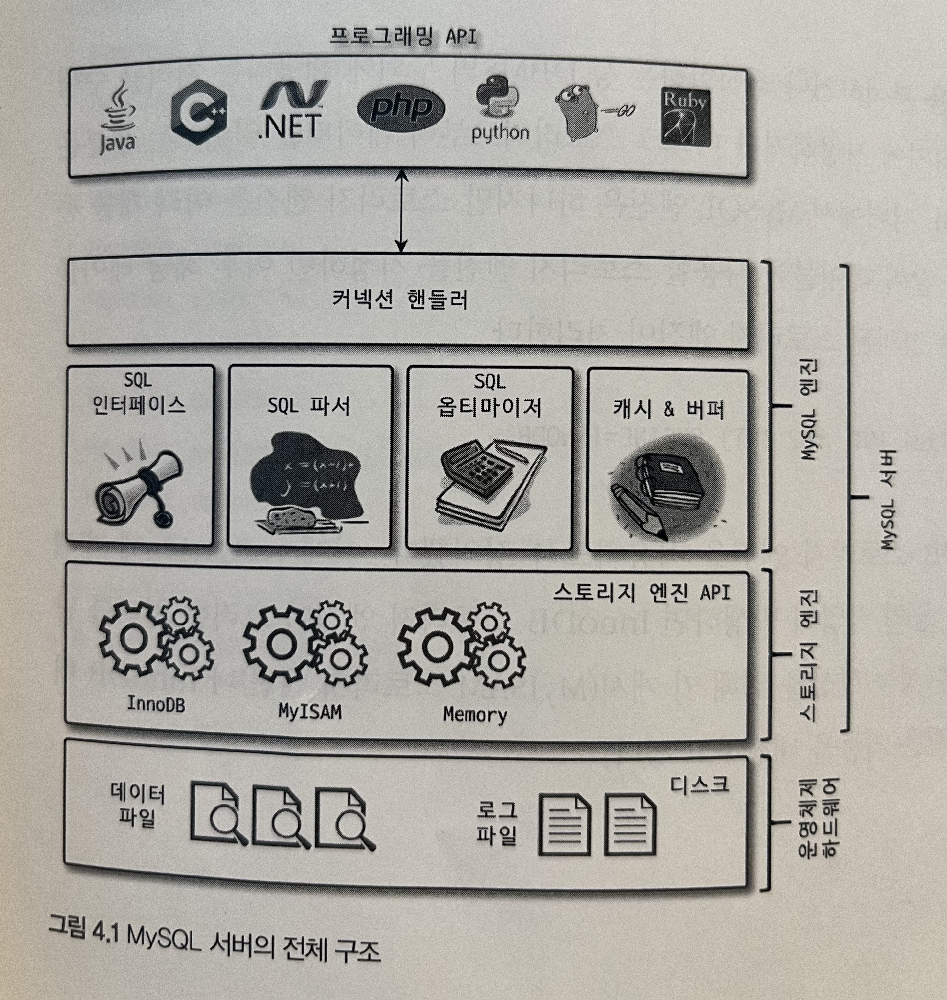
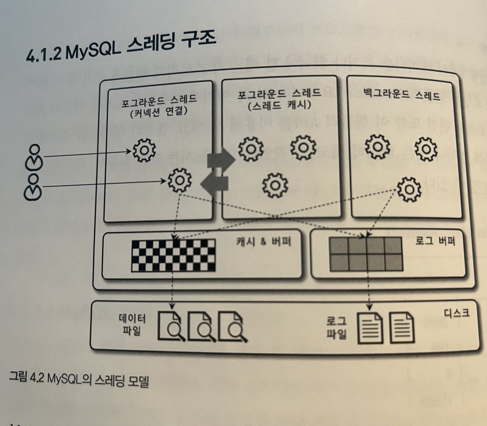
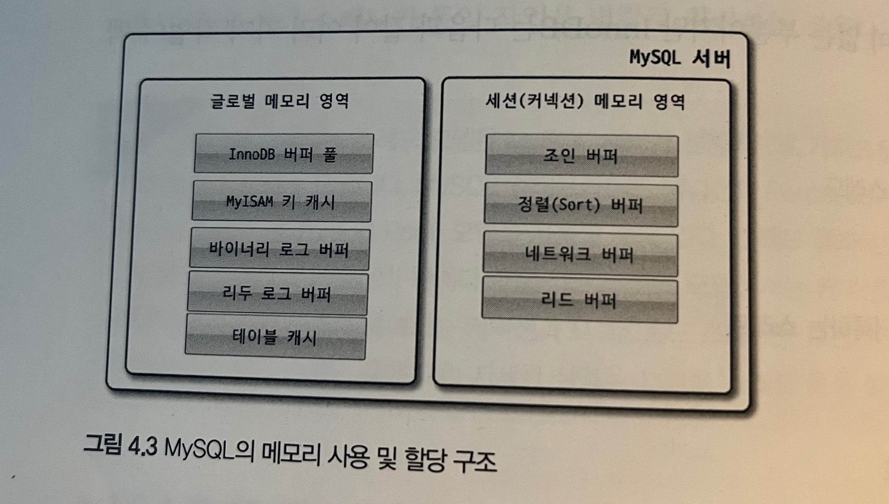
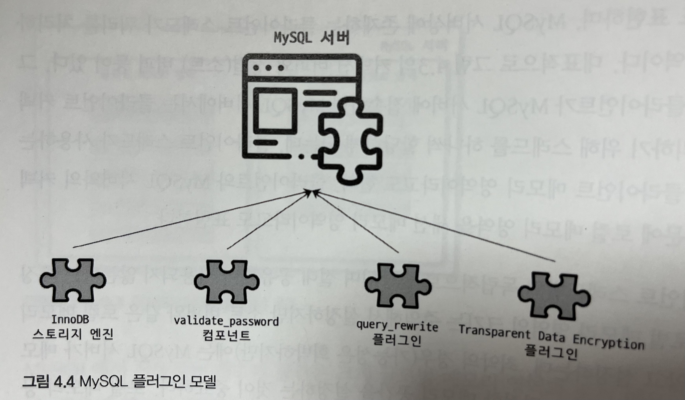
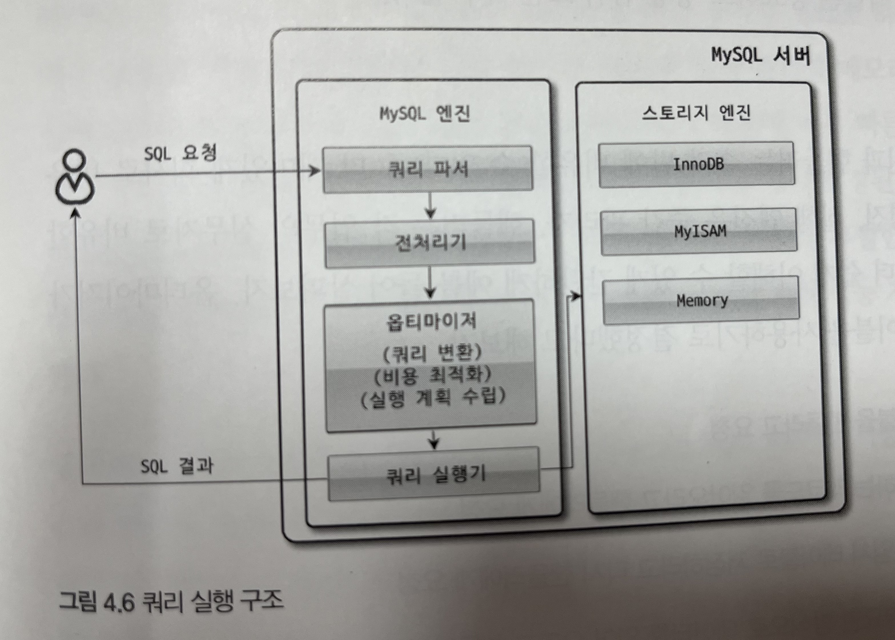
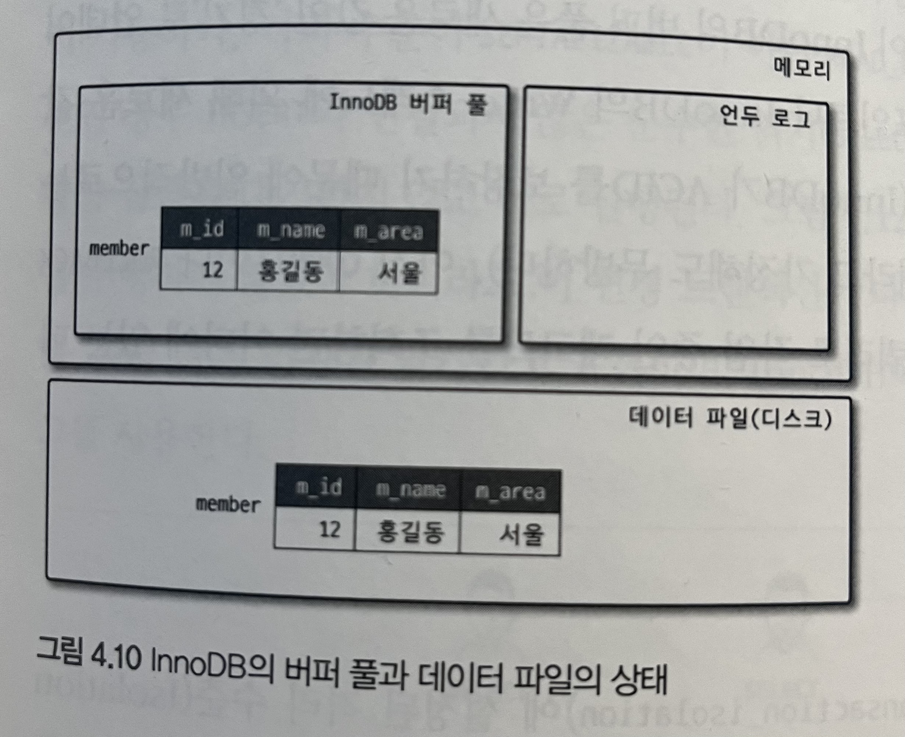
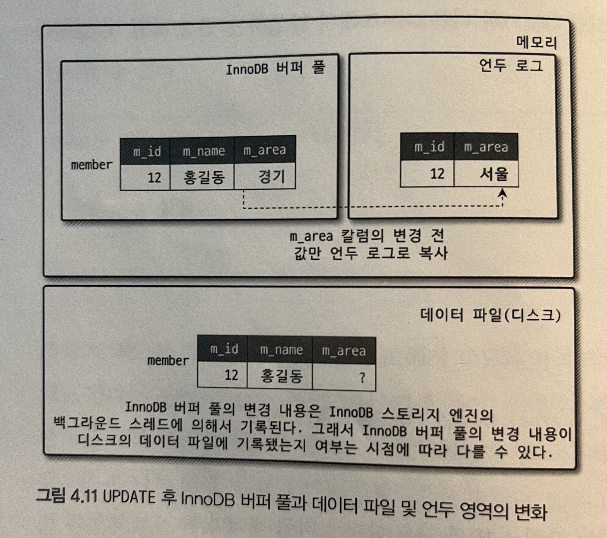

# 04 아키텍처

## 4.1 MySQL 엔진 아키텍처

### 4.1.1 MySQL 의 전체 구조



* MySQL  서버는 크게 MySQL 엔진과 스토리지 엔진으로 구분할 수 있다. 

#### 4.1.1.1 MySQL 엔진

* 다음과 같이 구성
  * 클라이언트로의 접속 및 쿼리 요청을 처리하는 커넥션 핸들러
  * SQL 파서 및 전처리기
  * 쿼리의 최적화된 실행을 위한 옵티마이저
* DBMS의 **두뇌**에 해당하는 처리 수행
* MySQL 엔진은 하나이다

#### 4.1.1.2 스토리지 엔진

* 데이터를 디스크 스토리지에 저장하거나 디스크 스토리지로부터 데이터 읽어옴
* 스토리지 엔진은 여러개를 동시에 사용할 수 있다.
* 테이블이 사용할 스토리지 엔진을 지정 가능

```mysql
mysql> create table test_table (fd1 int, fd2 int) engine=innodb;
Query OK, 0 rows affected (0.04 sec)
```

* 각 스토리지 엔진은 성능 향상을 위해 키 캐시나 innodb 버퍼 풀과 같은 기능을 내장하고 있다.

#### 4.1.1.3 핸들러 API

* MySQL 엔진의 쿼리 실행기에서 데이터를 쓰거나 읽어야 할 때는 각 스토리지 엔진에 쓰기 또는 읽기를 요청, 이러한 요청을 핸들러 요청 이라고 하고 여기서 사용되는 API를 핸들러 API라고 한다.
  * 핸들러 API를 통해 얼마나 많은 데이터(레코드) 작업이 있었는지 확인

```mysql
mysql> show global status like 'handler%';
+----------------------------+-------+
| Variable_name              | Value |
+----------------------------+-------+
| Handler_commit             | 0     |
| Handler_delete             | 0     |
| Handler_discover           | 0     |
| Handler_external_lock      | 0     |
| Handler_icp_attempts       | 0     |
| Handler_icp_match          | 0     |
| Handler_mrr_init           | 0     |
| Handler_mrr_key_refills    | 0     |
| Handler_mrr_rowid_refills  | 0     |
| Handler_prepare            | 0     |
| Handler_read_first         | 9     |
| Handler_read_key           | 9     |
| Handler_read_last          | 0     |
| Handler_read_next          | 52    |
| Handler_read_prev          | 0     |
| Handler_read_retry         | 0     |
| Handler_read_rnd           | 0     |
| Handler_read_rnd_deleted   | 0     |
| Handler_read_rnd_next      | 71    |
| Handler_rollback           | 0     |
| Handler_savepoint          | 0     |
| Handler_savepoint_rollback | 0     |
| Handler_tmp_delete         | 0     |
| Handler_tmp_update         | 0     |
| Handler_tmp_write          | 7     |
| Handler_update             | 0     |
| Handler_write              | 12    |
+----------------------------+-------+
27 rows in set (0.00 sec)
```


### 4.1.2 MySQL 스레딩 구조




* MySQL 서버는 프로세스 기반이 아닌 스레드 기반이다.
* 크게 포그라운드스레드 / 백그라운드 스레드로 구분할 수 있다.
* MySQL 서버에서 실행중인 스레드 목록

```mysql
select thread_id, name, type, processlist_user, processlist_host from performance_schema.threads order by type, thread_id;
Empty set (0.00 sec)
```

#### 4.1.2.1 포그라운드 스레드(클라이언트 스레드)

* 최소한 MySQL 서버에 접속된 클라이언트 수만큼 존재
* 각 클라이언트 사용자가 요청하는 쿼리 문장을 처리
* 사용자가 커넥션 종료하면 해당 커넥션을 담당하던 스레드는 다시 스레드 캐시로 되돌아간다.
* 이미 스레드 캐시에 일정 개수 이상의 대기 중인 스레드가 있으면 스레드 캐시에 넣지 않고 스레드를 종료시켜 일정 개수의 스레드만 스레드 캐시에 존재하게 한다.
* 포그라운드 스레드는 데이터를 MySQL의 데이터 버퍼나 캐시로부터 가저오며, 버퍼나 캐시에 없는 경우에는 직접 디스크의 데이터나 인덱스 파일로부터 데이터를 읽어와서 작업을 처리
* InnoDB 테이블의 경우 버퍼, 캐시까지만 포그라운드 스레드가 처리, 나머지 버퍼로부터 디스크까지 기록은 백그라운드 스레드가 처리

#### 4.1.1.2 백그라운드 스레드

* InnoDB에서 백그라운드로 처리되는 작업
  * 인서트 버퍼 병합 스레드
  * 로그를 디스크로 기록하는 스레드
  * InnoDB 버퍼 풀의 데이터를 디스크에 기록하는 스레드
  * 데이터를 버퍼로 읽어 오는 스레드
  * 잠금이나 데드락을 모니터링하는 스레드
* 쓰기 스레드는 아주 많은 작업을 백그라운드로 처리하기 때문에 충분히 설정해 주는것이 좋다.
* 대부분의 DBMS에서는 쓰기 작업을 버퍼링해서 일괄 처리하는 기능 탑재(InnoDB)
* MyISAM 은 사용자 스레드가 쓰기작업까지 하기 때문에 쓰기 버퍼링 기능 사용 불가


### 4.1.3 메모리 할당 및 사용 구조



### 

* MySQL 메모리 공간은 글로벌 메모리 영역, 로컬 메모리 영역으로 구분

#### 4.1.3.1 글로벌 메모리 영역

* MySQL 시스템변수로 설정해 둔 만큼 운영체제로부터 메모리를 할당받음

* 클라이언트 스레드 수와 무관하게 보통 하나의 메모리 공간만 할당된다.
* 모든 스레드에 의해 공유된다.
* 종류
  * 테이블 캐시
  * InnoDB 버퍼 풀
  * InnoDB 어댑팁 해시 인덱스
  * InnoDB 리두 로그 버퍼

#### 4.1.3.2 로컬 메모리 영역

* 클라이언트 스레드가 쿼리를 처리하는 데 사용하는 메모리 영역

* 클라이언트 커넥션으로부터의 요청을 처리하게 위해 하나씩 할당된 클라이언트 스레드가 사용하는 메모리 공간

* 클라이언트와 MySQL 서버와의 커넥션을 세션이라고 하기 때문에 세션 메모리 영역이라고도 표현

* 각 클라이언트 스레드별로 독립적으로 할당, 절대 공유되어 사용되지 않음

* 각 쿼리의 용도별로 필요할 때만 공간이 할당되고 필요하지 않은 경우에는 메모리 공간을 할당조차 하지 않을 수 있음( 소트 버퍼, 조인 버퍼와 같은 공간)

* 커넥션이 열려 있는 동안 계속 할당된 상태로 남아 있는 공간(커넥션 버퍼, 결과 버퍼)이 있고 쿼리를 실행하는 순간에만 할당했다가 다시 해제하는 공간(소트 버퍼나 조인 버퍼)이 있음

* 종류

  * 정렬 버퍼

  * 조인 버퍼

  * 바이너리 로그 캐시

  * 네트워크 버퍼

    

### 4.1.4 플러그인 스토리지 엔진 모델




* MySQL 에서 기본적으로 제공하는 스토리지 엔진 이외에 부가적인 기능을 더 제공하는 스토리지 엔진이 필요한 경우 플러그인으로 구현하여 제공
* 핸들러 
  * MySQL 엔진이 각 스토리지 엔진에게 데이터를 읽어오거나 저장하도록 명령하려면 핸들러를 통해야 함
  * 'Handler_' 로 시작하는 상태 변수는 MySQL 엔진이 각 스토리지 엔진에게 보낸 명령의 횟수를 의미하는 변수
* **하나의 쿼리 작업은 여러 하위 작업으로 나뉘는데, 각 하위 작업이 MySQL 엔진 영역에서 처리되는지 아니면 스토리지 엔진 영역에서 처리되는지 구분할 줄 알아야 한다.**
* MySQL 서버에서 지원되는 스토리지 엔진

```mysql
mysql> show engines;
+--------------------+---------+----------------------------------------------------------------------------------+--------------+------+------------+
| Engine             | Support | Comment                                                                          | Transactions | XA   | Savepoints |
+--------------------+---------+----------------------------------------------------------------------------------+--------------+------+------------+
| CSV                | YES     | Stores tables as CSV files                                                       | NO           | NO   | NO         |
| MRG_MyISAM         | YES     | Collection of identical MyISAM tables                                            | NO           | NO   | NO         |
| MEMORY             | YES     | Hash based, stored in memory, useful for temporary tables                        | NO           | NO   | NO         |
| MyISAM             | YES     | Non-transactional engine with good performance and small data footprint          | NO           | NO   | NO         |
| SEQUENCE           | YES     | Generated tables filled with sequential values                                   | YES          | NO   | YES        |
| InnoDB             | DEFAULT | Supports transactions, row-level locking, foreign keys and encryption for tables | YES          | YES  | YES        |
| Aria               | YES     | Crash-safe tables with MyISAM heritage                                           | NO           | NO   | NO         |
| PERFORMANCE_SCHEMA | YES     | Performance Schema                                                               | NO           | NO   | NO         |
+--------------------+---------+----------------------------------------------------------------------------------+--------------+------+------------+
8 rows in set (0.01 sec)
```

* 설치된 플러그인 확인

```mysql
mysql> show plugins;
+-------------------------------+----------+--------------------+---------+---------+
| Name                          | Status   | Type               | Library | License |
+-------------------------------+----------+--------------------+---------+---------+
| binlog                        | ACTIVE   | STORAGE ENGINE     | NULL    | GPL     |
| mysql_native_password         | ACTIVE   | AUTHENTICATION     | NULL    | GPL     |
| mysql_old_password            | ACTIVE   | AUTHENTICATION     | NULL    | GPL     |
| CSV                           | ACTIVE   | STORAGE ENGINE     | NULL    | GPL     |
| MEMORY                        | ACTIVE   | STORAGE ENGINE     | NULL    | GPL     |
| MyISAM                        | ACTIVE   | STORAGE ENGINE     | NULL    | GPL     |
| MRG_MyISAM                    | ACTIVE   | STORAGE ENGINE     | NULL    | GPL     |
| CLIENT_STATISTICS             | ACTIVE   | INFORMATION SCHEMA | NULL    | GPL     |
| INDEX_STATISTICS              | ACTIVE   | INFORMATION SCHEMA | NULL    | GPL     |
| TABLE_STATISTICS              | ACTIVE   | INFORMATION SCHEMA | NULL    | GPL     |
| USER_STATISTICS               | ACTIVE   | INFORMATION SCHEMA | NULL    | GPL     |
| SQL_SEQUENCE                  | ACTIVE   | STORAGE ENGINE     | NULL    | GPL     |
| InnoDB                        | ACTIVE   | STORAGE ENGINE     | NULL    | GPL     |
| INNODB_TRX                    | ACTIVE   | INFORMATION SCHEMA | NULL    | GPL     |
| INNODB_LOCKS                  | ACTIVE   | INFORMATION SCHEMA | NULL    | GPL     |
| INNODB_LOCK_WAITS             | ACTIVE   | INFORMATION SCHEMA | NULL    | GPL     |
| INNODB_CMP                    | ACTIVE   | INFORMATION SCHEMA | NULL    | GPL     |
| INNODB_CMP_RESET              | ACTIVE   | INFORMATION SCHEMA | NULL    | GPL     |
| INNODB_CMPMEM                 | ACTIVE   | INFORMATION SCHEMA | NULL    | GPL     |
| INNODB_CMPMEM_RESET           | ACTIVE   | INFORMATION SCHEMA | NULL    | GPL     |
| INNODB_CMP_PER_INDEX          | ACTIVE   | INFORMATION SCHEMA | NULL    | GPL     |
| INNODB_CMP_PER_INDEX_RESET    | ACTIVE   | INFORMATION SCHEMA | NULL    | GPL     |
| INNODB_BUFFER_PAGE            | ACTIVE   | INFORMATION SCHEMA | NULL    | GPL     |
| INNODB_BUFFER_PAGE_LRU        | ACTIVE   | INFORMATION SCHEMA | NULL    | GPL     |
| INNODB_BUFFER_POOL_STATS      | ACTIVE   | INFORMATION SCHEMA | NULL    | GPL     |
| INNODB_METRICS                | ACTIVE   | INFORMATION SCHEMA | NULL    | GPL     |
| INNODB_FT_DEFAULT_STOPWORD    | ACTIVE   | INFORMATION SCHEMA | NULL    | GPL     |
| INNODB_FT_DELETED             | ACTIVE   | INFORMATION SCHEMA | NULL    | GPL     |
| INNODB_FT_BEING_DELETED       | ACTIVE   | INFORMATION SCHEMA | NULL    | GPL     |
| INNODB_FT_CONFIG              | ACTIVE   | INFORMATION SCHEMA | NULL    | GPL     |
| INNODB_FT_INDEX_CACHE         | ACTIVE   | INFORMATION SCHEMA | NULL    | GPL     |
| INNODB_FT_INDEX_TABLE         | ACTIVE   | INFORMATION SCHEMA | NULL    | GPL     |
| INNODB_SYS_TABLES             | ACTIVE   | INFORMATION SCHEMA | NULL    | GPL     |
| INNODB_SYS_TABLESTATS         | ACTIVE   | INFORMATION SCHEMA | NULL    | GPL     |
| INNODB_SYS_INDEXES            | ACTIVE   | INFORMATION SCHEMA | NULL    | GPL     |
| INNODB_SYS_COLUMNS            | ACTIVE   | INFORMATION SCHEMA | NULL    | GPL     |
| INNODB_SYS_FIELDS             | ACTIVE   | INFORMATION SCHEMA | NULL    | GPL     |
| INNODB_SYS_FOREIGN            | ACTIVE   | INFORMATION SCHEMA | NULL    | GPL     |
| INNODB_SYS_FOREIGN_COLS       | ACTIVE   | INFORMATION SCHEMA | NULL    | GPL     |
| INNODB_SYS_TABLESPACES        | ACTIVE   | INFORMATION SCHEMA | NULL    | GPL     |
| INNODB_SYS_DATAFILES          | ACTIVE   | INFORMATION SCHEMA | NULL    | GPL     |
| INNODB_SYS_VIRTUAL            | ACTIVE   | INFORMATION SCHEMA | NULL    | GPL     |
| INNODB_MUTEXES                | ACTIVE   | INFORMATION SCHEMA | NULL    | GPL     |
| INNODB_SYS_SEMAPHORE_WAITS    | ACTIVE   | INFORMATION SCHEMA | NULL    | GPL     |
| INNODB_TABLESPACES_ENCRYPTION | ACTIVE   | INFORMATION SCHEMA | NULL    | BSD     |
| INNODB_TABLESPACES_SCRUBBING  | ACTIVE   | INFORMATION SCHEMA | NULL    | BSD     |
| Aria                          | ACTIVE   | STORAGE ENGINE     | NULL    | GPL     |
| PERFORMANCE_SCHEMA            | ACTIVE   | STORAGE ENGINE     | NULL    | GPL     |
| SEQUENCE                      | ACTIVE   | STORAGE ENGINE     | NULL    | GPL     |
| FEEDBACK                      | DISABLED | INFORMATION SCHEMA | NULL    | GPL     |
| user_variables                | ACTIVE   | INFORMATION SCHEMA | NULL    | GPL     |
| partition                     | ACTIVE   | STORAGE ENGINE     | NULL    | GPL     |
+-------------------------------+----------+--------------------+---------+---------+
52 rows in set (0.01 sec)

```

* MySQL 서버에서는 스토리지 엔진뿐 만 아니라 다양한 기능을 플러그인 형태로 지원한다.

* MySQL 서버에서 제공하는 기능을 확장하거나 완전히 새로운 기능을 플러그인을 이용해 구현할 수 있음.

  

### 4.1.5 컴포넌트

* MySQL 8.0 부터 기존의 플러그인 아키텍처를 대체하기 위해 컴포넌트 아키텍처 지원
* 플러그인의 단점
  * 오직 MySQL 서버와 인터페이스할 수 있고, 플러그인끼리 통신 불가
  * MySQL 서버의 변수나 함수를 직접 호출하기 때문에 안전하지 않음(캡슐화 x)
  * 플러그인은 상호 의존 관계를 설정할 수 없어 초기화가 어려움

* 컴포넌트 사용법

```mysql
mysql> install component 'file://component_validate_password';

mysql> select * from mysql.component;
```


### 4.1.6 쿼리 실행 구조




#### 4.1.6.1 쿼리 파서

* 사용자 요청으로 들어온 쿼리 문장을 토큰으로 분리해 트리 형태의 구조로 만들어 내는 작업, 기본 문법 오류 발견

#### 4.1.6.2 전처리기

* 파서 과정에서 만들어진 파서 트리를 기반으로 쿼리 문장에 구조적인 문제점이 있는지 확인, 각 토큰을 테이블 이름이나 칼럼 이름, 내장함수과 같은 개체를 매핑해 해당 객체의 존재 여부와 객체의 접근 권한 등을 확인하는 과정을 수행

#### 4.1.6.3 옵티마이저

* 사용자의 요청으로 들어온 쿼리 문장을 저렴한 비용으로 가장 빠르게 처리하는 방법을 결정

#### 4.1.6.4 실행 엔진

* 옵티마이저는 회사의 경영진, 실행 엔진은 중간 관리자, 핸들러는 각 업무의 실무자
* 실행 엔진은 만들어진 계획대로 각 핸들러에게 요청해서 받은 결과를 또 다른 핸들러 요청의 입력으로 연결하는 역할을 수행

#### 4.1.6.5 핸들러(스토리지 엔진)

* 핸들러는 서버의 가장 밑단에서 MySQL 실행 엔진의 요청에 따라 데이터를 디스크로 저장하고 읽어 오는 역할을 담당 
* MyISAM 테이블을 조작하는 경우에는 핸들러가 MyISAM 스토리지 엔진이 되고, InnoDB 테이블을 조작하는 경우에는 핸들러가 InnoDB 스토리지 엔진이 된다.


### 4.1.7 복제

* 뒷 단원에서 다룸


### 4.1.8 쿼리 캐시

* SQL 의 실행결과를 메모리에 캐시하고, 동일 SLQ 쿼리가 실행되면 테이블을 읽지 않고 즉시 결과 반환하는 역할
* 하지만 테이블 데이터가 변경되면 캐시에 저장된 관련 내용을 모두 삭제해야해서 심각한 동시 처리 성능 저하 유발
* MySQL 8.0에서 기능 ㄴ제거됨


### 4.1.9 스레드 풀

* MySQL 커뮤니티 에디션에서 스레드 풀 기능 사용하고자 한다면, 플러그인 형태로 작동하는 Percona Server 에서 제공하는 스레드 풀 사용

* 내부적으로 사용자의 요청을 처리하는 스레드 개수를 줄여서 CPU가 제한된 개수의 스레드 처리에만 집중할 수 있게 해서 서버의 자원 소모를 줄이는 것이 목적

* 기본적으로 CPU 코어의 개수만큼 스레드 그룹 생성, thread_pool_size 변수 변경해 조정 가능

* 스레드 그룹의 모든 스레드가 일을 처리하고 있다면 스레드 풀은 해당 스레드 그룹에 새로운 작업 스레드를 추가할지, 아니면 기존 작업 스레드가 처리를 완료할 때 까지 기다릴지 여부 판단해야 함

  * 스레드 풀의 타이머 스레드는 주기적으로 스레드 그룹의 상태를 체크해서 thread_pool_stall_limit시스템 변수에 정의된 밀리초 안에 작업 스레드가 지금 처리 중인 작업을 끝내지 못하면 새로운 스레드를 생성해서 스레드 그룹에 추가한다.
  * 이때 전체 스레드 풀에 있는 스레드의 개수는 thread_pool_max_threads 시스템 변수의 값을 넘어설 수 없다.
  * 즉, 모든 스레드 그룹의 스레드가 각자 작업을 처리하고 있는 상태에서 새로운 쿼리 요청이 들어오더라도 스레드 풀은 thread_pool_stall_limit 시간 동안 기다려야만 새로 들어온 요청을 처리할 수 있다는 뜻이다.
  * 따라서 응답 시간에 아주 민감한 서비스라면 thread_pool_stall_limit 시스템 변수를 적절히 낮춰서 설정해야 한다.

* Percona Server의 스레드 풀 플러그인은 선순위 큐와 후순위 큐를 이용해 특정 트랜잭션이나 쿼리를 우선적으로 처리할 수 있는 기능을 제공 -> 전체적인 처리 성능 향상

  

### 4.1.10 트랜잭션 지원 메타데이터

* 데이터베이스 서버에서 테이블의 구조 정보와 스토어드 프로그램 등의 정보를 데이터 딕셔너리 또는 메타데이터 라고 함
* MySQL 5.7 버전까지는 메타데이터를 **파일 기반**으로 관리하였으나, 이러한 방법은 생성 및 변경 작업이 **트랜잭션을 지원하지 않기 때문에** 테이블의 생성 또는 변경 도중에 MySQL 서버가 비정상적으로 종료되면 일관되지 않은 상태로 남게 됨
* 이와 같은 문제점을 해결하기 위해 MySQL 8.0 버전 부터는 메타데이터를 **InnoDB 테이블에 저장**하도록 개선
  * MySQL 서버가 작동하는 데 기본적으로 필요한 테이블들인 시스템 테이블을 모두 InnoDB 스토리지 엔진을 사용, 시스템 테이블과 딕셔너리 정보를 모아서 mysql DB에 저장
  * mysql DB는 통째로 mysql.ibd 라는 이름의 테이블스페이스에 저장되기 때문에 MySQL  서버의 데이터 디렉터리에 존재하는 mysql.ibd라는 파일은 다른 *.ibd 파일과 함께 주의가 필요
  * mysql DB 테이블에서 실제 테이블의 구조가 저장된 테이블은 보이지 않는다. 사용자가 임의로 수정하지 못하게 사용자의 화면에 보여주지 않는다. 대신 information_schema DB의 TABLES와 COLUMNS 등과 같은 뷰를 통해 조회할 수 있음
* 메타데이터가 트**랜잭션 기반의 InnoDB 스토리지 엔진에 저장**되도록 개선되면서 스키마 변경 작업 중간에 MySQL 서버가 비정상적으로 종료되어도 스키마 변경이 완전한 성공 또는 완전한 실패로 정리된다.
* MyISAM 이나  CSV 등과 같은 스토리지 엔진의 메타 데이터는 SDI(Serialized Dictionary Information) 파일 사용
  * InnoDB 테이블 구조도 SDI 파일로 변환 가능
  * ibd2sdi 유틸리티 사용하면 InnoDB 테이블스페이스에서 스키마 정보 추출할 수 있음

```mysql
mysql> ibd2sdi mysql_data_dir/mysql.ibd > mysql_schema.json;
```


## 4.2 InnoDB 스토리지 엔진 아키텍처

* MySQL 에서 사용할 수 있는 스토리지 엔진 중 거의 유일하게 레코드 기반의 잠금 제공 -> 높은 동시성 처리 가능, 안정적, 뛰어난 성능

  

### 4.2.1 프라이머리 키에 의한 클러스터링

* InnoDB의 모든 테이블은 기본적으로 프라이머리 키를 기준으로 클러스터링되어 저장된다
* 프라이머리 키가 클러스터링 인덱스이기 때문에 프라이머리 키를 이용한 레인지 스캔은 상당히 빨리 처리
* 쿼리의 실행 계획에서 프라이머리 키는 기본적으로 다른 보조 인덱스에 비해 비중이 높게 설정됨(쿼리의 실행 계획에서 다른 보조 인덱스보다 프라이머리 키가 선택될 확률 높음)
* **오라클 DBMS의 IOT(Index organized table)과 동일한 구조가 InnoDB에서는 일반적인 테이블의 구조**가 되는 것
* MyISAM스트리지 엔진에서는 클러스터링 키를 지원하지 않음 -> 프라이머리 키와 세컨더리 인덱스는 구조적으로 아무런 차이 없음

### 4.2.2 외래 키 지원

* InnoDB에서 외래 키는 부모 테이블, 자식 테이블 모두 해당 칼럼에 인덱스 생성 필요, 변경 시에는 반드시 부모, 자식 테이블에 데이터 있는지 체크작업 필요 -> 데드락 발생 빈법, 주의 필요
* 외래 키가 복잡하게 얽히는 등의 문제로 수동으로 데이터 적재하거나 스키마 변경 등의 작업에 문제가 생길 때는 foreign_key_checks 시스템 변수 off설정, 외래 키 관계에 대한 체크 작업 일시정지

### 4.2.3 MVCC(Multi Version Concurrency Control)

* 잠금을 사용하지 않는 일관된 읽기를 제공하는게 목적
* 언두 로그로 구현
* 멀티 버전 : 하나의 레코드에 대해 여러 개의 버전이 동시에 관리된다는 의미
* InnoDB 스토리지 엔진 사용하는 테이블의 데이터 변경 처리 과정
* 



* 격리 수준이 READ_UNCOMMITTED인 경우에는 InnoDB 버퍼 풀이 현재 가지고 있는 변경된 데이터 읽어서 반환

* READ_COMMITTED이나 그 이상의 격리 주순(REPEATABLE_READ,  SERIALIZABE)인 경우에는 아직 커밋되지 않았기 때문에 InnoDB 버퍼 풀이나 데이터 파일에 있는 내용 대신 변경되기 이전의 내용을 보관하고 있는 언두 영역의 데이터 반환

* **-> 이러한 과정을 DBMS에서는 MVCC라고 표현**
  
  * 하나의 레코드에 대해서 2개의 버전이 유지되고, 필요에 따라 어느 데이터가 보여지는지 달라지는 구조
  
* 롤백을 실행하면 InnoDB는 언두 영역에 있는 백업된 데이터를 다시 InnoDB 버퍼 풀로 복구, 언두 영역의 내용은 삭제 

* 언두 영역의 데이터는 언두 영역을 필요로 하는 트랜잭션이 없을 때 삭제됨

  

### 4.2.4 잠금 없는 일관된 읽기(Non-Locking Consistent Read)

* InnoDB 스토리지 엔진은 MVCC 기술 이용해 잠금 걸지 않고 읽기 작업 수행

* 격리 수준이 SERIALIZABLE이 아닌 수준인 경우 INSERT와 연결되지 않은 순수한 읽기(SELECT)작업은 다른 트랜잭션의 변경 작업과 관계없이 항상 잠금 대기하지 않고 바로 실행

* 이를 위해 언두 로그 사용

* 오랜 시간 동안 활성 상태인 트랜잭션으로 인해 MySQL 서버가 느리거나 문제 발생하는 경우 있음, 일관된 읽기를 위해 언두 로그를 삭제하지 못하고 계속 유지해야 하기 때문 -> 트랜잭션이 시작됐다면 가능한 빨리 롤백, 커밋을 통해 트랜잭션 완료 하는것이 좋다.

  

### 4.2.5 자동 데드락 감지

* InnoDB 스토리지 엔진은 데드락 감지 스레드를 가지고 있어서 주기적으로 잠금 대기 그래프 검사, 교착 상태 빠진 트랜잭션 찾아서 언두 로그 레코드 적게 가진 트랜잭션 순으로 강제종료
* innodb_table_locks 시스템 변수 활성화하면 InnoDB 스토리지 엔진 내부의 레코드 잠금 뿐 아니라 테이블 레벨의 잠금까지 감지할 수 있게 됨. 활성화 추천
* 

### 4.2.6 자동화된 장애 복구

* 자동으로 복구될 수 없는 손상이 있다면 InnoDB는 자동 복구를 멈추고 MySQL 서버 종료
* MySQL 설정 파일에 innodb_force_recovery 시스템 변수 설정해서 MySQL서버 재시작
  * 서버 시작될 때 innoDB 스토리지 엔진이 데이터 파일이나 로그 파일의 손상 여부 검사 과정 선별적으로 진행할 수 있게 함
  * 1 ~ 6 까지 값이 있는데 커질수록 심각, 복구가능성 적어짐
  
  

### 4.2.7 InnoDB 버퍼 풀

* InnoDB 스토리지 엔진의 가장 핵심 부분
* 디스크의 데이터 파일이나 인덱스 정보를 메모리에 캐시해 두는 공간

#### 4.2.7.1 버퍼 풀의 크기 설정

* InnoDB 버퍼 풀의 크기 적절히 작은 값으로 설정해서 조금씩 증가시키는게 최선
* innodb_buffer_pool_size 로 설정, 허나 버퍼 풀 크기 변경은 크리티컬한 변경이므로 서버가 한가할 때 진행하는것이 좋음
* 버퍼 풀 여러개로 쪼개어 관리 할 수 있게 개선됨 -> 개별 버퍼 풀 전체를 관리하는 잠금(세마포어) 자체도 경합이 분산되는 효과 내게 됨

#### 4.2.7.2 버퍼 풀의 구조

* 버퍼 풀은 페이지 크기로 쪼개져 InnoDB 스토리지 엔진이 데이터를 필요로 할 때 해당 데이터 페이지를 읽어서 각 조각에 저장
* 버퍼 풀 페이지 조작 관리 위한 자료구조
  * 프리 리스트
    * 버퍼 풀에서 비어있는 페이지들 목록, 사용자 쿼리가 디스크의 데이터 페이지 읽어와야 할 때 사용
  * LRU 리스트
    * LRU + MRU 결합형태
    * 디스크로부터 한 번 읽어온 페이지를 최대한 오랫동안 InnoDB 버퍼 풀 메모리에 유지해서 디스크 읽기 최소화 하기 위한 목적
  * 플러시 리스트
    * 디스크로 동기화되지 않은 데이터를 가진 데이터 페이지의 변경 시점 기준의 페이지 목록 관리
    * 한 번 변경이 가해진 데이터 페이지는 플러시 리스트에 관리됨, 특정 시점에 디스크에 기록돼야함
    * 데이터가 변경되면 InnoDB 는 변경 내용을 리두 로그에 기록하고 버퍼 풀의 데이터 페이지에도 변경내용 반영, 리두 로그의 각 엔트리는 특정 데이터 페이지와 연결됨
    * 리두 로그가 디스크로 기록됐다해서 데이터 페이지가 디스크로 기록됐다는 것 보장 x
    * InnoDB 스토리지 엔진은 체크포인트 발생, 리두로그와 데이터페이지 상태 동기화

#### 4.2.7.3 버퍼 풀과 리두 로그

* 버퍼 풀은 클 수록 쿼리 성능 빨라짐
* 하지만 버퍼 풀 메모리 공간 늘리는 것은 데이터 캐시 기능만 향상시키는것
* 버퍼링 기능까지 향상시키려면 InnoDB 버퍼 풀과 리두 로그와의 관계 이해해야 함
* 클린페이지, 더티페이지
* 리두 로그는 1개 이상의 고정 크기 파일을 연결해서 순환 고리처럼 사용, 로그 엔트리는 어느 순간 새로운 로그 엔트리로 덮어 씌워짐
* 따라서 리두 로그 파일에서 재사용 가능/불가능 공간 구분 관리 해야함
* 재사용 불가능 공간을 활성 리두 로그 라고 함
* LSN 
* 가장 최근 체크포인트 지점의 LSN이 활성 리두 로그 공간의 시작점
* 체크포인트 에이지 : 가장 최근 체크포인트의 LSN과 마지막 리두 로그 엔트리의 LSN의 차이 = 활성 리두 공간의 크기
* 체크포인트 LSN보다 작은 리두 로그 엔트리와 관련된 더티 페이지는 모두 디스크로 동기화돼야 한다.
* 체크포인트 LSN보다 작은 LSN값을 가진 리두 로그 엔트리도 디스클로 동기화돼야 한다.

#### 4.2.7.4 버퍼 풀 플러시

*  InnoDB 스토리지 엔진이 버퍼 풀에서 아직 디스크로 기록되지 않은 더티 페이지들을 디스크에 동기화하기 위해 실행하는 2개의 플러시 기능
  * 플러시 리스트 플러시
  * LRU 리스트 플러시

##### 4.2.7.4.1 플러시 리스트 플러시

* 재활용을 위해 리두 로그 공간을 지우려면 InnoDB 버퍼 풀의 페이지가 먼저 디스크로 동기화돼야 한다. 이를 위해 주기적으로 플러시 리스트 플러시 함수 호출, 플러시 리스트에서 로새전에 변경된 데이터 페이지 순서대로 디스크에 동기화
* 클리너 스레드 : 더티 페이지를 디스크로 동기화하는 스레드
* 하나의 클리너 스레드가 하나의 버퍼 풀 인스턴스 처리하도록 자동으로 설정됨, 하지만 innodb_page_cleaners 시스템 변수의 설정값이 버퍼 풀 인스턴스를 개수보다 적으면 하나의 클리너 스레드가 여러개의 버퍼 풀 인스턴스 처리
* 버퍼 풀에 더티 페이지가 많을수록 디스크 쓰기 폭발 현상 발생가능성 높아짐
* 일정 수준 이상의 더티 페이지 발생하면 조금씩 더티 페이지를 디스크로 기록
* 어댑티브 플러시 : 단순히 버퍼 풀의 더티 페이지 비율이나 변수 설정값에 의존하지 않고 새로운 알고리즘을 사용해서 더티페이지를 얼마나 디스크로 기록할지 결정 

##### 4.2.7.4.2 LRU 리스트 플러시

* LRU 리스트에서 사용 빈도가 낮은 데이터 페이지들을 제거해서 새로운 페이지들을 읽어올 공간을 만들기 위해 사용

#### 4.2.7.5 버퍼 풀 상태 백업 및 복구

* 워밍업 상태 : 버퍼 풀에 쿼리들이 사용할 데이터가 이미 준비돼 있어서 디스크에서 읽어오지 않아도 되는 상태, 쿼리처리속도 빨라짐
* 5.6 버전부터는 버퍼 풀 덤프 및 적재 기능 도입, InnoDB 버퍼 풀 상태 백업 가능

#### 4.2.7.6 버퍼 풀의 적재 내용 확인

* infromation_schema 데이터베이스의 innodb_buffer_page 테이블 이용해 버퍼 풀의 메모리에 어떤 테이블의 페이지들이 적재돼 있는지 확인 가능, 하지만 부하 일으킬 수 있음 -> innodb_cached_indexes 테이블 추가됨, 테이블 인덱스별로 데이터 페이지가 얼마나 버퍼 풀에 적재돼있는지 확인 가능

  

### 4.2.8 Double Write Buffer

* 파셜 페이지, 톤 페이지 : 리두 로그 공간 낭비 막기 위해 페이지의 변경된 내용만 기록하는 것으로 인해 더티 페이지를 디스크 파일로 플러시 할 때 일부만 기록되는 문제가 발생되는 현상

* 이같은 문제 막기 위해 Double Write 기법 이용해 더티 페이지를 묶어서 한번의 디스크 쓰기로 시스템 테이블스페이스의 DoubleWrite 버퍼에 기록

  

### 4.2.9 언두로그

* 트랜잭션, 격리수준 보장 위해 DML로 변경되기 이전 버전의 데이터 별도 백업

#### 4.2.9.1 언두 로그 모니터링 

* 언두로그 데이터 용도 
  * 트랜잭션 롤백 대비
  * 트랜잭션 격리 수준 유지하면서 높은 동시성 제공
    * 트랜잭션 격리 수준 : 동시에 여러 트랜잭션이 데이터 변경하거나 조회할 때 한 트랜잭션의 작업 내용이 다른 트랜잭션에 어떻게 보일지 결정하는 기준
* 5.5 이전 버전에서는 한번 증가한 언두 로그공간은 다시 줄어들지 않았음 -> 디스크 사용량, 매번 백업할 때도 그만큼 더 복사해야하는 문제점
* 5.7 이후 언두 로그를 돌아가면서 순차저긍로 사용해 디스크 공간 줄이는것 가능, 서버가 필요한 시점에 사용공간 자동으로 줄여주기도 함
* 하지만 여전히 활성 트랜잭션이 장시간 유지되는것은 좋지 않기 때문에 서버의 언두 로그가 얼마나 증가했는지 모니터링하는게 좋음
* INSERT 문장 언두로그와 UPDATE / DELETE 문장 언두로그는 별도관리
  * update/delete 문장 언두로그는 mvcc와 데이터복구에 모두 사용되지만 insert 문장 언두로그는 mvcc에는 사용되지 않기 때문

#### 4.2.9.2 언두 테이블스페이스 관리

* 언두 로그가 저장되는 공간
* 8.0버전부터는 언두로그는 항상 시스템 테이블스페이스 외부의 별도 로그 파일에 기록되도록 개선
* 하나의 언두 테이블스페이스는 1~128 롤백 세그먼트 가짐, 롤백 세그먼트는 1개 이상의 언두 슬롯 가짐
* 최대 동시 처리 가능 트랜잭션 수
  * InnoDB 페이지 크기 / 16 * 롤백 세그먼트 개수 * 언두 테이블스페이스 개수
* 8.0부터 새로운 언두 테이블 스페이스 동적으로 추가, 삭제 가능
* Undo tablespace truncate : 언두 테이블스페이스 공간을 필요한 만큼만 남기고 운영체제로 반납하는것


### 4.2.10 체인지 버퍼

* 변경해야 할 인덱스 페이지가 버퍼풀에 없어서 디스크로 부터 읽어와서 업데이트 해야하는 경우 즉시 실행하지 않고 임시 공간에 저장해두고 바로 사용자에게 결과를 반환하면서 성능을 향상시키는데, 이때 사용하는 임시 메모리
* 유니크 인덱스는 체인지 버퍼 사용 불가
* 체인지 버퍼에 임시로 저장된 인덱스 레코드 조각은 이후 백그라운드 스레드에 의해 병합, 이를 체인지 버퍼 머지 스레드 라고 함


### 4.2.11 리두 로그 및 로그 버퍼 

* 트랜잭션의 4요소 중 D(영속성)과 연관
* 서버 비정상 종료 시 데이터 파일에 기록되지 못한 데이터 잃지 않게 해주는 안전장치
* 일관되지 않은 데이터 종류
  * 커밋됐지만 데이터 파일에 기록되지 않은 데이터 -> 리두로그로 복구
  * 롤백됐지만 데이터 파일에 이미 기록된 데이터 -> 언두로그 + 리두로그 사용
* 리두 로그는 트랜잭션 커밋되면 즉시 디스크로 기록되도록 설정하는 것 권장, 하지만 부하 유발할 수 있으므로 시스템변수로 조절 가능
  * innodb_flush_log_at_trx_commit  = 0 : 1초에 한번씩 리두로그 디스크로 기록, 동기화
  * = 1 : 트랜잭션 커밋될 때 마다 디스크로 기록, 동기화
  * = 2 : 트랜잭션 커밋될 떄 마다 디스크로 기록, 동기화는 1초에 한번


#### 4.2.11.1 리두 로그 아카이빙 

* 데이터 변경이 많아서 리두 로그가 덮어쓰인다고 해도 백업이 실패하지 않게 해줌


#### 4.2.11.2 리주 로그 활성화 및 비활성화

* 트랜잭션이 커밋돼도 데이터 파일은 즉시 디스크로 동기화되지 않지만 리두로그는 항상 디스크로 기록됨
* 8.0 부터는 리두로그를 비활성화 해서 데이터 적재 시간 단축시킬 수 있음


### 4.2.12 어댑티브 해시 인덱스

* 사용자가 수동으로 생성하는 인덱스가 아니라 InnoDB 스토리지 엔진에서 사용자가 자주 요청하는 데이터에 대해 자동으로 생성하는 인덱스
* B-Tree인덱스 검색시간 줄여주기 위해 도입
* 해시 인덱스는 (인덱스 키 값, 데이터 페이지 주소) 쌍으로 관리됨
* 인덱스 키 값은 B-Tree 인덱스의 고유번호와 B-Tree인덱스의 실제 키 값 조합으로 생ㅅ어
* 데이터 페이지 주소는 실제 키 값이 저장된 데이터 페이지의 메모리 주소(InnODB 버퍼 풀에 로딩된 페이지의 주소)
* 8.0 부터는 내부 잠금(세마포어) 경합 줄이기 위해 어댑티브 해시 인덱스의 파티션 기능 제공
* 어댑티브 해시 인덱스가 성능 향상에 크게 도움되지 않는 경우
  * 디스크 읽기 많은 경우
  * 특정 패턴의 쿼리가 많은 경우(조인, LIKE 패턴 검색)
  * 매우 큰 데이터를 가진 테이블의 레코드를 폭넓게 읽는 경우
* 서능향상에 많은 도움 된느 경우
  * 디스크의 데이터가 InnoDB 버퍼 풀 크기와 비슷한 경우(디스크 읽기가 많지 않은 경우)
  * 동등 조건 검색 (동등 비교와 IN연산자) 많은 경우
  * 쿼리가 데이터 중에서 일부 데이터에만 집중되는 경우
* 어댑티브 해시 인덱스에 테이블 인덱스가 저장되어 있는 경우 테이블을 삭제하거나 변경하려 하면 InnoDB 스토리지 엔진은 테이블이 가진 모든 데이터 페이지 내용을 해시 인덱스에서 제거해야 함 -> 어댑티브 해시 인덱스의 도움을 많이 받을수록 테이블 삭제, 변경 작업은 치명적인 작업이 됨
