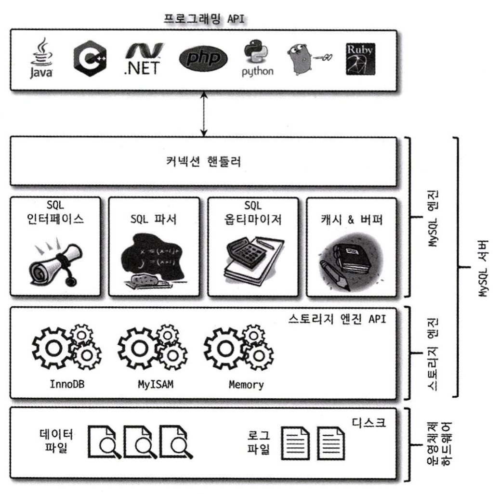
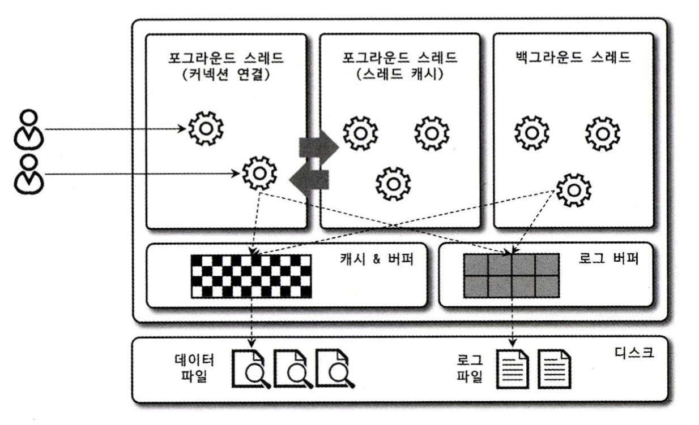
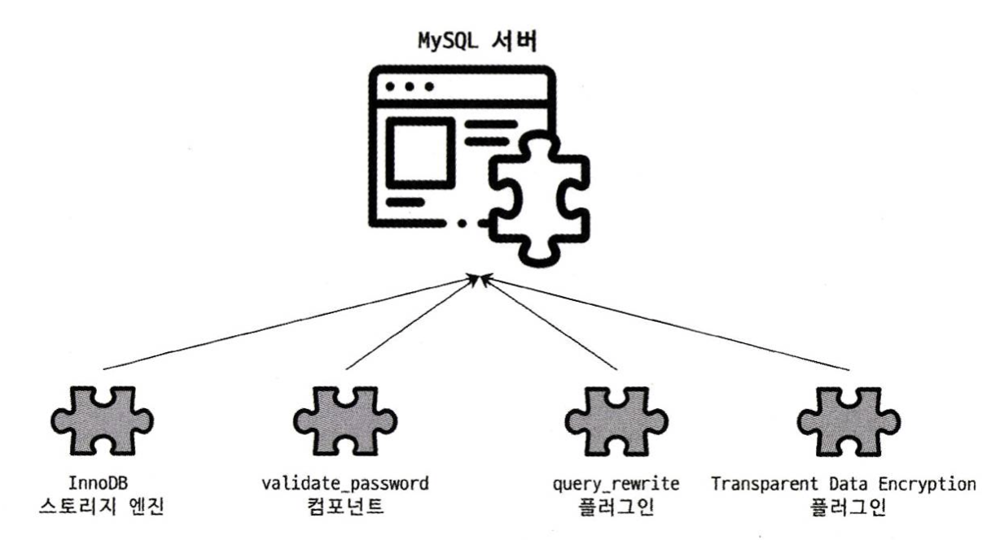
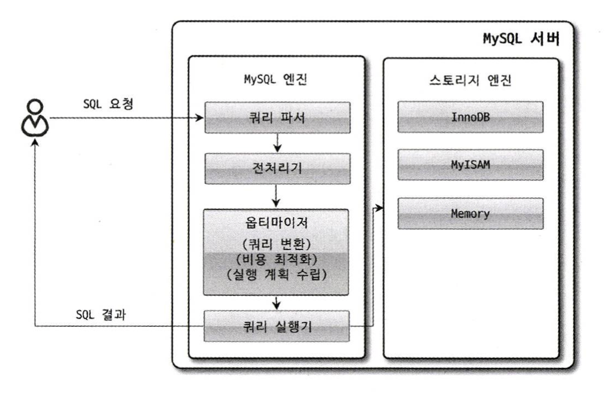

# 4. 아키텍처

> MYSQL 서버는 머리 역할을 담당하는 MYSQL 엔진과 손발 역할을 담당하는 스토리지 엔진으로 구성된다. 기본적으로 제공되는 스토리지 엔진에는 InnoDB 스토리지 엔진과 MyISAM 스토리지 엔진 등이 있다. <br>

<br>

## 4.1 MYSQL 엔진 아키텍처
MYSQL은 대부분의 프로그래밍 언어로부터 접근 방법을 모두 지원한다.

또한, MYSQL서버는 크게 MYSQL 엔진과 스토리지 엔진으로 구분할 수 있다.

### 4.1.1 MYSQL의 전체 구조


### 1) MYSQL 엔진
MYSQL 엔진은 다음과 같이 구성되어 있다.
- 클라이언트로부터의 접속 및 쿼리 요청을 처리하는 커넥션 핸들러
- SQL 파서
- 전처리기
- 쿼리의 최적화된 실행을 위한 옵티마이저

MYSQL 엔진은 SQL 문장을 분석하거나 최적화하는 등 DBMS의 두뇌 역할을 맡고 있다. 사람의 머리가 1개인 것처럼 MYSQL에서도 MYSQL 엔진은 1개만 존재한다.

또한, 표준 SQL(ANSI SQL) 문법을 지원하기 때문에 다른 DBMS와 호화되어 실행될 수 있다.

### 2) 스토리지 엔진
스토리지 엔진은 실제 데이터를 디스크 스토리지에 저장하거나 읽어오는 부분을 담당하고 있다.

MYSQL 엔진은 1개지만 스토리지 엔진은 여러 개를 동시에 사용할 수 있다.

```sql
mysql> use employees;
Database changed
mysql> CREATE TABLE test_table (fd1 INT, fd2 INT) ENGINE=INNODB;
Query OK, 0 rows affected (0.04 sec)

mysql> show tables;
+---------------------+
| Tables_in_employees |
+---------------------+
| test_table          |
+---------------------+
1 row in set (0.00 sec)
```
해당 예제에서 test_table은 InnoDB 스토리지 엔진을 사용하도록 정의되었다. 즉, 해당 테이블의 모든 읽기, 변경 작업(insert, update, delete, select 등)은 InnoDB 엔진이 처리하게 된다. 

그리고 스토리지 엔진은 성능 향상을 위한 기능을 내장하고 있다.
- MyISAM 스토리지 엔진: 키 캐시
- InnoDB 스토리지 엔진: InnoDB 버퍼 풀

### 3) 핸들러 API
MYSQL 엔진의 쿼리 실행기에서 스토리지 엔진에 쓰기, 읽기를 요청하는데 이러한 요청을 핸들러 요청이라고 한다. 이때 여기서 사용되는 API를 핸들러 API라고 한다.
핸들러 API를 통해 MYSQL 엔진과 데이터를 주고 받는다.

<br>

### 4.1.2 MYSQL 스레딩 구조


MYSQL 서버는 프로세스 기반이 아닌 스레드 기반으로 작동하며, 크게 포그라운드 스레드와 백그라운드 스레드로 구분된다.
MYSQL 서버에서 실행 중인 스레드의 목록은 `performance_schema` 데이터베이스의 `threads` 테이블을 통해 확인할 수 있다.

### 1) 포그라운드 스레드(클라이언트 스레드)
최소한 MYSQL 서버에 접속된 클라이언트의 수만큼 존재하며, 주로 사용자가 요청하는 쿼리 문장을 처리한다. 

사용자가 작업을 마치고 커넥션을 종료하면 해당 커넥션을 담당하던 스레드는 다시 스레드 캐시로 되돌아간다. 만약 이미 스레드 캐시에 일정 개수 이상의 스레드가 대기 중이라면 스레드 캐시에 넣지 않고 스레드를 종료시켜 일정 개수의 스레드만 존재하게 한다. (스레드 캐시에 유지할 수 있는 최대 스레드 개수는 `thread_cache_size` 시스템 변수로 설정)

포그라운드 스레드는 데이터를 MYSQL의 데이터 버퍼나 캐시로부터 가져오며, 버퍼나 캐시에 없는 경우에는 직접 디스크의 데이터나 인덱스 파일로부터 데이터를 읽어와 작업을 처리한다.

- cf)
- ISAM 테이블: 디스크 쓰기 작업까지 포그라운드 스레드가 처리
- InnoDB: 데이터 버퍼나 캐시까지만 포그라운드 스레드가 처리하고 나머지 버퍼로부터 디스크까지 기록하는 작업은 백그라운드 스레a드가 처리

### 2) 백그라운드 스레드
백그라운드 스레드의 개수는 MYSQL 서버의 설정 내용에 따라 가변적일 수 있다.

사용자의 요청을 처리하는 도중 데이터의 쓰기 작업은 버퍼링(지연)되어 처리될 수 있지만 데이터의 읽기 작업은 절대 지연될 수 없다! 그래서 일반적인 DBMS에는 대부분의 쓰기 작업을 버퍼링해서 일괄 처리하는 기능이 있다.

InnoDB 스토리지 엔진의 백그라운드 스레드에서 가장 중요한 역할은 **로그 스레드**와 버퍼의 데이터를 디스크로 내려쓰는 작업을 처리하는 **쓰기 스레드**이다. 쓰기 스레드는 아주 많은 작업을 백그라운드로 처리하기 때문에 디스크를 최적으로 사용할 수 있을 만큼 충분히 설정하는 것이 좋다. 

cf) MYSQL 5.5 부터 데이터 쓰기 및 읽기 스레드의 개수를 2개 이상 지정할 수 있게 되었으며, `innodb_write_io_threads`, `innodb_read_io_threads` 시스템 변수로 스레드 개수를 설정할 수 있다.

<br>

### 4.1.3 메모리 할당 및 사용 구조
MYSQL에서 사용되는 메모리 공간은 **MYSQL 서버 내에 존재하는 많은 스레드가 공유해서 사용하는 공간인지 여부에 따라** 글로벌 메모리 영역과 로컬 메모리 영역으로 구성된다.
메모리 공간은 MYSQL의 시스템 변수로 설정해 둔 만큼 운영체제로부터 메모리를 할당받아 만들어진다.

### 1) 글로벌 메모리 영역
글로벌 메모리 영역의 모든 메모리 공간은 MYSQL 서버가 시작되면서 운영체제로부터 할당된다. **일반적으로 클라이언트 스레드의 수와 무관하게 하나의 메모리 공간만 할당된다.** 또한, 생성된 글로벌 영역이 N개라 하더라도 모든 스레드에 의해 공유된다.

ex) 테이블 캐시, InnoDB 버퍼 풀, InnoDB 어댑티브 해시 인덱스, InnoDB 리두 로그 버퍼

### 2) 로컬 메모리 영역
**= 세션 메모리 영역 = 클라이언트 메모리 영역**

MYSQL 서버상에 존재하는 클라이언트 스레드가 쿼리를 처리하는데 사용하는 메모리 영역이다. 
로컬 메모리는 각 클라이언트 스레드별로 독립적으로 할당되며 절대 공유되어 사용되지 않는다는 특징이 있다.
또한, 클라이언트 스레드가 사용하는 메모리 공간이어서 클라이언트 메모리 영역이라고도 하며, 
클라이언트와 MYSQL 서버와의 커넥션을 세션이라고 하기 때문에 로컬 메모리 영역을 세션 메모리 영역이라고도 표현한다.

로컬 메모리 영역은 커넥션이 열려 있는 동안 계속 할당된 상태로 남아 있는 공간도 있고, **(-> 커넥션 버퍼, 결과 버퍼)**
쿼리를 실행하는 순간에만 할당했다가 다시 해제하는 공간도 있다. **(-> 소트 버퍼, 조인 버퍼)**

또한, 각 쿼리의 용도별로 필요할 때만 공간이 할당되고 필요하지 않은 경우에는 MYSQL이 메모리 공간을 할당하지 않을 수 있다. **-> 정렬 버퍼, 조인 버퍼**

ex) 정렬 버퍼, 조인 버퍼, 바이너리 로그 캐시, 네트워크 버퍼

<br>

### 4.1.4 플러그인 스토리지 엔진 모델


MYSQL의 독특한 구조 중 대표적인 것이 플러그인 모델이다. 플로그인 형태로 빌드된 스토리지 엔진 라이브러리를 다운로드해서 끼워 넣기만 하면 손쉽게 부가적인 기능을 사용할 수 있다.

수많은 사용자의 요구 조건을 만족시키기 위해 기본적으로 제공되는 스토리지 엔진 이외에 부가적인 기능을 추가 제공하는 스토레지 엔진을 플러그인 형태로 개발하여 사용할 수 있다.

MYSQL 서버에서는 스토리지 엔진 뿐만 아니라 다양한 기능을 플러그인 형태로 지원한다. 
검색어 파서, 인증 방식 등도 모두 플러그인으로 개발되어 제공되고 있으며,  MYSQL 서버의 기능을 커스텀하게 확장하거나 새로운 기능을 플러그인으로 개발할 수도 있다.

<br>

### 4.1.5 컴포넌트
플러그인에는 다음과 같은 단점들이 있다.
- 오직 MYSQL 서버와 인터페이스할 수 있고, 플러그인끼리는 통신할 수 없다.
- MYSQL 서버의 변수나 함수를 직접 호출하기 때문에 안전하지 않다. (캡슐화 X)
- 상호 의존 관계를 설정할 수 없어서 초기화가 어렵다.

기존의 플러그인 아키텍처의 단점을 보완하기 위해 MYSQL 8.0 부터는 컴포넌트 아키텍처가 지원되고 있다.

특히, MYSQL 5.7 까지는 비밀번호 검증 기능이 플러그인 형태로 제공되었지만 8.0 의 비밀번호 검증 기능은 컴포넌트로 개선되었다.

<br>

### 4.1.6 쿼리 실행 구조


### 1) 쿼리 파서
사용자 요청으로 들어온 쿼리를 MYSQL이 인식할 수 있는 최소 단위의 어휘나 기호로 분리해 트리 형태의 구조로 만들어 내는 작업을 수행한다. 쿼리의 기본 문법 오류는 이 과정에서 발견되고 사용자에게 오류 메시지를 전달한다.

### 2) 전처리기
파서 과정에서 만들어진 파서 트리를 기반으로 쿼리에 구조적 문제점이 있는지 확인한다. 
테이블 이름, 칼럼 이름, 내장 함수와 같은 개체를 매핑하여 객체의 존재 여부와 객체의 접근 권한 등을 확인한다.

### 3) 옵티마이저
사용자의 요청으로 들어온 쿼리를 저렴한 비용으로 가장 빠르게 처리할지(최적화) 결정한다. DBMS의 두뇌 역할을 한다. 

### 4) 실행 엔진
만들어진 계획대로 각 핸들러에게 요청해서 받은 결과를 또 다른 핸들러 요청의 입력으로 연결하는 역할을 수행한다. 옵티마이저가 두뇌라면 실행 엔진은 손발 역할을 한다고 생각하면 쉽다.

### 5) 핸들러(스토리지 엔진)
MYSQL 서버의 가장 밑단에서 MYSQL 실행 엔진의 요청에 따라 데이터를 디스크로 저장하고 읽어오는 역할을 한다. 핸들러는 결국 스토리지 엔진을 의미한다.

<br>

### 4.1.8 쿼리 캐시
쿼리 캐시는 SQL의 실행 결과를 메모리에 캐시하고 동일 쿼리가 실행되면 테이블을 읽지 않고 즉시 결과를 반환하기 때문에 매우 빠른 성능을 보인다. 그래서 빠른 응답을 필요로 하는 웹 기반의 으용 프로그램에서 매우 중요한 역할을 했다.

하지만, 테이블의 데이터가 변경되면 캐시에 저장된 결과에서 해당 테이블과 연관된 모든 것들을 삭제해야하여 동시 처리 성능 저하를 유발한다는 치명적인 문제가 있었다.

결국 MYSQL 8.0 으로 오면서 쿼리 캐시는 MYSQL 서버의 기능에서 완전히 제거되었고, 관련된 시스템 변수도 모두 제거되었다.

<br>

### 4.1.9 스레드 풀
스레드 풀은 내부적으로 사용자의 요청을 처리하는 스레드 개수를 줄여서 동시 처리되는 요청이 많아도 MYSQL 서버의 CPU가 제한된 개수의 스레드 처리에만 집중할 수 있게 하여 서버 자원 소모를 줄이는 것이 목적이다.

CPU가 제한된 개수의 스레드를 적절히 처리할 수 있다면 CPU의 프로세스 친화도를 높이고 불필요한 컨텍스트 스위칭을 줄여 오버헤드도 낮출 수 있다.
따라서, 일반적으로는 CPU의 코어 개수에 스레드 그룹의 개수를 맞추는 것이 좋다. (스케줄링 과정에서 CPU 시간을 제대로 확보하지 못하면 쿼리 처리가 더 느려질 수 있음.)

스레드 풀은 MYSQL 커뮤니티 에디션은 지원하지 않고, MYSQL 서버 엔터프라이즈 에디션에서만 기능을 제공한다.

<br>

### 4.1.10 트랜잭션 지원 메타데이터
데이터베이스 서버에서 테이블의 구조 정보와 스토어드 프로그램 등의 정보를 데이터 딕셔너리 또는 메타데이터라고 한다.

MYSQL 서버 5.7 까지 테이블 구조 및 일부 스토어드 프로그램을 파일 기반으로 관리했다. 하지만 파일 기반의 메타데이터는 생성 및 변경 작업 시 트랜잭션을 지원하지 않아, 작업 시 MYSQL 서버가 비정상적으로 종료되면 일관되지 않은 상태가 되는 '데이터베이스나 테이블이 깨지는' 문제가 발생했다.

MYSQL 8.0 부터는 테이블의 구조 정보나 스토어드 프로그램의 코드 관련 정보를 모두 트랜잭션 기반의 InnoDB 테이블에 저장하도록 개선되었다. 
구체적으로는 모든 시스템 테이블과 데이터 딕셔너리 정보를 InnoDB 스토리지 엔진을 사용하도록 개선하였으며, 이를 모아서 `mysql` DB에 저장하고 있다.

<br><hr>
