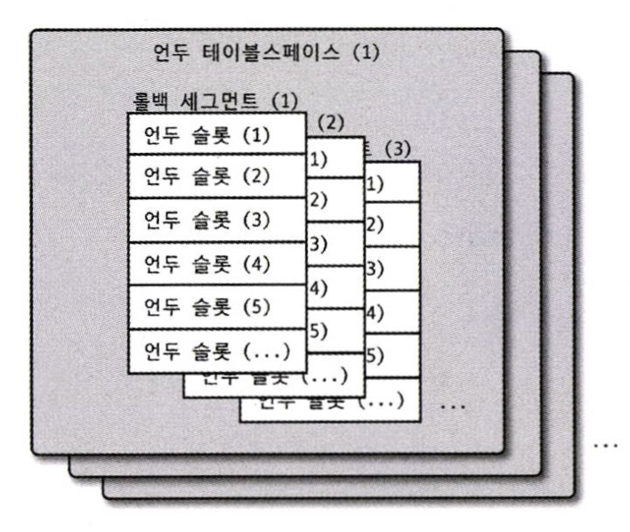

# 4. 아키텍처

> MYSQL 서버는 머리 역할을 담당하는 MYSQL 엔진과 손발 역할을 담당하는 스토리지 엔진으로 구성된다. 기본적으로 제공되는 스토리지 엔진에는 InnoDB 스토리지 엔진과 MyISAM 스토리지 엔진 등이 있다. <br>

<br>

## 4.1 MYSQL 엔진 아키텍처
MYSQL은 대부분의 프로그래밍 언어로부터 접근 방법을 모두 지원한다.

또한, MYSQL서버는 크게 MYSQL 엔진과 스토리지 엔진으로 구분할 수 있다.

### 4.1.1 MYSQL의 전체 구조


### 1) MYSQL 엔진
MYSQL 엔진은 다음과 같이 구성되어 있다.
- 클라이언트로부터의 접속 및 쿼리 요청을 처리하는 커넥션 핸들러
- SQL 파서
- 전처리기
- 쿼리의 최적화된 실행을 위한 옵티마이저

MYSQL 엔진은 SQL 문장을 분석하거나 최적화하는 등 DBMS의 두뇌 역할을 맡고 있다. 사람의 머리가 1개인 것처럼 MYSQL에서도 MYSQL 엔진은 1개만 존재한다.

또한, 표준 SQL(ANSI SQL) 문법을 지원하기 때문에 다른 DBMS와 호화되어 실행될 수 있다.

### 2) 스토리지 엔진
스토리지 엔진은 실제 데이터를 디스크 스토리지에 저장하거나 읽어오는 부분을 담당하고 있다.

MYSQL 엔진은 1개지만 스토리지 엔진은 여러 개를 동시에 사용할 수 있다.

```sql
mysql> use employees;
Database changed
mysql> CREATE TABLE test_table (fd1 INT, fd2 INT) ENGINE=INNODB;
Query OK, 0 rows affected (0.04 sec)

mysql> show tables;
+---------------------+
| Tables_in_employees |
+---------------------+
| test_table          |
+---------------------+
1 row in set (0.00 sec)
```
해당 예제에서 test_table은 InnoDB 스토리지 엔진을 사용하도록 정의되었다. 즉, 해당 테이블의 모든 읽기, 변경 작업(insert, update, delete, select 등)은 InnoDB 엔진이 처리하게 된다. 

그리고 스토리지 엔진은 성능 향상을 위한 기능을 내장하고 있다.
- MyISAM 스토리지 엔진: 키 캐시
- InnoDB 스토리지 엔진: InnoDB 버퍼 풀

### 3) 핸들러 API
MYSQL 엔진의 쿼리 실행기에서 스토리지 엔진에 쓰기, 읽기를 요청하는데 이러한 요청을 핸들러 요청이라고 한다. 이때 여기서 사용되는 API를 핸들러 API라고 한다.
핸들러 API를 통해 MYSQL 엔진과 데이터를 주고 받는다.

<br>

### 4.1.2 MYSQL 스레딩 구조


MYSQL 서버는 프로세스 기반이 아닌 스레드 기반으로 작동하며, 크게 포그라운드 스레드와 백그라운드 스레드로 구분된다.
MYSQL 서버에서 실행 중인 스레드의 목록은 `performance_schema` 데이터베이스의 `threads` 테이블을 통해 확인할 수 있다.

### 1) 포그라운드 스레드(클라이언트 스레드)
최소한 MYSQL 서버에 접속된 클라이언트의 수만큼 존재하며, 주로 사용자가 요청하는 쿼리 문장을 처리한다. 

사용자가 작업을 마치고 커넥션을 종료하면 해당 커넥션을 담당하던 스레드는 다시 스레드 캐시로 되돌아간다. 만약 이미 스레드 캐시에 일정 개수 이상의 스레드가 대기 중이라면 스레드 캐시에 넣지 않고 스레드를 종료시켜 일정 개수의 스레드만 존재하게 한다. (스레드 캐시에 유지할 수 있는 최대 스레드 개수는 `thread_cache_size` 시스템 변수로 설정)

포그라운드 스레드는 데이터를 MYSQL의 데이터 버퍼나 캐시로부터 가져오며, 버퍼나 캐시에 없는 경우에는 직접 디스크의 데이터나 인덱스 파일로부터 데이터를 읽어와 작업을 처리한다.

- cf)
- ISAM 테이블: 디스크 쓰기 작업까지 포그라운드 스레드가 처리
- InnoDB: 데이터 버퍼나 캐시까지만 포그라운드 스레드가 처리하고 나머지 버퍼로부터 디스크까지 기록하는 작업은 백그라운드 스레드가 처리

### 2) 백그라운드 스레드
백그라운드 스레드의 개수는 MYSQL 서버의 설정 내용에 따라 가변적일 수 있다.

사용자의 요청을 처리하는 도중 데이터의 쓰기 작업은 버퍼링(지연)되어 처리될 수 있지만 데이터의 읽기 작업은 절대 지연될 수 없다! 그래서 일반적인 DBMS에는 대부분의 쓰기 작업을 버퍼링해서 일괄 처리하는 기능이 있다.

InnoDB 스토리지 엔진의 백그라운드 스레드에서 가장 중요한 역할은 **로그 스레드**와 버퍼의 데이터를 디스크로 내려쓰는 작업을 처리하는 **쓰기 스레드**이다. 쓰기 스레드는 아주 많은 작업을 백그라운드로 처리하기 때문에 디스크를 최적으로 사용할 수 있을 만큼 충분히 설정하는 것이 좋다. 

cf) MYSQL 5.5 부터 데이터 쓰기 및 읽기 스레드의 개수를 2개 이상 지정할 수 있게 되었으며, `innodb_write_io_threads`, `innodb_read_io_threads` 시스템 변수로 스레드 개수를 설정할 수 있다.

<br>

### 4.1.3 메모리 할당 및 사용 구조
MYSQL에서 사용되는 메모리 공간은 **MYSQL 서버 내에 존재하는 많은 스레드가 공유해서 사용하는 공간인지 여부에 따라** 글로벌 메모리 영역과 로컬 메모리 영역으로 구성된다.
메모리 공간은 MYSQL의 시스템 변수로 설정해 둔 만큼 운영체제로부터 메모리를 할당받아 만들어진다.

### 1) 글로벌 메모리 영역
글로벌 메모리 영역의 모든 메모리 공간은 MYSQL 서버가 시작되면서 운영체제로부터 할당된다. **일반적으로 클라이언트 스레드의 수와 무관하게 하나의 메모리 공간만 할당된다.** 또한, 생성된 글로벌 영역이 N개라 하더라도 모든 스레드에 의해 공유된다.

ex) 테이블 캐시, InnoDB 버퍼 풀, InnoDB 어댑티브 해시 인덱스, InnoDB 리두 로그 버퍼

### 2) 로컬 메모리 영역
**= 세션 메모리 영역 = 클라이언트 메모리 영역**

MYSQL 서버상에 존재하는 클라이언트 스레드가 쿼리를 처리하는데 사용하는 메모리 영역이다. 
로컬 메모리는 각 클라이언트 스레드별로 독립적으로 할당되며 절대 공유되어 사용되지 않는다는 특징이 있다.
또한, 클라이언트 스레드가 사용하는 메모리 공간이어서 클라이언트 메모리 영역이라고도 하며, 
클라이언트와 MYSQL 서버와의 커넥션을 세션이라고 하기 때문에 로컬 메모리 영역을 세션 메모리 영역이라고도 표현한다.

로컬 메모리 영역은 커넥션이 열려 있는 동안 계속 할당된 상태로 남아 있는 공간도 있고, **(-> 커넥션 버퍼, 결과 버퍼)**
쿼리를 실행하는 순간에만 할당했다가 다시 해제하는 공간도 있다. **(-> 소트 버퍼, 조인 버퍼)**

또한, 각 쿼리의 용도별로 필요할 때만 공간이 할당되고 필요하지 않은 경우에는 MYSQL이 메모리 공간을 할당하지 않을 수 있다. **-> 정렬 버퍼, 조인 버퍼**

ex) 정렬 버퍼, 조인 버퍼, 바이너리 로그 캐시, 네트워크 버퍼

<br>

### 4.1.4 플러그인 스토리지 엔진 모델


MYSQL의 독특한 구조 중 대표적인 것이 플러그인 모델이다. 플로그인 형태로 빌드된 스토리지 엔진 라이브러리를 다운로드해서 끼워 넣기만 하면 손쉽게 부가적인 기능을 사용할 수 있다.

수많은 사용자의 요구 조건을 만족시키기 위해 기본적으로 제공되는 스토리지 엔진 이외에 부가적인 기능을 추가 제공하는 스토레지 엔진을 플러그인 형태로 개발하여 사용할 수 있다.

MYSQL 서버에서는 스토리지 엔진 뿐만 아니라 다양한 기능을 플러그인 형태로 지원한다. 
검색어 파서, 인증 방식 등도 모두 플러그인으로 개발되어 제공되고 있으며,  MYSQL 서버의 기능을 커스텀하게 확장하거나 새로운 기능을 플러그인으로 개발할 수도 있다.

<br>

### 4.1.5 컴포넌트
플러그인에는 다음과 같은 단점들이 있다.
- 오직 MYSQL 서버와 인터페이스할 수 있고, 플러그인끼리는 통신할 수 없다.
- MYSQL 서버의 변수나 함수를 직접 호출하기 때문에 안전하지 않다. (캡슐화 X)
- 상호 의존 관계를 설정할 수 없어서 초기화가 어렵다.

기존의 플러그인 아키텍처의 단점을 보완하기 위해 MYSQL 8.0 부터는 컴포넌트 아키텍처가 지원되고 있다.

특히, MYSQL 5.7 까지는 비밀번호 검증 기능이 플러그인 형태로 제공되었지만 8.0 의 비밀번호 검증 기능은 컴포넌트로 개선되었다.

<br>

### 4.1.6 쿼리 실행 구조


### 1) 쿼리 파서
사용자 요청으로 들어온 쿼리를 MYSQL이 인식할 수 있는 최소 단위의 어휘나 기호로 분리해 트리 형태의 구조로 만들어 내는 작업을 수행한다. 쿼리의 기본 문법 오류는 이 과정에서 발견되고 사용자에게 오류 메시지를 전달한다.

### 2) 전처리기
파서 과정에서 만들어진 파서 트리를 기반으로 쿼리에 구조적 문제점이 있는지 확인한다. 
테이블 이름, 칼럼 이름, 내장 함수와 같은 개체를 매핑하여 객체의 존재 여부와 객체의 접근 권한 등을 확인한다.

### 3) 옵티마이저
사용자의 요청으로 들어온 쿼리를 저렴한 비용으로 가장 빠르게 처리할지(최적화) 결정한다. DBMS의 두뇌 역할을 한다. 

### 4) 실행 엔진
만들어진 계획대로 각 핸들러에게 요청해서 받은 결과를 또 다른 핸들러 요청의 입력으로 연결하는 역할을 수행한다. 옵티마이저가 두뇌라면 실행 엔진은 손발 역할을 한다고 생각하면 쉽다.

### 5) 핸들러(스토리지 엔진)
MYSQL 서버의 가장 밑단에서 MYSQL 실행 엔진의 요청에 따라 데이터를 디스크로 저장하고 읽어오는 역할을 한다. 핸들러는 결국 스토리지 엔진을 의미한다.

<br>

### 4.1.8 쿼리 캐시
쿼리 캐시는 SQL의 실행 결과를 메모리에 캐시하고 동일 쿼리가 실행되면 테이블을 읽지 않고 즉시 결과를 반환하기 때문에 매우 빠른 성능을 보인다. 그래서 빠른 응답을 필요로 하는 웹 기반의 으용 프로그램에서 매우 중요한 역할을 했다.

하지만, 테이블의 데이터가 변경되면 캐시에 저장된 결과에서 해당 테이블과 연관된 모든 것들을 삭제해야하여 동시 처리 성능 저하를 유발한다는 치명적인 문제가 있었다.

결국 MYSQL 8.0 으로 오면서 쿼리 캐시는 MYSQL 서버의 기능에서 완전히 제거되었고, 관련된 시스템 변수도 모두 제거되었다.

<br>

### 4.1.9 스레드 풀
스레드 풀은 내부적으로 사용자의 요청을 처리하는 스레드 개수를 줄여서 동시 처리되는 요청이 많아도 MYSQL 서버의 CPU가 제한된 개수의 스레드 처리에만 집중할 수 있게 하여 서버 자원 소모를 줄이는 것이 목적이다.

CPU가 제한된 개수의 스레드를 적절히 처리할 수 있다면 CPU의 프로세스 친화도를 높이고 불필요한 컨텍스트 스위칭을 줄여 오버헤드도 낮출 수 있다.
따라서, 일반적으로는 CPU의 코어 개수에 스레드 그룹의 개수를 맞추는 것이 좋다. (스케줄링 과정에서 CPU 시간을 제대로 확보하지 못하면 쿼리 처리가 더 느려질 수 있음.)

스레드 풀은 MYSQL 커뮤니티 에디션은 지원하지 않고, MYSQL 서버 엔터프라이즈 에디션에서만 기능을 제공한다.

<br>

### 4.1.10 트랜잭션 지원 메타데이터
데이터베이스 서버에서 테이블의 구조 정보와 스토어드 프로그램 등의 정보를 데이터 딕셔너리 또는 메타데이터라고 한다.

MYSQL 서버 5.7 까지 테이블 구조 및 일부 스토어드 프로그램을 파일 기반으로 관리했다. 하지만 파일 기반의 메타데이터는 생성 및 변경 작업 시 트랜잭션을 지원하지 않아, 작업 시 MYSQL 서버가 비정상적으로 종료되면 일관되지 않은 상태가 되는 '데이터베이스나 테이블이 깨지는' 문제가 발생했다.

MYSQL 8.0 부터는 테이블의 구조 정보나 스토어드 프로그램의 코드 관련 정보를 모두 트랜잭션 기반의 InnoDB 테이블에 저장하도록 개선되었다. 
구체적으로는 모든 시스템 테이블과 데이터 딕셔너리 정보를 InnoDB 스토리지 엔진을 사용하도록 개선하였으며, 이를 모아서 `mysql` DB에 저장하고 있다.

<br><hr>

## 4.2 InnoDB 스토리지 엔진 아키텍처
InnoDB는 MYSQL에서 사용할 수 있는 스토리지 엔진 중 거의 유일하게 **레코드 기반의 잠금을 제공**한다. 이 때문에 높은 동시성 처리가 가능하고 안정적이며 성능이 뛰어나다.

InnoDB 스토리지 엔진의 구조 및 특징에 대해 정리해보자.

### 4.2.1 프라이머리 키에 의한 클러스터링
**InnoDB**의 모든 테이블은 기본적으로 프라이머리 키를 기준으로 클러스터링되어 저장된다.
- 프라이머리 키 = 클러스터링 인덱스
- 프라이머리 키 값의 순서대로 디스크에 저장된다.
- 모든 세컨더리 인덱스의 논리적인 주소는 프라이머리 키의 값을 사용한다.
- 프라이머리 키를 이용한 레인지 스캔은 처리 속도가 매우 빠르다.
- 결과적으로, 쿼리처리 plan에서 기본적으로 다른 보조 인덱스보다 프라이머리 키의 비중이 높게 설정되고 선택될 확률이 높아진다.

**MyISAM** 스토리지 엔진에서는 클러스터링 키를 지원하지 않아, 프라이머리 키와 세컨더리 인덱스의 차이가 없다. 여기서 프라이머리 키는 단지 유니크 제약을 가진 세컨더리 인덱스이다.

<br>

### 4.2.2 외래 키 지원
외래 키는 InnoDB 스토리지 엔진 레벨에서 지원하는 기능이다. 
- 외래 키는 부모 테이블과 자식 테이블 모두에 해당 컬럼에 인덱스 생성이 필요하다.
- 외래 키 변경 시, 반드시 부모 테이블과 자식 테이블에 데이터가 있는지 체크하는 작업을 한다.
- 변경 작업 시, 잠금(lock)이 다른 테이블로 전파되고 이로 인해 데드락이 발생할 수 있다.
- `foreign_key_checks` 시스템 변수는 외래 키 관계에 대한 체크 작업 실행 여부를 세팅하는 변수이다.
  ```sql
  mysql> SET foreign_key_checks=OFF; -- 외래 키 체크 작업 중지
  -- // 작업 실행
  mysql> SET foreign_key_checks=ON; -- 외래 키 체크 작업 실행
  ```
  - 적용 범위: GLOBAL, SESSION 모두 설정 가능 (SESSION: 기본 세팅)
  - 외래 키 체크를 중지했다가 작업이 완료되면 반드시 외래 키 체크 기능을 다시 활성화해야한다.
  - 외래 키 체크를 일시적으로 중지했다고 해서 부모와 자식 테이블 간의 관계가 깨지게 되면 안된다.
  - 즉, 일관성을 맞춰준 후에 외래키 체크 기능을 활성화해야한다.

<br>

### 4.2.3 MVCC (Multi Version Concurrency Control)
MVCC는 레코드 레벨의 트랜잭션을 지원하는 기능이며, **잠금을 사용하지 않는 일관적 읽기를 제공**하는 것이 목적이다. 

데이터 조회 시, `transaction_isolation` 시스템 변수에 설정된 **격리 수준**에 따라 사용자에게 제공되는 데이터의 버전이 다르다.
- `READ_UNCOMMITTED` : 변경 후의 데이터를 보관하고 있는 공간인 InnoDB 버퍼 풀이 현재 가지고 있는 값을 제공한다.
- `READ_COMMITTED`, `REPEATABLE_READ` : COMMIT 되기 전까지 변경되기 전의 데이터를 보관하고 있는 언두 영역의 데이터를 제공한다.
- `SERIALIZABLE` : 트랜잭션에 진입하면 lock을 걸어 다른 트랜잭션이 접근하지 못하도록 한다. (성능 매우 안좋음)

InnoDB는 언두 로그(Undo log)를 통해 이 기능을 구현하였다.
- **데이터 변경 전 값**만 언두 로그 공간으로 복사됨.
- `COMMIT` , `ROLLBACK` 이 실행되기 전까지 언두 영역이 유지된다.
- `ROLLBACK` 수행 시, 백업 데이터를 InnoDB 버퍼 풀로 복구하고 언두 영역의 내용을 삭제한다.
- `COMMIT` 수행 시, InnoDB는 더 이상의 변경 작업 없이 지금의 상태(변경 후의 상태)를 영구적인 데이터로 만든다. 하지만 언두 영역의 내용을 힝싱 바로 삭제하지 않고 언두 영역을 필요로 하는 트랜잭션이 없을 때 삭제한다.

트랜잭션이 길어지면 언두에서 관리하는 예전 데이터가 삭제되지 못하고 오랫동안 관리되는 상황이 발생한다. 이는 언두 영역의 공간이 많이 늘어나는 문제를 야기시킬 수도 있다.
그러므로, 트랜잭션을 최대한 짧게 가져가는 것이 중요하다!

<br>

### 4.2.4 잠금 없는 일관된 읽기 (Non-Locking Consistent Read)
InnoDB 스토리지 엔진은 MVCC 기술을 통해 잠금(lock)을 걸지 않고 읽기 작업을 수행한다. 이 때문에 읽기 작업을 할 때 다른 트랜잭션이 가지고 있는 잠금을 기다리지 않고 읽기 작업이 가능하다.

격리 수준이 `SERIALIZABLE`이 아니라면 순수한 읽기 작업(SELECT)은 다른 트랜잭션의 변경 작업의 영향을 받지 않아 잠금을 대기하지 않고 실행된다.

<br>

### 4.2.5 자동 데드락 감지
InnoDB 스토리지 엔진은 잠금 대기 목록을 그래프 형태로 관리한다. (Wait-for List)

데드락 감지 스레드가 주기적으로 잠금 대기 그래프를 검사해, 교착 상태에 빠진 트랜잭션을 찾아 그 중 하나를 강제 종료시킨다.
- 트랜잭션 강제 종료의 지표: 트랜잭션의 언두 로그 양이 적은 순
- why? 트랜잭션 강제 롤백으로 인한 서버의 부하를 덜 유발하기 때문.

**특별한 이유가 없다면 `innodb_table_locks` 시스템 변수를 활성화하는 것이 좋다.** 이를 활성화해두면, InnoDB 스토리지 엔진 내부의 레코드 잠금 뿐만 아니라 상위 레벨의 MYSQL 엔진에서 관리하는 테이블 레벨의 잠금까지 감지할 수 있다.

동시 처리 스레드가 매우 많아지거나 각 트랜잭션이 가진 잠금의 개수가 많아지면 데드락 감지 스레드가 느려진다.
데드락 감지 스레드가 느려지면 작업 도중의 스레드는 더는 작업을 진행하지 못하고 대기하게 되면서 서비스가 느려진다.

이를 해결하기 위해, MYSQL 서버는 `innodb_deadlock_detect` 와 `innodb_lock_wait_timeout` 이라는 시스템 변수를 제공한다.
- `innodb_deadlock_detect` : 데드락 감지 스레드 실행 여부
  - 데드락 감지 스레드가 작동하지 않으면, 무한정 대기 상태가 될 것이기 때문에 OFF로 바꾸면 위험함.
- `innodb_lock_wait_timeout` : 데드락 상황 시, 데드락 대기 시간 설정 (초 단위)
  - 활성화하면, 데드락 상황에서 일정 시간이 지났을 때 자동으로 요청이 실패하고 에러를 리턴한다.
  - 즉, 트랜잭션이 잠금(lock)을 설정한 시간동안 획득하지 못하면 쿼리는 실패하고 에러를 리턴한다.
- **만약 `innodb_deadlock_detect` 시스템 변수를 OFF로 비활성화하였다면, `innodb_lock_wait_timeout` 를 기본값인 50초보다 훨씬 낮은 시간으로 변경하여 처리 지연이 되지 않도록 하는 것이 좋다!**

<br>

### 4.2.6 자동화된 장애 복구
InnoDB는 손실이나 장애로부터 데이터를보호하기 위한 여러 메커니즘이 있다.
InnoDB 데이터 파일은 기본적으로 MYSQL 서버가 시작될 때 항상 자동 복구를 수행하는데, 자동 복구할 수 없는 경우라면 자동 복구를 멈추고 MYSQL 서버가 종료되어버린다.

이때는 `innodb_force_recovery` 시스템 변수를 설정해서 MYSQL 서버를 시작해야 하는데, 1~6의 값을 가지며 각 숫자 값 별로 선별적 자동 복구가 실행된다.

- 1 (SRV_FORCE_IGNORE_CORRUPT)
  - 테이블스페이스의 데이터나 인덱스 페이지에서 손상된 부분이 발견되어도 무시하고 MYSQL 서버를 시작한다.
- 2 (SRV_FORCE_NO_BACKGROUND)
  - 백그라운드 스레드 가운데 메인 스레드를 시작하지 않고 MYSQL 서버를 시작한다.
  - InnoDB의 메인 스레드가 언두 데이터를 삭제하려는 과정에서 장애가 발생하면 이 모드로 복구한다.
- 3 (SRV_FORCE_NO_TRX_UNDO)
  - 커밋되지 않고 종료된 트랜잭션은 계속 그 상태로 남아 있게 MYSQL 서버를 시작한다.
- 4 (SRV_FORCE_NO_IBUF_MERGE)
  - 인서트 버퍼의 내용을 무시하고 강제로 MYSQL 서버를 시작한다. 인서트 버퍼는 인덱스에 관련된 부분이므로 테이블을 덤프한 후 다시 데이터베이스를 구축하면 데이터의 손실 없이 복구할 수 있다.
- 5 (SRV_FORCE_NO_UNDO_LOG_SCAN)
  - 언두 로그를 모두 무시하고 MYSQL 서버를 시작한다. 하지만 이 모드로 복구되면 MYSQL 서버가 종료되던 시점에 커밋되지 않았던 작업도 모두 커밋된 것처럼 처리되기 때문에 잘못된 데이터가 테이블에 남게 된다.
- 6 (SRV_FORCE_NO_LOG_REDO)
  - 리두 로그를 모두 무시한 채로 MYSQL 서버를 시작한다. 커밋이 되어도 리두 로그에만 기록되고 데이터 파일에 기록되지 않은 데이터는 모두 무시된다. 즉, 마지막 체크포인트 시점의 데이터만 남게 된다.

위와 같이 진행했음에도 MYSQL 서버가 시작되지 않으면 백업을 이용해 다시 구축할 수 밖에 없다.

<br>

### 4.2.7 InnoDB 버퍼 풀
버퍼 풀은 디스크의 데이터 파일이나 인덱스 정보를 메모리에 캐시해 두는 공간이다. 또한 쓰기 작업을 지연시켜 일괄 작업으로 처리할 수 있게 해주는 버퍼 역할도 같이 한다.

### 1) 버퍼 풀의 크기 설정
버퍼 풀의 크기는 운영체제와 각 클라이언트 스레드가 사용할 메모리도 충분히 고려해서 설정해야 한다. 

MYSQL 5.7부터는 버퍼 풀의 크기를 동적으로 조절할 수 있게 되었는데, 버퍼 풀의 크기를 적절히 작은 값으로 설정해서 모니터링해가면서 증가시키는 방법이 최적이다.

InnoDB 버퍼 풀의 사이즈는 `innodb_buffer_pool_size` 시스템 변수로 설정할 수 있고, 동적으로 버퍼풀의 크기를 확장할 수 있다. 
버퍼풀의 크기를 변경하는 작업은 크리티컬하므로, 서버가 한가한 시점을 골라서 진행하는 것이 좋다. 또한, 버퍼 풀의 크기를 줄이는 작업은 서비스 영향도가 크므로 가능하면 진행하지 않는 것이 좋다. (크기를 늘리는 작업은 영향도 적음.)

InnoDB 버퍼 풀은 내부적으로 128MB 청크 단위로 쪼개어 관리된다. 그래서 버퍼 풀의 크기를 줄이거나 늘릴 때는 128MB 단위로 처리된다.

InnoDB 버퍼 풀은 버퍼 풀 전체를 관리하는 잠금(세마포어)로 인해 내부 잠금 경합이 많았다. 이런 경합을 줄이기 위해 버퍼 풀을 여러 개로 쪼개어 관리할 수 있게 되었다. `innodb_buffer_pool_instances` 시스템 변수를 통해 버퍼 풀을 여러 개로 분리해서 관리할 수 있다.

### 2) 버퍼 풀의 구조
버퍼 풀은 '페이지'라는 조각으로 쪼개져 있고, 데이터가 필요할 때 해당 데이터 페이지를 읽어 각 조각에 저장되는 구조를 가지고 있다.

InnoDB 스토리지 엔진은 버퍼 풀의 페이지 크기 조각을 관리하기 위해 크게 LRU 리스트, 플러시 리스트, 프리 리스트라는 3가지 자료 구조를 관리한다.

- LRU(Least Recently Used) 리스트
  - LRU와 MRU(Most Recently Used) 리스트가 결합된 형태
  - 디스크로부터 한 번 읽어온 페이지를 최대한 오랫동안 InnoDB 버퍼 풀의 메모리에 유지해서 디스크 읽기를 최소화함
- 플러시(Flush) 리스트
  - 디스크로 동기화되지 않은 데이터 페이지(더티 페이지)의 변경 시점 기준의 페이지 목록을 관리
  - 데이터 변경이 된 데이터 페이지는 플러시 리스트에 관리되고 특정 시점이 되면 디스크로 기록됨
- 프리(Free) 리스트
  - 데이터로 채워지지 않은 비어있는 페이지들의 목록
  - 새롭게 디스크의 데이터 페이지를 읽어와야 할 때 사용

### 3) 버퍼 풀과 리두 로그
InnoDB 버퍼 풀은 데이터베이스 성능 향상을 위해 데이터 캐시 기능과 쓰기 버퍼링 기능을 지원하는데, 버퍼 풀의 메모리 공간만 늘리는 것은 데이터 캐시 기능만 향상시키는 것이다. 쓰기 버퍼링 기능까지 향상시키려면 리두 로그를 활용해야 한다.

버퍼 풀은 디스크에서 읽은 상태로 전혀 변경되지 않은 **클린 페이지**와, INSERT, UPDATE, DELETE 명령으로 변경된 데이터를 가진 **더티 페이지**로 이루어진다.

더티 페이지는 디스크와 데이터 상태가 다르기 때문에 언젠가는 디스크로 기록이 되어야한다. 또한, 한정된 메모리 공간인 버퍼 풀에 더티 페이지가 계속 머무를 수는 없다.


(cf. 활성 리두 로그: 재사용 불가능한 공간)

그렇기 때문에, 리두 로그 파일과의 순환 고리를 이용해 데이터 변경을 기록한다.

리두 로그 파일은 순환되며 재사용되고, 기록될 때마다 로그 포지션은 계속 증가된 값을 가지는데 이를 LSN(Log Sequence Number) 라고 한다.

InnoDB 스토리지 엔진은 주기적으로 체크포인트 이벤트를 발생시켜 리두 로그와 버퍼 풀의 더티 페이지를 디스크로 동기화하는데, 가장 최근 체크포인트 지점의 LSN을 활성 리두 로그의 시작점으로 설정한다.

체크포인트가 발생하면 LSN 시작점부터 그보다 작은 LSN을 가진 리두 로그 엔트리와 이와 관련된 버퍼 풀의 더티 페이지는 디스크로 동기화되어야한다.

마지막 리두 공간의 LSN과 가장 최근 LSN의 차이를 **Checkpoint Age**라고 하며, 이는 활성 리두 공간의 크기가 된다.

### 4) 버퍼 풀 플러시(Buffer Pool Flush)
InnoDB 스토리지 엔진은 버퍼 풀에서 아직 디스크로 기록되지 않은 더티 페이지들을 성능상의 악영향 없이 디스크에 동기화하기 위해 2개의 플러시 기능을 백그라운드로 실행한다.
- 플러시 리스트 플러시
  - 주기적으로 플러시 리스트 플러시 함수를 호출하여 플러시 리스트에서 오래전에 변경된 데이터 페이지 순으로 디스크에 동기화하는 작업을 수행한다.
- LRU 리스트 플러시
  - LRU 리스트 플러시 함수를 호출하여 사용 빈도가 낮은 데이터 페이지들을 제거해서 새로운 페이지들을 읽어올 공간을 만든다.

### 5) 버퍼 풀 상태 백업 및 복구
InnoDB 버퍼 풀은 쿼리의 성능과 매우 밀접하게 연관되어 있다. 디스크의 데이터가 버퍼 풀에 적재되어 있는 상태를 **워밍업**이라고 하는데, 버퍼 풀이 잘 워밍업 된 상태에서는 그렇지 않은 경우보다 몇십 배의 쿼리 처리 속도를 보인다.

MYSQL 5.5는 서버 재기동 시 강제 워밍업을 위해 주요 테이블과 인덱스에 대해 풀 스캔을 실행하고 서비스를 오픈했었다. 

MYSQL 5.6부터 **버퍼 풀 덤프 및 적재 기능**이 제공되고 있다. 서버를 중지할 때 `innodb_buffer_pool_dump_now` 시스템 변수를 이용해 현재 버퍼 풀의 상태를 백업할 수 있다. 그리고 서버를 재시작할 때 `innodb_buffer_pool_load_now` 시스템 변수를 이용해 백업된 버퍼 풀의 상태를 다시 복구할 수 있다.

### 6) 버퍼 풀의 적재 내용 확인
MYSQL 8.0부터는 `information_schema` 데이터베이스의 `innodb_cached_indexes` 테이블이 추가되었다. 이 테이블을 이용하여 테이블의 인덱스별로 데이터 페이지가 얼마나 InnoDB 버퍼 풀에 적재되어 있는지 확인할 수 있다.

<br>

### 4.2.8 Double Write Buffer
InnoDB 스토리지 엔진의 리두 로그는 공간 효율성을 위해 페이지의 변경된 내용만 기록한다.
따라서 더티 페이지를 디스크 파일로 플러시 할 때 일부만 기록되는 문제 상황(Partial-page, Torn-page)이 발생하면 나머지 부분은 복구하지 못할수도 있다.

이와 같은 문제를 막기 위해 InnoDB 스토리지 엔진에서는 **Double-Write** 기법을 사용한다.
더티 페이지를 묶어서 DoubleWrite 버퍼에 기록해두고 실제 데이터 파일의 쓰기가 중간에 실패할 때 사용한다. 

1. 데이터 파일에 변경 내용을 기록하기 전에 더티 페이지를 묶어 DoubleWrite 버퍼에 기록한다.
2. InnoDB 스토리지 엔진은 각 더티 페이지를 데이터 파일에 하나씩 랜덤으로 쓰기를 실행한다.
3. 페이지가 기록되는 도중에 비정상 종료가 발생했다!
4. InnoDB 엔진이 재시작될 때 항상 데이터 파일의 페이지들과 DoubleWrite 버퍼의 내용을 비교한다.
5. 데이터 파일 페이지와 DoubleWrite 버퍼가 다른 내용을 담고 있다면 DoubleWrite 버퍼의 내용을 데이터 파일의 페이지로 복사한다.

DoubleWirte 버퍼는 데이터의 안정성을 위해 자주 사용되며, `innodb_doublewrite` 시스템 변수로 이 기능을 사용할지 여부를 설정할 수 있다.

<br>

### 4.2.9 언두 로그
언두 로그란 트랜잭션과 격리 수준을 보장하기 위해 DML로 변경되기 이전 버전의 데이터를 별도로 백업해둔 데이터를 의미한다. 
언두 로그의 데이터는 크게 1) 트랜잭션의 롤백 대비용 목적, 2) 트랜잭션의 격리 수준을 유지하면서 높은 동시성을 제공하는 목적으로 사용된다.

- 트랜잭션 보장 : 트랜잭션이 롤백되면 언두 로그에 백업된 데이터로 복구한다.
- 격리 수준 보장 : 트랜잭션 격리 수준에 맞게 언두 로그에 백업해둔 데이터를 읽어서 반환한다.

cf) 트랜잭션의 격리 수준: 동시에 여러 트랜잭션이 데이터를 변경하거나 조회할 떄 트랜잭션의 작업 내용이 다른 트랜잭션에 어떻게 보일지 결정하는 수준

### 1) 언두 로그 모니터링
언두 로그는 매우 중요한 역할을 담당하고 있는 만큼 관리 비용도 많이 필요하다.

트랜잭션이 완료되었다고 해서 해당 트랜잭션이 생성한 언두 로그를 즉시 삭제할 수 있는 것이 아니다. (활성화된 다른 트랜잭션이 없어야 삭제 가능 -> 더 이상 언두 로그 공간 내 데이터를 접근할 가능성이 없기 때문.)

또한, MYSQL 5.5까지는 증가한 언두 로그 공간은 다시 줄어들지 않았다. 하지만 공간의 문제는 MYSQL 5.7과 MySQL 8.0으로 업그레이드되면서 완전히 해결되었다.
MYSQL 8.0에서는 언두 로그를 순차적으로 사용하여 디스크 공간을 줄이는 것도 가능하며, 때로는 MYSQL 서버가 필요한 시점에 사용 공간을 자동으로 줄여주기도 한다.

하지만 MYSQL 서버에서 활성 상태의 트랜잭션이 장시간 유지되면 쿼리의 성능이 떨어질 수 있기 때문에 성능상 좋지 않다. 그렇기에, MYSQL 서버의 언두 로그가 얼마나 증가했는지 모니터링하는 것이 좋다.

### 2) 언두 테이블스페이스 관리
언두 로그가 저장되는 공간을 **언두 테이블스페이스**라고 하는데, 이 공간은 MYSQL 서버의 버전별로 많은 변화가 있었다.

- MYSQL 5.6 이전 버전
  - 언두 로그가 모두 시스템 테이블스페이스에 저장됨
  - 시스템 테이블스페이스는 MYSQL 서버가 초기화될 때 생성되기 때문에 확장의 한계가 있음
- MYSQL 5.6 버전
  - `innodb_undo_tablespaces` 시스템 변수 도입
  - `innodb_undo_tablespaces` > 2 : 언두 로그를 별도의 언두 로그 파일에 저장함
  - `innodb_undo_tablespaces` = 0 : 언두 로그를 시스템 테이블 스페이스에 저장함
- MYSQL 8.0 버전
  - `innodb_undo_tablespaces` 시스템 변수 효력 없음(Deprecated)
  - 언두 로그를 항상 외부의 별도 로그 파일에 기록함



언두 테이블스페이스는 1개 이상 128개 이하의 롤백 세그먼트를 가지며, 롤백 세그먼트는 1개 이상의 언두 슬롯을 가진다.

> 최대 동시 트랜잭션 수 = (InnoDB 페이지 크기) / 16 * (롤백 세그먼트 수) * (언두 테이블스페이스 개수)

언두 로그 공간이 남는 것은 괜찮지만, 언두 로그 슬롯이 부족한 경우에는 트랜잭션을 시작할 수 없는 문제가 발생할 수 있음을 인지하고 언두 로그 관련 시스템 변수를 관리해야 한다.

MYSQL 8.0 이전 버전에서 생성된 언두 로그는 변경이 허용되지 않고 정적으로 사용이 되었지만, 8.0부터는 `CREATE UNDO TABLESPACE` , `DROP TABLESPACE` 명령으로 언두 테이블스페이스를 동적으로 추가/삭제할 수 있게 되었다.

<br>

### 4.2.10 체인지 버퍼
체인지 버퍼는 변경해야 할 인덱스 페이지를 디스크로부터 읽어와서 업데이트해야 하는 경우 사용되는 임시 메모리 공간을 의미한다.

레코드가 INSERT, UPDATE 될 때 데이터 파일을 변경하는 작업뿐 아니라 테이블에 포함된 인덱스를 업데이트 하는 작업이 필요하다. 
그런데 인덱스를 업데이트하는 작업은 때때로 디스크를 읽는 작업이 필요하다. (InnoDB는 변경해야 할 인덱스 페이지가 버퍼 풀에 있으면 바로 업데이트를 수행하지만, 그렇지 않은 경우 디스크로부터 읽어와야 한다.)

디스크를 갔다오는 자원 소모를 막기 위해, InnoDB는 즉시 실행을 하지 않고 인덱스를 체인지 버퍼에 저장해 두고 바로 사용자에게 결과를 반환하는 형태로 성능을 향상시킨다. 
이후 체인지 버퍼에 임시로 저장되어 있는 인덱스 레코드 조각은 버퍼 머지 스레드라는 백그라운드 스레드에 의해 병합된다.

참고적으로 체인지 버퍼의 공간은 InnoDB 버퍼 풀의 50%까지 사용할 수 있다. 또한, 사용자에게 결과를 전달하기 전 반드시 중복 여부를 체크해야 하는 유니크 인덱스는 체인지 버퍼를 사용할 수 없다.

<br>

### 4.2.11 리두 로그 및 로그 버퍼
리두 로그는 데이터를 디스크에 기록하기 전에 먼저 기록되는 로그이며, MYSQL 서버에서 비정상 종료가 발생하면 데이터 파일에 기록되지 못한 데이터를 리두 로그에서 가져와 종료 직전 상태로 복구한다.

모든 DBMS에서 데이터 파일은 읽기 성능을 고려한 자료 구조를 가지고 있기 때문에, 변경된 데이터를 데이터 파일에 기록하려면 더 큰 비용이 필요하다. 이로 인한 성능 저하를 막기 위해 데이터베이스 서버는 쓰기 비용이 낮은 자료 구조인 리두 로그를 사용한다.

데이터베이스 서버에서 리두 로그는 트랜잭션이 커밋되면 즉시 디스크로 기록되도록 시스템 변수를 설정하는 것이 권장된다. 이렇게 해야만 서버가 비정상 종료가 되었을 때 직전까지의 트랜잭션 커밋 내용이 리두 로그에 기록될 수 있고, 이를 통해 복구가 가능해지기 때문이다. 

하지만 위의 작업은 많은 부하를 유발하기 때문에, 어느 주기로 디스크에 동기화할지 결정하는 `innodb_flush_log_at_trx_commit` 시스템 변수를 제공한다.

#### & 로그 버퍼
변경작업이 매우 많은 DBMS 서버의 경우 리두 로그의 기록 작업이 큰 부하를 줄 수 있다. 이러한 문제를 보완하기 위해 버퍼링 기능을 제공하는데, 리두 로그 버퍼링에 사용되는 공간을 '로그 버퍼'라고 한다.

로그 버퍼의 크기는 기본 16MB이고, 큰 데이터(BLOB, TEXT)를 자주 변경하는 경우에는 더 크게 설정하는 것이 좋다.

### 1) 리두 로그 아카이빙
MYSQL 서버에서 데이터 변경이 너무 많으면 리두 로그가 빠르게 증가하고, 새로 추가되는 리두 로그 내용은 복사되기도 전에 덮어 쓰일 수 있다. 
즉, 데이터 파일을 복사하는 동안 추가된 리두 로그 엔트리가 같이 백업되지 못하는 상황이 되면 데이터 백업 파일은 일관된 상태를 유지하지 못하고 데이터 백업에 실패하게 된다.

이러한 문제를 해결하기 위해 MYSQL 8.0부터 **리두 로그 아카이빙 기능**이 추가되었다. 해당 기능은 데이터 변경이 많아서 리두 로그가 덮어 쓰인다고 해도 백업이 실패하지 않도록 해준다.

### 2) 리두 로그 활성화 및 비활성화
리두 로그는 MYSQL 서버가 비정상 종료되었을 때 데이터 파일에 기록되지 못한 트랜잭션을 복구하기 위해 항상 활성화되어 있다. MYSQL 서버에서 트랜잭션이 커밋되어도 데이터 파일은 즉시 디스크로 동기화되지 않지만, 리두 로그는 항상 디스크로 기록된다.

MYSQL 8.0부터는 리두 로그를 수동으로 활성화하거나 비활성화할 수 있게 되었다. 데이터를 복구하거나 대용량 데이터를 한 번에 적재하는 경우 리두 로그를 비활성화하여 데이터 적재 시간을 줄일 수 있다.

**리두 로그를 비활성화하고 작업을 처리했다면 작업이 끝난 후 리두 로그를 다시 활성화시키는 것을 잊지말자!** 
서버가 비정상적으로 종료되어도 일관된 데이터를 갖고 있어야 하므로, 서비스 도중에는 리두 로그를 활성화하는 것이 좋다.

만약 데이터가 일부 손실되어도 괜찮다면 리두 로그를 비활성화하는 것보다는 `innodb_flush_log_at_trx_commit` 시스템 변수를 1이 아닌, 0 또는 2로 설정하여 사용할 것을 권장한다.

<br>

### 4.2.12 어댑티브 해시 인덱스(Adaptive Hash Index)
어댑티브 해시 인덱스란 사용자가 수동으로 생성한 인덱스가 아닌, InnoDB 스토리지 엔진에서 사용자가 자주 요청하는 데이터에 대해 자동으로 생성하는 인덱스이다. 

`innodb_adaptive_hash_index` 시스템 변수를 통해 기능을 활성화하거나 비활성화 할 수 있다.

B-Tree 인덱스에서 특정 값을 찾는 속도는 상대적이며, 경우에 따라 속도가 느려질 수 있다. 어댑티브 해시 인덱스는 이러한 B-Tree 검색 시간을 줄여주기 위해 도입된 기능이다.
자주 읽히는 데이터 페이지의 키 값을 이용해 해시 인덱스를 만들고, 필요할 때마다 어댑티브 해시 인덱스를 검색해서 레코드가 저장된 데이터 페이지를 빠르게 찾아갈 수 있다.

해시 인덱스는 **인덱스 키 값**과 해당 인덱스 키 값이 저장된 **데이터 페이지 주소**의 쌍으로 관리된다. 
  - 인덱스 키 값: B-Tree 인덱스의 고유ID와 B-Tree 인덱스의 실제 키 값의 조합
  - 데이터 페이지 주소: 실제 키 값이 저장된 데이터 페이지의 메모리 주소 = InnoDB 버퍼 풀에 로딩된 페이지 주소

그래서, 어댑티브 해시 인덱스는 버퍼 풀에 올려진 데이터 페이지에 대해서만 관리되고, 버퍼 풀에서 해당 데이터 페이지가 없어지면 어댑티브 해시 인덱스에서도 해당 페이지의 정보는 사라진다.

#### & 어댑티브 해시 인댁스가 항상 성능 향상을 야기하는 것은 아니다!
- 어댑티브 해시 인덱스가 성능 향상에 도움이 되는 경우
  - 디스크의 데이터가 InnoDB 버퍼 풀 크기와 비슷한 경우 (디스크 읽기가 많지 않은 경우)
  - 동등 조건 검색 (동등 비교, IN 연산자) 이 많은 경우
  - 쿼리가 데이터 중에서 일부 데이터에만 집중되는 경우
- 어댑티브 해시 인덱스가 성능 향상에 도움이 되지 않는 경우
  - 디스크 읽기가 많은 경우
  - 특정 패턴의 쿼리가 많은 경우 (LIKE 패턴이나 조인 검색)
  - 매우 큰 데이터를 가진 테이블의 레코드를 폭넓게 읽는 경우

어댑티브 해시 인덱스가 활성화되어 있으면 InnoDB 스토리지 엔진은 그 키 값이 해시 인덱스에 있든 없든 검색을 한다. 따라서 효율이 없는 경우에도 계속 해시 인덱스를 사용하게 된다.

또한, 삭제/변경 작업이 일어날 테이블의 인덱스가 어댑티브 해시 인덱스에 적재되어 있다면 InnoDB 스토리지 엔진은 테이블이 가진 모든 데이터 페이지 내용을 어댑티브 해시 인덱스에서 제거해야 한다.
이는 많은 CPU 자원을 사용하며 서버의 처리 성능을 떨어지게 한다. 즉, 어댑티브 해시 인덱스의 도움을 많이 받을수록 테이블 삭제/변경 작업은 더 치명적인 작업이 된다!

그러므로, 어댑티브 해시 인덱스가 도움이 되고 있는지 아니면 불필요한 오버헤드를 발생시키고 있는지 판단하여 적절히 사용해야 한다.

<br><hr>
