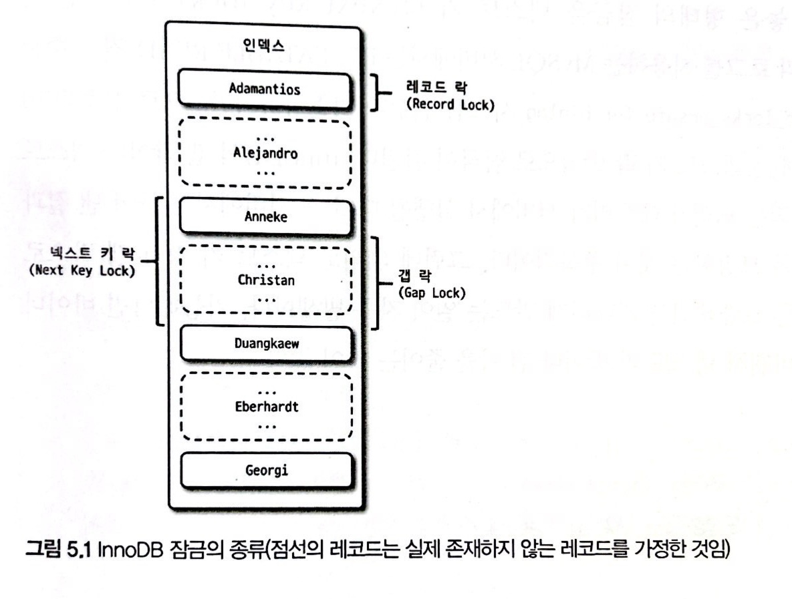

# 5. 트랜잭션과 잠금

>[5.1 트랜잭션](#5.1-트랜잭션)
>
>- [5.1.1 MySQL에서의 트랜잭션](#5.1.1-MySQL에서의-트랜잭션)
>- [5.1.2 주의사항](#5.1.2-주의사항)
>
>[5.2 MySQL 엔진의 잠금](#5.2-MySQL-엔진의-잠금)
>
>- 글로벌 락 / 테이블 락 / 네임드 락 / 메타데이터 락
>
>[5.3 InnoDB 스토리지 엔진 잠금](#5.3-InnoDB-스토리지-엔진-잠금)
>
>- [5.3.1 InnoDB 스토리지 엔진의 잠금](#5.3.1-InnoDB-스토리지-엔진의-잠금)
>- [5.3.2 인덱스와 잠금](#5.3.2-인덱스와-잠금)
>  - 레코드 락 / 갭 락 / 넥스트 키 락 / 자동 증가 락
>- [5.3.3 레코드 수준의 잠금 확인 및 해제](#5.3.3-레코드-수준의-잠금-확인-및-해제)

<br>

## 5.1 트랜잭션

> 트랜잭션은 작업의 완전성을 보장해주는 것
>
> - 즉 논리적인 작업 셋을 모두 완벽하게 처리하거나, 처리하지 못할 경우에는 원 상태로 복구해서 작업의 일부만 적용되는 현상(Partial update)이 발생하지 않게 만들어주는 기능
>
> 잠금(Lock)과 트랜잭션은 비슷한 개념 같지만 다름
>
> - 잠금: 동시성 제어 기능
> - 트랜잭션: 데이터 정합성 보장 기능

### 5.1.1 MySQL에서의 트랜잭션

- 트랜잭션은 꼭 여러 개의 변경 작업을 수행하는 쿼리가 조합됐을 때만 의미 있는 개념은 아님
  - 하나의 논리적 작업 셋에 쿼리 1개든 2개든 관계없이 논리적인 작업 셋 자체가 100% 적용(commit 시) 되거나
  - 아무것도 적용되지 않아야(rollback 또는 트랜잭션 rollback시키는 오류 발생) 함을 보장하는 것

- 예시

  ```sql
  -- fdpk 값 '3'이 존재할 때 Duplicate entry '3' for key 'PRIMARY' 에러 발생
  INSERT INTO tab_myisam (fdpk) VALUES (1), (2), (3);
  INSERT INTO TAB_INNODB (fdpk) VALUES (1), (2), (3);
  ```

  - myisam은 트랜잭션 지원하지 않으므로 1,2가 테이블에 insert 됨*(Partial Update)*
  - innodb는 트랜잭션 지원하므로 1,2 insert는 rollback되고 기존에 있던 3만 유지

<br>

### 5.1.2 주의사항

- **트랜잭션의 범위를 최소화해야 한다!**

- 예시

  ```txt
  # bad case
  1) 처리 시작
    => 데이터베이스 커넥션 생성
    => 트랜잭션 시작
  2) 사용자의 로그인 여부 확인
  3) 사용자의 글쓰기 내용의 오류 여부 확인
  4) 첨부로 업로드된 파일 확인 및 저장
  5) 사용자의 입력 내용을 DBMS에 저장
  6) 첨부 파일 정보를 DBMS에 저장
  7) 저장된 내용 또는 기타 정보를 DBMS에서 조회
  8) 게시물 등록에 대한 알림 메일 발송
  9) 알림 메일 발송 이력을 DBMS에 저장
    <= 트랜잭션 종료(commit)
    <= 데이터베이스 커넥션 반납
  10) 처리 완료
  ```

  - 실제 트랜잭션이 필요한 작업은 부분적임
  - 일반적으로 데이터베이스 커넥션은 개수가 제한적이어서 각 단위 프로그램이 커넥션을 소유하는 시간이 길어질수록 사용 가능한 여유 커넥션의 개수는 줄어들 것(어느 순간에는 커넥션을 가져가기 위해 기다려야 할 수도 있음)
  - 8번 작업이 더 위험. 메일 전송, FTP 파일 전송, 네트워크 통신 작업은 트랜잭션에서 제거하는 것이 좋음
    - 프로그램 실행 동안 서버 통신 에러가 발생하면 웹 서버 뿐만 아니라 DBMS 서버까지 위험해지는 상황이 발생할 수 있음

  ```txt
  # good case
  1) 처리 시작
  2) 사용자의 로그인 여부 확인
  3) 사용자의 글쓰기 내용의 오류 여부 확인
  4) 첨부로 업로드된 파일 확인 및 저장
  
    => 데이터베이스 커넥션 생성
    => 트랜잭션 시작
  5) 사용자의 입력 내용을 DBMS에 저장
  6) 첨부 파일 정보를 DBMS에 저장
    <= 트랜잭션 종료(commit)
    
  7) 저장된 내용 또는 기타 정보를 DBMS에서 조회
  8) 게시물 등록에 대한 알림 메일 발송
  
    => 트랜잭션 시작
  9) 알림 메일 발송 이력을 DBMS에 저장
    <= 트랜잭션 종료(commit)
    <= 데이터베이스 커넥션 반납
  
  10) 처리 완료
  ```

  - 5, 6번 작업: 사용자 입력 정보와 첨부파일 정보 저장은 한 번에 이루어져야 함
  - 7번 작업: 저장된 데이터의 단순 확인 및 조회이므로 트랜잭션 포함 불필요
  - 8번 작업: 위 설명 참조
  - 9번 작업: 5,6번과 성격이 다르기 때문에 별도 트랜잭션으로 분리하는 것이 좋음

<br>

## 5.2 MySQL 엔진의 잠금

> MySQL에서 사용하는 잠금은 크게 MySQL 엔진 레벨과 스토리지 엔진 레벨로 나뉨
>
> - MySQL 엔진 레벨: 모든 스토리지 엔진에 영향을 미침
> - 스토리지 엔진 레벨: 스토리지 엔진 간 상호 독립적

##### 글로벌 락

```sql
FLUSH TABLES WITH READ LOCK;
```

- MySQL에서 제공하는 잠금 가운데 가장 범위가 큼(서버 전체)

- 한 세션에서 글로벌 락을 획득하면 다른 세션에서 select 제외한 대부분의 DDL, DML 실행하면 글로벌 락 해제까지 대기

- 주의사항

  - 테이블에 읽기 잠금을 걸기 전 먼저 테이블을 플러시해야 하기 때문에 테이블에 실행 중인 모든 종류의 쿼리가 완료되어야 함

    - 테이블 또는 레코드에 쓰기 잠금을 거는 sql이 실행되고 있다면, 해당 sql과 트랜잭션 완료 시까지 글로벌 락 획득 명령은 기다려야 함

    - 장시간 select 쿼리가 실행되고 있을 때도 쿼리 종료 시까지 기다려야 함

  - 글로벌 락은 MySQL 서버의 모든 테이블에 큰 영향을 미치므로 웹 서비스용에선 가급적 사용하지 않는 것이 좋음

    - 글로벌 락 획득 명령이 최악의 케이스로 실행되면 쿼리가 아주 오랜 시간 실행되지 못하고 기다려야 할 수 있음

  - mysqldump 백업 프로그램은 우리가 알지 못하는 사이에 이 명령을 내부적으로 실행하고 백업할 때도 있음

- backup lock

  ```sql
  LOCK INSTANCE FOR BACKUP;
  -- 백업 실행
  UNLOCK INSTANCE;
  ```

  - InnoDB 스토리지 엔진은 트랜잭션을 지원하므로 일관된 데이터 상태를 위해 모든 데이터 변경 작업을 멈출 필요는 없음. 
  - 8.0부터 Xtrabackup / Enterprise Backup 같은 백업 툴의 안정적 실행을 위해 조금 더 가벼운 글로벌 락 도입
  - 허용
    - DML 허용(테이블 데이터 변경 허용)
    - DDL 명령 실행 시 replication 일시 중지(<u>백업 실패 막기 위함</u>)
      - 일반적 MySQL 서버 구성(Source server & Replica server)에서, 주로 백업은 레플리카 서버에서 실행
      - 백업이 `FLUSH TABLES WITH READ LOCK` 명령을 통해 글로벌 락 획득하면 복제는 백업 시간만큼 지연
      - 레플리카 서버에서 백업 실행 도중 소스 서버 문제 생기면 레플리카 서버 데이터가 최신 상태가 될 때까지 서비스를 멈춰야 할 수도 있음
      - XtraBackup / Enterprise Backup 툴은 복제가 진행되는 상태에서도 일관된 백업을 만들 수 있지만, 스키마가 변경(DDL 작업)되면 백업 실패할 수 있음 -> 백업 락을 통해 해결
  - 제한
    - 특정 세션에서 백업 락 획득하면 모든 세션에서 테이블 스키마나 사용자 인증 관련 정보 변경 불가능
    - 종류
      - 데이터베이스 및 테이블 등 모든 객체 생성 및 변경, 삭제
      - REPAIR TABLE과 OPTIMIZE TABLE 명령
      - 사용자 관리 및 비밀번호 변경

##### 테이블 락

- 개별 테이블 단위로 설정되는 잠금

- 명시적 락 획득

  ```sql
  LOCK TABLES table_name [ READ | WRITE ];
  UNLOCK TABLES;
  ```

  - 명시적 테이블 락도 특별한 상황이 아니면 애플리케이션에서 사용할 필요가 거의 없음

    (글로벌 락과 동일하게 온라인 작업에 상당한 영향을 미치기 때문)

- 묵시적 락 획득

  - MyISAM / MEMORY 테이블 데이터 변경 쿼리 실행 시 발생
  - InnoDB 테이블은 스토리지 엔진 차원에서 레코드 기반 잠금 제공하므로 묵시적 테이블 락 설정되지 않음(엄밀히는 DML은 무시하고, DDL 시에만 영향 있음)

##### 네임드 락

```sql
GET_LOCK(lock_name, lock_time);

-- "mylock"이라는 문자열에 대해 잠금 획득
-- 이미 잠금을 사용 중이면 2초 동안만 대기(2초 이후 자동 잠금 해제)
SELECT GET_LOCK('mylock', 2);

-- 잠금이 설정되어 있는지 확인
SELECT IS_FREE_LOCK('mylock');

-- 락 반납(잠금 해제)
SELECT RELEASE_LOCK('mylock');

-- 3개 함수 모두 정상적으로 락 획득하거나 해제한 경우 1,
-- 아니면 NULL 또는 0 반환
```

```sql
-- since 8.0
SELECT GET_LOCK('mylock_1', 10); -- 네임드 락 중첩 사용 가능
SELECT GET_LOCK('mylock_2', 10);

SELECT RELEASE_ALL_LOCKS();  -- 현재 세션에서 획득한 네임드 락을 일괄 해제하는 기능도 추가
```

- GET_LOCK() 함수를 이용해 임의의 문자열에 대해 잠금 설정
- 잠금 대상이 table, record, auto_increment와 같은 데이터베이스 객체가 아님
- 단순히 사용자가 지정한 문자열(string)에 대해 획득하고 반납(해제)하는 잠금이고, 자주 사용되지는 않음
- use case
  - DB서버 1대 / 웹 서버 5대 등 특정 정보 동기화하는 요건 처럼 여러 클라이언트가 상호 동기화해야 할 때 네임드 락을 이용하면 쉽게 해결 가능
  - 많은 레코드에 대해 복잡한 요건으로 레코드를 변경하는 트랜잭션에 유용(e.g. 배치 프로그램)
    - 배치가 한꺼번에 많은 레코드 변경하면 자주 데드락의 원인이 될 수 있음
    - 각 프로그램 실행 시간 분산하거나 프로그램 코드 수정해서 데드락 최소화할 수 있지만, 간단한 방법이 아니고 완전한 해결책이 되지도 못함
    - 이 경우 동일 데이터를 변경하거나 참조하는 프로그램끼리 분류해서 네임드 락을 걸고 쿼리 실행하면 해결 가능

##### 메타데이터 락

- 데이터베이스 객체(대표적으로 테이블이나 뷰 등)의 이름이나 구조를 변경하는 경우에 획득

- 명시적 획득/해제 불가능

- 예시

  - `RENAME TABLE tab_a TO tab_b` 같이 테이블 이름 변경하는경우 자동으로 획득

    (tab_a, tab_b 두 테이블 모두 한꺼번에 잠금)

  - 메타데이터 락과 InnoDB 트랜잭션 동시에 사용해야 하는 경우도 있음

    - INSERT만 실행되는 로그 테이블 가정(update, delete 작업 없음)

    - 테이블 구조 변경 요건 발생 시

      - 시간이 너무 오래 걸리면 undo log 증가, online DDL 실행 동안 누적된 버퍼 크기 등 고려 필요
      - DDL 단일 스레드로 작동하므로 많은 시간 소모

    - 해결

      ```sql
      -- 1. 트랜잭션 시작(BEGIN or START TRANSACTION으로 실행하면 안됨)
      SET autocommit=0;
      
      -- 2. 작업 대상 테이블 2개에 테이블 쓰기 락 획득
      LOCK TABLES access_log WRITE, access_log_new WRITE;
      
      -- 3. 남은 데이터 복사
      SELECT MAX(id) as @MAX_ID FROM access_log_new;
      INSERT INTO access_log_new SELECT * FROM access_log WHERE PK > @MAX_ID;
      COMMIT;
      
      -- 4. 복사 완료 시 새로운 테이블을 서비스 투입
      RENAME TABLE access_log TO access_log_old, acces_log_new TO access_log;
      UNLOCK TABLES;
      
      -- 5. 불필요 테이블 삭제
      DROP TABLE access_log_old;
      ```

      - 새로운 구조 테이블 생성

      - 최근(1시간 직전 또는 하루 전) 데이터까지는 pk 범위별로 나눠 여러 개 스레드로 빠르게 복사

      - 나머지 데이터는 트랜잭션과 테이블 잠금, `RENAME TABLE` 명령으로 응용 프로그램 중단 없이 실행 가능

      - 이 때, 남은 데이터 복사 시간 동안은 테이블 잠금으로 인해 insert 불가능

        (따라서 가능하면 아주 최근 데이터까지 복사해둬야 잠금 시간 최소화하여 서비스 영향 최소화 가능)

<br>

## 5.3 InnoDB 스토리지 엔진 잠금

### 5.3.1 InnoDB 스토리지 엔진의 잠금



- 레코드 기반의 잠금 기능 제공
- 잠금 정보가 상당히 작은 공간으로 관리되기 때문에 레코드락이 페이지락 또는 테이블 락으로 레벨업되는 경우(lock escalation)가 없음
- 일반 상용 DMBS와 다른 점은 레코드와 레코드 사이의 간격을 잡그는 gap lock이 존재

##### 레코드 락

- 레코드 자체만을 잠그는 것(record lock, record only lock)
- 인덱스 레코드 잠금
  - 레코드 자체를 잠그는 상용 DBMS와의 차이점
  - 인덱스가 없는 테이블이더라도 내부적으로 자동 생성된 클러스터 인덱스 이용해 잠금
- PK or Unique index에 의한 변경 작업은 갭 락은 잠그지 ㅇ

##### 갭 락

- 레코드 자체가 아닌 레코드와 바로 인접한 레코드 사이의 간격만을 잠금
- 갭 락의 역할은 레코드와 레코드 사이의 간격에 새로운 레코드가 생성(INSERT)되는 것을 제어
- 넥스트 키 락의 일부로 자주 사용

##### 넥스트 키 락

- next key lock = record lock + gap lock
- 바이너리 로그에 기록되는 쿼리가 레플리카 서버에서 실행될 때 소스 서버에서 만들어 낸 결과와 동일한 결과를 만들어내도록 보장하는 것이 주목적
  - STATEMENT 포맷 바이너리 로그 사용하면 REPEATABLE READ 격리 수준 사용해야 함
  - `innodb_locks_unsafe_for_binlog=0(비활성)` 시 변경을 위해 검색하는 레코드에는 넥스트 키 락 방식으로 잠금이 걸림
- next key lock, gap lock으로 인해 데드락이 발생하거나 다른 트랜잭션을 기다리게 만드는 일이 자주 발생하므로, 바이너리 로그 포맷을 가급적 ROW 형태로 바꿔서 next key/gap lock을 줄이는 것이 좋음
- 8.0 이후 부터 ROW 포맷 바이너리 로그 기본설정으로 변경
  - 안정성 높아지고, STATEMENT 포맷 바이너리 로그가 가지는 단점을 많이 해결

##### 자동 증가 락

- AUTO_INCREMENT 컬럼 속성
  - 동시 여러 레코드가 insert 될 경우 저장되는 레코드 중복되지 않고 저장된 순서대로 증가하도록 `auto increment lock` 테이블 수준 잠금 사용
- insert, replace 등 새로운 레코드 저장하는 쿼리에서만 필요
- ~5.0
  - 트랜잭션과 관계없이 auto_increment 값을 가져오는 순간만 락이 걸렸다 즉시 해제
  - auto increment lock은 테이블에 단 하나만 존재
    - 명시적으로 값 설정해도 잠금

- `innodb_autoinc_lock_mode=2`

  - 5.1 부터 자동 증가 락의 작동 방식 변경 가능

  - `0`: 5.0과 동일한 잠금 방식으로 모든 insert 문장은 auto increment lock 사용

  - `1`

    - 건수 예측 가능 시
      - auto increment lock 미사용하고, 훨씬 가볍고 빠른 Latch(mutex variable)를 이용해 처리
      - 개선된 래치는 자동 증가 락과 달리 아주 짧은 시간 동안만 잠금을 걸고, 필요한 자동 증가 값을 가져오면 잠금 해제
    - 건수 예측 불가능 시
      - INSERT ... SELECT 처럼 쿼리 실행 전 알 수 없을 때는 auto increment lock 사용
      - 해당 쿼리 완료 전 다른 커넥션은 insert 실행 불가능
      - 대량 insert 수행 시에는 InnoDB 스토리지 엔진이 여러 개의 자동 증가 값을 한 번에 할당 받아 사용(하지만 할당 받은 값을 사용 못하면 폐기 되므로 누락 발생 가능)

  - `2`

    - auto increment lock 절대 걸지 않고, Latch 사용

    - 하나의 insert 문장으로 삽입 되는 레코드라도 연속된 자동 증가 값을 보장하지 않음

      (interleaved mode)

    - 해당 모드에서는 대량 insert 수행 시에도 다른 커넥션에서 insert 수행 가능하여 동시 처리 성능 높아짐
    - 유니크한 값이 생성된다는 것만 보장하므로, STATEMENT 포맷의 바이너리 로그 사용하는 복제에서는 소스 서버와 레플리카 서버의 자동 증가 값이 달라질 수도 있기 때문에 주의해야 함

<br>

### 5.3.2 인덱스와 잠금

- 변경해야 할 레코드를 찾기 위해 검색한 인덱스의 레코드를 모두 잠금
- 예시
  - index가 설정된 컬럼의 건수가 200건이면 200건에 모두 잠금 설정
  - index가 없는 테이블에 30만 건이 존재하면, 30만건 모두 잠금
- MySQL 잠금 특성에 대해 잘 이해하고 index 설정을 잘 해야함

<br>

### 5.3.3 레코드 수준의 잠금 확인 및 해제

- 5.1 부터 레코드 잠금과 잠금 대기에 대한 조회 가능

- 5.1  `informatioon_schema` DB

  - `INNODB_TRX`, `INNODB_LOCKS`, `INNODB_LOCK_WAITS` 테이블에서 확인 가능
  - 8.0 deprecated

- since 8.0 `performance_schema` DB

  - `data_locks`, `data_lock_waits`

- 예시

  ```sql
  SHOW PROCESSLIST;
  
  #transaction 실행
  
  SELECT * FROM performance_schema.data_lock_waits;
  -- lock wait list 조회
  
  SELECT * FROM performance_shcema.data_locks;
  -- 스레드가 어떤 잠금을 가지고 있는지 더 상세히 확인
  
  KILL 17;
  -- 17번 스레드 강제 종료, race condition 종료
  ```
