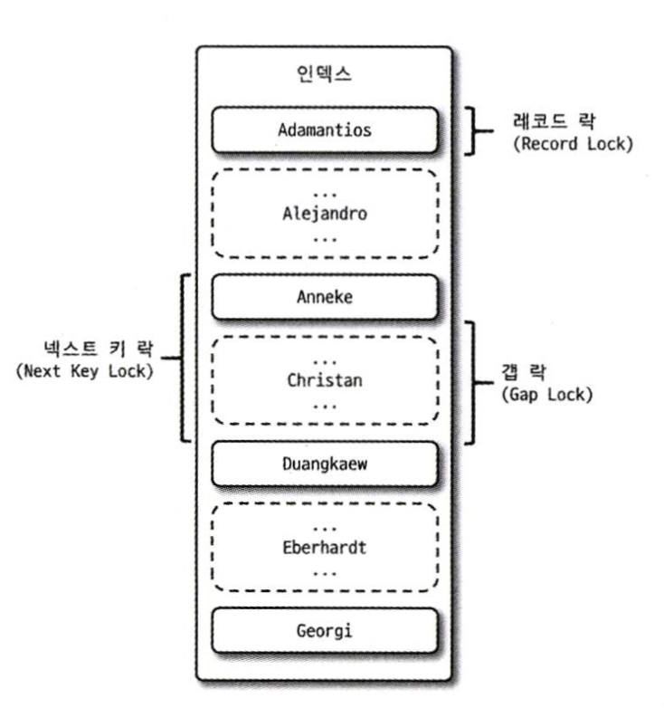
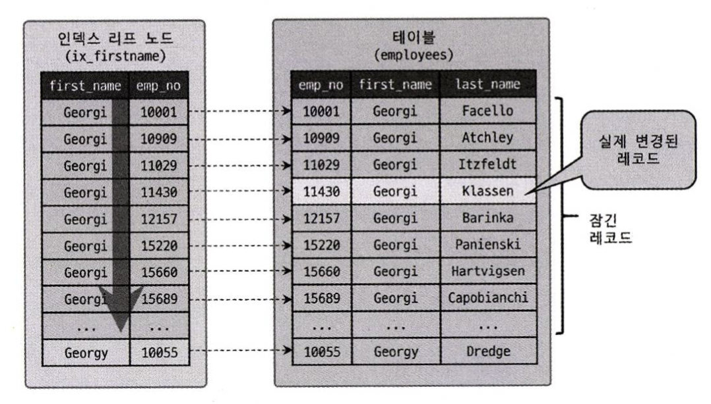

# 5. 트랜잭션과 잠금

> 트랜잭션과 잠금은 서로 비슷한 개념 같지만 다르다. 
> 
> 트랜잭션은 작업의 완전성을 보장하는 기능이다. 즉, 하나의 작업을 완벽하게 처리하고(commit), 다 처리하지 못할 경우에는 원 상태로 복구하여(rollback) 작업의 정합성을 보장한다.
> 
> 잠금은 동시성을 제어하기 위한 기능이다. 여러 커넥션에서 동시에 동일한 자원을 요청할 경우 하나의 커넥션만 접근할 수 있도록 한다. <br>

<br>

## 5.1 트랜잭션
MYSQL 서버에서 MyISAM과 MEMORY 스토리지 엔진은 트랜잭션을 지원하지 않고, InnoDB 스토리지 엔진에서는 트랜잭션을 지원한다.

### 5.1.1 MYSQL에서의 트랜잭션
트랜잭션은 하나의 작업을 100%(commit) 또는 0%(rollback) 적용시키는 기능이며, 데이터의 정합성을 보장해준다.

MyISAM 테이블 작업 도중 오류가 발생하면 이미 실행된 쿼리 결과는 적용된 채로 종료된다.

하지만, InnoDB 테이블 작업 도중 오류가 발생하면 전체를 원래 상태로 만든다는 트랜잭션의 원칙대로 작업을 실행하기 전 상태로 복구한다.

```
ex) 
> 각각의 테이블에 3 데이터가 들어가있는 상태
> insert into table (pk) values (1), (2), (3);
> ERROR : Duplicate entry '3' for key 'PRIMARY'

> 결과 조회
> select * from MyISAM table : | 1  2  3 |
> select * from InnoDB table : | 3 |
```

위와 같이, MyISAM 테이블에서 **부분 업데이트** 현상이 발생하면 테이블 데이터의 정합성을 맞추기 어려워진다.
- 실패한 쿼리로 인해 남은 레코드를 다시 삭제하는 재처리 작업이 필요할 수 있다.

<br>

### 5.1.2 주의사항
트랜잭션은 꼭 필요한 최소의 코드에만 적용하는 것이 좋다. 즉, 트랜잭션의 범위를 최소화하라는 의미이다.

트랜잭션이 긴 경우 발생할 수 있는 문제를 다음의 예시로 확인해보자.
```
1) 처리 시작
    => 데이터베이스 커넥션 생성
    => 트랜잭션 시작
2) 사용자의 로그인 여부 확인
3) 사용자의 글쓰기 내용의 오류 여부 확인
4) 첨부로 업로드된 파일 확인 및 저장
5) 사용자의 입력 내용을 DBMS에 저장
6) 첨부 파일 정보를 DBMS에 저장
7) 저장된 내용 또는 기타 정보를 DBMS에서 조회
8) 게시물 등록에 대한 알림 메일 발송
9) 알림 메일 발송 이력을 DBMS에 저장
    <= 트랜잭션 종료(COMMIT)
    <= 데이터베이스 커넥션 반납
10) 처리 완료
```

일반적으로 DB 커넥션은 개수가 제한적이라 각 단위 프로그램이 커넥션을 소유하는 시간이 길어질수록 사용 가능한 여유 커넥션의 개수는 줄어든다.
즉, 실제로 데이터 저장은 5번부터 일어나기 때문에 이전까지의 절차는 DBMS의 트랜잭션에 포함시킬 필요가 없다.
그리고 어느 순간에는 각 단위 프로그램에서 커넥션을 가져가기 위해 기다려야 하는 상황이 발생할 수 있어 성능이 나빠질 수 있다.

또한, 8번의 메일 발송 작업은 트랜잭션에서 제거하는 것이 좋다.
 메일 발송 작업, FTP 파일 전송 작업, 원격 서버와 통신하는 작업 등 ***외부 서버와 통신하는 네트워크 작업은 만약 해당 서버가 통신 불가 상태에 빠진다면 트랜잭션이 실패하는 것은 물론이고 DBMS 서버 장애로까지 이어질 수 있다.***

마지막으로, 위의 예시에는 DBMS 작업이 5,6,7,9번이 있는데 세부 요건에 따라 별도의 트랜잭션으로 나누는 것이 좋다. (5,6 / 7(단순 조회여서 트랜잭션은 사용하지 않아도 됨) / 9)

아래와 같이 트랜잭션이 활성화되어 있는 프로그램의 범위를 나누고 최소화한다면 위험도를 낮출 수 있다.
```
1) 처리 시작
2) 사용자의 로그인 여부 확인
3) 사용자의 글쓰기 내용의 오류 발생 여부 확인 
4) 첨부로 업로드된 파일 확인 및 저장
    => 데이터베이스 커넥션 생성(또는 커넥션 풀에서 가져오기)
    => 트랜잭션 시작
5) 사용자의 입력 내용을 DBMS에 저장
6) 첨부 파일 정보를 DBMS에 저장
    <= 트랜잭션 종료(COMMIT)
7) 저장된 내용 또는 기타 정보를 DBMS에서 조회 
8) 게시물 등록에 대한 알림 메일 발송
    => 트랜잭션 시작
9) 알림 메일 발송 이력을 DBMS에 저장
    <= 트랜잭션 종료(COMMIT)
    <= 데이터베이스 커넥션 종료(또는 커넥션 풀에 반납) 
10) 처리 완료
```

<hr><br>

## 5.2 MYSQL 엔진의 잠금
MYSQL에서 사용되는 잠금은 크게 **스토리지 엔진 레벨**과 **MYSQL 엔진 레벨**로 나눌 수 있다. 
MYSQL 엔진 레벨의 잠금은 모든 스토리지 엔진에 영향을 미치지만, 스토리지 엔진 레벨의 잠금은 각 스토리지 엔진 간 상호 영향을 미치지 않는다.

### 5.2.1 글로벌 락
- `FLUSH TABLES WITH READ LOCK` 명령으로 획득할 수 있다.
- MYSQL에서 제공하는 잠금 가운데 가장 범위가 크다.
  - 글로벌 락을 잡고 있는 세션이 있다면, 다른 세션에서 SELECT를 제외한 대부분의 DDL, DML 문장을 실행할 경우 글로벌 락이 해제될 때까지 대기 상태로 남는다.
  - MYSQL 서버 전체에 영향을 미치며, 작업 테이블이나 데이터베이스가 다르더라도 동일하게 영향을 미친다.
  - 즉, 실행과 동시에 MYSQL 서버에 존재하는 모든 테이블에 잠금을 건다.

InnoDB 스토리지 엔진은 트랜잭션을 지원하기 때문에 일관된 데이터 상태를 위해 모든 데이터 작업을 멈출 필요가 없어졌다.

그래서, MYSQL 8.0부터는 **백업 락**이라는 개념이 도입되었다. 백업 락은 조금 더 가벼운 개념으로, **일반적인 테이블의 데이터 변경은 허용**되지만 아래와 같이 테이블의 스키마나 사용자의 인증 관련 정보는 변경할 수 없다.
- 모든 객체(db, table ...) 생성 및 변경, 삭제
- REPAIR TABLE 과 OPTIMIZE TABLE 명령
- 사용자 관리 및 비밀번호 변경

<br>

### 5.2.2 테이블 락
- 개별 테이블 단위로 설정되는 잠금으로, 명시적 또는 묵시적으로 특정 테이블의 잠금을 획득할 수 있다.
- 명시적 잠금
  - `LOCK TABLES table_name [READ | WRITE]` (테이블 잠금)
  - `UNLOCK TABLES` (잠금 해제)
  - MyISAM과 InnoDB 스토리지 엔진을 사용하는 테이블 모두 설정할 수 있다.
  - 글로벌 락과 동일하게 온라인 작업에 상당한 영향을 끼치기 때문에, 애플리케이션에서 사용할 필요가 거의 없다.
- 묵시적 잠금
  - MyISAM, MEMORY 테이블에 데이터를 변경하는 쿼리를 실행하면 발생한다.
    - 즉, 쿼리가 실행되는 동안 자동으로 락을 획득했다가 쿼리가 완료된 후 자동으로 락이 해제된다.
  - InnoDB 테이블은 레코드 기반의 잠금을 제공하기 때문에, 단순 데이터 변경 쿼리로 인해 묵시적인 테이블 락이 설정되지 않는다.
    - 대부분의 DML 쿼리에서는 락이 무시되고 DDL 쿼리에만 영향을 미친다.

<br>

### 5.2.3 네임드 락
- `GET_LOCK()` 함수를 통해 임의의 문자열에 대해 잠금을 설정할 수 있다.
- 사용자가 지정한 **문자열**에 대해 잠금을 획득하고 해제한다.
- 많은 레코드에 대해서 복잡한 요건으로 레코드를 변경하는 트랜잭션에 유용하게 사용된다.

<br>

### 5.2.4 메타데이터 락
- DB 객체(table, view...)의 이름이나 구조를 변경하는 경우에 획득하는 잠금이다.
- 명시적으로 획득하거나 해제할 수 있는 잠금이 아니다.

- 만약 테이블의 이름을 변경한다면 메타데이터 락을 자동으로 획득할 수 있는데, 여러 개의 RENAME 작업을 진행하고 싶다면 하나의 쿼리로 실행하는 것이 좋다.
  - `RENAME TABLE` 명령의 경우 원본 이름과 변경될 이름 모두 한꺼번에 잠금이 설정된다.
  - 그러므로 2개의 쿼리로 나눠서 RENAME 작업을 진행할 경우 "Table not found" 에러가 발생할 수 있다.

<hr><br>

## 5.3 InnoDB 스토리지 엔진 잠금
InnoDB 스토리지 엔진은 내부에서 레코드 기반의 잠금 방식을 탑재하고 있다.

최근(MYSQL 5.1 ~) InnoDB의 트랜잭션과 잠금, 잠금 대기 중인 트랜잭션의 목록을 조회할 수 있는 방법이 도입되었다.
- `information_schema` DB에 존재하는 **INNODB_TRX**, **INNODB_LOCKS**, **INNODB_LOCK_WAITS** 테이블 조회

### 5.3.1 InnoDB 스토리지 엔진의 잠금
InnoDB 스토리지 엔진은 잠금 정보가 상당히 작은 공간으로 관리되기 때문에 **락 에스컬레이션**이 발생하지 않는다.

**락 에스컬레이션**이란, 많은 수의 작은 잠금을 더 적은 수의 큰 잠금으로 올리는 프로세스를 의미한다. 
- ex. 레코드 락->페이지 락 또는 테이블 락 으로 레벨업되는 경우
- 경합 가능성이 올라가므로 동시성 처리 성능이 떨어진다.


> 점선은 실제 존재하지 않는 레코드를 의미한다.

### 1) 레코드 락 (Record lock)
- 레코드 자체만을 잠그는 것을 의미한다.
- InnoDB 스토리지 엔진은 레코드 자체가 아니라 인덱스의 레코드를 잠근다.
  - 인덱스가 없는 테이블이라도 내부적으로 자동 생성된 클러스터 인덱스를 이용해 잠금을 설정한다.
  - PK 또는 유니크 인덱스에 의한 변경 작업은 레코드 락을 걸고 작업한다. 
- 레코드 자체를 잠그느냐, 인덱스를 잠그느냐는 상당히 중요한 차이를 만들어 낸다.

### 2) 갭 락 (Gap lock)
- 레코드와 바로 인접한 레코드 사이의 간격만을 잠그는 것을 의미한다.
- 즉, 레코드와 레코드 사이의 간격에 새로운 레코드가 생성되는 것을 제어한다.

### 3) 넥스트 키 락 (Next key lock)
- 레코드 락과 갭 락을 합쳐놓은 형태의 잠금이다.
- 바이너리 로그에 기록되는 쿼리가 레플리카 서버에서 실행될 때 소스 서버에서 만들어 낸 결과와 동일한 결과를 만들어내도록 보장하는 것이 주목적이다.
  - 레플리카 서버(Slave): 소스 서버의 데이터를 복제해서 저장하는 백업서버
  - 소스 서버(Master): 데이터를 실질적으로 저장하는 서버
- STATEMENT 포맷의 바이너리 로그를 사용하는 MYSQL 서버에서는 `REPEATABLE READ` 이상의 격리 수준을 사용해야한다.
  - STATEMENT 포맷의 바이너리 로그: 쿼리를 그대로 기록하는 방식
  - READ-COMMITTED 격리 수준을 사용하면 하나의 트랜잭션에서 실행 시점에 따라 스냅샷이 달라지기 때문에 데이터가 불일치하는 문제가 발생할 수 있다.
- 넥스트 키 락과 갭 락으로 인해 데드락이나 다른 트랜잭션을 기다리게 만드는 일이 자주 발생하므로, 가능하면 바이너리 로그 포맷을 ROW 형태로 바꿔서 해당 락들을 줄이는 것이 좋다.
  - ROW 포맷의 바이너리 로그: 생성/변경된 모든 Row 정보를 기록하는 방식
    - 복제 시 소스 서버와 레플리카 서버의 데이터 일관성을 유지하는데 안전하다.
    - 변경된 데이터가 바로 적용되기에 더 적은 락을 점유한다.
- MYSQL 8.0 에서는 ROW 포맷의 바이너리 로그로 기본 설정이 변경되었다.

### 4) 자동 증가 락 (Auto increment lock)
- `AUTO_INCREMENT`가 사용된 테이블에 동시에 여러 레코드가 적재되는 경우, 레코드는 중복되지 않고 저장된 순서대로 증가하는 일련번호 값을 가져야한다.
- 이를 위해 자동 증가 락은 InnoDB 스토리지 엔진에서 내부적으로 사용하는 테이블 수준의 잠금이다.
- INSERT나 REPLACE 쿼리와 같이 새로운 레코드를 저장하는 쿼리에만 사용된다.
- 트랜잭션과 관계없이 AUTO_INCREMENT를 가져오는 순간만 락이 걸렸다가 바로 해제된다.
- 명시적으로 해제하거나 획득할 수 없다.
- 테이블 당 하나만 존재하기 때문에, 동시에 INSERT가 일어나는 경우 하나의 쿼리는 AUTO_INCREMENT 잠금을 기다려야한다.
- 자동 증가 값이 증가하면 줄어들지 않는 이유가 AUTO_INCREMENT 잠금을 최소화하기 위해서이다.

<br>

### 5.3.2 인덱스와 잠금
InnoDB의 잠금은 레코드를 잠그는 것이 아니라 인덱스를 잠그는 방식으로 처리된다. 즉, 변경해야 할 레코드를 찾을 때 검색한 인덱스의 레코드를 모두 잠궈야 한다. 
이와 같은 특징으로 InnoDB에서 인덱스 설계는 매우 중요하다.

```sql
--// first_name 칼럼만 멤버로 담긴 ix_firstname이라는 인덱스가 준비되어 있다면,
--// KEY ix_firstname (first_name)

> SELECT COUNT(*) FROM employees WHERE first_name='Suyeon';
+-----------+
|       253 |
+-----------+

> SELECT COUNT(*) FROM employees WHERE first_name='Suyeon' AND last_name='Jin';
+-----------+
|         1 |
+-----------+

> UPDATE employees SET hire_date=NOW() WHERE first_name='Suyeon' AND last_name='Jin';
```

위 예시의 UPDATE 쿼리를 실행하면 1개의 레코드에 락이 걸릴거 같지만 `first_name='Suyeon'` 레코드 253건이 모두 잠긴다. 
그 이유는 first_name에는 인덱스가 존재하지만 last_name에는 인덱스가 없기 때문이다.



만약 테이블에 인덱스가 아예 존재하지 않았다면, 테이블 풀 스캔이 일어나면서 1개의 UPDATE를 위해 테이블의 모든 레코드가 다 잠기게 될 것이다.

즉, 적절한 인덱스가 준비되어 있지 않다면 각 클라이언트 간의 동시성이 떨어져서 작업 중에는 다른 클라이언트가 해당 테이블을 업데이트하지 못하고 기다려야하는 상황이 일어날 수 있다. InnoDB에서 인덱스 설계가 중요한 이유도 이 때문이다.

<br>

### 5.3.3 레코드 수준의 잠금 확인 및 해제
레코드 수준의 잠금은 테이블 수준의 잠금보다 조금 더 복잡하다. 테이블의 레코드 각각에 잠금이 걸리기 때문에 그 레코드가 자주 사용되지 않는다면 오랜 시간 동안 잠금 상태로 남겨져 있어도 잘 발견되지 못한다.

MYSQL 5.1부터는 레코드 잠금과 잠금 대기에 대한 조회가 가능해져 잠금과 잠금 대기 중인 스레드를 바로 확인할 수 있다.
- `information_schema` DB에 존재하는 **INNODB_TRX**, **INNODB_LOCKS**, **INNODB_LOCK_WAITS** 테이블 조회
- MYSQL 8.0부터는 `information_schema`의 정보들은 조금씩 제거되고 있다.

MySQL 8.0부터 `performance_schema` DB의 **data_locks**, **data_lock_waits** 테이블로 잠금과 잠금 대기 중인 스레드를 확인할 수 있어졌다.

```sql
--// 명령이 실행된 상태의 프로세스 목록을 조회
> SHOW PROCESSLIST;

--// performance_schema의 data_locks 테이블과 data_lock_waits 테이블을 조인하여 잠금 대기 순서 조회
> SELECT
     r.trx_id waiting_trx_id,
     r.trx_mysql_thread_id waiting_thread, 
     r.trx_query waiting_query,
     b.trx_id blocking_trx_id, 
     b.trx_mysql_thread_id blocking_thread, 
     b.trx_query blocking_query
 FROM performance_schema.data_lock_waits w 
     INNER OOIN information_schema.innodb_trx b
         ON b.trx_id = w.blocking_engine_transaction_id 
     INNER JOIN information_schema.innodb_trx r
         ON r.trx_id = w.requesting_engine_transaction_id;

--// 특정 스레드가 어떤 잠금을 가지고 있는지 상세하게 확인하고 싶다면 performance_schema의 data_locks 테이블이 가진 컬럼을 모두 확인하면 된다.
> SELECT * FROM performance_schema.data_locks\G

--// 특정 스레드가 잠금을 가진 상태에서 오랜 시간 멈춰있다면, 특정 스레드를 강제 종료하여 잠금 경합을 끝낼 수 있다.
> KILL {특정 스레드번호}
```

<hr><br>

