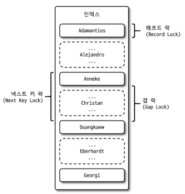
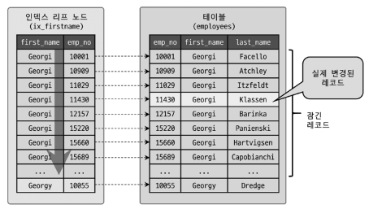

# 05장 트랜잭션과 잠금
MySQL의 동시성에 영향을 미치는 잠금과 트랜잭션, 트랜잭션의 격리 수준.

## 5.1 트랜잭션
트랜잭션은 작업의 일부만 적용되는 현상을 방지하여 작업의 완전성을 보장해준다.

### 5.1.1 MySQL에서의 트랜잭션
트랜잭션은 하나의 작업 셋의 쿼리의 갯수와 관계없이 작업 셋 자체가 100% 적용되거나 아무것도 적용되지 않아야 함을 보장한다.
실행 도중 오류가 발생하여 작업 셋의 일부만 적용된다면 데이터의 정합성을 맞추기 위해 일부만 적용된 레코드를 삭제하는 재처리 작업이 필요해진다.
트랜잭션은 어플리케이션 개발에서 이러한 문제를 해결해준다.

### 5.1.2 주의사항
트랜잭션 또한 필요한 최소의 코드에만 적용하는 것이 좋다. 즉, 트랜잭션의 범위를 최소화해야 한다.
실제 DBMS와 무관한 로직은 트랜잭션에 포함시키지 않는 것이 좋고, 하나의 트랜잭션에는 성격이 비슷한 작업끼리만 묶는다.

## 5.2 MySQL 엔진의 잠금
잠금은 동시성을 제어하기 위한 기능이다. MySQL에서의 잠금은 스토리지 엔진 레벨과 MySQL 엔진 레벨로 나눈다.
MySQL 엔진 잠금은 스토리지 엔진에 영향을 주지만 스토리지 엔진의 잠금은 스토리지 엔진 간 영향을 주지않는다.

### 5.2.1 글로벌 락
MySQL의 잠금 중 범위가 가장 크다. 글로벌 락의 영향 범위는 MySQL 서버 전체이다.  
한 세션에서 글로벌 락을 획득하면 다른 세션에서는 DDL, DML 등 SELECT 를 제외한 대부분의 쿼리가 글로벌 락을 기다린다.

MyISAM이나 MEMORY 테이블에서 일관된 백업을 받을 때는 글로벌 락을 사용한다.
InnoDB는 트랜잭션을 지원하므로 글로벌 락을 사용할 필요는 없다.
MySQL 8.0 부터는 InnoDB를 기본 스토리지 엔진으로 채택하면서 백업 툴의 안정적인 실행을 위해 백업 락을 도입했다.

백업 락은 일반적인 테이블의 데이터 변경이 허용된다. 
MySQL 의 백업은 소스 서버에서 레플리카 서버로 복제를 실행한 후에 레플리카 서버에서 백업이 실행된다.
백업 툴의 실행 도중에 스키마 변경 등 DDL 명령이 실행되면 복제를 일시 중지하여 백업의 실패를 방지한다.

### 5.2.2 테이블 락
테이블 락은 개별 테이블 단위로 실행되며, 명시적 또는 묵시적으로 특정 테이블의 락을 획득할 수 있다.

- 명시적 테이블 락
```sql
락 획득 > LOCK TABLES table_name [ READ | WRITE ]
락 해제 > UNLOCK TABLES
```

- 묵시적 테이블 락
  - MyISAM이나 MEMORY 테이블에 데이터 변경 쿼리를 실행하면 발생
  - 서버가 잠금을 설정하고 데이터 변경 후 즉시 해제
  - InnoDB 테이블은 엔진에서 레코드 기반의 잠금 제공하므로 대부분의 DML에서는 묵시적 테이블 락이 설정되지 않음. DDL의 경우만 영향을 미침

### 5.2.3 네임드 락
`GET_LOCK()` 함수를 이용해 임의의 문자열에 대해 잠금을 설정할 수 있다.  
단순히 사용자가 지정한 문자열에 대해 잠금을 획득하고 해제한다. 
예를 들어 여러 클라이언트가 상호 동기화 처리할 때 네임드 락을 이용하면 쉽게 해결할 수 있다.

### 5.2.4 메타데이터 락
데이터베이스 객체의 이름이나 구조를 변경하는 경우 획득하는 잠금.
명시적으로 획득, 헤제하지 않고 `RENAME TABLE table_a TO table_b` 같이 테이블의 이름을 변경하는 경우 자동으로 획득한다.
`RENAME TABLE` 명령은 변경 전과 변경 후 두 개에 모두 잠금을 설정한다.

## 5.3 InnoDB 스토리지 엔진 잠금
InnoDB는 MySQL에서 제공하는 잠금과는 별개로 스토리지 엔진 내부에서 레코드 기반의 잠금을 제공한다.

MySQL 서버의 `information_schema` 데이터베이스의 `INNODB_TRX`, `INNODB_LOCKS`, `INNODB_LOCK_WAITS` 테이블을 조회하면 InnoDB의 잠금과 트랜잭션에 대한 모니터링을 할 수 있다.
또한, `Performance Schema`를 이용하여 엔진 내부 잠금에 대해 모니터링할 수 있다.

### 5.3.1 InnoDB 스토리지 엔진의 잠금
InnoDB는 레코드 기반의 잠금을 제공하며, 잠금 정보가 작은 공간으로 관리되어 레코드 락이 페이지락 또는 테이블 락으로 레벨업되지 않는다.


> InnoDB 스토리지 엔진의 레코드 락과 갭 락, 넥스트 키 락

#### 5.3.1.1 레코드 락
레코드 자체만을 잠그는 것이다. 다른 DBMS의 레코드 락과 동일하다. InnoDB는 레코드 자체가 아니라 인덱스의 레코드를 잠근다.
만약 인덱스가 없는 테이블의 경우 자동 생성된 클러스터 인덱스를 이용한다. 
프라이머리 키 또는 유니크 인덱스에 의한 변경 작업에서는 레코드 자체를 잠근다.

#### 5.3.1.2 갭락
레코드 자체가 아니라 레코드와 바로 인접한 레코드 사이의 간격을 잠근다. 
레코드와 레코드 사이에 새로운 레코드의 생성을 제어한다.

#### 5.3.1.3 넥스트 키 락
레코드 락과 갭 락을 합쳐 놓은 잠금이다.
`STATEMENT 포맷 바이너리 로그를 사용하는 MySQL 서버`에서 갭 락이나 넥스트 키 락은 바이너리 로그에 기록된 쿼리의 결과를 레플리카 서버와 소스 서버가 동일하도록 보장한다.
이 락으로 인해 데드락 발생 혹은 다른 트랜잭션의 대기가 자주 발생하면 `ROW 포맷 바이너리 로그`로 바꾸는 게 좋다.

#### 5.3.1.4 자동 증가 락
MySQL 에서는 자동 증가하는 숫자를 추출하기 위해 `AUTO_INCREMENT` 속성을 제공한다. 이 값은 중복되지 않아야 한다. 
InnoDB 엔진은 `AUTO_INCREMENT 락`이라고 하는 테이블 수준의 잠금을 사용한다.

MySQL 5.0 까지는 `AUTO_INCREMENT 락`을 명시적으로 획득하고 해제하는 방법은 없었다. 
5.1 이상부터는 `innodb_autoinc_lock_mode` 변수로 자동 증가 락의 작동 방식을 변경할 수 있다.

__`innodb_autoinc_lock_mode`__
- 0
  - 5.0과 동일한 방식.
  - 모든 INSERT 문장은 자동 증가 락을 사용.
- 1
  - MySQL 서버가 INSERT 건수를 정확히 예측할 경우 락 대신 래치(뮤텍스)를 이용한다.
  - 락 대비 아주 짧은 시간만 잠금을 걸고 값을 가져온다.
  - `INSERT ... SELECT`와 같이 INSERT 건수를 정확히 예측 불가한 경우 자동 증가락을 사용.
  - 하나의 INSERT 쿼리로 INSERT된 레코드는 연속된 값을 가진다. => 연속 모드(Consecutive)
- 2
  - 자동 증가 락 대신 래치(뮤텍스)를 사용.
  - 하나의 INSERT 쿼리라도 연속된 값을 보장하지 않음. => 인터리빙 모드(Interleaved)
  - 단지 유니크한 값만 보장한다.
  - `STATEMENT 포맷 바이너리 로그`의 복제에서는 값이 달라질 수 있다.

AUTO_INCREMENT 한 번 증가된 값은 쿼리가 실패해도 줄어들지 않는다.

### 5.3.2 인덱스와 잠금
InnoDB는 인덱스를 잠근다. 즉, 변경할 레코드를 찾기 위해 검색한 인덱스의 레코드를 모두 잠근다.
만약 테이블에 인덱스가 없다면, 풀 스캔하면서 모든 레코드를 잠그게 된다. MySQL의 InnoDB에서 인덱스 설계가 중요한 이유이다.


> InnoDB 인덱스 락

### 5.3.3 레코드 수준의 잠금 확인 및 해제
MySQL 8.0 에서는 `performance_schema`의 `data_locks` 테이블과 `data_lock_waits` 테이블을 조회하여 
각 트랜잭션이 기다리는 잠금, 해당 잠금을 가지고 있는 트랜잭션에 대한 정보를 얻을 수 있다.
`KILL` 명령을 수행하여 트랜잭션을 수행중인 프로세스를 종료하면 잠금을 강제로 해제할 수 있다.