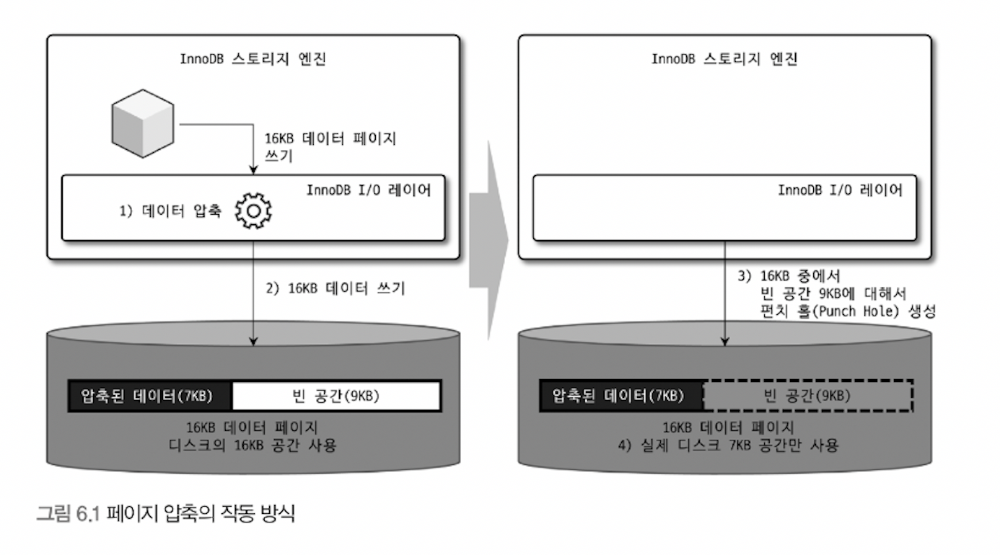
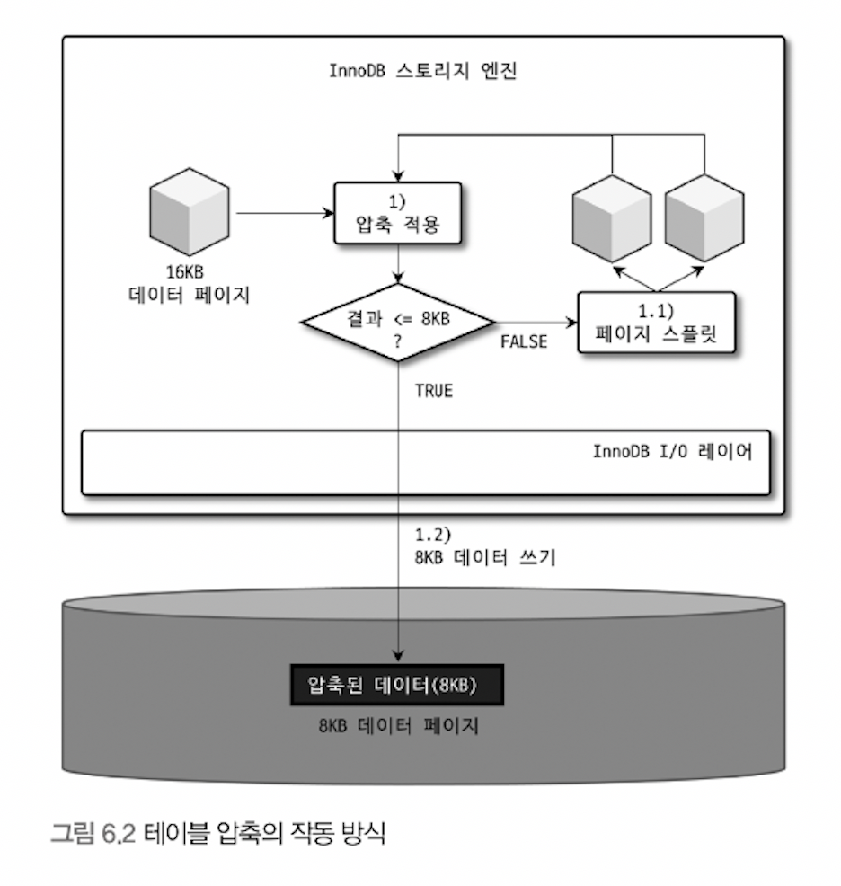

# 6장 데이터 압축

서버에서 데이터 파일의 크기는 쿼리의 성능 뿐만 아니라 백업 및 복구에도 영향이 있다.

데이터 파일의 크기가 클수록

- 더 많은 데이터 페이지를 버퍼 풀로 읽어옴
- 더티 페이지가 더 자주 기록됨
- 백업 시간이 오래 걸림
- 복구 시간도 오래 걸림
- 더 많은 저장 공간이 필요함

이런 문제를 해결하기 위해 데이터 압축을 제공한다. 크게 테이블 압축과 페이지 압축이 있다.

## 6.1 페이지 압축

서버가 디스크에 저장하는 시점에 데이터 페이지가 압축되고, 디스크에서 데이터 페이지를 읽어올 때 압축이 해제된다. 즉 버퍼 풀의 데이터 페이지는 압축이 해제된 상태로만 관리된다.

데이터 페이지를 압축한 결과의 용량은 예측이 불가능하다. 하나의 테이블은 동일한 크기로 통일돼야하므로 펀치 홀 기능을 사용한다.

페이지 압축 과정



1. 16KB 페이지 압축 ( 7KB로 가정 )
2. 디스크에 압축된 7KB를 기록 + 9KB의 빈 데이터를 기록
3. 9KB에 대해 펀치 홀 생성
4. 파일은 7KB만 남기고 남은 9KB는 반환

펀치홀 기능의 문제점
1. 운영체제와 하드웨어 자체 지원이 필요
2. 파일 시스템 관련 명령 또는 유틸리티가 지원하지 못함

데이터 파일은 백업, 복구과정에서 데이터가 복사되고 그 외에 많은 유틸리티를 사용하는데 펀치 홀 공간이 채워져서 파일의 크기가 원본과 같아질 수 있다. 이런 이유로 페이지 압축은 많이 사용하지 않는다.

페이지 압축 사용방법 - `COMPRESSION` 옵션을 설정한다.

```sql
// 테이블 생성
CREATE TABLE T1 (C1 INT) COMPRESSION="zlib";
// 테이블 변경
ALTER TALBE T1 COMPRESSION="zlib";
OPTIMIZE TABLE T1;
```

## 6.2 테이블 압축

테이블 압축은 페이지 압축과 다르게 운영체제나 하드웨어에 대한 제약이 없다. 테이블 압축은 파일 크기를 줄일 수 있어서 이득이 있지만 여러 단점도 있다.

1. 버퍼 풀 공간 활용률이 낮음
2. 쿼리 처리 성능이 낮음
3. 빈번한 데이터 변경 시 압축률이 떨어짐

### 6.2.1 압축 테이블 생성

테이블 압축은 압축하려는 테이블이 별도의 테이블 스페이스를 사용해야 한다. 즉 테이블을 생성할 때 `innodb_file_per_table` 변수를 ON으로 설정해야 한다.

테이블 압축 사용 테이블 생성

```sql
SET GLOBAL innodb_file_per_table=ON;

CREATE TABLE COMP_TABLE (
	C1 INT PRIMARY KEY
)
ROW_FORMAT=COMPRESSED
KEY_BLOCK_SIZE=8;

// ROW_FORMAT 옵션이 생략되면 자동으로 COMPRESSED 옵션이 추가된다.
CREATE TABLE COMP_TABLE (
	C1 INT PRIMARY KEY
)
KEY_BLOCK_SIZE=8;

// KEY_BLOCK_SIZE는 압축된 페이지가 저장될 크기를 지정한다.
// KB 단위를 사용하며, 2n (n >= 2)로만 설정가능
// 페이지 크기가 16KB라면 4KB or 8KB
// 페이지 크기가 32KB 또는 64KB 인 경우는 테이블 압축 적용 불가능
```

데이터 페이지를 압축하는 과정 ( 데이터 페이지=16KB, KEY_BLOCK_SIZE=8KB )



1. 16KB의 페이지를 압축
    1. 압축 결과가 8KB 이하이면 디스크에 저장
    2. 8KB 초과 시에 페이지를 나누어서 2개의 페이지에 8KB씩 저장
2. 나눈 페이지에 대해 각각 1번 단계부터 반복 실행

데이터 압축 방식은 원본 페이지의 압축 결과가 목표 크기인 `KEY_BLOCK_SIZE` 보다 작거나 같을 때까지 반복하여 나눈다. 따라서 목표값을 잘못 설정하면 처리 성능이 매우 떨어질 수 있다.

### 6.2.2 KEY_BLOCK_SIZE 결정

테이블 압축을 적용하기 전에 먼저 `KEY_BLOCK_SIZE` 값을 4KB 또는 8KB 로 생성 후 샘플 데이터를 저장하여 값이 적절한지 판단한다.

샘플 데이터를 이용한 값 결정

1. 데이터 테이블과 같은 구조의 압축 테이블 생성
2. 테스트 실행 전 `innodb_cmp_per_inde_enabled` 를 ON으로 설정하여 인덱스 별 압축 실행, 성공 횟수 기록
3. 데이터 테이블을 압축 테이블로 저장

일반적으로 압축 실패율은 3~5%로 유지할 수 있게 값을 선택하는 것이 좋다.

> 주의사항
압축 실패율이 높다고 압축을 사용하지 않아야 하는 것은 아니다. INSERT 만 수행되는 로그 테이블은 INSERT 이후 변경되지 않는다. 이런 경우는 압축 실패가 큰 손해는 아니다.
또한, 압축 실패율이 낮아도 조회와 변경이 자주 일어난다면 압축을 고려하지 않는 것이 좋다.
>

### 6.2.3 압축된 페이지의 버퍼 풀 적재 및 사용

InnoDB 스토리지 엔진은 디스크에서 읽은 상태 그대로의 페이지 목록을 관리하는 LRU 리스트와 압축 해제된 페이지 목록을 관리하는 Unzip_LRU 리스트를 별도로 관리한다. Unzip_LRU 리스트는 압축이 적용된 페이지의 압축 해제 페이지만 관리하지만, LRU 리스트는 압축이 적용되지 않은 테이벌의 페이지도 가질 수 있다.

결국, 버퍼 풀을 이중으로 사용하여 메모리를 낭비하게 된다. 또한, 압축된 페이지에서 데이터를 읽거나 변경하면 압축 해제가 필요한데, 이는 CPU를 상대적으로 많이 사용한다. 이런 단점을 보완하기 위해 Unzip_LRU 리스트를 별도로 관리하여 상황에 맞게 적절히 처리한다.

- InnoDB 버퍼 풀의 공간이 필요한 경우: 원본 페이지는 유지, Unzip_LRU에서 해제된 버전 제거
- 압축된 페이지가 자주 사용되는 경우: 압축 해제된 페이지를 계속 유지
- 압축된 페이지가 사용되지 않아서 LRU에서 제거: Unzip_LRU에서도 함께 제거
- CPU 사용량이 높은 서버: Unzip_LRU의 비율을 높게 유지
- Disk IO 사용량이 높은 서버: Unzip_LRU 리스트의 비율을 낮춰서 버퍼 풀의 공간을 확보

### 6.2.4 테이블 압축 관련 설정

테이블 압축 시에 압축 실패율을 낮추기 위해 필요한 튜닝 포인트 제공

- innodb_cmp_per_index_enabled
    - 압축 테이블의 인덱스별 압축 성공 및 압축 실행 횟수 수집 설정
    - 비활성화 시에는 테이블 단위로만 수집됨
- innodb_compression_level
    - InnoDB의 테이블 압축은 zlib 알고리즘만 지원
    - 압축률을 설정할 수 있다.
    - 작을수록 속도는 빠르지만 낮은 압축률
- innodb_compression_failure_threshold_pct / innodb_compression_pad_pct_max
    - 압축 실패율이 pct 값보다 커지면 압축 실행 전 페이지 끝에 의도적으로 빈 공간을 추가
    - 이 공간을 패딩이라고 하며, 압축률을 높일 수 있다
    - 패딩의 최대 크기는 pct_max 값으로 설정
    - pct_max 값은 전체 페이지 크기 대비 패딩 공간의 비율
- innodb_log_compressed_pages
    - 서버의 비정상 종료 후 재시작하는 경우 복구 과정이 실패하지 않도록 압축된 데이터 페이지를 리두 로그에 기록
