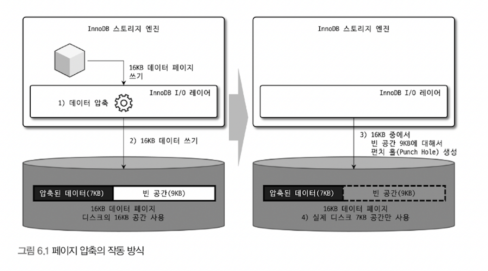
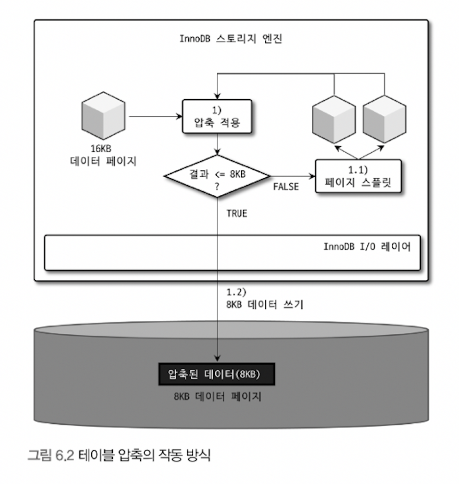

# 6. 데이터 압축

> [6.1 페이지 압축](#6.1-페이지-압축)
>
> [6.2 테이블 압축](#6.2-테이블-압축)
>
> - 압축 테이블 생성
> - KEY_BLOCK_SIZE 결정
> - 압축된 페이지의 버퍼 풀 적재 및 사용
> - 테이블 압축 관련 설정

MySQL 서버에서 디스크에 저장된 데이터 파일의 크기는 일반적으로 쿼리 처리 성능, 백업 및 복구 시간과 밀접하게 연관됨

디스크 데이터 파일이 크면 쿼리 처리를 위해 더 많은 데이터 페이지를 InnoDB 버퍼 풀로 읽어야 할 수 있고, 새로운 페이지가 버퍼 풀로 적재되기 때문에 그만큼 더티 페이지가 더 자주 디스크로 기록되어야 함

이런 문제점 해결을 위해 데이터 압축 기능을 제공하며, 크게 테이블 압축과 페이지 압축 두 종류로 구분됨

<br>

## 6.1 페이지 압축



<br>

- Transparent Page Compression

  - MySQL 서버가 디스크에 저장하는 시점에 데이터 페이지가 압축되어 저장 -> 디스크에서 데이터 페이지 읽어올 때 압축 해제
  - 버퍼 풀에 데이터 페이지가 한 번 적재되면 InnoDB 스토리지 엔진은 압축이 해제된 상태로만 데이터 페이지 관리
  - 따라서 서버 내부 코드는 압축 여부와 관계 없이 투명(Transparent)하게 작동

- 작동 방식

  - 16KB 페이지 압축(압축 결과를 7KB로 가정)

  - MySQL 서버는 디스크에 압축된 결과 7KB 기록

    (이 때, MySQL 서버는 7KB(압축 데이터) + 9KB(빈 데이터) 기록)

  - 디스크에 데이터 기록 후, 7KB 이후의 공간 9KB에 대해 Punch-hole 생성

  - 파일 시스템은 7KB만 남기고 나머지 디스크의 9KB 공간은 운영체제로 반납

- 사용

  ```sql
  -- 테이블 생성 시
  CREATE TABLE t1 (c1 INT) COMPRESSION="zlib";
  
  -- 테이블 변경 시
  ALTER TABLE t1 COMPRESSION="zlib";
  OPTIMIZE TABLE t1;
  ```

- 문제점

  - 적어도 하나의 테이블은 동일한 크기의 페이지(블록)로 통일되어야 함. 이를 위해 페이지 압축 기능은 운영체제별로 특정 버전의 파일 시스템에서만 지원되는 펀치 홀(Punch hole)이라는 기능 사용
  - 펀치 홀 기능은 운영체제 + 하드웨어 자체에서도 해당 기능 지원해야 사용 가능함
  - 아직 파일 시스템 관련 명령어(유틸리티)가 펀치 홀 지원 못함
  - 백업 및 복구 과정에서도 파일 복사 과정이 일어남. 'cp' 같은 파일 복사 명령 또는 XtraBackup 같은 툴이 파일 복사하면 펀치 홀이 다시 채워져 원본 크기로 돌아갈 수도 있음

- 위 문제점들로 페이지 압축은 많이 사용되지 않음

<br>

## 6.2 테이블 압축

테이블 압축은 운영체제, 하드웨어 제약 없이 사용하므로 일반적으로 활용도가 더 높음

##### 6.2.1 압축 테이블 생성

- 전제 조건

  - 압축 사용하려는 테이블의 별도의 테이블 스페이스를 사용해야 함
  - 시스템 변수 설정
    -  `innodb_file_per_table=ON`
    - (optional) `KEY_BLOCK_SIZE=2n` (KB)
      - 페이지 크기(innodb_page_size)가 16KB면 4, 8만 설정 가능. 32 or 64이면 테이블 압축 적용 불가
  - 테이블 생성 시 옵션 `ROW_FORMAT=COMPRESSED`

- 압축 작동 방식

  

  - 16KB 데이터 페이지를 압축
    - 압축된 결과가 8KB 이하면 그대로 디스크 저장(압축 완료)
    - 압축된 결과가 8KB 초과하면 원본 페이지를 split, 2개 페이지에 8KB씩 저장
  - 나뉜 페이지에 대해 위 단계를 반복 실행
  - 압축 방식에서 가장 중요한 것은 페이지 압축 결과가 목표 크기(KEY_BLOCK_SIZE) 보다 작거나 같을 때까지 반복해서 페이지를 split. 목표 크기 잘못 설정되면 성능 급격히 떨어질 수 있음

<br>

##### 6.2.2 KEY_BLOCK_SIZE 결정

- 압축 결과가 어느정도 될지 예측해서 KEY_BLOCK_SIZE를 정하는 것이 가장 중요

- 4KB or 8KB 테이블 생성해서 다량의 샘플 데이터로 테스트하고 적절한지 판단해야 함(샘플 데이터가 많을 수록 정확한 테스트 가능)

- 테스트

  ```sql
  -- 1. 기본 테이블 생성 및 샘플 데이터 insert
  
  -- 2. 인덱스별 압축 실행 횟수와 성공 횟수 기록되도록 설정
  SET GLOBAL innodb_cmp_per_index_enabled=ON;
  
  -- 3. 압축 테스트 테이블로 저장
  
  -- 4. 인덱스별로 압축 횟수, 성공 횟수, 압축 실패율 조회
  SELECT
  	table_name, index_name, compress_ops, compress_ops_ok,
  	(compress_ops-compress_ops_ok) / compress_ops * 100 as compression_failure_pct
  FROM information_shcema.INNODB_CMP_PER_INDEX:
  ```

  - (상세 내용 테스트 결과 책 참조)
  - 일반적으로 압축 실패율은 3~5% 미만으로 유지할 수 있도록 KEY_BLOCK_SIZE 설정
  - 압축 실패율이 높다고 해서 압축 사용하지 말아야 한다는 것을 의미하지는 않음
    - insert만 되는 로그 테이블을 가정하면, 이후 변경되지 않음. 그렇다면 한 번 정도 압축 시도 실패해서 split 후 재압축 되더라도 전체적으로 데이터 파일 크기가 큰 폭으로 줄어든다면 손해는 아님(물론 반대의 부작용도 있을 수 있음)
    - 압축 실패율 높지 않더라도 테이블 데이터가 매우 빈번하고 조회, 변경된다면 압축 고려하지 않는 것이 좋음

- 테이블 압축은 zlib 이용해 압축 실행하는데, 압축 알고리즘은 많은 CPU 자원 소모함

<br>

##### 6.2.3 압축된 페이지의 버퍼 풀 적재 및 사용

- InnoDB 스토리지 엔진

  - 압축 테이블의 데이터 페이지를 버퍼 풀에 적재하면 압축된 상태와 압축 해제된 상태 2개 버전을 관리
    - LRU list: 디스크에서 읽은 상태 그대로의 데이터 페이지 목록(압축 적용&미적용 둘 다 가짐)
    - Unzip_LRU list: 압축된 페이지들의 압축 해제 버전(압축 적용 데이터 페이지만 가짐)

- 문제점

  - 압축 테이블에 대해서는 버퍼 풀의 공간을 이중으로 사용하여 메모리 낭비
  - 압축 페이지에서 데이터 읽거나 변경하기 위해서는 압축 해제해야 하는데, 압축 및 해제 작업은 CPU를 상대적으로 많이 소모
  - 단점
    - 버퍼 풀 공간 활용률이 낮음
    - 쿼리 처리 성능 낮음
    - 빈번한 데이터 변경 시 압축률 떨어짐

- 해결

  Unzip_LRU 리스트 별도 관리하다 MySQL 서버로 유입되는 요청 패턴에 따라서 적절히(Adaptive) 처리 수행

  - 메모리 관리

    - InnoDB 버퍼 풀 공간이 필요한 경우 LRU 리스트에서 원본 데이터 페이지(압축된 형태)는 유지하고, Unzip_LRU 리스트에서 압축 해제된 버전은 제거해서 버퍼 풀 공간 확보

    - 압축 데이터 페이지가 자주 사용되는 경우 Unzip_LRU 리스트에 압축 해제된 페이지를 계속 유지하면서 압축 및 해제 작업 최소화

    - 압축 데이터 페이지 사용되지 않아 LRU 리스트에서 제거되어야 하는 경우 Unzip_LRU 리스트에서도 함께 제거

  - Adaptive algorithm

    - CPU 사용량 높은 서버에서는 압축 및 해제 피하기 위해 Unzip_LRU 비율 높여 유지
    - Disk IO 사용량 높은 서버에서는 Unzip_LRU 리스트 비율 낮춰 버퍼 풀 공간을 더 확보

<br>

##### 6.2.4 테이블 압축 관련 설정

페이지 압축 실패율을 낮추기 위한 튜닝 포인트 제공

- `innodb_cmp_per_index_enabled=OFF`

  - 테이블 압축 사용 테이블의 모든 인덱스별로 압축 성공 및 실행 횟수 수집하도록 설정

    (information_schema.INNODB_CMP_PER_INDEX 테이블 기록)

  - 비활성 시 테이블 단위의 압축 성공 및 실행 횟수만 수집

    (information_schema.INNODB_CMP 테이블 기록)

- `innodb_compression_level=6`

  - 0 ~ 9 설정
  - 작을수록 압축 속도 빨라지고 압축률 낮아짐 ~ 클수록 속도 느리고 압축률 높아짐

- `innodb_compression_failure_threshold_pct=5` (0~100%)

  `innodb_compression_pad_pct_max=50` (0~75)

  - 테이블 단위 압축 실패율이 threshold 값보다 커지면 압축 실행 전 원본 데이터 페이지의 끝에 의도적으로 일정 크기의 빈 공간 추가
  - 이를 통해 압축률을 높여 압축 결과가 KEY_BLOCK_SIZE 보다 작아지게 만듦
  - 이 빈 공간을 padding 이라 하고, 압축 실패율이 높아질수록 계속 증가
  - 추가할 수 있는 패딩 공간의 최대 크기는 위 pad 설정값을 넘을 수 없음

- `innodb_log_compressed_pages=ON`

  - 비정상 종료 후 재시작될 경우 압축 알고리즘(zlib)의 버전 차이가 있더라도 복구 과정 실패하지 않도록 압축 데이터 페이지를 그대로 리두 로그에 기록
  - 데이터 페이지를 통째로 리두 로그에 저장하면 리두 로그 증가량에 상당한 영향 미침
  - 압축 적용 후 리두 로그 용량이 빠르게 증가하거나 버퍼 풀로부터 더티 페이지가 한꺼번에 많이 기록되는 패턴으로 바뀐다면 해당 변수 OFF 후 모니터링 필요
  - 가능하면 기본값 ON 유지 필요