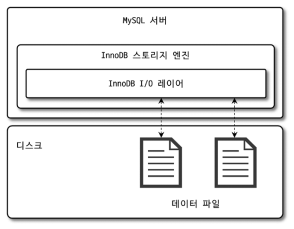
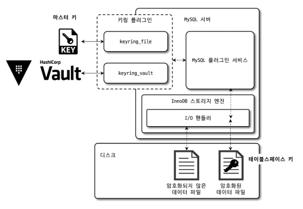
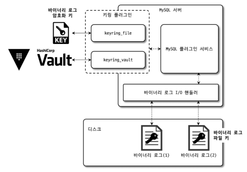

# 07장 데이터 암호화
MySQL 8.0부터는 리두 로그나 언두 로그, 복제를 위한 바이너리 로그 등도 모두 암호화를 지원한다. 
응용 프로그램의 암호화는 주로 칼럼 단위로 수행하며, 데이터베이스의 암호화는 테이블 단위로 수행한다.

## 7.1 MySQL 서버의 데이터 암호화
MySQL의 암호화는 디스크 입출력 지점에서 암, 복호화를 수행한다. 즉, 스토리지 엔진의 I/O 레이어에서만 실행된다.


> MySQL 서버의 디스크 입출력

MySQL 서버와 사용자 입장에서는 암호화 여부를 식별할 필요가 없고, 
암호화되지 않은 테이블과 차이가 없기 때문에 TDE ( Transparent Data Encryption ) 이라고 한다.
또한 "Data At Rest Encryption" 라고도 한다.

### 7.1.1 2단계 키 관리
MySQL 서버의 암호화 키는 키링 (KeyRing) 플러그인으로 관리한다.

MySQL 8.0 에서 지원하는 키링 플러그인
- keyring_file File-Based 플러그인
- keyring_encrypted_file Keyring 플러그인
- keyring_okv KMIP 플러그인
- keyring_aws Amazon Web Services Keyring 플러그인

마스터 키를 관리하는 방법만 다르고 MySQL 서버 내부 작동은 동일하다.


> 키링 플러그인의 2단계 키 관리 방식

MySQL 서버는 마스터 키와 테이블스페이스 키라는 두 가지의 키를 사용한다. 
테이블 스페이스 키는 마스터 키로 암호화 후 MySQL 서버 외부로 노출되지 않기 때문에 프라이빗 키라고도 한다. 
그러나 마스터 키는 디스크 파일 혹은 외부 키 관리 솔루션을 이용하므로 노출될 가능성이 있으므로 주기적으로 변경한다. 

__마스터 키 변경__
```sql
mysql > ALTER INSTANCE ROTATE INNODB MASTER KEY;
```

두 가지 키를 이용하여 암호화 키 변경에 의한 시스템 부하를 피할 수 있다.
테이블 스페이스 키를 변경하면 모든 데이터를 복호화 후 다시 암호화하는 프로세스를 거쳐야 한다. 
그러므로 마스터 키만 변경하고, 테이블 스페이스 키를 다시 암호화하는 방식을 사용한다.

### 7.1.2 암호화와 성능
MySQL 서버는 디스크로부터 암호화된 페이지를 불러올 때에 복호화하므로 
메모리에 한 번 적재되면 암호화되지 않은 테이블과 성능이 동일하다. 
하지만 버퍼 풀에 불러올 때 복호화되고, 암호화된 테이블이 변경될 때 암호화해야 하기 때문에 그 시간 만큼 처리가 지연된다.

MySQL 서버의 암호화 알고리즘인 AES 알고리즘은 데이터 페이지를 암호화한 결과가 평문과 같은 크기이다.
따라서 암호화로 버퍼 풀의 효율이나 메모리 사용 효율이 떨어지지는 않는다.

테이블에 암호화와 압축이 동시에 적용되면 압축을 먼저 실행하고 암호화를 진행한다.
- 암호화된 데이터는 랜덤한 배열을 가지는데 이는 압축률을 떨어트린다.
- 암호화된 데이터는 복호화하여 메모리에 적재되지만, 압축된 데이터는 압축, 압축 해제 모든 상태로 적재될 수 있다. 
암호화를 먼저 할 경우 버퍼 풀의 데이터 또한 매번 암복호화를 수행해야 한다.

### 7.1.3 암호화와 복제
MySQL 서버에서 기본적으로 모든 노드는 각자의 마스터 키를 할당해야 한다. 
따라서 소스 서버와 레플리카 서버는 다른 마스터 키를 갖도록 설정한다. 
마스터 키가 레플리카 서버로 복제되지 않으므로 테이블스페이스 키 또한 복제되지 않는다. 
결국 암호화 전의 값이 동일하더라도 암호화된 데이터는 달라진다. 
마스터키 로테이션 명령을 실행하더라도 마스터 키 자체가 레플리카 서버로 전달되지 않는다.

MySQL 서버의 백업에서 키링 파일을 백업하지 않는 경우, 데이터 복구를 할 수 없다. 
키링 파일을 데이터 파일과 별도로 백업한다면 로테이션 명령으로 마스커 키가 언제 변경했는지도 기억해야 한다. 
따라서 키링 파일은 복구를 감안하고 백업 방식을 선택해야 한다.

## 7.2 keyring_file 플러그인 설치
MySQL 서버의 TDE 암호화 키 관리는 플러그인 방식으로 제공된다. 
커뮤티니 에디션에서 사용가능한 Keyring_file 플러그인은 마스터 키를 디스크 파일에 평문으로 저장한다. 
즉 파일이 노출되면 암호화가 무용지물이 된다.

## 7.3 테이블 암호화
키링 플러그인은 마스터 키를 생성하고 관리만 하기 때문에, 
키링 플러그인 종류와 상관 없이 암호화된 테이블의 생성과 활용 방법은 동일하다.

### 7.3.1 테이블 생성
TDE를 사용하는 테이블의 생성 구문은 일반 테이블 생성 쿼리의 마지막에 `ENCRYPTION='Y'` 옵션만 추가한다.
모든 테이블에 암호화를 적용한다면 `default_table_encryption` 시스템 변수를 ON으로 설정하면 암호화 옵션을 추가히지 않아도 암호화된 테이블로 생성된다.

### 7.3.2 응용 프로그램 암호화와의 비교
응용 프로그램에서 암호화하여 저장하는 경우도 있는데, 이 경우는 MySQL 서버에서 컬럼 값의 암호화 여부를 인지할 수 없다.
따라서 인덱스를 생성하더라도 100% 활용할 수 없다. 
하지만 MySQL 서버의 TDE 암호화는 로그인만하면 평문을 볼 수 있다. 
응용 프로그램 암호화는 MySQL 서버에 로그인하더라도 평문의 내용을 확인할 수 없다.
따라서 서비스의 요건과 성능을 고려하여 둘을 혼합하여 사용할 수 있다.

### 7.3.3 테이블스페이스 이동
테이블을 다른 서버로 복사하거나 특정 테이블의 데이터 파일만 백업했다가 복구하는 경우에 
테이블스페이스 이동 기능이 레코드를 덤프 후 복구하는 방식보다 빠르고 효율적이다.

이 때에 암호화된 테이블의 경우는 목적지 서버와 현재 서버의 마스터 키가 다르다. 
MySQL 서버는 임시 마스터 키를 발급하여 기존 마스터 키로 복호화 후, 임시 마스터 키로 암호화한 후에 테이블스페이스를 이동한다.
그래서 임시 마스터 키가 저장된 파일을 함께 복사해야 복구가 가능하다.

## 7.4 언두 로그 및 리두 로그 암호화
테이블에 암호화를 적용하더라도 메모리에 존재하는 데이터는 평문으로 관리되며, 데이터 파일 이외의 디스크에는 평문으로 저장된다.
따라서 리두 로그, 언두 로그 그리고 바이너리 로그에는 평문으로 저장된다.

리두 로그와 언두 로그는 암호화가 적용되더라도 모든 데이터에 적용할 수 없다. 
따라서 암호화 활성화 시점 이후로 생성되는 로그만 암호화하며, 비활성화 시점 이후의 로그만 암호화를 하지 않는다.
또한, 암호화 키는 이미 암호화된 데이터가 남아 있어서 비활성화 즉시 불필요해지지 않는다.

리두 로그와 언두 로그 데이터는 각각의 프라이빗 키가 발급되고, 이 키를 이용하여 암복호화를 진행한다.
암복호화 이후 마스터 키로 암호화한다.

## 7.5 바이너리 로그 암호화
바이너리 로그와 릴레이 로그는 디스크에 저장된 로그 파일만 암호화한다. 
MySQL 서버의 메모리, 소스 서버와 레플리카 서버간의 네트워크 구간에서 암호화를 하지 않는다. 
네트워크 구간의 암호화는 복제를 위한 계정에 SSL을 적용하면 된다.

### 7.5.1 바이너리 로그 암호화 키 관리
바이너리 로그와 릴레이 로그 파일 암호화에서도 2단계 암호화 키 관리 방식을 사용한다.



바이너리 로그 암호화 키는 테이블 암호화의 마스터 키와 동일한 역할을 한다.

### 7.5.2 바이너리 로그 암호화 키 변경
바이너리 로그 암호화 키는 다음 명령으로 변경 (로테이션) 할 수 있다.
```sql
mysql > ALTER INSTANCE ROTATE BINLOG MASTER KEY;
```

바이너리 로그 암호화 키 변경 후 과정
1. 시퀀스 번호와 새로운 바이너리 로그 키 발급 후 키링 파일에 저장 
2. 바이너리 로그 파일, 릴레이 로그 파일 스위치 (새로운 로그 파일로 로테이션)
3. 새로운 로그 파일을 위한 파일 키 생성, 바이너리 로그 키로 암호화 후 각 로그 파일에 저장
4. 기존 로그 파일의 파일 키를 읽어서 새로운 파일 키로 암호화 후 다시 저장
5. 모든 로그 파일이 새로운 바이너리 로그 키로 암호화됐다면 기존 바이너리 로그 키를 키링 파일에서 제거

### 7.5.3 mysqlbinlog 도구 활용
mysqlbinlog 를 활용하여 바이너리 로그 파일의 내용을 열어볼 수 있다.
암호화된 바이너리 로그 파일을 열어보기 위해서는 MySQL 서버를 통해 가져오는 방법이 유일하다.
바이너리 로그 키는 MySQL 서버만 갖고 있어서 복호화가 불가능하기 때문이다.

mybinlog 명령을 실행할 때 `--read-from-remote-server` 파라미터와 함께 MySQL 서버 접속 정보를 입력한다.

```shell
linux > mysqlbinlog --read-from-remote-server -uroot -p -vvv mysql-bin.000011
```
