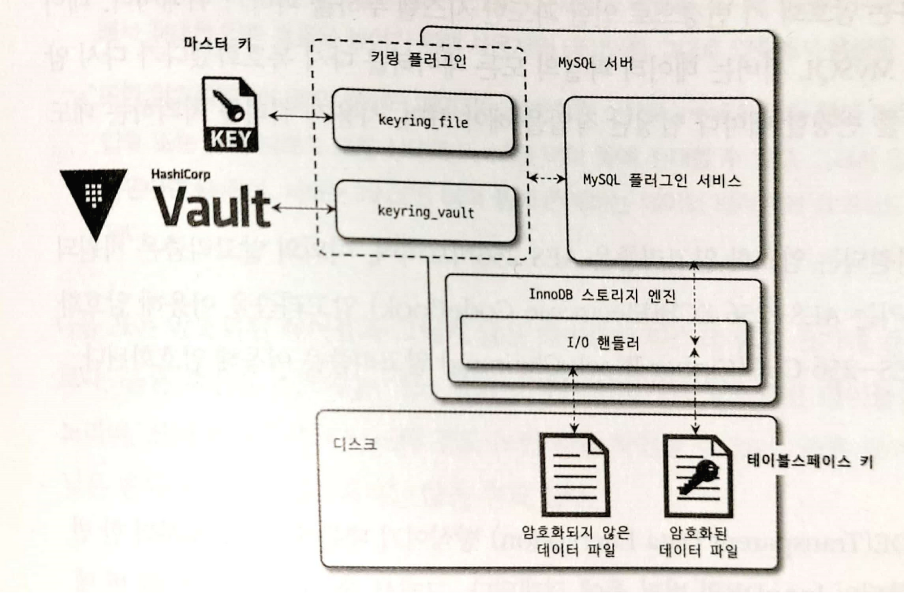

# 7. 데이터 암호화

> 데이터 암호화 여부는 보안 감사에서 필수적으로 언급되는 부분이다. 중요한 정보를 저장하는 서비스는 으용프로그램에서 암호화한 데이터를 데이터베이스 서버에서 암호화하는 이중 암호화 방법을 선택하기도 한다. <br> 이번 장에서는 MYSQL 서버에서의 암호화 방식에 대해 알아본다.

<br>

## 7.1 MYSQL 서버의 데이터 암호화
MYSQL 서버는 데이터베이스 서버와 디스크 사이의 데이터를 읽고 쓰는 지점에서 암호화 또는 복호화를 수행한다. 
즉, MYSQL 서버(InnoDB 스토리지 엔진)의 I/O 레이어에서만 데이터의 암호화와 복호화 과정이 실행되는 것이다.

따라서, MYSQL 서버의 사용자가 쿼리를 처리하는 과정에서는 아무런 차이가 없다.

이러한 암호화 방식을 **TDE**(Transparent Data Encryption) 또는 **Data at Rest Encryption** 이라고 한다.

### 7.1.1 2단계 키 관리
MYSQL 서버의 TDE에서 암호화 키는 **키링(KeyRing) 플러그인**에 의해 관리된다.

MYSQL 8.0 버전에서 지원되는 키링 플러그인은 다음과 같으며, 각각의 플러그인은 마스터 키를 관리하는 방법만 다를 뿐 작동 방식은 모두 동일하다.

(기본은 File-Based 플러그인이며, 엔터프라이즈 에디션을 사용하면 나머지 플러그인으로 변경할 수 있다.)
- `keyring_file` File-Based 플러그인
- `keyring_encrypted_file` Keyring 플러그인
- `keyring_okv` KMIP 플러그인
- `keyring_aws` Amazon Web Services Keyring 플러그인

MYSQL 서버의 키링 플러그인은 2단계(2-Tier) 키 관리 방식을 사용한다.

MYSQL 서버의 데이터 암호화는 **마스터 키**와 **테이블스페이스 키(=프라이빗 키)** 라는 두 가지 종류의 키를 가지고 있다. 

MYSQL 서버는 외부 키 관리 솔루션 또는 디스크의 파일에서 마스터 키를 가져오고, 암호화된 테이블이 생성될 때마다 해당 테이블을 위한 임의의 테이블스페이스 키를 발급한다.

그리고 마스터 키를 이용해 테이블스페이스 키를 암호화해서 각 테이블의 데이터 파일 헤더에 저장한다. 이렇게 생성된 테이블스페이스 키는 테이블이 삭제되지 않는 이상 절대 변경되지 않는다. 

테이블스페이스 키는 서버 외부로 노출되지 않기 때문에 주기적으로 변경하지 않아도 보안상 취약하지 않다. 하지만 마스터 키는 외부의 파일을 이용하기 때문에 노출될 가능성이 있으므로 주기적으로 변경해야 한다.

<br>

### 7.1.2 암호화와 성능
MYSQL 서버의 암호화는 TDE 이기 때문에, 디스크로부터 한 번 읽은 데이터 페이지는 복호화되어 InnoDB의 버퍼 풀에 적재된다. 그래서 데이터 페이지가 한 번 메모리에 적재되면 암호화되지 않은 테이블과 동일한 성능을 보인다.

하지만 쿼리가 InnoDB 버퍼 풀에 존재하지 않는 데이터 페이지를 읽어야 하는 경우에는 복호화 과정을 거치기 때문에 복호화 시간 동안 쿼리 처리가 지연된다. 

그리고 암호화된 테이블이 변경되면 다시 디스크로 동기화될 때 암호화되어야 하기 때문에 디스크에 저장할 때도 처리가 지연된다. 하지만 데이터 페이지 저장 작업은 MYSQL 서버의 백그라운드 스레드가 수행하기 때문에 쿼리가 지연되지는 않는다.

<br>

### 7.1.3 암호화와 복제
MYSQL 서버의 복제에서 레플리카 서버는 소스 서버의 모든 사용자 데이터를 동기화하므로 실제 데이터 파일도 동일하다고 볼 수 있다. 하지만 TDE를 이용한 암호화 사용 시 마스터 키와 테이블스페이스 키는 기본적으로 새로 할당해야 한다.

소스 서버와 레플리카 서버는 서로 각자의 마스터 키와 테이블스페이스 키를 관리하기 때문에 복제 멤버들의 데이터 파일은 암호화되기 전의 값이 동일하더라도 실제 암호화된 데이터가 저장된 데이터 파일의 내용은 완전히 달라진다.

소스 서버의 마스터 키를 변경할 때(마스터 키 로테이션 명령 실행), 
해당 명령이 레플리카 서버로 복제되고 소스 서버와 레플리카 서버가 각각 서로 다른 마스터 키를 새로 발급받는다.

MYSQL 서버를 백업할 때 TDE의 키링 파일을 백업하지 않으면 데이터를 복구할 수 없게 된다.

<br><hr>

## 7.2 keyring_file 플러그인 설치
MYSQL 엔터프라이즈 에디션에서 사용할 수 있는 플러그인은 많지만 MYSQL 커뮤니티 에디션에서는 keyring_file 플러그인만 사용 가능하다.

keyring_file 플러그인은 테이블스페이스 키를 암호화하기 위한 마스터 키를 디스크의 파일로 관리한다.
- 마스터 키는 평문으로 디스크에 저장된다.
- 즉, 마스터 키가 저장된 파일이 외부로 노출되면 보안에 취약해진다.

TDE 플러그인은 다른 플러그인과는 달리, MYSQL 서버가 시작되는 단계에서도 가장 빨리 초기화되어야 한다.
- my.cnf 파일에서 early-plugin-load 시스템 변수에 "keyring_file.so" 라이브러리를 명시
- keyring_file_data 설정에 마스터 키를 저장할 키링 파일의 경로를 명시
- keyring_file_data 설정의 경로는 오직 하나의 MYSQL 서버만 참조해야 함

<br><hr>

## 7.3 테이블 암호화
키링 플러그인은 마스터 키 생성 및 관리까지만 담당하기 때문에, 어떤 플러그인을 쓰더라도 암호화된 테이블을 생성 및 활용하는 방식은 동일하다.

### 7.3.1 테이블 생성
일반적인 테이블 생성 구문과 동일, 마지막에 **ENCRYPTION='Y'** 옵션만 추가로 넣으면 된다.
- 디스크에 기록될 때는 데이터가 자동으로 암호화되어 저장되고, 다시 디스크에서 메모리로 읽어올 때는 복호화된다.

모든 테이블에 대해 암호화를 적용하고자 한다면 default_table_encryption 시스템 변수를 ON으로 설정하면 된다.
- ENCRYPTION 옵션을 별도로 설정하지 않아도 된다.

<br>

### 7.3.2 응용 프로그램 암호화와의 비교
응용 프로그램에서 암호화된 컬럼은 인덱스를 생성하더라도 그 기능을 100% 활용할 수 없다. 
- 저장되는 컬럼 값의 암호화 여부를 MYSQL 서버에서 인지하지 못한다.

MYSQL 서버 암호화와 응용 프로그램 암호화 기능 중 **MYSQL 서버 암호화를 선택 하는 것이 좋다.**
- 서버 암호화 중이라면 모든 데이터를 평문으로 확인할 수 있다.
- 응용 프로그램 암호화 중이라면 평문의 내용을 확인할 수 없다. 즉, 암호화된 데이터를 조회하게 된다.

응용 프로그램 암호화는 서비스의 요건과 성능을 고려해서 선택해야 하며, MYSQL 서버 암호화와 혼합하여 쓴다면 더 안전한 서비스를 구축할 수 있다.

<br>

### 7.3.3 테이블스페이스 이동
테이블을 다른 서버로 복사해야 하는 경우 또는 특정 테이블의 데이터 파일만 백업했다가 복구하는 경우라면 테이블스페이스 이동(Export & Import) 기능이 레코드를 덤프했다가 복구하는 방식보다 효율적이다.

TDE가 적용되어 암호화된 테이블은 소스 서버와 레플리카 서버의 마스터 키가 다르다. 
1. 우선, 암호화된 테이블에 대해 `FLUSH TABLES source_table FOR EXPORT` 명령을 실행하여 임시 마스터 키를 발급한다. 
2. 그리고 암호화된 테이블의 테이블스페이스 키를 기존 마스터 키로 복호화한다.
3. 이후 임시 마스터 키로 테이블스페이스 키를 다시 암호화하여 데이터 파일의 헤더 부분에 저장한다.
4. 그래서 임시 마스터 키가 저장된  \*.cfp 파일을 함께 복사해야 복구가 가능하다.

<br><hr>

## 7.4 언두 로그 및 리두 로그 암호화
테이블 암호화를 적용해도 리두 로그나 언두 로그, 복제를 위한 바이너리 로그는 평문으로 저장된다. 
MYSQL 8.0.16 부터는 `innodb_undo_log_encrypt`, `innodb_redo_log_encrypt` 시스템 변수를 이용해 리두 로그와 언두 로그를 암호화된 상태로 저장할 수 있게 되었다.

MYSQL 서버에서는 리두 로그나 언두 로그 암호화가 활성화되면 그때부터 생성되는 리두 로그와 언두 로그만 암호화하여 저장한다. (그 전까진 평문으로 저장) 암호화를 비활성화 하는 경우도 마찬가지이다. 
그래서 리두 로그와 언두 로그의 암호화를 활성화 -> 비활성화 한다고 해서 즉시 암호화에 사용한 키가 불필요한 것은 아니다.

리두 로그와 언두 로그를 위한 별도의 테이블스페이스 키가 발급되고, 해당 키는 마스터 키로 암호화되어 리두 로그와 언두 로그 파일의 헤더에 저장되면서 이들 데이터가 암호화된다.

<br><hr>

## 7.5 바이너리 로그 암호화
테이블 암호화 활성화 상태에도 바이너리 로그와 릴레이 로그 파일도 평문을 저장한다. 
바이너리 로그는 의도적으로 긴 시간동안 데이터를 보관하는 서비스도 있고 때로는 중분 백업을 위해 바이너리 로그를 보관하기도 한다. 그렇기에 바이너리 로그 암호화는 상황에 따라 중요도가 높아질 수도 있다.

바이너리 로그와 릴레이 로그의 암호화 기능은 디스크에 저장된 로그 파일만 암호화한다. MYSQL 서버의 메모리 내부, 소스 서버 <-> 레플리카 서버 간의 네트워크 구간에서 로그 데이터를 암호화하지 않는다. 만약 암호화를 하고 싶다면 복제를 위한 계정에 SSL을 사용하면 된다.

### 7.5.1 바이너리 로그 암호화 키 관리
바이너리 로그와 릴레이 로그 파일 암호화를 위해서도 MYSQL 서버는 2단계(2-Tier) 암호화 키 방식을 사용한다.

- 바이너리 로그와 릴레이 로그 파일의 데이터는 파일 키로 암호화해서 디스크로 저장한다. 
- 파일 키는 **바이너리 로그 암호화 키**로 암호화해서 각 바이너리 로그와 릴레이 로그 파일의 헤더에 저장된다.
  - 바이너리 로그 암호화 키 : 테이블 암호화의 마스터 키와 동일한 역할
- 파일 키는 바이너리 로그와 릴레이 로그 파일 단위로 자동 생성되어 해당 로그 파일의 데이터 암호화에만 사용된다.

<br>

### 7.5.2 바이너리 로그 암호화 키 변경
```sql
mysql> ALTER INSTANCE ROTATE BINLOG MASTER KEY;
```

1. 증가된 시퀀스 번호와 새로운 바이너리 로그 암호화 키 발급 후 키링 파일에 저장
2. 바이너리 로그 파일, 릴레이 로그 파일 스위치 (새로운 로그 파일로 로테이션)
3. 신규 생성된 바이너리 로그와 릴레이 로그 파일의 암호화를 위한 파일 키 생성 및 파일 키는 바이너리 로그 키(마스터 키)로 암호화 후 각 로그 파일에 저장
4. 기존 바이너리 로그와 릴레이 로그 파일의 파일 키를 읽어서 새로운 파일 키로 암호화 후 다시 저장
5. 모든 로그와 릴레이 로그 파일이 새로운 바이너리 로그 암호화 키로 암호화됐다면 기존 바이너리 로그 암호화 키를 키링 파일에서 제거

<br>

### 7.5.3 mysqlbinlog 도구 활용
트랜잭션의 내용을 추적하거나 백업 복구를 위해 암호화된 바이너리 로그를 복호화할 일이 종종 발생한다. 

바이너리 로그 암호화 키는 그 바이너리 로그나 릴레이 로그 파일을 생성한 MYSQL 서버만 가지고 있어서 외부에서 복호화가 불가능하다. 
mysqlbinlog 도구만으로는 복호화할 방법이 없기에 그나마 MYSQL 서버를 통해 가져오는 방법이 유일하다. 

mysqlbinlog 명령을 실행할 때 ``--read-from-remote-server`` 파라미터와 함께 MYSQL 서버 접속 정보를 입력한다.