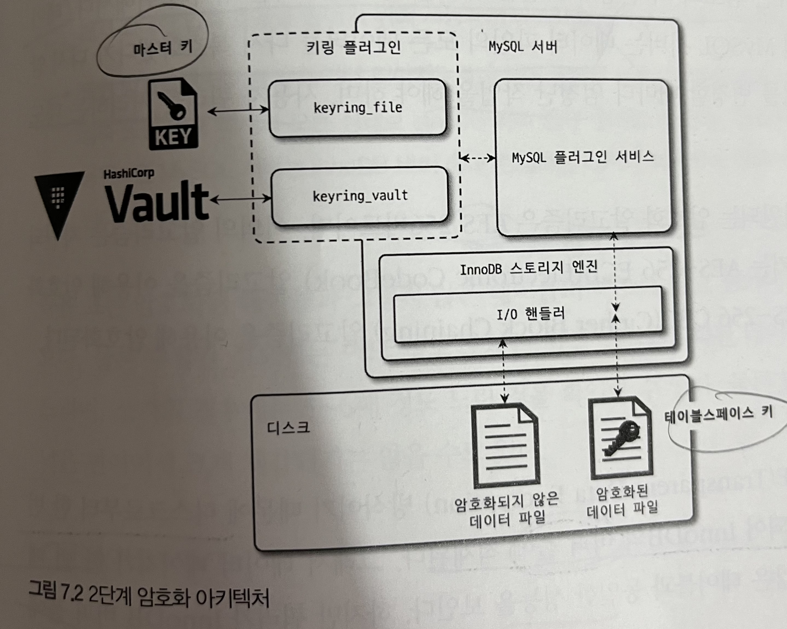

# 07 데이터 암호화

* 데이터 파일 암호화 기능만 제공 -> 리두로그, 언두로그, 복제를 위한 바이너리 로그 등도 암호화 기능 제공
* 응용 프로그램의 암호화 - 컬럼 단위, 데이터베이스 수준 암호화 -> 테이블 단위

## 7.1 MySQL 서버의 데이터 암호화

* 암호화/복호화는 MySQL 서버(InnoDB 스토리지 엔진)의 I/O레이어에서만 실행
* 


* 따라서 MySQL 서버에서 암호화된 테이블은 암호화되지 않은 테이블과 동일한 처리 과정을 거친다. 
* 암호화 기능이 활성화돼있어도 MySQL 내부와 사용자 입장에서는 아무런 차이가 없음

**--> 이러한 암호화 방식을 TDE(Transparent Data Encryption) 이라고 한다**

### 7.1.1 2단계 키 관리

* TDE에서 암호화 키는 키링 플러그인으로 관리됨
* 커뮤니티 에디션에서 사용가능한 플러그인
  * keyring_file File_Based 플러그인
* 플러그인 종류는 다양하지만 마스터 키를 관리하는 방법만 다르고 서버 내부적으로 작동방식은 동일
* 2단계(2-Tier)키 관리 방식



* MySQL 서버의 데이터 암호화가 가지는 두가지 키 종류
  * 마스터 키
  * 테이블스페이스 키(프라이빗 키)
* **MySQL 서버는 마스터 키를 이용해 테이블스페이스키를 암호화해서 각 테이블의 데이터 파일 헤더에 저장한다.**
* 테이블 스페이스키는 절대 변경되지 않고, 마스터 키는 주기적으로 변경해줘야 한다.
  
  * 테이블스페이스키는 서버 외부로 노출되지 않기 때문에 변경하지 않아도 보안상 취약점이 되지 않는 반면, 마스터 키는 외부의 파일을 이용하기 때문에 
* 마스터 키 변경 방법

* ```mysql
  mysql> ALTER INSTANCE ROTATE INNODB MASTER KEY;
  ```

  * 마스터 키를 변경하면
    1. 기존의 마스터 키를 이용해 각 테이블의 테이블스페이스 키를 복호화 한 다음
    2. 새로운 마스터 키로 다시 암호화 한다.
  * 이 과정에서 테이블스페이스 키 자체와 데이터파일의 데이터는 전혀 변경되지 않는다.

* MySQL 서버에서 2안계 암호화 방식 사용하는 이유

  * 만일 테이블스페이스 키가 변경된다면 MySQL 서버는 데이터 파일의 모든 데이터를 복호화했다가 다시 암호화해야 한다. -> 과도한 시스템 부하 발생, 사용자 쿼리 처리하는데 영향 미치게 됨

* TDE에서 지원되는 암호화 알고리즘 : AES 256 비트

### 7.1.2 암호화와 성능

* TDE 방식이기 때문에 디스크로부터 한 번 읽은 데이터 페이지는 복호화되어 InnoDB 버퍼 풀에 적재됨
  * 따라서 데이터 페이지가 한번 메모리에 적재되면 암호화되지 않은 테이블과 동일한 성능 보인다.
* 하지만 쿼리가 InnoDB 버퍼 풀에 존재하지 않는 데이터 페이지를 읽으려 하면 복호화를 해야 하기 때문에 지연 발생
* 테이블 변경하면 디스크에 동기화 할 때도 암호화 시간 추가 발생
  * 하지만 데이터 페이지 저장은 사용자 쿼리를 처리하는 스레드가 아닌 백그라운드 스레드가 수행하기 때문에 실제 사용자 쿼리가 지연되지는 않음
* UPDATE, DELETE 명령 또한 변경하고자 하는 레코드를 InnoDB 버퍼 풀로 읽어와야 하기 때문에 복호화 지연 발생
* AES 암호화 알고리즘은 암호화한 암호문의 크기와 평문의 크기가 동일
* 같은 테이블에 압축, 암호화 동시에 일어나면 압축 -> 암호화 순으로 실행
  * 이유
    * 암호화된 결과문은 아주 랜덤한 바이트 배열을 가지므로 압축률을 상당히 떨어트림
    * 암호화된 테이블의 데이터 페이지는 복호화된 상태로 InnoDB 버퍼 풀에 존재하지만, 압축된 데이터 페이지는 압축, 압축해제 상태 둘 다 버퍼 풀에 존재할 수 있음. 그래서 만일 암호화가 먼저 적용된다면 MySQL 서버는 InnoDB 버퍼 풀에 존재하는 데이터 페이지에 대해서 매번 암호화 작업을 수행해야 함

### 7.1.3 암호화와 복제

* 소스 서버와 레플리카 서버는 서로 다른 마스터 키와 테이블 스페이스 키를 관리함
* 따라서 복제 멤버들의 평문은 소스 서버와 동일할지 몰라도 암호화된 데이터가 저장된 데이터의 내용은 서로 다르다.
* 마스터 키 로테이션을 실행하면 소스서버, 레플리카 서버가 각각 서로 다른 마스터 키를 새로 발급받는다.
*  키링 파일을 데이터 파일과과 별도로 백업한다면 마스터 키가 언제 로테이션 명령으로 변경됐는지까지 기억하고 있어야 함.(보안을 위해 키링 파일은 데이터 파일과 별도로 보관하는것을 권장, but 복구를 감안해서 선택해야 한다.)

## 7.2 keyring_file 플러그인 설치

*  keyring_file 플러그인은 테이블스페이스 키를 암호화하기 위한 마스터 키를 디스크의 파일로 관리
* 마스터 키는 디스크에 저장될 때 평문으로 저장됨,
* 그래서 마스터 키가 저장된 파일이 외부에 노출되면 데이터 암호화는 무용지물이 됨
  * keyring_file 플러그인을 사용하고자 한다면 다음과 같은 방법 권장
    * MySQL 서버가 시작될 때 키링 파일을 다른 서버로부터 다운받아 로컬 디스크에 저장한 후
    * 서버가 시작되면 MySQL 서버가 마스터 키를 메모리에 캐시하기 때문에 로컬 데스크에서 키링 파일을 삭제해도 됨
    * 마스터 키를 로테이션 했으면 로컬의 키링 파일이 최신이 되므로 외부 서버에 복사해 둬야 함
* TDE 플러그인은 MySQL서버가 시작되는 단계에서 가장 빨리 초기화돼야 한다.
* 하나의 리눅스 서버에 MySQL 서버가 2개 이상 실행 중이라면 각 MySQL 서버는 서로 다른 키링 파일을 사용해야 한다.

## 7.3 테이블 암호화

* 키링 플러그인은 마스터 키를 생성하고 관리하는 부분만 담당하기 때문에 어떤 키링 플러그인을 사용하든 암호화된 테이블 생성, 활용 방법은 모두 동일하다.

### 7.3.1 테이블 생성

### 7.3.2 응용 프로그램 암호화와의 비교

* 응용 프로그램에서 암호화해서 MySQL 서버에 저장하면 MySQL 서버는 암호화 여부를 인지하지 못한다.
* 문제 발생 상황
  * 범위로 조건을 검색하고자 할 때
  * 특정 값을 기준으로 정렬하고자 할 때
* 암호화되기 이전의 값을 모르기 때문에 위와 같은 작업을 수행할 수 없음

### 7.3.3 테이블스페이스 이동

* (테이블을 다른 서버로 복사해야 하는 경우 또는 특정 테이블의 데이터 파일만 백업했다가 복구하는 경우 테이블스페이스 이동(Export & Import)기능이 레코드를 덤프했다가 복구하는 방식보다 효율적이고 빠르다.)

* TDE가 적용된 암호화된 테이블의 경우 원본 MySQL 서버와 목적지 MySQL 서버의 마스터 키가 다르기 때문에 추가 작업이 필요하다

* 테이블스페이스 Export 명령

* ```mysql
  mysql > FLUSH TABLES source_table FOR EXPORT;
  ```

* 암호화되지 않은 테이블의 테이블스페이스 복사 과정

  	1. 명령이 실행되면 MySQL 서버는 source_table 의 저장되지 않은 변경사항을 모두 디스크로 기록
  	2.  source_table에 접근할 수 없게 잠금
  	3. 동시에 source_table의 구조를 source_table.cfg 파일로 기록
  	4. source_table.ibd파일과 source_table.cfg파일을 목적지 서버로 복사
  	5. 복사가 완료되면 UNLOCK_TABLES 명령으로 source_table 잠금 해제

* 암호화된 테이블 복사 과정

  	1. MySQL서버는 임시로 사용할 마스터 키를 발급받아 source_table.cfp파일로 기록
  	2. 암호화된 테이블의 테이블스페이스 키를 기존 마스터 키로 복호화
  	3. 임시 마스터 키로 다시 암호화해서 데이터 파일 헤더 부분에 저장
  	4. 데이터 파일과 임시 마스터 키가 저장된 *.cfp파일을 함께 복사

  * *.cfg파일은 단순히 테이블의 구조만 가지고 있기 때문에 파일이 없어져도 복구가 가능하지만 *.cfp파일이 없으면 복구가 불가능해진다.

## 7.4 언두 로그 및 리두 로그 암호화

* 테이블 암호화를 적용해도 디스크로 저장되는 데이터만 암호화되고 메모리에 존재하는 데이터는 평문으로 관리
* 이 평문 데이터가 테이블의 데이터 파일 이외의 디스크 파일로 기록될 때는 여전히 평문으로 저장됨

--> 리두 로그, 언두 로그, 복제를 위한 바이너리 로그는 평문으로 저장됨

* 8.0.16 버전부터 리두 로그와 언두 로그도 암호화할 수 있도록 개선
* 하지만 테이블 하나에 암호화가 적용되면 테이블의 모든 데이터가 암호화되는 것과 같은 방식은 리두 로그와 언두 로그에 적용할 수 없음
* MySQL 서버는 리두 로그나 언두 로그를 평문으로 저장하다가 암호화가 활성화되면 그때부터 생성되는 로그만 암호화해서 저장
* 반대로 리두 로그와 언두 로그가 암호화되는 상태에서 암호화를 비활성화하면 그때부터 저장되는 로그는 다시 평문으로 저장.
* 따라서 리두 로그와 언두 로그 암호화를 비활성화 했다고 해서 암호화에 사용된 키가 바로 불필요해지는 것이 아님
* 특히 언두 로그의 경우, 암호화를 비활성한다고 하더라고 기존의 언두 로그는 여전히 암호화된 상태로 남아있는다.
* 리두 로그, 언두 로그 데이터 모두 각각의 테이블스페이스 키(프라이빗 키) 로 암호화, 테이블스페이스 키는 다시 마스터 키로 암호화되어 리두 로그 파일과 언두 로그 파일의 헤더에 저장

## 7.5 바이너리 로그 암호화

* 테이블 암호화 적용되도 바이너리 로그, 릴레이 로그 역시 평문을 저장
* 바이너리 로그는 언두 로그, 리두 로그와 다르게 상당히 긴 시간 동안 보관하는 서비스도 있고 때로는 증분 백업을 위해 바이너리 로그를 보관하기도 하기 때문에 바이너리 로그 파일의 암호화는 상황에 따라 중요도가 높아질 수 있음
* 바이너리 로그와 릴레이 로그 파일 암호화 기능은 디스크에 저장된 로그 파일에 대한 암호화만 담당, MySQL 서버의 메모리 내부 또는 소스 서버와 레플리카 서버 간의 네트워크 구간에서 로그 데이터를 암호화하지는 않는다.
* 복제 멤버 간의 네트워크 구간에서도 바이너리 로그를 암호화하고자 한다면 MySQL 복제를 위한 계정이 SSL을 사용하도록 설정

### 7.5.1 바이너리 로그 암호화 키 관리

* 바이너리 로그와 릴레이 로그 파일 데이터 암호화 역시 2단계 암호화 키 관리 방식 사용


* 바이너리 로그와 릴레이 로그 파일의 데이터는 파일 키로 암호화해서 디스크로 저장, 파일 키는 "바이너리 로그 암호화 키"(=마스터 키)로 암호화해서 각 파일의 헤더에 저장
* 파일 키는 바이너리 로그와 릴레이 로그 파일 단위로 자동 생성되어 해당 로그 파일의 데이터 암호화에만 사용된다.

### 7.5.2 바이너리 로그 암호화 키 변경

``` mysql
mysql> ALTER INSTANCE ROTATE BINLOG MASTER KEY;
```

* 바이너리 로그 암호화 키가 변경되면 다음의 과정을 거친다
  1. **증가된 시퀀스 번호**화 함께 새로운 **바이너리 로그 암호화 키**(=마스터 키) 발급 후 **키링 파일**에 저장
  2. 바이너리 로그 파일과 릴레이 로그 파일 **스위치**(새로운 로그 파일로 로테이션)
  3. 새로 생성되는 바이너리 로그, 릴레이 로그 파일의 암호화를 위해 **파일 키**(=프라이빗 키)를 생성하고, 파일 키는 바이너리 로그 파일 키(=마스터 키)로 암호화해서 각 로그 파일에 저장
  4. 기존 바이너리 로그와 릴레이 로그 파일의 파일 키를 읽어서 새로운 바이너리 로그 파일 키로 암호화해서 다시 저장(암호화되 않은 로그 파일은 무시)
  5. 모든 바이너리 로그와 릴레이 로그 파일이 새로운 바이너리 로그 암호화 키로 다시 암호화됐다면 기존 바이너리 로그 암호화 키를 키링 **파일에서 제거**

* 4번 과정은 상당한 시간이 걸리는 작업일 수 있어서 이를 위해 키링 파일에서 바이너리 로그 암호화 키는 버전 관리(시퀀스 번호)가 이뤄진다.
* 바이너리 로그와 릴레이 로그 파일들은 최근 순서대로 파일 키를 다시 암호화해서 저장하는 작업 수행

### 6.5.3 mysqlbinlog 도구 활용

* 한 번 바이너리 로그 파일이 암호화되면 바이너리 로그 암호화 키가 없으면 복호화 할 수 없다. 
* 그런데 바이너리 로그 암호화 키는 로그 파일을 생성한 MySQL 서버만 가지고 있어서 복호화가 불가능하다.
*  mysqlbinlog 도구를 이용해 암호화된 바이너리 로그 파일의 내용을 SQL 문장으로 풀어보면 암호화된 바이너리 로그 파일 직접 열어 볼 수 없다는 에러 메시지 출력
* 바이너리 로그 파일의 내용을 볼 수 있는 유일한 방법은 MysQL 서버를 통해 가져오는 방법이 유일하다.


