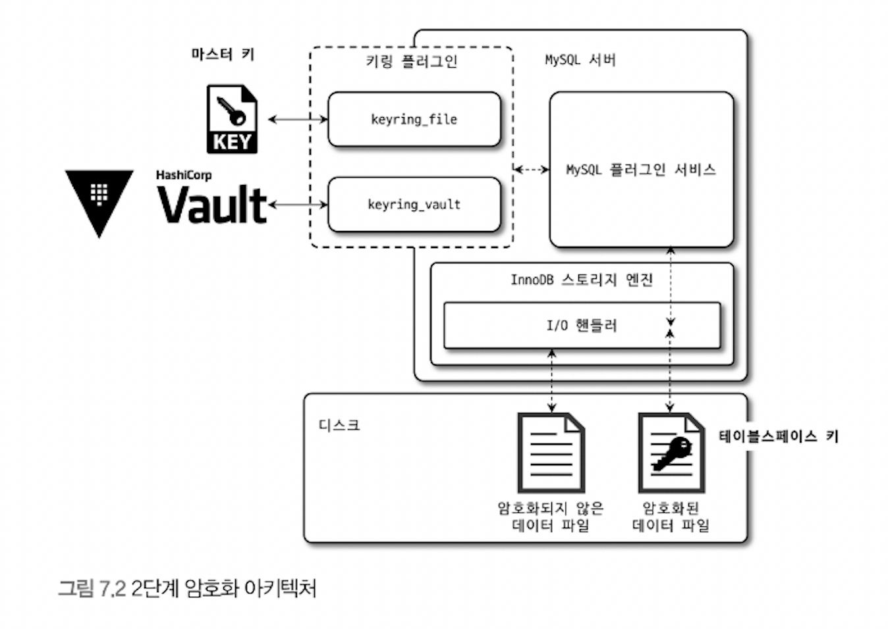
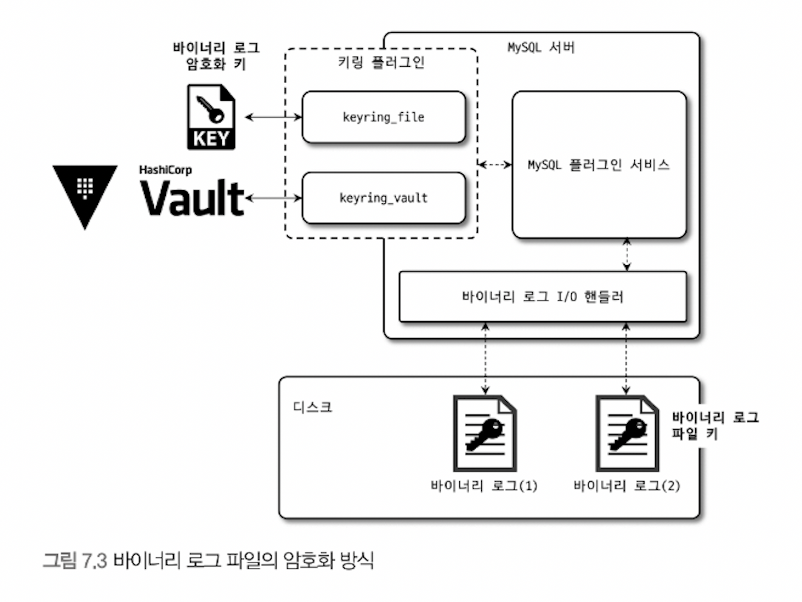

# 7. 데이터 암호화

> [7.1 MySQL 서버의 데이터 암호화](#7.1-MySQL-서버의-데이터-암호화)
>
> - 2단계 키 관리
> - 암호화와 성능
> - 암호화와 복제
>
> [7.2 keyring_file 플러그인 설치](#7.2-keyring-file-플러그인-설치)
>
> [7.3 테이블 암호화](#7.3-테이블-암호화)
>
> - 테이블 생성
> - 응용 프로그램 암호화와의 비교
> - 테이블스페이스 이동
>
> [7.4 언두 로그 및 리두 로그 암호화](#7.4-언두-로그-및-리두-로그-암호화)
>
> [7.5 바이너리 로그 암호화](#7.5-바이너리-로그-암호화)

<br>

5.7 버전부터 지원되기 시작한 암호화 기능은 처음에는 데이터 파일(테이블스페이스)에 대해서만 암호화 기능 제공함. 하지만 8.0부터 데이터 + 리두 로그 + 언두 로그 + 바이너리 로그 등도 모두 암호화 기능 지원

응용프로그램의 암호화는 주로 주요 정보를 가진 컬럼 단위로 암호화 하며, 데이터베이스 수전에서는 테이블 단위로 암호화를 적용함.

<br>

## 7.1 MySQL 서버의 데이터 암호화

- InnoDB 스토리지 엔진의 I/O 레이어에서만 데이터 암복호화 실행

  (디스크 입출력 이외 부분에서 암호화 처리 불필요)

- TDE(Transparent Data Encryption)

  - MySQL 서버에서는 암호화된 테이블도 비암호화 테이블과 동일한 처리 과정을 거침
  - MySQL 내부와 사용자 입장에서는 아무런 차이가 없음
  - a.k.a 'Data at Rest Encryption'
    - Data at Rest는 메모리(In-Process)나 네트워크 전송(In-Transit) 단계가 아닌 디스크에 저장(At Rest)된 단계에서만 암호화된다는 의미로 사용되는 표현

##### 7.1.1 2단계 키 관리

- MySQL 서버의 TDE에서 암호화 키는 키링(KeyRing) 플러그인에 의해 관리

- 8.0에서 지원하는 키링 플러그인

  (커뮤니티 에디션에서는 kerying_file 플러그인만 사용 가능)

  - keyring_file: File-Based 플러그인
  - keyring_encrypted_file: Keyring 플러그인
  - keyring_okv: KMP 플러그인
  - keyring_aws: Amazon Web Services Keyring 플러그인

- 동작 방식

  각 플러그인은 마스터 키를 관리하는 방법만 다를 뿐 MySQL 서버 내부적으로 동작하는 방식은 동일

  

  <br>

- 2단계 키(master key & tablespace key(private key))

  - 마스터 키
    - HashiCorp Vault 외부 키 관리 솔루션(KMS, Key Management Service) 또는 디스크 파일(keyring_file or keyring_encrypted_file 사용 시)에서 마스터 키를 가져옴
    - 외부 파일을 이용하기 때문에 노출 가능성 있어 보안 취약점 될 수도 있음
  - 테이블스페이스 키
    - 암호화된 테이블 생성 시마다 해당 테이블을 위한 임의의 테이블스페이스 키 발급
    - 마스터 키를 이용해 테이블스페이스키 암호화하여 각 테이블 데이터 파일 헤더에 저장
    - 테이블 삭제되지 않는 이상 절대 변경되지 않음
    - 절대 MySQL 서버 외부로 노출되지 않기 때문에 변경하지 않아보 보안 취약점이 되지 않음

- 마스터 키 변경

  ```sql
  ALTER INSTANCE ROTATE INNODB MASTER KEY;
  ```

  - 마스터 키는 외부 파일 이용으로 노출 가능성 있어 주기적으로 변경해야 함

  - 마스터 키 변경 시 기존의 마스터 키 이용해 각 테이블의 테이블스페이스 키를 복호화한 뒤 새로운 마스터 키로 다시 암호화

    (테이블스페이스 키 자체와 데이터 파일 데이터는 변경되지 않음)

- 2단계 키 방식을 사용하는 이유는 암호화 키 변경으로 인한 과도한 시스템 부하 피하기 위함

  - 테이블스페이스 키가 만약 변경된다면 데이터 파일의 모든 데이터를 다시 복호화했다가 다시 암호화 해야 하므로, 사용자 쿼리 처리 성능에도 영향을 미치게되므로 변경 못하게 막음

- TDE에 지원되는 암호화 알고리즘은 AES 256비트, 이외 알고리즘 미지원

  - 테이블스페이스 키는 AES-256 ECB(Electronic CodeBook) 알고리즘 이용해 암호화
  - 실제 데이터 파일은 AES-256 CBC(Cipher Block Chaining) 알고리즘 이용해 암호화

##### 7.1.2 암호화와 성능

- TDE 방식이므로 디스크로부터 한 번 읽은 데이터 페이지는 복호화되어 InnoDB 버퍼 풀에 적재

  (데이터 페이지가 한 번 메모리에 적재되면 암호화되지 않은 테이블과 동일한 성능)

- 성능 지연

  - 쿼리가 InnoDB 버퍼 풀에 존재하지 않는 데이터 페이지를 읽어야 하는 경우 복호화 과정 거치므로 복호화 시간 동안 쿼리 처리 지연됨
  - 암호화된 테이블이 변경되면 다시 디스크로 동기화할 때 암호화해야 하므로 시간 더 걸림
  - 하지만! 데이터 페이지 저장은 사용자 쿼리 처리 스레드가 아닌 백그라운드 스레드가 수행하기 때문에 실제 사용자 쿼리 지연되는 것은 아님

- 메모리 사용 효율

  - 암호화 결과가 평문의 결과와 동일한 크기의 암호문을 반환
    - AES(Advanced Encryption Standard) 암호화 알고리즘은 암호화 하려는 평문의 길이가 짧은 경우 키의 크기에 따라 암호화된 결과의 용량이 더 커질 수도 있지만, 이미 데이터 페이지가 암호화 키보다 훨씬 크기 때문
  - 암호화가 InnoDB 버퍼 풀 효율을 떨어뜨리거나 메모리 사용 효율 낮추지 않음

- 암호화/압축 동시 적용 시 압축 먼저 실행하고 암호화 적용

  - 일반적으로 암호화된 결과문은 아주 랜덤한 바이트의 배열을 가지게 되는데, 이는 압축률을 떨어뜨림. 그래서 최대한 압축 효율을 높이기 위해 사용자 데이터를 그대로 압축해서 용량 최소화한 후 암호화 적용
  - 암호화된 테이블 데이터 페이지는 복호화된 상태로 InnoDB 버퍼 풀에 저장되지만, 압축된 데이터 페이지는 모든 상태(압축 또는 압축 해제)로 InnoDB 버퍼 풀에 존재할 수 있음. 그래서 암호화 먼저 실행되면 InnoDB 버퍼 풀에 존재하는 데이터 페이지에 대해서도 매번 암복호화 작업 해야 하므로 비효율적

- 암호화 테이블은 읽기는 3~5배, 쓰기는 5~6배 정도 느림(밀리초 단위이므로 크게 체감되지 않을 수도 있음)

  - read/write 성능 측정

    ```sql
    SELECT (SUM(SUM_TIMER_READ) / SUM(COUNT_READ)) / 1000000000 as avg_read_latency_mx, (SUM(SUM_TIMER_WRITE) / SUM(COUNT_WRITE)) / 1000000000 as avg_write_latency_ms
    FROM performance_schema.file_summary_by_instance
    WHERE file_name LIKE '%DB_NAME/TABLE_NAME%';
    ```

##### 7.1.3 암호화와 복제

- 소스 / 레플리카 서버 암호화 마스터/테이블스페이스 키, 데이터 모두 다름

  - MySQL 서버 복제에서 레플리카 서버는 소스 서버의 모든 사용자 데이터 동기화하기 때문에 실제 데이터 파일도 동일할 것이라 생각하지만, TDE 이용한 암호화 사용 시 마스터 키와 테이블스페이스 키는 일치하지 않음
  - MySQL 서버에서 기본적으로 모든 노드는 각자의 마스터 키를 할당해야 함
  - 로컬은 다른 키를 가질 수밖에 없지만, 원격 키 관리 솔루션을 사용해도 서로 다른 마스터 키 갖도록 설정해야 함
  - 마스터 키 자체가 레플리카로 복제되지 않기 때문에 테이블스페이스 키 또한 레플리카로 복제되지 않음

- 복제 소스 서버 마스터 키 변경

  ```sql
  ALTER INSTANCE ROTATE INNODB MASTER KEY;
  ```

  - 명령 자체는 레플리카 서버로 복제되지만, 실제 서버의 마스터 키 자체가 레플리카 서버로 전달되는 것은 아님
  - 따라서 로테이션 실행 시 소스 서버와 레플리카 서버가 각각 다른 마스터 키를 새로 발급받음

- 백업 시 TDE의 키링(Key Ring) 파일도 백업 필요

<br>

## 7.2 keyring_file 플러그인 설치

##### keyring_file 플러그인(커뮤니티 에디션에서 사용 가능한 플러그인만 다룸)

- 테이블스페이스 키를 암호화하기 위한 마스터 키글 파일로 관리
- 마스터 키는 평문으로 디스크에 저장
  - 따라서 마스터 키가 저장된 파일이 외부에 노출된다면 데이터 암호화는 무용지물이 됨
  - 이 플러그인을 사용한다면, 키링 파일을 다른 서버로부터 다운로드 후 로컬 디스크에 저장 후 서버 시작. MySQL 서버가 마스터 키를 메모리에 캐시하기 때문에 로컬 키링 파일 삭제해도 상관 없음
  - Percona Server는 HashiCorp Vault를 연동하는 키 관리 플러그인을 오픈소스로 제공하므로, keyring_vault 플러그인도 함께 검토해볼 것

- 다른 플러그인과 달리 TDE 플러그인은 서버 시작 단계에서도 가장 빨리 초기화되어야 함

- 설정

  ```txt
  # my.cnf 파일
  early-plugin-load=keyring_file.so
  keyring_file_data={마스터키 저장 키링 파일 경로}
  ```

  - keyring_file_data는 오직 하나의 MySQL서버만 참조해야 함
  - MySQL 서버가 n개면 서로 다른 키링 파일 사용하도록 설정해야 함

- keyring_file 플러그인 초기화 여부

  ```sql
  SHOW PLUGINS;
  # keyring_file active or inactive
  ```

  - 초기화 되면 플러그인 초기화와 동시에 keyring_file_data 시스템 변수의 경로에 빈 파일 생성
  - 아직 마스터 키 사용된 적 없으므로 내용이 비어 있고, 데이터 암호화 기능 사용하는 테이블 생성하거나 마스터 로테이션을 실행하면 키링 파일의 마스터 키 초기화

<br>

## 7.3 테이블 암호화

키링 플러그인은 마스터 키를 생성하고 관리하는 부분까지만 담당하므로, 모든 플러그인은 암호화된 테이블 생성 및 활용 방법은 모두 동일

##### 7.3.1 테이블 생성

```sql
CREATE TABLE tab_encrypted {
  id INT,
  data VARCHAR(100),
  PRIMARY KEY(id)
} ENCRYPTION='Y';
```

- 마지막에 ENCRYPTION='Y' 옵션을 넣으면 됨

- 암호화된 테이블만 검색

  ```sql
  SELECT table_schema, table_name, create_options
  FROM information_schema.tables
  WHERE table_name = 'tab_encrypted';
  ```

- 테이블 생성 시 암호화 자동 적용

  ```txt
  default_table_encryption=ON
  ```

##### 7.3.2 응용 프로그램 암호화와의 비교

- 응용 프로그램에서 직접 암호화하면 MySQL 서버는 인지하지 못함
- 단점
  - 인덱스 기능도 100% 활용하지 못함
  - 암호화되기 전의 값을 기준으로 정렬 못함
- 목적과 용도의 차이
  - MySQL TDE 암호화는 서버 로그인만 가능하면 평문 확인 가능
  - 응용 프로그램 암호화는 평문 내용 확인 불가능
    - 더 안전한 서비스가 필요할 때 활용

##### 7.3.3 테이블스페이스 이동

- 테이블 스페이스 이동(Export & Import) 기능이 레코드 덤프했다가 복구하는 방식보다 훨씬 효율적이고 빠름

- TDE 적용 암호화 테이블은 원본 MySQL 서버와 목적지 MySQL 서버의 암호화 키(마스터 키)가 다르므로 더 신경써야 함

- export

  ```sql
  FLUSH TABLES source_table FOR EXPORT;
  ```

  - source_table 저장되지 않은 변경 사항을 모두 디스크로 기록
  - source_table 잠금
  - `source_table.cfg` 파일로 구조 기록
    - 임시 사용 마스터 키 발급하여 기록
    - 암호화 테이블스페이스 키를 기존 마스터 키로 복호화
    - 임시 발급 마스터 키로 다시 암호화
    - 데이터 파일 헤더 부분에 저장
  - `source_table.ibd` 데이터 파일 기록
  - 위 두 파일을 모두 복사
  - 복사 완료 시 UNLOCK TABLES

<br>

## 7.4 언두 로그 및 리두 로그 암호화

- 8.0.16 버전부터 리두 로그/ 언두 로그 암호화 가능

  ```txt
  innodb_undo_log_encrypt=OFF|ON
  innodb_redo_log_encrypt=OFF|ON
  ```

- 테이블 암호화는 암호화 적용되면 해당 테이블 모든 데이터 암호화되지만, 언두/리두 로그는 적용 시점에 따라 다름

- 리두/언두 로그 모두 각각의 테이블스페이스 키로 암호화, 테이블스페이스 키는 다시 마스터 키로 암호화

  - 실제 테이블의 테이블스페이스 키가 아닌, 언두/리두 로그만의 private key

- 암호화 여부 확인

  ```sql
  SHOW GLOBAL VARIABLES LIKE 'innodb_redo_log_encrypt';
  ```

<br>

## 7.5 바이너리 로그 암호화

- 바이너리 로그와 릴레이 로그 파일도 리두/언두 로그처럼 평문 저장

- 일반적으로 언두/리두는 짧은 시간 데이터 가지기 때문에 보안에 크게 민감하지 않지만, 바이너리 로그는 때로는 증분 백업(Incremental Backup)을 위해 바이너리 로그를 보관하여 중요도가 높아질 수도 있음

- 바이너리/릴레이 로그 파일 암호화 기능은 디스크 저장된 로그 파일에 대한 암호화만 담당
  - 복제 멤버 간의 네트워크 구간에서도 바이너리 로그 암호화하고 싶다면 복제 계정이 SSL을 사용하도록 설정

##### 7.5.1 바이너리 로그 암호화 키 관리



<br>

- 파일 키(File Key)로 암호화해서 디스크 저장
- 파일 키는 '바이너리 로그 암호화 키'로 암호화해서 각 바이너리/릴레이 로그 파일 헤더에 저장

##### 7.5.2 바이너리 로그 암호화 키 변경

```sql
ALTER INSTANCE ROTATE BINLOG MASTER KEY;
```

- 바이너리 로그 암호화 키 변경 과정
  - 증가된 시퀀스 번호와 함께 새로운 바이너리 로그 암호화 키 발급 후 키링 파일에 저장
  - 바이너리/릴레이 로그 파일 스위치(새로운 로그 파일로 로테이션)
  - 새로 생성되는 바이너리/릴레이 로그 파일 암호화를 위해 파일 키 생성, 파일 키는 바이너리 로그 암호화 키(마스터 키)로 암호화해서 각 로그 파일에 저장
  - 기존 바이너리/릴레이 로그 파일의 파일 키를 읽어서 새로운 바이너리 로그 파일 키로 암호화하여 다시 저장(암호화되지 않은 로그 파일은 무시)
  - 모든 바이너리/릴레이 로그 파일이 새로운 바이너리 로그 암호화 키로 다시 암호화됐다면 기존 바이너리 로그 암호화 키를 키링 파일에서 제거

- 기존 로그 파일의 파일 키를 읽어서 새로운 암호화 키로 암호화해 다시 저장하는 과정이 가장 오래 걸림

  - 키링 파일에서 '바이너리 로그 암호화 키'는 내부적으로 버전(시퀀스 번호) 관리가 이뤄짐
  - master key 변경 명령을 연속 2번 실행하면, 키링 파일에는 순차적인 시퀀스 번호 가지는 3개 바이너리 로그 암호화 키가 존재
  - 로그 파일들을 최근 순서대로 파일 키를 다시 암호화해서 저장하는 작업 수행

- 바이너리 로그 파일 암호화 여부 확인

  ```sql
  SHOW BINARY LOGS;
  # encrypted=NO|YES
  ```

##### 7.5.3 mysqlbinlog 도구 활용

- 트랜잭션 내용 추적 또는 백업 복구를 위해 암호화된 바이너리 로그를 평문으로 복구화할 때 사용

- 바이너리 로그 암호화 키는 MySQL 서버만 가지고 있기 때문에 복구가 불가능하여 mysqlbinlog 도구 이용하여 암호화 바이너리 로그 파일 열면, 직접 열 수 없다는 에러 메시지 출력

- 그나마 열 수 있는 방법은 MySQL 서버를 통해 가져오는 방법이 유일

  - mysqlbinlog 도구가 MySQL 서버에 접속해서 바이너리 로그를 가져오는 방법
  - mysqlbinlog 도구는 서버에 요청만 할 뿐, 실제 읽는 것은 MySQL 서버

- 명령

  암호화된 mysql-bin.000011 바이너리 로그 파일 읽기

  ```bash
  mysqlbinlog --read-from-remote-server -uroot -p -vvv mysql-bin.000011
  ```


