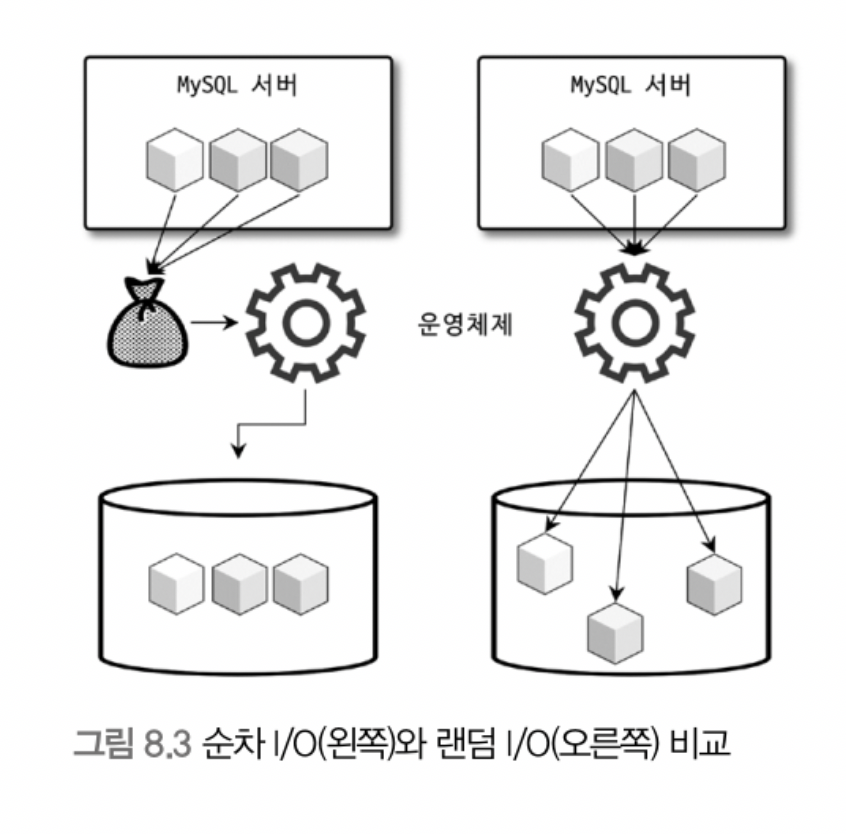

# 8. 인덱스

> [8.1 디스크 읽기 방식](#8.1-디스크-읽기-방식)
>
> - HDD & SDD
> - 랜덤 I/O, 순차 I/O
>
> [8.2 인덱스란?](#8.2-인덱스란?)
>
> [8.3 B-Tree 인덱스](#8.3-B-Tree-인덱스)
>
> - 구조 및 특성
>
> - B-Tree 인덱스 키 추가 및 삭제
>
> - B-Tree 인덱스 사용에 영향을 미치는 요소
>
>   (컬럼의 크기, 유니크한 인덱스 키 값의 개수, 레코드의 건수)

<br>

## 8.1 디스크 읽기 방식

컴퓨터 CPU나 메모리처럼 전기적 특성을 띤 장치의 성능은 짧은 시간 매우 빠른 속도로 발전했지만, 디스크 같은 기계식 장치의 성능은 제한적으로 발전

최근 자기 디스크 원판에 의존하는 하드 디스크보다 SSD 드라이브가 많이 활용되지만, 여전히 저장 매체는 가장 느린 부분

데이터베이스 성능 튜닝은 어떻게 디스크 I/O를 줄이느냐가 관건일 때가 상당히 많음

<br>

##### 8.1.1 HDD & SDD

HDD(Hard Disk Drive)

- 기계식 하드 디스크 드라이브

SDD(Solid State Drive)

- 전자식 저장 매체
- 기존 하드 디스크 드라이브와 같은 인터페이스(SATA or SAS) 지원하므로 내장 디스크나 DAS(Direct-Attached Storage) 또는 SAN(Storage Area Network)에 그대로 사용할 수 있음
- 기존 HDD에서 데이터 저장용 플래터(원판) 제거하고, 플래시 메모리 장착
  - 디스크 원판을 기계적으로 회전시킬 필요 없이 아주 빨리 데이터 read/write
  - 플래시 메모리는 전원이 공급되지 않아도 데이터가 삭제되지 않음
  - 컴퓨터의 메모리 보다는 느리지만 HDD보다 훨씬 빠름

##### 8.1.2 랜덤 I/O, 순차 I/O

- 순차 I/O는 HDD, SDD 성능 차이 비슷

- 랜덤 I/O는 SDD가 훨씬 빠름

  - 데이터베이스는 랜덤 I/O를 통해 작은 데이터 읽고 쓰는 작업이 대부분이므로 DBMS용 스토리지에 최적
  - 일반적인 웹 서비스(OLTP) 환경 데이터베이스에서는 SDD가 HDD 보다 훨씬 빠름

- 예시

  

  <br>

  - 순차 I/O는 3개의 페이지(3 x 16KB)를 디스크 기록하기 위해 1번 시스템 콜 요청

    랜덤 I/O는 3개의 페이지를 디스크에 기록하기 위해 3번 시스템 콜 요청

    즉, 디스크 기록 위치 찾기 위해 각각 디스크 헤드를 한 번, 세 번 움직임

  - 디스크에 데이터 read/write 걸리는 시간은 디스크 헤더를 움직여서 읽고 쓸 위치로 옮기는 단계에서 결정

    즉, 디스크 성능은 디스크 헤더의 위치 이동 없이 얼마나 많은 데이터를 한 번에 기록하느냐에 의해 결정된다고 볼 수 있음

  - 여러 번 read/write 요청하는 랜덤 I/O 작업이 작업 부하가 훨씬 큼

    - DB 작업은 대부분 작은 데이터를 빈번히 read/write 하므로 MySQL 서버에는 그룹 커밋이나 바이너리 로그 버퍼 또는 InnoDB 로그 버퍼 등의 기능이 내장됨

  - 디스크 원판이 없는 SDD는 랜덤 I/O와 순차 I/O 차이가 없을 것으로 예상되지만, 실제로는 SSD에서도 랜덤 I/O의 전체 throughput이 떨어짐

- 순차 I/O는 항상 효율적인가?

  - 랜덤 I/O, 순차 I/O 모두 파일에 쓰기를 실행하면 반드시 동기화(sync 또는 flush) 작업 필요
  - 순차 I/O도 파일 동기화 작업이 빈번히 일어나면 랜덤 I/O처럼 비효율적으로 처리될 때가 많음
  - 기업용 DB 서버에는 캐시 메모리가 장착된 RAID(Redundant Array of Independent Disks) 컨트롤러가 일반적으로 사용하는데, 이 캐시 메모리 성능을 튜닝 시 무시하면 안됨

- 일반적으로 쿼리 튜닝하는 것은 랜덤 I/O 줄여주는 것이 목적. 랜덤 I/O를 줄인다는 것은 쿼리 처리에 꼭 필요한 데이터만 읽도록 쿼리를 개선하는 것을 의미

<br>

## 8.2 인덱스란?

##### 개념

- 컬럼(또는 컬럼들)의 값과 해당 레코드가 저장된 주소를 키와 값의 쌍(key-value pair)으로 삼아 인덱스를 만듦

- 인덱스도 내용이 많아지면 검색 시 시간이 오래걸리므로 컬럼의 값을 주어진 순서로 미리 정렬해서 보관

  - 인덱스: SortedList 자료구조처럼 저장되는 값을 항상 정렬된 상태로 유지
  - 데이터 파일: ArrayList처럼 정렬없이 저장 순서대로 유지

- 장/단점

  - 이미 정렬된 인덱스를 가지므로 select 처리 빠름

  - 인덱스가 많으면 insert, update, delete 처리가 느려짐

- 결국, DBMS 인덱스는 데이터 저장(insert, update, delete) 성능 희생하여 데이터 읽기 속도를 높이는 기능
- 인덱스를 추가할지는 저장 속도를 어디까지 희생할 수 있을지, 읽기 속도를 얼마나 더 빠르게 만들어야 하는지에 따라 결정됨

##### 역할별 분류

- Primary Key Index
  - PK 컬럼의 값으로 만들어진 인덱스
  - 컬럼(또는 컬럼의 조합)은 테이블에서 해당 레코드를 식별하는 기준값이 되므로 식별자라고도 부름
- Secondary Index
  - PK 인덱스 제외한 나머지 모든 인덱스
  - unique 인덱스는 PK와 성격이 비슷하고 대체해서 사용할 수 있어 '대체키'라고도 함

##### 데이터 저장방식(알고리즘)별 분류

- B-Tree Index
  - 가장 일반적으로 사용되는 인덱스 알고리즘
  - 컬럼 값 변형하지 않고 원래의 값을 이용해 인덱싱하는 알고리즘
  - MySQL에서 위치 기반 검색 지원을 위한 R-Tree도 있는데, B-Tree의 응용 알고리즘임
- Hash Index
  - 컬럼의 값으로 해시값을 계산해 인덱싱하는 알고리즘
  - 매우 빠른 검색을 지원
  - 값 변형해서 인덱싱하므로 전방(prefix) 일치와 같이 값의 일부만 검색하거나 범위 검색 시에는 사용 불가능
  - 주로 메모리 기반의 데이터베이스에서 많이 사용
- 이외에 Fractal-Tree, Merge-Tree 알고리즘 사용하는 DBMS도 있음

##### 기타 분류

- 데이터 중복 허용 여부 분류
  - unique / non-unique(옵티마이저에게 매우 중요)
- 기능별 분류
  - 전문 검색용 인덱스, 공간 검색용 인덱스 등

<br>

## 8.3 B-Tree 인덱스

### 8.3.1 구조 및 특성


<br>

- Root Node - Branch Node - Leaf Node

  - leaf node에는 항상 실제 데이터 레코드를 찾아가기 위한 주소값 가짐

- 인덱스의 키 값은 정렬되어 있지만, 데이터 파일의 레코드는 임의의 순서로 저장됨

  - 삭제/변경되지 않고 insert만 수행된다면 정렬되겠지만, 삭제 후 insert 하면 삭제된 공간 재활용하도록 DBMS가 설계되므로 순서 보장하진 않음

  - 대부분 RDBMS 데이터 파일에서 레코드는 임의의 순서로 저장. 하지만 InnoDB 테이블에서 레코드는 클러스터되어 디스크에 저장되므로 기본적으로 PK 순서로 정렬되어 저장됨

    오라클의 IOT(Index organized table)나 MS-SQL 클러스터 테이블과 같은 구조

    다른 DBMS에서 클러스터링 기능은 선택이지만, InnoDB에서는 default clustering(비슷한 값 최대한 모아서 저장하는 방식)

- MyISAM, InnoDB에서의 리프 노드와 데이터 파일의 관계

  - 인덱스는 테이블의 키 컬럼만 가지므로, 나머지 컬럼 읽으려면 데이터 파일에서 해당 레코드를 찾아야함

  

  <br>

  - MyISAM 테이블은 PK 클러스터링 없이 데이터 파일이 heap 공간처럼 활용
  - 레코드 주소는 insert 순번이거나 데이터 파일 내의 위치(offset)
  - secondary index가 물리적 주소를 가짐

  

  <br>

  - InnoDB 에서는 PK가 ROWID 역할을 함(실제 레코드 주소를 가리키는 물리적 주소가 아니라, PK라는 논리적 주소값을 가짐)
  - secondary index의 경우 pk index 한 번 더 검색 후 레코드를 읽음
    - pk index를 거치므로 성능이 떨어질 것처럼 보이지만 각기 장단점이 있음(8.8 '클러스터링 인덱스' 내용 참조)

<br>

### 8.3.2 B-Tree 인덱스 키 추가 및 삭제

테이블 레코드 저장하거나 변경하는 경우 인덱스 키 추가나 삭제 작업 발생

##### 인덱스 키 추가

- MyISAM, Memory 스토리지는 인덱스 키 추가되면 즉시 인덱스에 저장, InnoDB 스토리지는 지연 처리 가능(change buffer)
  - change buffer 메모리는 인덱스 페이지를 디스크로부터 읽어와서 업데이트해야 할 경우, 이를 즉시 실행시키지 않고 임시로 저장해두고 사용자에게 결과를 반환
  - PK or Unique Index의 경우 중복 체크가 필요하므로 즉시 B-Tree에 추가 또는 삭제

- 작동방식

  > 상대적으로 쓰기 작업(새로운 키 추가 작업)에 비용이 큼

  - 저장될 키 값을 이용해 B-Tree에 상의 적절한 위치를 검색해야 함

  - 저장될 위치가 결정되면 레코드의 키 값과 대상 레코드의 주소 정보를 B-Tree 리프 노드에 저장

  - 리프 노드가 꽉 차서 더 저장할 수 없을 때 리프 노드가 분리(split)되어야 하는데, 이는 상위 브랜치 노드까지 처리의 범위가 넓어짐

- 인덱스 추가로 인한 insert/update 영향

  - 테이블의 컬럼 수, 컬럼의 크기, 인덱스 컬럼의 특성 확인 필요
  - 대략적인 계산 방법
    - 레코드 추가 작업 비용 '1'로 가정
    - 인덱스 키 추가 작업 비용 '1.5' 정도로 예측
  - 예시
    - 인덱스가 없을 때는 작업 비용 1, 3개인 경우에는 5.5 정도의 비용(1.5 * 3 + 1)으로 예측
  - 이 비용의 대부분은 메모리와 CPU 처리 시간이 아닌 디스크로부터 인덱스 페이지 read/write 시간

<br>

##### 인덱스 키 삭제

- 값이 저장된 B-Tree 리프 노드를 찾아 삭제 마크만 하면 작업 완료
- 삭제 마킹된 인덱스 키 공간은 방치하거나 재활용 가능
- 마킹 작업 또한 디스크 쓰기가 필요하므로 I/O 작업이 일어남
  - 5.5 이상에서는 버퍼링 되어 지연 처리(change buffer)

<br>

##### 인덱스 키 변경

- 키 값 '삭제 후 다시 새로운 키 값을 '추가'하는 형태로 처리

<br>

##### 인덱스 키 검색

- insert, update, delete 작업 시 인덱스 관리 추가 비용 감당하면서 인덱스를 구축하는 이유는 빠른 검색을 위함
- 트리 탐색: 루트 - 브랜치 - 리프 노드를 거쳐 비교 작업 수행
- 사용
  - select 시 뿐만 아니라 update, delete 처리를 위해 레코드를 먼저 검색해야 할 경우에도 사용
  - 100% 일치, 앞부분(Left-most part) 일치 여부, 부등호 비교 조건
  - 뒷부분만 검색하는 용도로는 사용 불가능
- **인덱스의 키 값에 변형이 가해진 후 비교되는 경우에는 절대 B-Tree의 빠른 검색 기능을 사용할 수 없음**
  - 이미 변형된 값은 B-Tree 인덱스에 존재하는 값이 아님
  - 함수나 연산을 수행한 결과로 정렬하거나 검색하는 장점은 B-Tree 인덱스 사용 불가

<br>

##### 기타

- record lock, next key lock, gap lock은 검색을 수행한 인덱스를 잠근 후 테이블 레코드를 잠그는 방식으로 구현
- update, delete 실행 시 테이블에 적절히 사용할 수 있는 인덱스 없는 경우 불필요하게 많은 레코드를 잠금(심지어 테이블 락 발생 가능)

<br>

### 8.3.3 B-Tree 인덱스 사용에 영향을 미치는 요소

> 컬럼의 크기, 유니크한 인덱스 키 값의 개수, 레코드의 건수에 따라 검색/변경 작업 성능에 영향

##### 인덱스 키 값(컬럼)의 크기

- Page or Block

  - 디스크에 데이터 저장하는 기본 단위
  - 모든 읽기 쓰기 작업의 최소 작업 단위
  - 버퍼 풀에서 데이터를 버퍼링하는 기본 단위

- 인덱스도 페이지 단위로 관리

- B-Tree 자식 노드 개수 결정 요인

  - 인덱스 페이지 크기와 키 값의 크기에 따라 결정

  - 시스템 변수

    ```sql
    innodb_page_size=16  #5.7부터 4KB ~ 64KB 값 선택 가능, default 16KB
    ```

- 예시

  

  <br>

  - 자식노드 주소

    - 여러가지 복합적인 정보가 담긴 영역

    - 페이지 종류별로 대략 6~12바이트까지 다양한 크기의 값을 가질 수 있음

      (편의상 평균적으로 12바이트로 구성된다고 가정)

  - 저장 가능 키 갯수(자식 노드 585개를 가질 수 있는 B-Tree)

    - 585개: 16 * 1024 / (16+12)

  - 키 값의 크기가 커질수록 페이지당 저장 가능한 키 갯수는 줄어듦

    - select 쿼리가 1,000개를 읽어야 한다면 최소 2번 이상 디스크로 읽어야 함(페이지 2개는 필요하므로)
    - 디스크로부터 읽어야 하는 횟수가 늘어나면 그만큼 성능에 영향

  - 전체적인 인덱스의 크기가 커지면, 키 캐시 영역은 제한적이기 때문에 메모리 효율 떨어짐

<br>

##### B-Tree 깊이

- 값을 검색할 때 몇 번이나 랜덤하게 디스크를 읽어야 하는지와 직결되는 문제

- 직접 제어할 방법은 없음
- 예시(그림 8-7)
  - B-Tree 깊이가 3인 경우 최대 2억(585 ** 3)개 키 저장 가능, 키 값이 32바이트로 늘어나면 5천만(372 ** 3)으로 줄어듦
  - 같은 레코드 건수라 하더라도 B-Tree 깊이가 깊어져 디스크 읽기가 더 많이 필요함
- 일반적으로 대용량 데이터베이스더라도 B-Tree depth가 5단계 이상 깊어지는 경우는 흔치 않음

<br>

##### 선택도(기수성)

- 모든 인덱스 키 값 가운데 유니크한 값의 수

- 인덱스에서 선택도(Selectivity) or 기수성(Cardinality) 거의 같은 의미로 사용

- 전체 인덱스 키 값은 100개인데, 유니크한 값의 수는 10개라면 선택도는 '10'

  - 선택도가 높을수록 검색 대상이 줄어들어 빠르게 처리됨

    (선택도가 좋지 않더라도 sorting, grouping 작업을 위해 인덱스를 만드는 것이 나은 경우도 있음. 인덱스가 검색에만 사용되는 것은 아니므로 용도 고려해 인덱스 설계 필요)

- 예시

  > 레코드 건수 10,000건 / country, city 컬럼 중 country 컬럼으로만 인덱스 생성
  >
  > 인덱스의 통계 정보(유니크한 값의 개수)가 관리되므로 city 컬럼의 기수성은 작업 범위에 영향을 미치지 못함

  - case A: country 컬럼 unique value 10개(선택도 10)

    - 평균 1,000건 조회
    - 조회 결과가 1건이었다면 인덱스에 부적합

  - case B: country 컬럼 unique value 1,000개(선택도 100)

    - 평균 10건 조회

    - 조회 결과가 1건이었다면 1건 조회를 위해 10건을 읽었으므로 적합

      (9건 정도의 낭비는 무시 가능)

##### 읽어야 하는 레코드 건수

- 인덱스를 통하는 것은 높은 비용이 드는 작업
  - 예를 들어 100만건 저장 테이블에서 50만건 읽어야 할 때 모두 읽는 것이 좋을지, 인덱스를 통해 50만건만 읽는 것이 효율적일지 판단해야 함
  - 옵티마이저는 인덱스를 이용하지 않고 full scan할 것
- 인덱스를 이용한 읽기의 손익 분기점
  - 일반적인 DMBS의 옵티마이저에서 인덱스를 통해 레코드 1건을 읽는 것이 테이블에서 직접 레코드 1건을 읽는 것보다 4~5배 정도 비용이 더 드는 작업으로 예측(10.1.3 코스트 모델 참조)
  - 인덱스를 통해 읽어야할 레코드 건수(옵티마이저가 판단한 예상 건수)가 전체 20~25% 넘어가면 인덱스 이용하지 않는 것이 더 효율적

