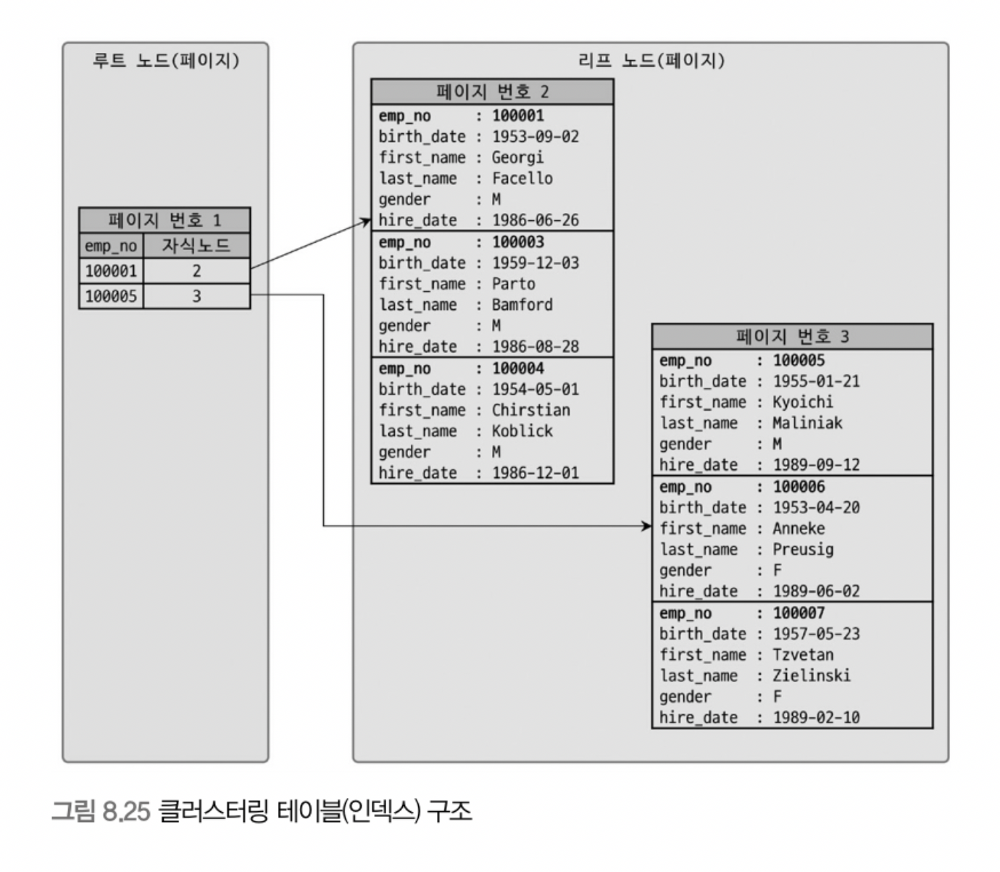

# 8. 인덱스(the others)

> [8.5 전문 검색 인덱스](#8.5-전문-검색-인덱스)
>
> - 어근 분석(stemming)
> - n-gram
>
> [8.6 함수 기반 인덱스](#8.6-함수-기반-인덱스)
>
> - 가상 컬럼을 이용한 인덱스
> - 함수를 이용한 인덱스
>
> [8.7 멀티 밸류 인덱스](#8.7-멀티-밸류-인덱스)
>
> [8.8 클러스터링 인덱스](#8.8-클러스터링-인덱스)
>
> [8.9 유니크 인덱스](#8.9-유니크-인덱스)
>
> [8.10 외래키](#8.10-외래키)

<br>

## 8.5 전문 검색 인덱스

> B/R-Tree 인덱스
>
> - 일반적으로 크지 않은 데이터 또는 이미 키워드화한 작은 값에 대한 인덱싱 알고리즘
> - B-Tree 인덱스는 실제 컬럼 값이 1MB 더라도 전체를 인덱스 키로 사용하는 것이 아니라, 3,072byte(InnoDB)까지만 잘라서 인덱스 키로 사용
> - 전체 또는 좌측 일치와 같은 검색만 가능
>
> 전문 검색 인덱스(Full Text Index)
>
> - 문서 전체에 대한 분석과 검색을 위한 인덱싱 알고리즘

<br>

### 8.5.1 인덱스 알고리즘

- 전문 검색에서는 문서 본문의 내용에서 사용자가 검색하게 될 키워드를 분석하고, 빠른 검색용으로 사용할 수 있게 해당 키워드로 인덱스 구축
- 키워드 분석 및 인덱스 구축 방법
  - 단어의 어근 분석
  - n-gram 분석 알고리즘

##### 8.5.1.1 어근 분석 알고리즘

전문 검색 인덱스는 2가지 중요한 과정을 거쳐 색인 작업 수행

- 불용어(Stop Word) 처리

  - 검색에서 가치 없는 단어 필터링하여 제거
  - 불용어 갯수가 많지 않으므로 알고리즘 구현한 코드에 상수로 정의해 사용하는 경우 많음
  - 유연성을 위해 불용어 자체를 데이터베이스화해서 사용자가 추가/삭제하도록 구현하는 경우도 있음
  - 현재는 불용어가 소스코드로 정의되어 있지만, 이를 무시하고 사용자가 별도로 불용어 정의할 수 있는 기능 제공

- 어근 분석(Stemming)

  - 검색어로 선정된 단어의 뿌리인 원형 찾는 작업

  - MeCab(오픈소스 형태소 분석 라이브러리)을 플러그인 형태로 사용하도록 지원

    - 단어 사전 필요

    - 문장 해체하여 각 단어 품사 식별할 수 있는 문장 구조 인식 필요

      (실제 언어 샘플을 이용해 언어 학습하는 과정 수행하는데, 상당한 시간이 필요한 작업)

  - 한글이나 일본어는 영어와 같이 단어 변형 자체는 거의 없으므로, 어근 분석 보다는 문장의 형태소 분석해서 명사와 조사 구분하는 기능이 더 중요한 편임

    (서구권 언어 형태소 분석기: MongoDB에서 사용하는 Snowball 오픈소스)

##### 8.5.1.2 n-gram 알고리즘

- 전문적 검색 엔진을 고려하면 시간과 노력이 필요해서 범용적으로 적용하기 쉽지 않음. 이러한 단점 보완을 위해 n-gram 알고리즘 도입(단순히 키워드 검색만 함)

- 본문을 무조건 몇 글자씩 잘라서 인덱싱하는 방법

  - 알고리즘이 단순하고 국가별 언어에 대한 이해와 준비 작업 필요 없음

  - 하지만 만들어진 인덱스 크기는 상당히 큼

  - n은 인덱싱 할 키워드의 최소 글자 수

    (일반적으로 2글자로 쪼개는 2-gram 또는 Bi-gram 사용)

- 예시

  `To be or not to be. That is the question`

  - 각 글자를 중첩해서 2글자씩 토큰으로 구분

    (10글자라면 (10-1)개의 토큰으로 구분)

  - 구분된 토큰을 인덱스에 저장

    (중복 토큰은 하나의 인덱스 엔트리로 병합되어 저장)

- 불용어 filter

  - 생성 토큰들에 대해 불용어 걸러내는 작업 수행

  - 불용어와 동일하거나 불용어 포함하는 경우 걸러서 버림

  - MySQL 서버 내장 불용어 확인

    ```sql
    SELECT * FROM information_schema.INNODB_FT_DEFAULT_STOPWORD;
    ```

- 기타
  - 전문 검색 더 빠르게 하기 위해 2단계 인덱싱(프론트엔드/백엔드 인덱스) 방법도 있긴 함
  - 성능 향상을 위한 Merge-Tree 기능도 있긴 함

<br>

##### 8.5.1.3 불용어 변경 및 삭제

- 불용어 처리가 더 혼란스럽게 만들 수도 있어서 불용어를 무시하거나 사용자 정의 불용어를 등록하는 방법 권장

- 불용어 처리 무시

  - 스토리지 엔진 관계 없이 모든 불용어 완전 제거

    ```txt
    # my.cnf
    ft_stopword_file=''
    ```

    - 서버 설정 파일(my.cnf)의 ft_stopword_file 시스템 변수 빈 문자열 설정
    - 서버 시작시에만 인지하므로 설정 변경 시 서버 재시작 필요

  - InnoDB 스토리지 엔진 사용 테이블에만 적용

    ```sql
    SET GLOBAL innodb_ft_enable_stopword=OFF|ON;
    ```

    - 동적 시스템 변수로 서버 실행 중에도 변경 가능

- 사용자 정의 불용어 사용

  - 설정 파일

    ```txt
    # my.cnf
    ft_stopword_file={file_path}
    ```

  - 불용어 목록 테이블로 저장

    ```sql
    CREATE TABLE my_stopword(value VARCHAR(30)) ENGINE = INNODB;
    INSERT INTO MY_STOPWORD(value) VALUES ('MySQL');
    
    SET GLOBAL innodb_ft_server_stopwrod_table='mydb/my_stopword';
    
    ALTER TABLE tb_bi_gram
    ADD FULLTEXT INDEX fx_title_body(title, body) WITH PARSER ngram;
    ```

    - 불용어 테이블 생성 후 `innodb_ft_server_stopword_table` 시스템 변수에 불용어 테이블 설정
    - 목록 변경 이후 전문 검색 인덱스가 생성되어야만 변경된 불용어 적용

<br>

### 8.5.2 전문 검색 인덱스의 가용성

- 전문 검색 인덱스 사용 조건(2가지)

  - 쿼리 문장이 전문 검색을 위한 문법 사용

    `MATCH ... AGAINST ...`

  - 테이블이 전문 검색 대상 컬럼에 대해서 전문 인덱스 보유

- 예시

  ```sql
  CREATE TABLE tb_test (
    doc_id INT,
    doc_body TEXT,
    PRIMARY KEY (doc_id),
    FULLTEXT KEY fx_docbody (doc_body) WITH PARSER ngram
  ) ENGINE = InnoDB;
  ```

  - 전문 검색 인덱스를 사용한 효율적 검색

    ```sql
    SELECT * FROM tb_test
    WHERE MATCH(doc_body) AGAINST('애플' IN BOOLEAN MODE);
    ```

  - table full scan을 통한 비효율적 검색

    ```sql
    SELECT * FROM tb_test WHERE doc_body LIKE '%애플%';
    ```

<br>

## 8.6 함수 기반 인덱스

> 컬럼의 값 변형해 만들어진 값에 대해 인덱스 구축해야 할 경우 함수 기반 인덱스 활용
>
> - 8.0부터 지원
> - 2가지 방법: 가상 컬럼 / 함수 이용한 인덱스

### 가상 컬럼을 이용한 인덱스

```sql
CREATE TABLE user (
  user_id BIGINT,
  first_name VARCHAR(10),
  last_name VARCHAR(10),
  PRIMARY KEY (user_id)
);

ALTER TABLE user
ADD full_name VARCHAR(30) as (CONCAT(first_name, ' ', last_name)) VIRTUAL,
ADD INDEX ix_fullname (full_name);
```

- `virtual`, `stored` 어떤 옵션으로든 인덱스 생성 가능
- 단점
  - 테이블에 새로운 컬럼 추가되는 것과 같으므로 실제 테이블 구조가 변경됨
- 15.8절 가상 컬럼(파생 컬럼) 참조

<br>

### 함수를 이용한 인덱스

```sql
CREATE TABLE user (
  user_id BIGINT,
  first_name VARCHAR(10),
  last_name VARCHAR(10),
  PRIMARY KEY (user_id),
  INDEX ix_full_name ((CONCAT(first_name, ' ', last_name)))
);
```

- 8.0 부터 테이블 구조 변경하지 않고 함수 직접 사용하는 인덱스 생성 가능
- 테이블 구조 변경하지 않고 계산된 결과값 검색을 빠르게 만듦
- 함수 기반 인덱스를 제대로 활용하기 위해선 반드시 조건절에 함수 기반 인덱스 명시 표현식이 그대로 사용되어야 함
- 공백 문자 리터럴로 인해 인덱스를 타지 못하면 다음 시스템 변수 조정 시도
  - collation_connection
  - collation_database
  - collation_server

<br>

## 8.7 멀티 밸류 인덱스

```sql
CREATE TABLE user (
  user_id BITINT AUTO_INCREMENT PRIMARY KEY,
  fisrt_name VARCHAR(10),
  last_name VARCHAR(10),
  credit_info JSON,
  INDEX mx_creditscores ( (CAST(credit_info -> '$.credit_scores' AS UNSIGNED ARRAY)))
);

INSERT INTO user VALUES (1, 'Matt', 'Lee', '{"credit_scores": [360, 353, 351]}');
```

- 전문 검색을 제외한 모든 인덱스는, `인덱스 : 데이터 레코드 = 1 : 1`

- Multi-Value 인덱스는 하나의 데이터 레코드가 여러 개의 키 값 가질 수 있는 형태

  - 일반적인 RDBMS에서는 정규화에 위배되는 형태
  - 최근 RDBMS가 JSON 데이터 타입 지원하면서 JSON의 배열 타입의 필드에 저장된 원소(Element)들에 대한 인덱스 요건 발생

- 사용 조건(다음의 함수를 반드시 사용해야 함)

  - `MEMBER OF()`

    ```sql
    SELECT * FROM user WHERE 360 MEMBER OF(credit_info -> '$.credit_scores');
    ```

  - `JSON_CONTAINS()`

  - `JSON_OVERLAPS()`

<br>

## 8.8 클러스터링 인덱스



클러스터링 인덱스의 리프 노드에는 레코드의 모든 컬럼이 같이 저장된다.

<br>

### 8.8.1 클러스터링 인덱스

- PK 값이 비슷한 레코드끼리 묶어서 저장하는 것

- InnoDB 스토리지 엔진에서 테이블의 PK에 대해서만 적용됨

- PK 값에 의해 레코드 저장 위치 결정

  - PK 변경되면 레코드 물리적 저장 위치가 바뀌어야 함

  - PK로 클러스터링된 테이블은 PK 값 자체에 대한 의존도가 크므로 신중히 PK 결정해야 함

  - 인덱스 알고리즘이라기보다 테이블 레코드의 저장 방식이라고 볼 수 있음

    (클러스터링 인덱스 == 클러스터링 테이블)

- PK 없는 테이블의 클러스터링 키 선택

  - PK 있으면 기본적으로 PK를 클러스터링 키로 선택

  - NOT NULL 옵션의 UNIQUE INDEX 중 첫 번째 인덱스를 클러스터링 키로 선택

  - 자동으로 유니크한 값을 가지도록 증가하는 컬럼을 내부적으로 추가한 후 클러스터링 키로 선택

    - InnoDB 스토리지 엔진이 내부적으로 레코드 일련번호 컬럼 생성

    - 사용자에게 노출되지 않으며 쿼리 문장에 명시적으로 사용 불가

      (따라서 가급적 PK 명시적으로 생성해야 함)

<br>

### 8.8.2 세컨더리 인덱스에 미치는 영향

- 모든 세컨더리 인덱스는 해당 레코드가 저장된 주소가 아닌 PK 값을 저장하도록 구현
  - 실제 레코드 주소를 가진다면 클러스터링 키 값이 변경될 때마다 데이터 레코드 주소가 변경되고, 해당 테이블의 모든 인덱스에 저장된 주솟값 변경해야 하므로 오버헤드 발생하므로 실제 레코드 주소로 저장하지 않음

<br>

### 8.8.3 클러스터링 인덱스의 장점과 단점

- 장점

  - PK(클러스터링 키)로 검색 시 처리 성능 매우 빠름

    (특히 PK를 범위 검색하는 경우)

  - 테이블의 모든 세컨더리 인덱스가 PK를 가지므로 인덱스만으로 처리될 수 있는 경우가 많음

    (커버링 인덱스)

- 단점

  - 클러스터링 키 값 크기가 클 경우 전체적인 인덱스 크기가 커짐

    (모든 세컨더리 인덱스가 클러스터링 키를 가지기 때문)

  - 세컨더리 인덱스 검색 시 PK로 한 번 더 검색해야 하므로 처리 성능 느림

  - insert 시 PK에 의해 레코드 저장 위치 결정되므로 처리 성능 느림

  - PK 변경 시 레코드 delete & insert 작업 필요하여 처리 성능 느림

<br>

### 8.8.4 클러스터링 테이블 사용 시 주의사항

- 클러스터링 인덱스 키의 크기
  - PK 크기 커지면 세컨더리 인덱스도 자동적으로 커짐
  - 예를 들어 레코드 건수 100만일 때, PK 크기가 10byte -> 50byte로 커지면 190MB 정도 커짐
- PK는 auto_increment 보다는 업무적인 컬럼으로 생성(가능한 경우)
  - PK로 검색 시 매우 빠르므로 검색에서 빈번하게 사용되는 대표값으로 PK 설정하는 것이 좋음
- PK는 반드시 명시
  - auto_increment 컬럼을 이용해서라도 생성 권장
  - ROW 기반 복제나 InnoDB Cluster에서 모든 테이블이 PK 가져야만 정상적 복제 성능을 보장함
- auto_increment 컬럼을 인조 식별자로 사용할 경우
  - 세컨더리 인덱스가 필요 없다면 여러 개 컬럼 복합으로 PK 만들어 키의 길이가 길어지더라도 그대로 사용하는 것이 좋음
  - 세컨더리 인덱스도 필요하고 PK도 길다면 auto_increment 컬럼 추가 고려
  - 로그와 같이 insert 위주 테이블에서 사용 시 성능 향상

<br>

## 8.9 유니크 인덱스

> - 유니크는 인덱스라기 보다는 제약 조건에 가까움
>
> - 인덱스 없이 유니크 제약만 설정할 방법이 없음
>
>   (유니크 인덱스에서 NULL도 저장 가능한데, NULL은 특정 값이 아니므로 2개 이상 저장 가능)
>
> - PK는 기본적으로 NULL 허용하지 않는 유니크 속성 자동 부여

### 8.9.1 유니크 인덱스와 일반 세컨더리 인덱스의 비교

##### 인덱스 읽기

- 유니크 인덱스가 반드시 빠른 것은 아님
- 유니크하지 않은 세컨더리 인덱스에서 추가 작업은 디스크 읽기가 아니라 CPU에서의 컬럼값 비교 작업이므로 성능상 영향이 거의 없음
- 유니크하지 않은 세컨더리 인덱스는 중복된 값이 허용되므로 읽어야 할 레코드가 많아서 느린 것이지, 인덱스 자체의 특성 때문에 느린 것이 아님

##### 인덱스 쓰기

- 유니크 인덱스의 키 값을 쓸 대는 중복된 값이 있는지 체크하는 과정이 한 단계 더 필요
- 유니크하지 않은 세컨더리 인덱스의 쓰기보다 유니크 인덱스가 더 느림
  - 중복 체크 시 읽기/쓰기 잠금 사용하고 데드락 빈번하게 발생
  - 인덱스 키 저장을 버퍼링하기 위한 체인지 버퍼(Change Buffer) 사용 불가(중복 체크해야 하므로)

##### 유니크 인덱스 사용 시 주의사항

- 성능 향상을 위해 불필요하게 유니크 인덱스 생성하지 않는 것이 좋음
- MySQL의 유니크 인덱스는 다른 일반 인덱스와 같은 역할하므로 중복 인덱스 생성 불필요
- 실행 계획, 파티션에 미치는 영향(10장 실행계획, 13장 파티션 참조)
- 유일성이 꼭 보장되어야 하는 컬럼에는 유니크 인덱스 생성하되, 필요하지 않다면 유니크하지 않은 세컨더리 인덱스 생성도 고려하라

<br>

## 8.10 외래키

> 데이터베이스에서 외래 키를 물리적으로 생성하려면 잠금 경합까지 고려해 모델링 진행하는 것이 좋음
>
> 자식 테이블 레코드 추가 시 해당 참조키가 부모 테이블에 있는지 확인
>
> - 체크 작업 시 연관 테이블에 읽기 잠금 필요하여 잠금 확장 발생하면 쿼리 동시 처리 악영향

##### InnoDB 외래키 관리 시 특징

- 테이블 변경(쓰기 잠금)이 발생하는 경우에만 잠금 경합(잠금 대기) 발생
- 외래키와 연관되지 않은 컬럼 변경은 최대한 잠금 경합(잠금 대기) 발생시키지 않음

##### 자식 테이블 변경 작업이 대기하는 경우

- 부모 테이블 피참조 값 변경 발생 시 lock -> 자식 테이블의 해당 fk 값 insert/update 쿼리는 대기
- 자식 테이블의 외래키가 아닌 컬럼의 변경은 외래키로 인한 '잠금 확장' 미발생

##### 부모 테이블 변경 작업이 대기하는 경우

- ON DELETE CASCADE 외래키 특성 설정 시
  - 자식 테이블의 fk 변경 시, 부모 테이블이 해당 키 삭제하는 경우 자식 레코드 쓰기 잠금 해제 시까지 대기
