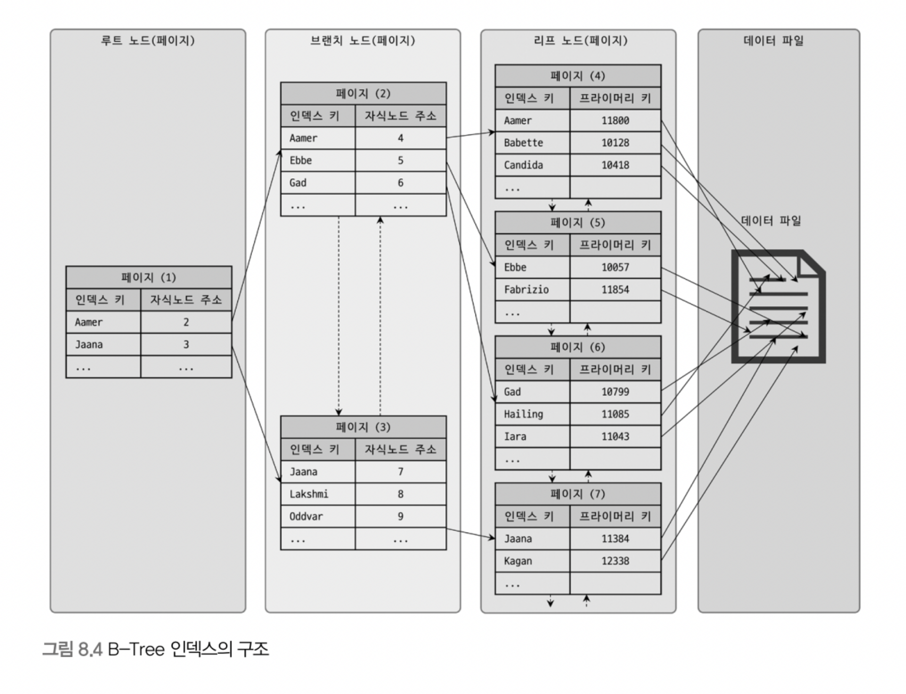

# 8. 인덱스

> 인덱스는 데이터베이스 쿼리 성능에 중요한 역할을 한다. <br> 인덱스는 개발자나 관리자에게 매우 중요하며, 쿼리 튜닝의 기본이 된다.

<br>

## 8.1 디스크 읽기 방식
디스크 같은 기계식 장치의 성능은 상대적으로 발전이 느리다. 최근에 SSD 드라이브가 많이 활용되고 있지만, 여전히 데이터 저장 매체는 컴퓨터에서 가장 느린 부분이다. 

그래서 데이터베이스 성능 튜닝은 어떻게 디스크 I/O를 줄이느냐가 관건일 때가 많다.

### 8.1.1 하드 디스크 드라이브(HDD)와 솔리드 스테이트 드라이브(SSD)
CPU나 메모리같은 주요 장치는 대부분 전자식 장치지만, 하드 디스크 드라이브(HDD)는 기계식 장치다. 그래서 데이터베이스 서버에서는 항상 디스크 장치가 병목이 된다. 이러한 HDD를 대체하기 위해 전자식 매체인 SSD가 많이 출시되고 있다.

### SSD (솔리드 스테이트 드라이브)
- HDD에서 데이터 저장용 플래터(원판)를 제거하고 플래시 메모리를 대신 장착하고 있다. 
- 디스크 원판을 기계적으로 회전시킬 필요가 없어 HDD보다 데이터를 빨리 읽고 쓸 수 있다. 
- 플래시 메모리를 사용하고 있어 전원이 공급되지 않아도 데이터가 보존된다.
- HDD보다 랜덤 I/O 성능이 뛰어나다.
  - 순차 I/O에서는 SSD가 HDD보다 조금 빠르거나 거의 비슷한 성능을 보인다.

<br>

요즘은 DBMS용으로 사용할 서버에는 대부분 SSD를 사용하고 있는데, 그 이유는 I/O 방식의 차이에 있다. 

I/O 방식은 크게 랜덤 I/O와 순차 I/O로 나눌 수 있는데, 
데이터베이스 서버에서는 순차I/O 작업보다 랜덤 I/O를 통해 작은 데이터를 읽고 쓰는 작업이 대부분이다. 
SSD의 장점 중 하나가 HDD보다 랜덤 I/O가 훨씬 빠르다는 것인데 이는 DBMS용 스토리지에 최적이라고 할 수 있다.

랜덤 I/O와 순차 I/O가 어떤 방식인지는 8.1.2에서 더 자세히 보도록 하자.

<br>

### 8.1.2 랜덤 I/O와 순차 I/O
#### 랜덤 I/O
- 디스크의 플래터(원반)를 돌려서 읽어야 할 데이터가 저장된 위치로 디스크 헤더를 이동시킨 후 데이터를 읽는 방식

#### 순차 I/O
- 디스크의 헤더를 움직이지 않고 한 번에 많은 데이터를 읽는 방식

디스크 I/O 시간은 디스크 헤더를 움직여서 읽고 쓸 위치로 옮기는데에서 결정되며, 디스크의 성능은 (1)디스크 헤더의 위치 이동을 최대한 줄이면서 (2)얼마나 많은 데이터를 (3)한 번에 기록하느냐에 의해 결정된다고 할 수 있다.

디스크 원판을 가지지 않는 SSD는 둘의 차이가 없을듯하지만, 실제로는 SSD에서도 랜덤 I/O가 순차 I/O보다 성능이 떨어진다.

쿼리 튜닝으로 I/O 방식을 바꾸기는 어려우며, 일반적인 튜닝의 목적은 랜덤 I/O 자체를 줄여주는 것이라고 할 수 있다. 즉, 쿼리를 처리하는데 꼭 필요한 데이터만 읽도록 쿼리를 튜닝하는 것을 의미한다.

> cf.
> 
> 인덱스 레인지 스캔 : 랜덤 I/O 사용
> 
> 풀 테이블 스캔 : 순차 I/O 사용
>
> 큰 테이블의 레코드 대부분을 읽는 작업(ex. 데이터 웨어하우스, 통계 작업)에서는 인덱스를 사용하지 않고 풀 테이블 스캔을 사용하도록 유도할 때가 있다.
> (순차 I/O가 랜덤 I/O보다 훨씬 빨리 많은 레코드를 읽어올 수 있기 때문)

<br><hr>

## 8.2 인덱스란?
인덱스는 컬럼(또는 컬럼들)의 값과 해당 레코드가 저장된 주소를 키와 값의 쌍(key-value pair)으로 삼아, 주어진 순서로 미리 정렬하여 저장해 두고, 원하는 결과를 최대한 빠르게 검색할 수 있도록 한다.

인덱스의 목적은 데이터 읽기 성능을 높이는 것이라 할 수 있다. 
인덱스를 통해 읽기 성능은 향상되지만 insert, update, delete 시 인덱스도 재정렬 과정을 거쳐야하므로 데이터 저장 성능은 떨어질 수밖에 없다. 
따라서 DBMS에서 인덱스는 데이터의 저장 성능을 희생하고 그 대신 데이터의 읽기 속도를 높이는 기능이다. 

무분별한 인덱스 추가는 지양해야 하며, 인덱스 추가를 결정할 때는 데이터 저장 속도를 얼마나 희생할지, 읽기 속도를 얼마나 더 빠르게 만들어야 하는지를 고려해야 한다.

### 8.2.1 인덱스 - 역할별 구분
- 프라이머리 키
  - 레코드를 대표하는 컬럼의 값으로 만들어진 인덱스
  - 테이블에서 해당 레코드를 식별할 수 있는 값(식별자)
  - null을 허용하지 않으며 중복을 허용하지 않는다.
- 보조 키(세컨더리 인덱스)
  - 프라이머리 키를 제외한 나머지 모든 인덱스
  - 유니크 인덱스는 프라이머리 키와 비슷하고 프라이머리 키를 대체할 수 있어 대체 키라고도 부른다.
  - 대체 키를 별도로 분류하기도 하고 그냥 세컨더리 인덱스로 분류하기도 한다.

### 8.2.2 인덱스 - 데이터를 관리하는 방식(알고리즘) 별 구분
- B-Tree 인덱스
  - 가장 일반적으로 사용되는 인덱스 알고리즘
  - 컬럼의 값을 변형하지 않고 원래의 값을 이용해 인덱싱하는 알고리즘
  - B-Tree의 응용 버전으로 R-Tree 인덱스가 있다.
- Hash 인덱스
  - 컬럼의 값으로 해시값을 계산해서 인덱싱하는 알고리즘
  - 매우 빠른 검색을 지원
  - 값을 변형해서 인덱싱하므로, 값의 일부만 검색(ex. prefix 일치)하거나 범위 검색 시 사용 불가
  - 메모리 기반의 데이터베이스에서 많이 사용

<br><hr>

## 8.3 B-Tree 인덱스
B-Tree 인덱스는 가장 일반적으로 사용되는 인덱싱 알고리즘이며, 가장 먼저 도입된 알고리즘이다. 컬럼의 값을 변형시키지 않고 인덱스 구조체 내에서 항상 정렬된 상태로 유지된다. 일반적으로 DBMS에서는 B-Tree 변형 알고리즘인 B+-Tree 또는 B*-Tree가 사용된다.

> cf. B-Tree 인덱스는 Balanced-Tree를 의미한다. Binary가 아닌 것에 주의하자.

### 8.3.1 B-Tree 인덱스의 구조 및 특성

B-Tree는 트리 구조의 최상위에 하나의 **루트 노드**가 존재하고 그 하위에 자식 노드가 붙어있는 구조를 가지고 있다. 
가장 하위의 노드를 **리프 노드**라 하고, 루트 노드도 리프 노드도 아닌 중간의 노드를 **브랜치 노드**라고 한다.

인덱스의 리프 노드는 항상 실제 데이터 레코드를 찾아가기 위한 주솟값을 가지고 있다. 또한, 위의 그림과 같이 인덱스의 키 값은 모두 정렬되어 있지만 데이터 파일의 레코드는 정렬되어 있지 않고 임의의 순서로 저장돼 있다. 

새로운 레코드가 insert되면 가능한 삭제된 빈 공간을 재활용하도록 DBMS가 설계되어 있기 때문에, 만약 레코드가 delete되어 빈 공간이 생기다면 항상 레코드가 insert된 순서로 저장된다고 보장할 수 없다.

> cf.
> 대부분의 RDBMS의 데이터 파일에서 레코드는 임의의 순서로 저장된다.
>
> 하지만, InnoDB 테이블에서 레코드는 클러스터되기 때문에 기본적으로 프라이머리 키 순서로 정렬되어 저장된다. (default)

<br>

 | 
--- | --- |

두 스토리지 엔진은 세컨더리 인덱스를 통해 데이터 파일을 찾아가는 방식에 가장 큰 차이점이 있다.

- MyISAM, MEMORY 테이블 (왼쪽)
  - 레코드 주소: 레코드가 테이블에 insert된 순번 or 데이터 파일 내 위치(offset)
  - 세컨더리 인덱스가 물리적인 주소를 가진다.
- InnoDB 테이블 (오른쪽)
  - 프라이머리 키가 ROWID의 역할(물리적 주솟값)을 한다.
  - 프라이머리 키를 주소처럼 사용하기 때문에, 세컨더리 인덱스는 논리적인 주소를 가진다.
  - 레코드를 읽을 때, 데이터 파일을 바로 찾아가지 않고 다음과 같은 과정을 거친다.
    1) 인덱스에 저장되어 있는 프라이머리 키 값을 이용해 프라이머리 키 인덱스를 한번 더 검색한다.
    2) 프라이머리 키 인덱스의 리프 페이지에 저장되어 있는 레코드를 읽는다.
  - 즉, InnoDB 테이블에서는 모든 세컨더리 인덱스 검색에서 프라이머리 키를 저장하고 있는 B-Tree를 한번 더 검색해야만 데이터 레코드를 읽을 수 있다.

<br>

### 8.3.2 B-Tree 인덱스 키 추가 및 삭제
테이블에 레코드를 저장하거나 변경하는 경우 인덱스 키 추가나 삭제 작업이 발생한다. 이런 작업이 어떻게 처리되는지 알아두면 쿼리 성능을 쉽게 예측할 수 있다.

### 8.3.2.1 인덱스 키 추가
1. 새로운 키 값이 B-Tree에 저장될 때, 저장될 키 값을 이용해 B-Tree상의 적절한 위치를 검색한다. 
2. 저장될 위치가 결정되면 레코드의 키 값과 레코드의 주소 정보를 B-Tree의 리프 노드에 저장한다.
3. 만약 리프 노드에 더는 저장할 수 없다면 리프 노드를 분리하여 저장한다.
   - 상위 브랜치 노드까지 처리 범위가 넓어진다.
   - 이로 인해, 상대적으로 쓰기 작업에 비용이 많이 들게 된다.

#### insert 실행 시,
MYISAM나 MEMORY 테이블에서는 **즉시** 새로운 키 값을 B-Tree 인덱스에 변경한다.

InnoDB 테이블에서는 필요하다면 insert 작업을 **지연시켜** 나중에 처리할 수 있다. 
하지만 프라이머리 키나 유니크 인덱스의 경우 중복 체크가 필요하여 즉시 B-Tree에 추가/삭제한다.

<br>

### 8.3.2.2 인덱스 키 삭제
1. 해당 키 값이 저장된 B-Tree 리프 노드를 검색한다.
2. 리프 노드에 삭제 마크를 추가한다.
   - 디스크 I/O가 필요한 작업이다.
   - 삭제 마킹된 인덱스 키 공간은 계속 그대로 방치되거나 재활용될 수 있다.

InnoDB 테이블에서는 이 작업 또한 버퍼링되어 **지연** 처리를 할 수 있다. 

<br>

### 8.3.2.3 인덱스 키 변경
1. B-Tree 인덱스 키 값을 찾아 삭제한다.
2. B-Tree에 다시 새로운 인덱스 키 값을 추가한다.

-> 즉, 변경 작업은 단순히 인덱스 키 값만 변경할 수 없고 기존 키 값을 삭제한 후 새로운 키 값을 추가하는 작업으로 처리된다.

InnoDB 테이블에서는 이 작업 또한 체인지 버퍼를 활용해 **지연** 처리를 할 수 있다. 

<br>

### 8.3.2.4 인덱스 키 검색
인덱스 검색 작업은 B-Tree 루트 노드부터 시작해 브랜치 노드를 거쳐 리프 노드까지 이동하면서 비교 작업을 수행한다. 이 과정을 **트리 탐색**이라고 한다. 
인덱스 **트리 탐색** 과정은 select뿐 아니라 update, delete를 처리하기 위해 레코드를 먼저 검색할 때도 사용된다.

B-Tree 인덱스를 이용한 검색이 가능할 때도 있고 불가능할 때도 있다!
- 사용 가능
  - 100% 일치하는 경우(동등 연산)
  - 키 값의 앞부분만 일치하는 경우(LIKE 연산)
  - 부등호 (< , >) 비교 조건
- 사용 불가능
  - 키 값의 뒷부분만 검색하는 경우
  - 키 값에 변형이 가해지는 경우

InnoDB 테이블에서 지원하는 레코드 잠금이나 넥스트 키락(갭 락)은 검색을 수행한 인덱스를 잠근 후 테이블의 레코드를 잠그는 방식으로 설계되어 있다. 
따라서 update delete를 수행할 때 적절한 인덱스가 없으면 불필요하게 많은 레코드를 잠글 수 있다.(모든 레코드를 잠글 수도 있음) 
따라서 InnoDB 스토리지 엔진에서는 인덱스 설계가 굉장히 중요하고 많은 부분에 영향을 미친다는 것을 잊지말아야 한다.

<br>

### 8.3.3 B-Tree 인덱스 사용에 영향을 미치는 요소
B-Tree 인덱스는 인덱스를 구성하는 컬럼의 크기, 레코드 건수, 유니크한 인덱스 키 값의 개수 등에 검색이나 변경 작업의 성능이 영향을 받는다.

### 8.3.3.1 인덱스 키 값의 크기
인덱스는 페이지 단위로 관리되며, B-Tree 인덱스의 트리 구성 요소인 루트, 브랜치, 리프 노드를 구분한 기준이 페이지 단위이다.

#### 페이지(Page)
- = 블록(Block)
- 디스크에 데이터를 저장하는 기본 단위
- 디스크의 모든 I/O 작업의 최소 작업 단위
- InnoDB 엔진의 버퍼 풀에서 데이터를 버퍼링하는 기본 단위

DBMS의 B-Tree는 자식 노드의 개수가 가변적이다. 
B-Tree가 가질 수 있는 자식 노드의 수는 인덱스의 페이지 크기와 키 값의 크기에 따라 결정된다.

그렇다면 16KB의 인덱스 페이지 하나가 몇 개의 키를 저장할 수 있을까?

위 그림처럼 `16 * 1024 / (16(키 값의 크기) + 12(자식 노드 주소 크기)) = 585 개의 키`를 저장할 수 있다. 즉, 자식 노드를 585개 가질 수 있다는 것이다. 
이때, 위의 경우에서 키 값이 32byte로 늘어났다고 가정하면 `16 * 1024 / (32(키 값의 크기) + 12(자식노드 주소 크기)) = 372개의 키`를 저장할 수 있다.

예를 들어, 500개의 레코드를 읽을 때 키 값이 16바이트인 인덱스 페이지는 디스크를 한 번만 읽으면 되지만, 키 값이 32바이트인 인덱스 페이지는 디스크를 두 번 읽어야 한다. 즉, 인덱스를 구성하는 키 값의 크기가 커지면 디스크를 읽어야 하는 횟수가 늘어나고 그만큼 느려진다.

또한, 인덱스 크기가 커지면 커질수록(인덱스 키 값의 길이가 길어질수록) 메모리에 캐시 해 둘 수 있는 레코드 수는 줄어들기 때문에 자연히 메모리 효율이 떨어지는 결과를 가져온다.

<br>

### 8.3.3.2 B-Tree 깊이
B-Tree 인덱스의 깊이는 상당히 중요하지만 직접 제어할 방법은 없다. 

B-Tree 인덱스는 인덱스 키 값의 평균 크기와 관계가 있는데, 
B-Tree 깊이가 3이고 키 값이 16 byte인 경우 최대 2억(585 * 585 * 585)개 정도의 키 값을 담을 수 있지만 , 키 값이 32 byte인 경우 담을 수 있는 키 값이 5천만(372 * 372 * 372)개로 줄어든다.

인덱스 키 값의 크기가 커질수록, 하나의 인덱스 페이지가 담을 수 있는 인덱스 키 값의 개수가 적어지고 B-Tree의 깊이도 깊어진다. B-Tree의 깊이는 값을 검색할 때 몇 번이나 랜덤하게 디스크 I/O를 수행해야 하는지와 직결되므로, 같은 레코드 건수라도 B-Tree 깊이가 깊을수록 디스크 I/O가 많아진다.

<br>

### 8.3.3.3 선택도(기수성)
인덱스에서 선택도(Selectivity) 또는 기수성(Cardinality)은 거의 같은 의미로 사용되며, 모든 인덱스 키 값 가운데 유니크한 값의 수를 의미한다. 
인덱스 키 값 가운데 중복된 값이 많아지면 기수성은 낮아지고 선택도 또한 떨어진다. 
인덱스는 선택도가 높을수록 검색 대상이 줄어들기 때문에 그만큼 빨리 처리된다. 

#### 전체 레코드 건수를 유니크한 값의 개수로 나눠보면 하나의 키 값으로 검색했을 때 대략 몇 건의 레코드가 일치할지 예측할 수 있다.

예를 들어, tb_city 테이블에 1만 건의 국가와 도시가 중복해서 저장되어 있지 않고 country 컬럼에만 인덱스가 생성되어 있다고 해보자.
```sql
> SELECT * FROM tb_city
  WHERE country='KOREA' AND city='SEOUL';
```
- country 컬럼의 유니크 값이 10개일 때
  - country=’KOREA’ 라는 조건으로 인덱스를 검색하면 1000건(10000 / 10)의 데이터가 일치할 것이라 예상할 수 있다.
  - city=’SEOUL’인 레코드는 1건이므로 1000건 중 999건은 불필요한 읽음이다.
- country 컬럼의 유니크 값이 1000개일 때
  - country=’KOREA’ 라는 조건으로 인덱스를 검색하면 10건(10000 / 1000)의 데이터가 일치할 것이라 예상할 수 있다.
  - city=’SEOUL’인 레코드는 1건이므로 10건 중 9건은 불필요한 읽음이다.

똑같은 쿼리를 실행해 똑같은 결과를 받았지만, MYSQL 서버가 수행하는 작업 내용은 차이가 크다. 이처럼 **인덱스에서 유니크한 값의 개수는 인덱스나 쿼리의 효율성에 큰 영향을 미친다.**

<br>

### 8.3.3.4 읽어야 하는 레코드의 건수
인덱스를 통해 레코드를 읽는 것은 인덱스를 거치지 않고 읽는 것보다 높은 비용이 드는 작업이다. 
따라서 레코드를 인덱스를 통해 읽어올건지, 전체 테이블을 모두 읽을건지, 둘 중 어느 것이 효율적인지 판단해야 한다.

일반적인 DBMS 옵티마이저에서는 인덱스를 통해 레코드 1건을 읽어오는 작업이 테이블에서 직접 1건을 읽는 것보다 4~5배의 비용이 더 든다고 예측한다. 
즉, 읽어야 할 레코드 건수가 전체 테이블 레코드의 20~25%를 넘어서면 인덱스를 이용하지 않고 테이블을 모두 직접 읽어서 필터링을 수행하는 것이 더 효율적이다.

예를 들어, 전체 100만 건의 레코드 가운데 50만 건을 읽어야 하는 작업은 전체 테이블의 50%를 읽는 작업이다. 즉, 인덱스의 손익 분기점인 20~25%보다 훨씬 크기 때문에 테이블 전체를 직접 읽는 것이 더 효율적이다. 
또한, 많은 레코드를 읽을 때는 강제로 인덱스를 사용하도록 힌트를 추가해도 성능상 얻을 수 있는 이점이 없다.

<br>

