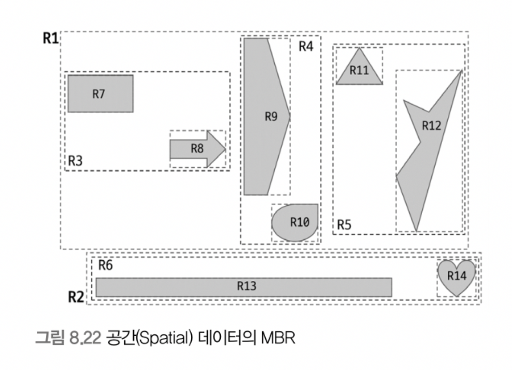

# 8.4 R-Tree 인덱스

> R-Tree인덱스의 기본 메커니즘은 B-Tree와 비슷하지만, R-Tree 인덱스는 2차원의 데이터를 저장하는 인덱스이다. 
> (B-Tree는 1차원 데이터를 저장하는 인덱스)

 

공간 인덱스는 R-Tree 인덱스 알고리즘을 사용해 2차원의 데이터를 인덱싱하고 검색하는 목적의 인덱스이다. 위치 기반(GPS)의 서비스를 구현할 때 많이 사용되고 있으며, MYSQL의 공간 확장을 이용하여 간단하게 구현할 수 있다.

 MYSQL의 공간 확장에는 크게 3가지 기능이 포함되어 있다.
 1. 공간 데이터를 저장할 수 있는 데이터 타입 (POINT, LINE, POLYGON, GEOMETRY)
 2. 공간 데이터의 검색을 위한 공간 인덱스 (R-Tree 알고리즘)
 3. 공간 데이터의 연산 함수 (ST_Distance(), ST_Distance_Sphere(), ST_Contains(), ST_Within())

 

## 8.4.1 구조 및 특성
MYSQL은 공간 정보의 저장 및 검색을 위해 다양한 데이터 타입 **POINT, LINE, POLYGON, GEOMETRY** 을 제공한다.

**GEOMETRY** 타입은 POINT, LINE, POLYGON 타입의 슈퍼 타입으로 
나머지 객체를 모두 저장할 수 있다.

R-Tree 알고리즘을 이해하려면 MBR 이라는 개념 또한 잘 알고 있어야한다.

**MBR은 "Minimum Bounding Rectangle"의 약자로 해당 도형을 감싸는 최소 크기의 사각형을 의미한다. 그리고 이 사각형들의 포함 관계를 B-Tree 형태로 구현한 인덱스가 R-Tree 인덱스이다.**

 

도형들이 저장될 때, 만들어지는 인덱스 구조를 이해하려면 우선 이 도형들의 MBR이 어떻게 되는지 알아야 한다.

위의 그림은 이 도형들의 MBR을 3개의 레벨로 나눠서 그룹화한 모습을 나타낸 것이다. 
- 최상위 레벨: R1 ~ R2
- 차상위 레벨: R3 ~ R6
- 최하위 레벨: R7 ~ R14

MBR을 그룹으로 나누면서 해당되는 공간 데이터를 찾아갈 수 있는 인덱스의 형태가 만들어졌다. 최상위 레벨의 MBR은 R-Tree의 루트 노드에 저장되는 정보이며, 차상위 레벨의 MBR은 브랜치 노드가 된다. 그리고 각 도형의 객체는 리프 노드에 저장되므로 아래와 같이 R-Tree 인덱스의 내부를 표현할 수 있다.

 

## 8.4.2 R-Tree 인덱스의 용도
R-Tree 인덱스는 위도/경도 좌표 저장에 주로 사용되며, 좌표 시스템에 기반을 둔 정보는 모두 적용 가능한 인덱스이다. 

그렇기에 R-Tree 인덱스를 '공간 인덱스' 라고도 부른다.

**R-Tree 인덱스는 각 MBR의 포함 관계로 만들어진 인덱스다. 따라서, 포함 관계를 비교하는 함수로 검색을 수행하는 경우에만 인덱스를 사용할 수 있다.**

즉, 현재의 MYSQL에서 거리를 비교하는 함수는 R-Tree 인덱스를 효율적으로 사용하지 못하기 때문에,, 특정 지점을 기준으로 위치를 검색할 때 포함 관계 비교 함수를 통해 거리 기반의 검색을 해야 한다.