# 08장 인덱스

### 8.3.4 B-Tree 인덱스를 통한 데이터 읽기

MySQL이 인덱스를 이용하는 대표적인 방법
- [인덱스 레인지 스캔](#8341-인덱스-레인지-스캔)
- [인덱스 풀 스캔](#8342-인덱스-풀-스캔)
- [루스 인덱스 스캔](#8343-루스-인덱스-스캔)
- [인덱스 스킵 스캔](#8344-인덱스-스킵-스캔)

#### 8.3.4.1 인덱스 레인지 스캔
검색해야 할 인덱스의 범위가 결정됐을 때 사용하는 방식. 검색하는 값의 수나 검색 결과 레코드 건수와 상관 없이 레인지 스캔이라고 한다.

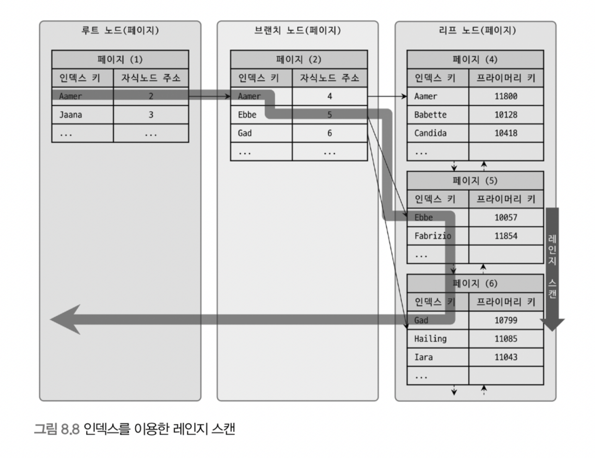
그림 8.8 처럼 검색하는 레코드의 시작 지점을 찾은 후 끝 지점까지 순서대로 읽는다.

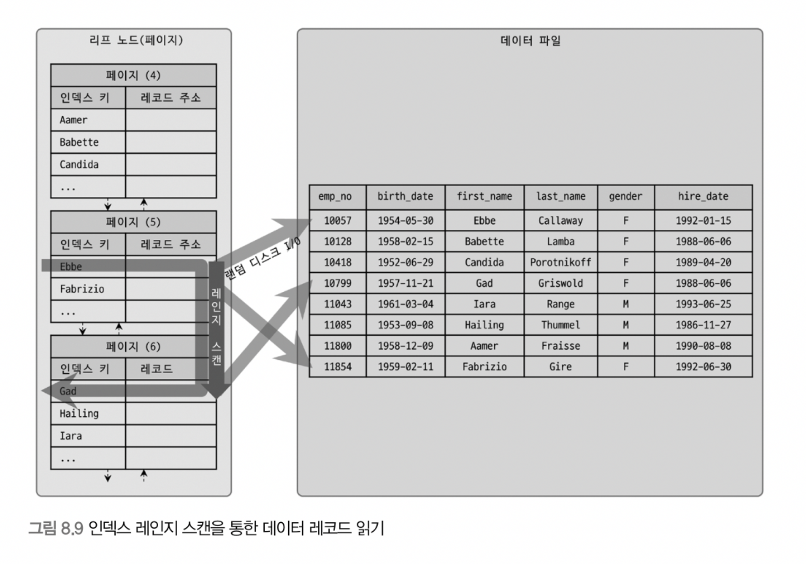
인덱스를 스캔하면서 레코드를 불러오는 경우 그림 8.9 처럼 불러온다. 그러니까 인덱스를 이용해 검색을 할 경우에 데이터 파일에서 레코드를 읽어오는 랜덤 I/O가 일어난다. 따라서, 읽어올 레코드가 20~25%를 넘으면 인덱스를 통하지 않고 테이블의 데이터를 직접 읽는 것이 더 효율적이다.

인덱스 레인지 스캔 동작 순서
1. 인덱스에서 조건에 맞는 위치를 찾는다. - 인덱스 탐색 (Index Seek)
2. 1번에서 찾은 위치부터 차례대로 읽는다. - 인덱스 스캔 (Index Scan)
3. 2번에서 읽은 인덱스 키와 레코드 주소를 이용해 페이지를 가져오고, 레코드를 읽는다.

검색할 데이터에 따라서 3번 과정이 필요하지 않는 경우도 있는데 이를 커버링 인덱스라고 한다. 즉, 랜덤 I/O가 없어서 속도가 빠르다.

#### 8.3.4.2 인덱스 풀 스캔
인덱스를 처음부터 끝까지 모두 읽는 방식. 대표적으로 쿼리의 조건절에 사용한 칼럼이 인덱스의 첫 번째 칼럼이 아닌 경우 사용된다. 인덱스는 (A, B, c) 순서로 만들어져 있지만 쿼리의 조건절은 B 칼럼이나 C 칼럼으로 검색하는 경우

쿼리가 인덱스에 명시된 칼럼만으로 조건을 처리할 수 있는 경우 이 방식을 사용한다. 그러나 데이터 레코드까지 모두 읽어야 한다면 절대 이 방식을 사용하지 않는다.

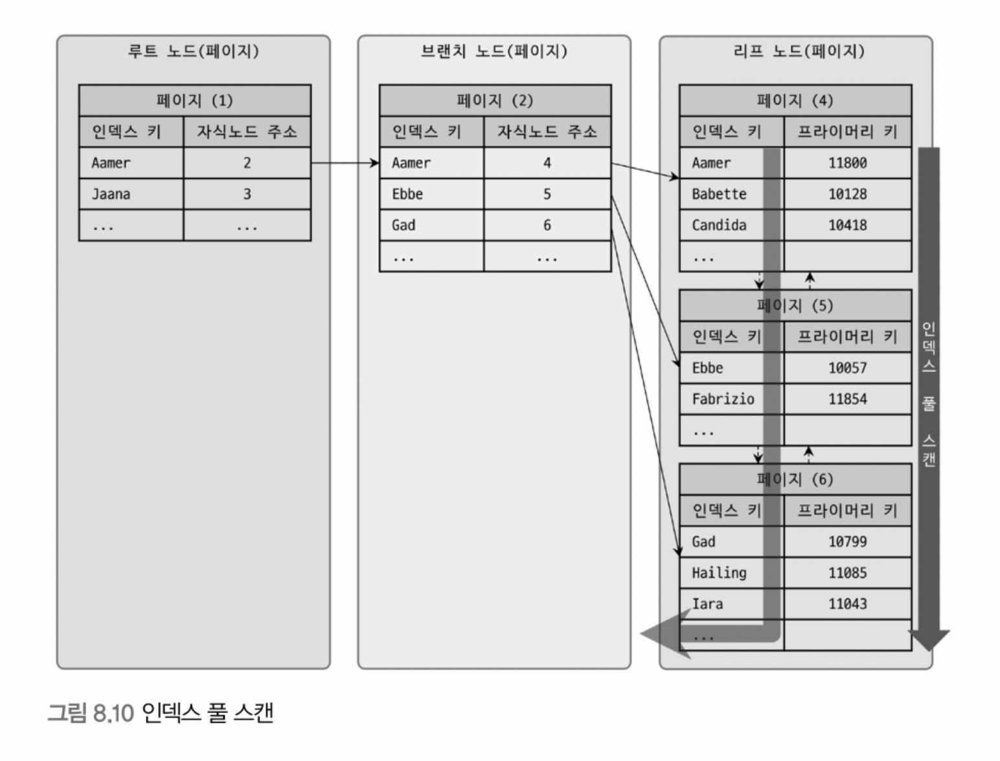
그림 8.10 처럼 인덱스 리프 노드의 제일 앞 또는 제일 뒤로 이동 후, 리프 노드를 따라서 스캔한다. 이 방식은 인덱스 레인지 스캔보다는 빠르지 않지만 테이블 풀 스캔보다는 효율적이다.

#### 8.3.4.3 루스 인덱스 스캔
오라클과 같은 DBMS의 "인덱스 스킵 스캔" 과 비슷한 동작을 한다. 루스 인덱스 스캔은 중간에 필요치 않은 인덱스 키 값은 무시하고 넘어가는 형태로 처리한다. 보통 `GROUP BY` 혹은 `MAX()`, `MIN()` 함수에 최적화를 할 때 사용한다.

```sql
SELECT DEPT_NO, MIN(EMP_NO)
FROM DEPT_EMP
WHERE EMP_NO BETWEEN 'd002' AND 'd004'
GROUP BY DEPT_NO;
```

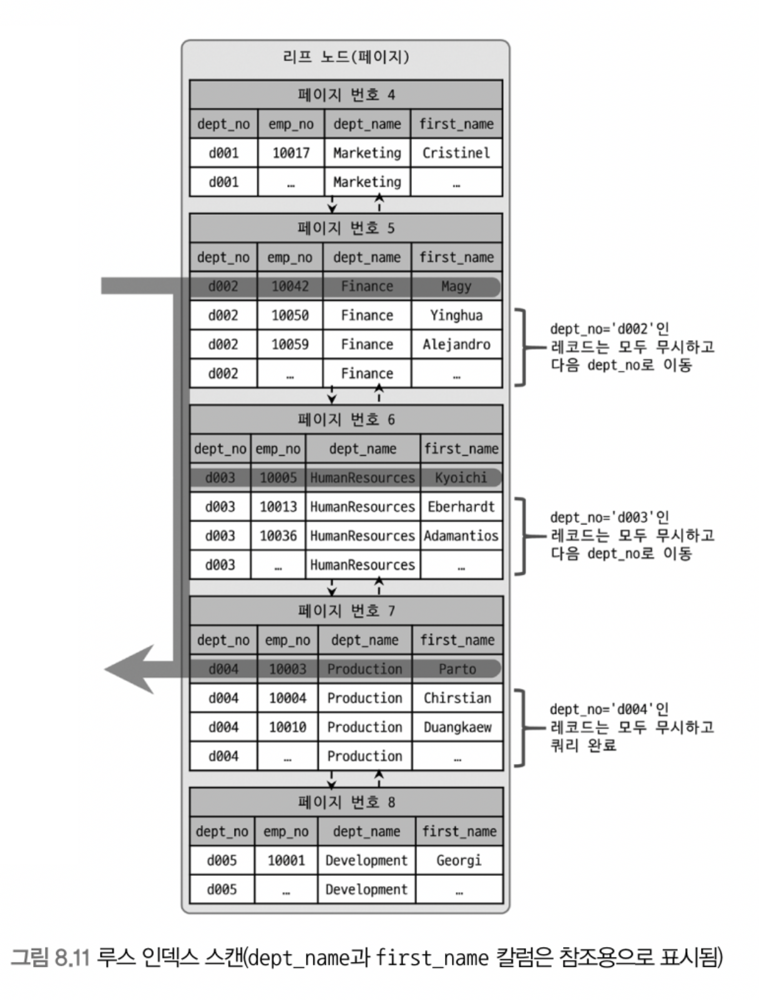
그림 8.11을 보면 불필요한 부분은 무시하고 필요한 부분만 읽는다.

#### 8.3.4.4 인덱스 스킵 스캔
인덱스는 값이 정렬되어 있는 것이 핵심이고, 이 때문에 인덱스를 구성하는 칼럼의 순서가 중요하다. 인덱스로 등록한 칼럼에 대한 조건이 일부 없는 쿼리는 인덱스를 "효율적으로" 사용할 수 없다. 즉, 인덱스에서 불필요한 부분도 접근하는 것을 의미한다.

MySQL 8.0 버전에서 이런 경우에도 칼럼을 건너뛰고 조건에 포함된 칼럼만으로 인덱스 검색이 가능한 '인덱스 스킵 스캔(Index Skip Scan)' 기능이 추가됐다.


> MySQL 서버는 인덱스를 루스 인덱스 스캔과 동일한 방식으로 읽으면서 인덱스에 존재하는 모든 값을 추출하고 그 결과를 이용하여 인덱스 스킵 스캔을 실행한다.

인덱스 스킵 스캔의 단점
- WHERE 조건절에 없는 인덱스 선행 칼럼의 유니크 값의 개수가 적어야 함
    - 유니크한 값의 개수가 너무 많으면 인덱스 시작 지점을 검색하는 작업이 많이 필요해진다.
- 쿼리가 인덱스에 존재하는 칼럼만으로 처리 가능해야 함 (커버링 인덱스)
    - 인덱스에 없는 칼럼을 필요할 경우 테이블 레코드를 읽어와야 한다.

### 8.3.5 다중 칼럼(Multi-column) 인덱스
두 개 이상의 칼럼으로 구성된 인덱스

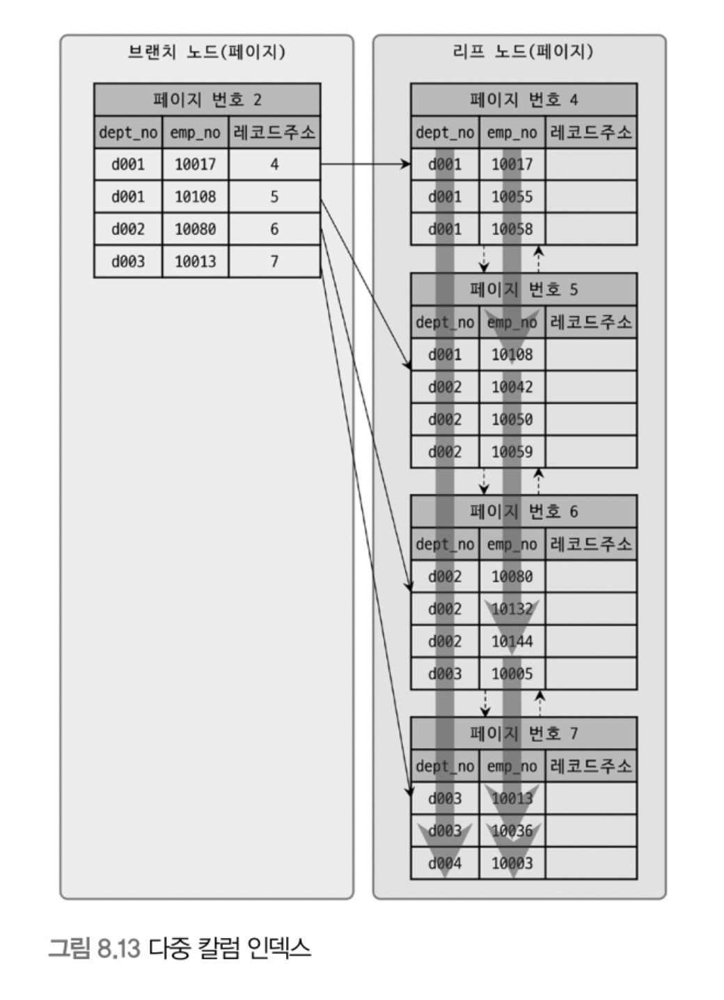
다중 칼럼 인덱스의 정렬은 앞의 칼럼에 의존한다. 따라서 그림 8.13의 `emp_no - "10003"` 레코드의 경우 emp_no 값이 가장 작지만 제일 마지막에 존재한다. 따라서 인덱스 내에서 칼럼의 순서가 매우 중요하며, 신중하게 결정해야 한다.

### 8.3.6 B-Tree 인덱스의 정렬 및 스캔 방향
인덱스는 설정한 정렬 규칙에 따라 오름차순이나 내림차순으로 저장된다. 그러나 읽는 방향은 쿼리에 따라 옵티마이저가 만드는 실행 계획에 따라 결정된다.

#### 8.3.6.1 인덱스의 정렬
MySQL 8.0 버전부터는 각 칼럼별로 정렬 규칙을 혼합해서 생성할 수 있다.

#### __인덱스 스캔 방향__
인덱스는 읽는 방향에 따라 오름차순 또는 내림차순의 효과를 얻을 수 있다.

```sql
SELECT *
FROM EMPLOYEES
ORDER BY FIRST_NAME DESC
LIMIT 1;
```

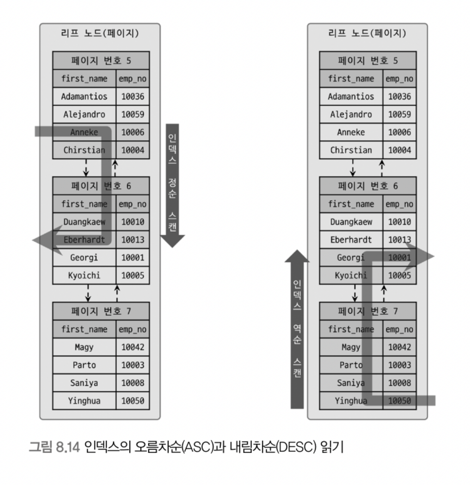
MySQL 옵티마이저는 그림 8.14 처럼 인덱스의 읽기 방향을 전환해서 최적화된 실행 계획을 만든다.

#### __내림차순 인덱스__
InnoDB는 인덱스 역순 스캔이 인덱스 정순 스캔보다 느릴 수 밖에 없다.
- 페이지 잠금이 인덱스 정순 스캔에 적합한 구조
- 페이지 내에서 인덱스 레코드가 단방향으로만 연결된 구조

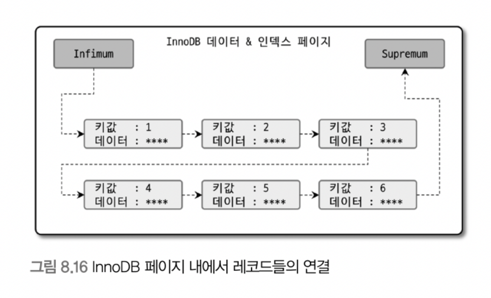
> 레코드들이 순서대로 저장된 것처럼 표시되지만 실제로는 Heap 처럼 사용돼서 물리적으로 순서대로 배치되지 않는다.

그러나 `ORDER BY ... DESC` 쿼리가 드물게 실행되면 내림차순 인덱스를 고려할 필요는 없다. 많은 쿼리가 인덱스의 앞쪽 또는 뒤쪽만 집중적으로 읽는 경우, 해당 순서대로 인덱스를 생성하여 잠금 병목 현상을 완화하는 데 도움이 된다.

### 8.3.7 B-Tree 인덱스의 가용성과 효율성

쿼리의 조건을 최적화하거나, 쿼리에 맞게 인덱스를 최적으로 생성하려면 WHERE 조건이나 GROUP BY, ORDER BY 절이 어떤 경우에 인덱스를
사용할 수 있고 어떤 방식으로 사용할 수 있는지 알아야 한다.

#### __비교 조건의 종류와 효율성__

다중 칼럼 인덱스에서 칼럼의 순서와 칼럼에 사용된 조건에 따라서 인덱스 활용 형태와 효율이 달라진다.

```roomsql
mysql > SELECT * FROM DEPT_EMP
        WHERE DEPT_NO = 'D002' AND EMP_NO >= 10114;
```

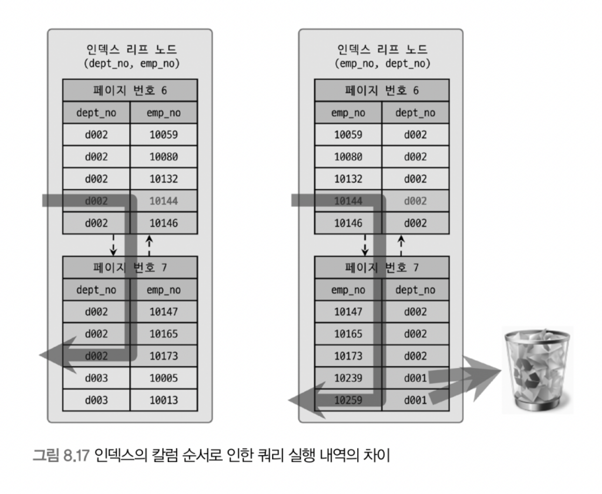

케이스 A: INDEX ( DEPT_NO, EMP_NO )
- 쿼리의 조건에 맞는 레코드를 찾고, DEPT_NO가 'D002' 가 아닐 때까지 인덱스를 쭉 읽는다.

케이스 B: INDEX ( EMP_NO, DEPT_NO )
- 쿼리의 조건에 맞는 레코드를 찾고, 그 이후 모든 레코드에 대해 DEPT_NO가 'D002' 인지 비교하는 과정을 거친다.

즉, 인덱스의 순서에 따라서 작업의 범위가 달라졌다. 케이스 A 같이 작업의 범위를 결정하는 조건을 `작업 범위 결정 조건` 이라고 하고,
케이스 B의 `DEPT_NO = 'D002'` 같은 조건을 `필터링 조건` 혹은 `체크 조건` 이라고 표현한다.

작업 범위 결정 조건은 많을 수록 쿼리의 처리 성능을 높이지만 체크 조건은 많다고 성능이 높아지지 못하며, 오히려 느려질 수도 있다.

#### __인덱스의 가용성__

B-Tree 인덱스는 왼쪽 값부터 순서대로 정렬되어 있다. 하나의 칼럼 뿐만 아니라 다중 칼럼에 대해서도 똑같이 적용된다.
즉, 왼쪽 값의 부분 혹은 왼쪽 칼럼을 모르면 인덱스 레인지 스캔을 사용할 수 없다.

#### __가용성과 효율성 판단__

B-Tree 인덱스에서 작업 범위 결정 조건으로 사용할 수 없는 것. (경우에 따라서 체크 조건으로 사용할 수는 있다.)
- NOT-EQUAL 로 비교된 경우
- LIKE '%??' 처럼 뒷부분 일치 형태로 문자열 패턴이 비교된 경우
- 스토어드 함수나 다른 연산자로 인덱스 칼럼이 변형된 후 비교된 경우
- NOT-DETERMINISTIC 속성의 스토어드 함수가 비교 조건에 사용된 경우
- 데이터 타입이 서로 달라서 인덱스 칼럼의 타입을 변환해야 비교가 가능한 경우
- 문자열 데이터 타입의 콜레이션이 다른 경우

다중 칼럼으로 만들어진 인덱스: ex) `INDEX IX_TEST ( COL_1, COL_2, COL_3, ... , COL_N )`

작업 범위 결정 조건으로 인덱스를 사용하지 못하는 경우
- COL_1 칼럼에 대한 조건이 없는 경우
- COL_1 칼럼의 비교 조건이 인덱스 사용 불가 조건인 경우

작업 범위 결정 조건으로 인덱스를 사용하는 경우
- COL_1 ~ COL_i-1 칼럼까지 동등 비교 형태
- COL_i 칼럼에 대해 동등, 대소, LIKE 좌측 일치 패턴 비교
이 경우는 COL_i 까지는 작업 범위 결정 조건으로 COL_i+1 부터는 체크 조건으로 사용한다.

## 8.4 R-Tree 인덱스
MySQL 의 공간 인덱스 ( Spatial Index ) 는 R-Tree 인덱스 알고리즘을 이용해 2차원의 데이터를 인덱싱하고 검색하는 것이 목적이다. 
B-Tree 와 매우 비슷하며, 인덱스를 구성하는 칼럼이 1차원의 스칼라 값인 B-Tree와 달리 2차원의 공간 개념값인 것이 다를 뿐이다.

MySQL 의 공간 확장을 이용하면 위치 기반 서비스를 간단하게 구현할 수 있다. MySQL 공간 확장의 기능
- 공간 데이터를 저장할 수 있는 데이터 타입
- 공간 데이터의 검색을 위한 공간 인덱스 ( R-Tree 알고리즘 )
- 공간 데이터의 연산 함수 ( 거리 또는 포함 관계 처리 )

### 8.4.1 구조 및 특성

MySQL 은 여러가지 기하학적 정보를 관리할 수 있는 데이터 타입을 제공한다.


GEOMETRY 타입은 나머지 3개의 슈퍼 타입으로 3가지 객체를 모두 저장할 수 있다.

R-Tree 알고리즘은 MBR 을 사용하는데, MBR ( Minimum Bounding Rectangle ) 은 해당 도형을 감싸는 최소 크기의 사각형이다.

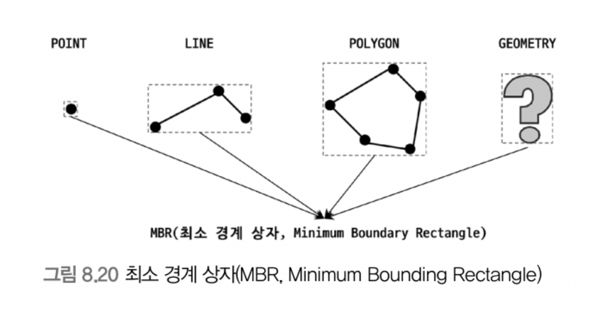

R-Tree 는 이 MBR을 이용해 도형 데이터를 인덱싱한다.

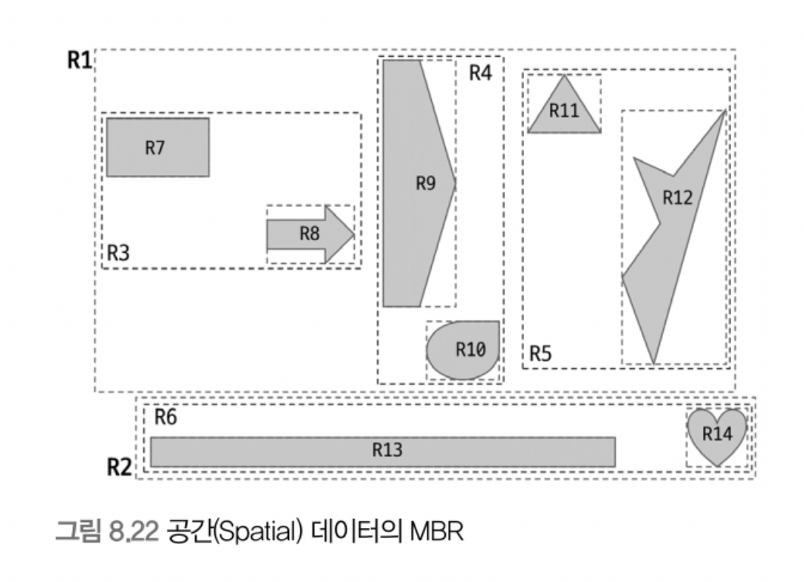

- 트리의 루트 노드: 최상위 레벨 R1, R2
- 트리의 브랜치 노드: 차상위 레벨 R3, R4, R5, R6
- 트리의 리프 노드: 최하위 레벨 R7 ~ R14

### 8.4.2 R-Tree 인덱스의 용도

R-Tree 인덱스는 각 도형의 MBR 의 포함 관계를 이용해 만든 인덱스이다. 
따라서 `ST_Contains()` 또는 `ST_Within()` 등의 포함 관계를 비교하는 함수로 검색하는 경우에만 사용할 수 있다.

예를 들어 어느 지점 P로부터 5km 이내의 모든 점들을 검색하는 경우

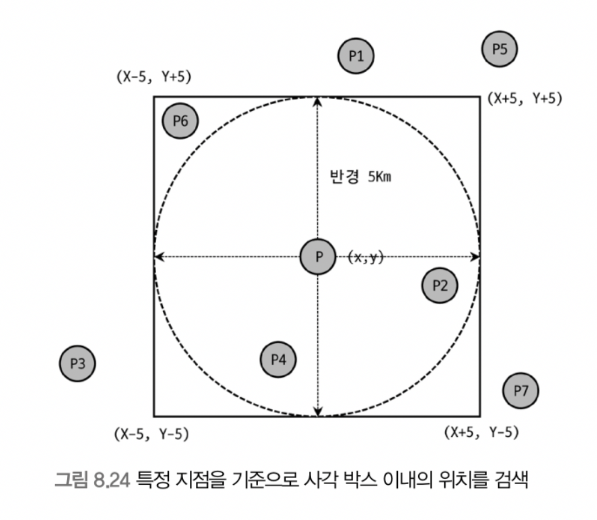

```roomsql
"사각 상자" 에 포함된 좌료 검색
sql> SELECT * FROM TB_LOCATION
     WHERE ST_Contains(사각상자, px);

sql> SELECT * FROM TB_LOCATION
     WHERE ST_Within(px, 사각상자); 

5km 이상 떨어진 P6를 제거해야 하는 경우
sql> SELECT * FROM TB_LOCATION
     WHERE ST_Contains(사각상자, px)
           AND ST_Distance_Sphere(p, px) <= 5 * 1000;
```

## 8.5 전문 검색 인덱스

문서의 내용 전체를 인덱스화해서 특정 키워드가 포함된 문서를 검색하는 전문 검색에는 일반적인 B-Tree 인덱스를 사용할 수 없다.
문서 전체에 대한 분석과 검색을 위한 인덱싱 알고리즘을 전문 검색 ( Full Text Search ) 인덱스라고 한다.

### 8.5.1 인덱스 알고리즘

전문 검색에서는 본문에서 사용자가 검색할 키워드를 분석하고, 이를 인덱싱하여 검색을 빠르게 한다. 
전문 검색 인덱스는 크게 어근 분석과 n-gram 분석 알고리즘으로 구분할 수 있다.

#### __1) 어근 분석 알고리즘__
전문 검색 인덱스는 불용어 처리와 어근 분석을 통해 색인 작업을 수행한다.

불용어 처리는 검색에 도움되지 않는 단어를 필터링하여 제거하는 작업이다. 
불용어는 많지 않아서 상수로 하드코딩하거나, 데이터베이스화해서 사용자가 추가 / 삭제할 수 있도록 유연성을 확보하기도 한다.

어근 분석은 검색어로 선정된 단어의 원형을 찾는 작업이다. 
어근 분석은 언어별로 문법이 다르기 때문에 분석 방식도 모두 다르다. 
한글의 경우는 단어의 변형이 거의 없어서 문장의 형태소 분석으로 명사와 조사를 구분하는 기능이 더 중요한 편이다.

#### __2) n-gram 알고리즘__
n-gramd은 본문을 무조건 n 글자씩 잘라서 인덱싱한다. 언어에 대한 이해와 분석이 필요 없는 대신 인덱스의 크기가 크다.
형태소 분석이 문장을 이해하는 알고리즘이라면 n-gram 알고리즘은 단순히 키워드를 찾기 위한 인덱싱이다. 
일반적으로 2글자 단위로 쪼개는 2-gram 방식이 많이 사용된다.

n-gram 인덱싱 ( 예시 2-gram )
- 띄어쓰기와 마침표를 기준으로 단어를 구분
- 2글자씩 중첩하여 토큰으로 분리 (이 때 중복되는 토큰은 하나의 인덱스 엔트리로 병합)
- 생성된 토큰에서 불용어 필터링
- B-Tree 인덱스에 저장

#### __3) 불용어 변경 및 삭제__
불용어 처리가 사용자에게 도움이 되기보다는 혼란스럽게 할 수도 있다. 
따라서 불용어를 처리하지 않거나, 서버 내장 불용어 대신 사용자 지정 불용어를 사용하는 방법이 좋다.

__*전문 검색 인덱스의 불용어 처리 무시*__
1. 스토리지 엔진과 관계없이 MySQL 서버의 모든 전문 인덱스에 대해 불용어를 제거
  - 이 방법은 불용어 비활성화에 사용하지만 사용자 정의 불용어 적용에도 사용할 수 있다.
2. InnoDB 엔진을 사용하는 테이블에 대해서만 불용어 처리를 무시
  - 동적인 시스템 변수이므로 실행 중에서도 변경할 수 있다.

__*사용자 정의 불용어 사용*__
1. 불용어 목록을 파일로 저장하고, MySQL 서버 설정 파일에서 지정
2. 불용어 목록을 테이블로 생성하고, InnoDB 엔진의 시스템 변수에서 지정

### 8.5.2 전문 검색 인덱스의 가용성
전문 검색 인덱스 사용 조건
- 쿼리 문장이 전문 검색을 위한 문법 사용 ( `MATCH ... AGAINST ... `)
- 테이블이 전문 검색 대상 칼럼에 대한 전문 인덱스 보유

## 8.6 함수 기반 인덱스
함수 기반 인덱스는 칼럼의 값을 변형하여 만든 값에 대한 인덱스를 구축할 때 사용한다. 
함수 기반 인덱스는 두 가지 방법으로 구분한다
1. 가상 칼럼을 이용한 인덱스
2. 함수를 이용한 인덱스

함수 기반 인덱스는 인덱싱 값을 구하는 과정만 다르고 그 외의 내부 구조나 유지관리 방법은 일반 B-Tree 인덱스와 동일하다.

### 8.6.1 가상 칼럼을 이용한 인덱스
MySQL 8.0 이전 버전에서 `first_name` 과 `last_name` 을 합쳐서 검색하려면 `full_name` 이라는 칼럼을 추가하고, 
모든 레코드를 업데이트하는 작업을 거쳤다. 
하지만 MySQL 8.0 부터는 다음과 같이 가상 칼럼을 생성하고, 그 가상 칼럼에 인덱스를 생성할 수 있게 됐다.

```sql
mysql> ALTER TABLE user
          ADD full_name VARCHAR(30) AS (CONCAT(first_name, ' ', last_name)) VIRTUAL,
          ADD INDEX ix_fullname (full_name);
```

가상 칼럼은 테이블에 새로운 칼럼을 추가하는 것과 같은 효과를 내기 때문에 실제 테이블 구조가 변경된다는 단점이 있다.

### 8.6.2 함수를 이용한 인덱스
MySQL 8.0 부터는 가상 칼럼과 다르게 테이블 구조를 변경하지 않고, 함수를 사용하는 인덱스를 생성할 수 있다.

```sql
mysql > CREATE TABLE USER (
          user_id BIGINT,
          first_name VARCHAR(10),
          last_name VARCHAR(10),
          PRIMARY KEY (user_id),
          INDEX ix_fullname ((CONCAT(first_name, ' ', last_name)))
        );
```
함수를 이용한 인덱스는 테이블 구조 변경 없이, 계산된 결과값의 검색을 빠르게 해준다. 
단, 함수 기반 인덱스 사용을 위해서 반드시 조건절에 함수 기반 인덱스에 명시된 표현식이 그대로 사용돼야 한다.
결과값이 같더라도 표현식이 다르면 MySQL 옵티마이저가 다른 함수로 인식해서 인덱스를 사용할 수 없다.

## 8.7 멀티 밸류 인덱스
전문 검색 인덱스를 제외한 모든 인덱스의 키와 데이터 레코드는 1:1 관계를 가진다. 
하지만 멀티 밸류 인덱스는 하나의 데이터 레코드가 여러 개의 키 값을 가질 수 있다. 
이는 최근 RDBMS 들이 JSON 데이터 타입을 지원하기 시작하면서 JSON 의 배열 타입 필드 원소들에 대한 인덱스 요건으로 추가된 것이다. 

멀티 밸류 인덱스를 활용하기 위해서는 다음 함수들을 이용해야 옵티마이저가 인덱스를 활용한 실행 계획을 수립한다.
- `MEMBER OF()`
- `JSON_CONTAINS()`
- `JSON_OVERLAPS()`

예시: 신용 정보 점수를 배열로 JSON 타입 칼럼에 저장하는 테이블
```sql

CREATE TABLE USER (
  USER_ID BIGINT AUTO_INREMENT PRIMARY KEY,
  FIRST_NAME VARCHAR(10),
  LAST_NAME VARCHAR(10),
  CREDIT_INFO JSON,
  INDEX mx_creditscores ( (CAST(CREDIT_INFO->'$.credit_scores' AS UNSIGNED ARRAY)) )
);

SELECT * FROM USER WHERE 360 MEMBER OF(CREDIT_INFO->'$.credit_scores');
```