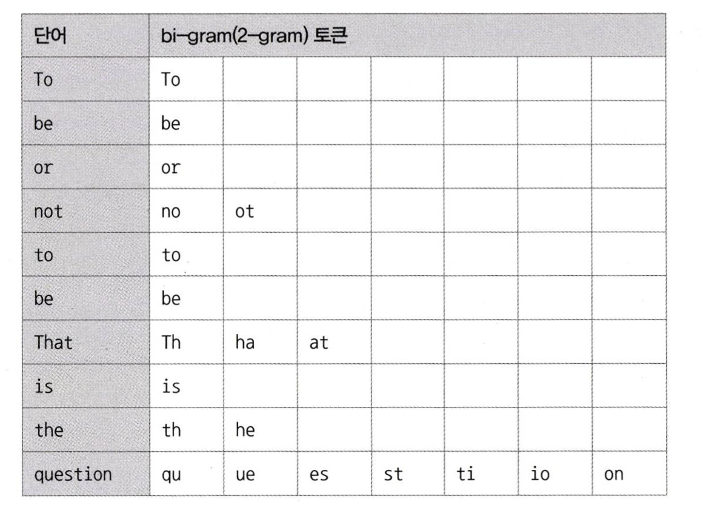

# 8.5 전문 검색 인덱스

> 전문 검색 인덱스는 문서의 내용 전체를 인덱스화해서 특정 키워드가 포함된 문서를 검색하기 위한 인덱싱 알고리즘이다.
<br>

B-Tree 인덱스의 특성 상, 전체 일치 또는 좌측 일부 일치와 같은 제약적인 검색만 가능하다. 그래서 문서 전체에 대한 분석과 검색에는 맞지 않았다.

이러한 니즈로, 전문 검색(Full Text search) 인덱스가 생겼는데 
전문 검색에서는 문서 본문의 내용에서 사용자가 검색하게 될 키워드를 분석해내고 빠른 검색용으로 사용할 수 있게 키워드로 인덱스를 구축한다.

<br>

## 8.5.1 전문 검색 인덱스 알고리즘
전문 검색 인덱스는 문서의 키워드를 인덱싱하는 기법에 따라 크게 **단어의 어근 분석**과 **n-gram 분석 알고리즘**으로 구분할 수 있다.

### 1) 어근 분석 알고리즘
**불용어(Stop Word) 처리** 와 **어근 분석(Stemming)** 2가지 과정을 거쳐서 색인 작업이 수행된다.

- 불용어 처리
  - 검색에서 가치가 없는 단어를 모두 필터링해서 제거하는 작업
  - 개수가 많지 않기 때문에 구현 코드에 모두 상수로 정의해서 사용하는 경우가 많다.
  - 불용어 자체를 사용자가 별도로 정의해서 사용할 수 있다.
- 어근 분석
  - 검색어로 선정된 단어의 뿌리인 원형을 찾는 작업
  - 한글은 단어의 변형 자체가 거의 없기 때문에 어근 분석보다는 문장의 형태소를 분석해 명사와 조사를 구분하는 기능이 더 중요하다.

### 2) n-gram 알고리즘
어근 분석 알고리즘은 매우 전문적인 전문 검색 알고리즘이기 때문에 완성도를 높이기 위해서 많은 시간과 노력이 필요하다. 
그래서 이런 단점을 보완하기 위해 n-gram 알고리즘이 도입되었다. 전문적인 검색 엔진을 고려하는게 아니라면 더 사용하기 편한 n-gram 알고리즘을 사용하면 된다.

즉, 형태소 분석이 문장을 이해하는 알고리즘이라면 n-gram은 단순히 키워드를 검색하기 위한 인덱싱 알고리즘이라고 할 수 있다.

n-garm 알고리즘은 **본문을 무조건 n개씩 잘라서 인덱싱하는 방법이다.** n은 인덱싱할 키워드의 최소 글자 수를 의미하는데, 본문을 n개로 잘라 토큰을 생성하기 때문에 인덱스의 크기는 상당히 큰 편이다.

일반적으로 2글자 단위로 키워드를 쪼개서 인덱싱하는 2-gram(Bi-gram) 방식으로 많이 사용된다.

`To be or not to be. That is the question`

위와 같은 본문을 2-gram 토큰으로 쪼개면 다음과 같다.


MYSQL 서버는 이렇게 생성된 토큰들에 대해 불용어를 걸러내는 작업을 수행한다. 
이때 불용어와 동일하거나 불용어를 포함하는 경우는 걸러서 버린다.

이렇게 걸러진 토큰을 MYSQL 서버는 전문 검색 인덱스에 등록한다. 그리고 이 토큰을 B-Tree 인덱스에 저장한다.

<br>

## 8.5.2 전문 검색 인덱스의 가용성
전문 검색 인덱스를 사용하기 위해서는 반드시 2가지 조건을 갖춰야 한다.
1. 쿼리문에 전문 검색을 위한 문법을 사용 (ex. MATCH... AGAINST...)
2. 테이블이 전문 검색 대상 컬럼에 대해서 전문 인덱스를 보유

다음과 같이 전문 검색 인덱스를 생성한다.
```sql
mysql> CREATE TABLE tb_test ( 
            doc_id INT,
            doc_body TEXT,
            PRIMARY KEY (doc_id),
            FULLTEXT KEY fx_docbody (doc_body) WITH PARSER ngram -- doc_body 컬럼에 전문 검색 인덱스 생성
       ) ENGINE=InnoDB;
```

또한 반드시 전문 검색을 위한 문법이 쿼리문에 사용되어야 한다.
```sql
-- 풀 테이블 스캔으로 쿼리가 처리된다. (전문 검색을 위한 문법을 사용하지 않음)
mysql> SELECT * FROM tb_test WHERE doc_body LIKE '%애플%';


-- 전문 검색 인덱스를 구성하는 컬럼들은 MATCH 절의 괄호 안에 모두 명시되어야 전문 검색 인덱스를 타 효율적으로 쿼리가 실행된다.
mysql> SELECT * FROM tb_test
       WHERE MATCH(doc_body) AGAINST('애플' IN BOOLEAN MODE);
```

<br>

# 8.6 함수 기반 인덱스
함수 기반의 인덱스는 컬럼의 값을 변형해서 만들어진 값에 대해 인덱스를 구축할 때 사용한다. 

함수 기반 인덱스는 인덱싱할 값을 계산하는 과정의 차이만 있을 뿐, 실제 인덱스의 내부적인 구조 및 유지관리 방법은 B-Tree 인덱스와 동일하다.

MYSQL 8.0부터 함수 기반 인덱스를 지원했는데, 구현 방법은 다음과 같이 두가지로 구분할 수 있다.

## 8.6.1 가상 컬럼을 이용한 인덱스
MYSQL 5.7부터 **가상 컬럼**을 추가하여 그 가상 컬럼에 인덱스를 생성할 수 있게 되었다.

가상 컬럼은 `VIRTUAL` 이나 `STORED` 옵션으로 만들 수 있으며, 어떤 옵션이든 해당 가상 컬럼에 인덱스를 만들 수 있다.
```sql
mysql> ALTER TABLE user
        ADD full_name VARCHAR(30) AS (CONCAT(first_name, ' ', last_name)) VIRTUAL,
        ADD INDEX ix_fullname (full_name);
```
가상 컬럼은 테이블에 새로운 컬럼을 추가하는 것과 동일하기 때문에 실제 테이블의 구조가 변경된다는 단점이 있다.

## 8.6.2 함수를 이용한 인덱스
MYSQL 8.0부터는 테이블 구조를 변경하지 않아도 함수를 직접 사용하는 인덱스를 만들 수 있게 되었다.
```sql
mysql> CREATE TABLE user (
        user_id BIGINT,
        first_name VARCHAR(10),
        last_name VARCHAR(10),
        PRIMARY KEY (user_id),
        INDEX ix_fullname ((CONCAT(first_name, ' ', last_name)))
        );
```
함수를 직접 사용하는 인덱스는 테이블의 구조를 변경하지 않고, 결과값 검색을 빠르게 만든다. 
해당 인덱스를 잘 활용하기 위해선 **반드시 조건절에 함수 기반 인덱스에 명시된 표현식이 그대로 사용되어야 한다.** 
만약 명시된 표현식과 쿼리문의 조건절에 명시된 표현식이 다르다면 MYSQL 옵티마이저는 다른 표현식으로 간주해서 함수 기반 인덱스를 타지 못한다.

<br>

# 8.7 멀티 밸류 인덱스
전문 검색 인덱스를 제외한 모든 인덱스는 인덱스 키 값과 레코드가 1:1 관계를 가진다. 
하지만 **멀티 밸류 인덱스는 하나의 데이터 레코드가 여러 개의 키 값을 가질 수 있는 형태의 인덱스다.**

최근 RDBMS들이 JSON 데이터 타입을 지원하기 시작하면서, **JSON 배열 타입의 필드에 저장된 원소들에 대한 인덱스를 지원하기 위해** MYSQL 8.0에서 멀티 밸류 인덱스가 생겼다.

```sql
mysql> CREATE TABLE user (
            user_id BIGINT AUTO_INCREMENT PRIMARY KEY, 
            first_name VARCHAR(10),
            last_name VARCHAR(10),
            credit_info JSON,
            INDEX mx_creditscores (
                (CAST(credit_info->'$.credit_scores' AS UNSIGNED ARRAY)) )
        );

mysql> INSERT INTO user VALUES (1, 'Matt', 'Lee1', '{"credit.scores":[360, 353, 351]}');
```

멀티 밸류 인덱스를 사용하기 위해서는 반드시 다음 함수들을 이용해서 검색해야만 옵티마이저가 인덱스를 활용한 실행 계획을 수립할 수 있다. 일반적인 조건 방식을 사용하면 안된다!
- MEMBER OF()
- JSON_CONTAINS()
- JSON_OVERLAPS()

<br>

# 8.9 유니크 인덱스 
유니크 인덱스는 인덱스에 값이 2개 이상 저장될 수 없음을 의미하는데, MYSQL에서는 인덱스로만 유니크 제약을 설정할 수 있다. 
프라이머리 키는 NULL이 허용되지 않는 유니크 인덱스와 같아보이지만 클러스터링 키의 역할도 하므로 유니크 인덱스와 근본적으로 다르다.

## 8.9.1 인덱스 읽기
많은 사람이 유니크 인덱스가 일반 세컨더리 인덱스보다 빠르다고 생각하지만 이는 사실이 아니다.

유니크하지 않은 세컨더리 인덱스는 중복된 값이 허용되므로 읽어야 할 레코드가 많아진 것 뿐, 인덱스 자체의 성능과는 무관하다.

**즉, 읽어야 할 레코드 건수가 같다면 성능상의 차이는 미미하다.**

## 8.9.2 인덱스 쓰기
새로운 레코드가 INSERT되거나 인덱스 컬럼의 값이 변경되는 경우에는 인덱스 쓰기 작업이 필요하다. 

그런데 유니크 인덱스의 키 값을 쓸 때는 중복 체크 과정이 추가로 필요하기 때문에 일반 세컨더리 인덱스의 쓰기보다 느리다. 

또한, InnoDB 에서는 체인지 버퍼를 사용하여 인덱스의 저장이나 변경 작업이 빨리 처리되지만 유니크 인덱스는 중복 체크 작업을 해야하므로 버퍼링하지 못한다. 이로 인해, 유니크 인덱스는 일반 세컨더리 인덱스보다 변경 작업이 더 느리다.

## 8.9.3 유니크 인덱스 사용 시 주의사항
위에서 살펴본 것처럼, 성능이 더 좋아질 것이라고 생각하고 불필요한 유니크 인덱스를 생성하지는 않는 것이 좋다.

그리고 MYSQL의 유니크 인덱스는 일반 다른 인덱스와 같은 역할을 하므로 중복해서 인덱스를 생성할 필요는 없다. (불필요한 중복)
- 똑같은 컬럼에 대해 프라이머리 키와 유니크 인덱스를 동일하게 생성 X -> 불필요한 중복임
- 똑같은 컬럼에 대해 세컨더리 인덱스와 유니크 인덱스 둘 다 생성 X -> 불필요한 중복임

결론적으로 유일성이 꼭 보장되어야 하는 컬럼에 대해서는 유니크 인덱스를 생성하고, 그렇지 않다면 세컨더리 인덱스를 생성하는 것도 좋은 방법이다.

<br>

# 8.10 외래키
외래키는 InnoDB 스토리지 엔진에서만 생성할 수 있으며, 외래키 제약이 설정되면 자동으로 연관 테이블의 컬럼에 인덱스까지 생성된다. 그리고 외래키가 제거되지 않은 상태에서는 자동으로 생성된 인덱스를 삭제할 수 없다.

이러한 InnoDB의 외래키 관리에는 중요한 특징이 있다.
- 테이블의 변경(쓰기 잠금)이 발생하는 경우에만 잠금 경합(잠금 대기)이 발생한다.
  - 자식 테이블의 외래키 컬럼의 변경은 부모 테이블의 확인이 필요하다.
  - 이 상태에서 부모 테이블의 레코드가 쓰기 잠금이 걸려 있으면 해당 쓰기 잠금이 해제될 때까지 자식 테이블의 작업은 대기하게 된다.
- 외래키와 연관되지 않은 컬럼의 변경은 최대한 잠금 경합(잠금 대기)를 발생시키지 않는다.
  - 자식 테이블의 외래키가 아닌 컬럼의 변경은 외래키로 인한 잠금 확장이 발생하지 않는다.