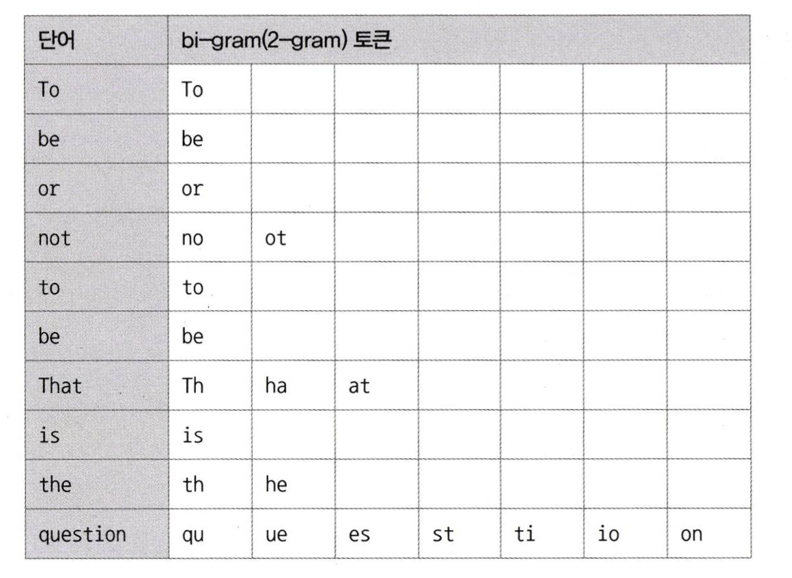

# 8.5 전문 검색 인덱스

> 전문 검색 인덱스는 문서의 내용 전체를 인덱스화해서 특정 키워드가 포함된 문서를 검색하기 위한 인덱싱 알고리즘이다.
<br>

B-Tree 인덱스의 특성 상, 전체 일치 또는 좌측 일부 일치와 같은 제약적인 검색만 가능하다. 그래서 문서 전체에 대한 분석과 검색에는 맞지 않았다.

이러한 니즈로, 전문 검색(Full Text search) 인덱스가 생겼는데 
전문 검색에서는 문서 본문의 내용에서 사용자가 검색하게 될 키워드를 분석해내고 빠른 검색용으로 사용할 수 있게 키워드로 인덱스를 구축한다.

<br>

## 8.5.1 전문 검색 인덱스 알고리즘
전문 검색 인덱스는 문서의 키워드를 인덱싱하는 기법에 따라 크게 **단어의 어근 분석**과 **n-gram 분석 알고리즘**으로 구분할 수 있다.

### 1) 어근 분석 알고리즘
**불용어(Stop Word) 처리** 와 **어근 분석(Stemming)** 2가지 과정을 거쳐서 색인 작업이 수행된다.

- 불용어 처리
  - 검색에서 가치가 없는 단어를 모두 필터링해서 제거하는 작업
  - 개수가 많지 않기 때문에 구현 코드에 모두 상수로 정의해서 사용하는 경우가 많다.
  - 불용어 자체를 사용자가 별도로 정의해서 사용할 수 있다.
- 어근 분석
  - 검색어로 선정된 단어의 뿌리인 원형을 찾는 작업
  - 한글은 단어의 변형 자체가 거의 없기 때문에 어근 분석보다는 문장의 형태소를 분석해 명사와 조사를 구분하는 기능이 더 중요하다.

### 2) n-gram 알고리즘
어근 분석 알고리즘은 매우 전문적인 전문 검색 알고리즘이기 때문에 완성도를 높이기 위해서 많은 시간과 노력이 필요하다. 
그래서 이런 단점을 보완하기 위해 n-gram 알고리즘이 도입되었다. 전문적인 검색 엔진을 고려하는게 아니라면 더 사용하기 편한 n-gram 알고리즘을 사용하면 된다.

즉, 형태소 분석이 문장을 이해하는 알고리즘이라면 n-gram은 단순히 키워드를 검색하기 위한 인덱싱 알고리즘이라고 할 수 있다.

n-garm 알고리즘은 **본문을 무조건 n개씩 잘라서 인덱싱하는 방법이다.** n은 인덱싱할 키워드의 최소 글자 수를 의미하는데, 본문을 n개로 잘라 토큰을 생성하기 때문에 인덱스의 크기는 상당히 큰 편이다.

일반적으로 2글자 단위로 키워드를 쪼개서 인덱싱하는 2-gram(Bi-gram) 방식으로 많이 사용된다.

`To be or not to be. That is the question`

위와 같은 본문을 2-gram 토큰으로 쪼개면 다음과 같다.


MYSQL 서버는 이렇게 생성된 토큰들에 대해 불용어를 걸러내는 작업을 수행한다. 
이때 불용어와 동일하거나 불용어를 포함하는 경우는 걸러서 버린다.

이렇게 걸러진 토큰을 MYSQL 서버는 전문 검색 인덱스에 등록한다. 그리고 이 토큰을 B-Tree 인덱스에 저장한다.

<br>

## 8.5.2 전문 검색 인덱스의 가용성
전문 검색 인덱스를 사용하기 위해서는 반드시 2가지 조건을 갖춰야 한다.
1. 쿼리문에 전문 검색을 위한 문법을 사용 (ex. MATCH... AGAINST...)
2. 테이블이 전문 검색 대상 컬럼에 대해서 전문 인덱스를 보유

다음과 같이 전문 검색 인덱스를 생성한다.
```sql
mysql> CREATE TABLE tb_test ( 
            doc_id INT,
            doc_body TEXT,
            PRIMARY KEY (doc_id),
            FULLTEXT KEY fx_docbody (doc_body) WITH PARSER ngram -- doc_body 컬럼에 전문 검색 인덱스 생성
       ) ENGINE=InnoDB;
```

또한 반드시 전문 검색을 위한 문법이 쿼리문에 사용되어야 한다.
```sql
-- 풀 테이블 스캔으로 쿼리가 처리된다. (전문 검색을 위한 문법을 사용하지 않음)
mysql> SELECT * FROM tb_test WHERE doc_body LIKE '%애플%';


-- 전문 검색 인덱스를 구성하는 컬럼들은 MATCH 절의 괄호 안에 모두 명시되어야 전문 검색 인덱스를 타 효율적으로 쿼리가 실행된다.
mysql> SELECT * FROM tb_test
       WHERE MATCH(doc_body) AGAINST('애플' IN BOOLEAN MODE);
```
