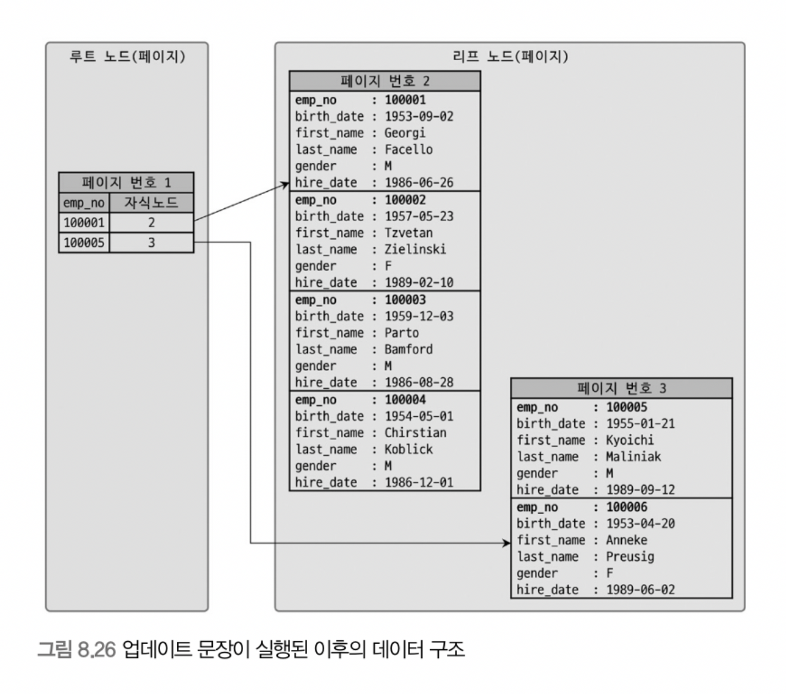

# 8.8 클러스터링 인덱스
클러스터링 인덱스는 테이블의 프라이머리 키에 대해서만 적용되며, **프라이머리 키 값이 비슷한 레코드끼리 묶어서 저장한다.** 
클러스터링 인덱스는 InnoDB 스토리지 엔진에서만 지원한다.

## 8.8.1 클러스터링 인덱스
클러스터링 인덱스에서 중요한 점은 프라이머리 키 값에 의해 레코드의 저장 위치가 결정된다는 것이다. 즉, 프라이머리 키 값이 변경되면 레코드의 물리적인 저장 위치도 변경되야 한다는 것이다. 
따라서, 클러스터링된 테이블은 프라이머리 키 값 자체에 대한 의존도가 상당히 크기 때문에 신중히 프라이머리 키를 결정해야한다.

클러스터링 인덱스는 사실 인덱스 알고리즘이라기보다 테이블 레코드 저장 방식이라고 볼 수 있다. 그래서 클러스터링 인덱스와 클러스터링 테이블은 동의어로 사용되기도 하며, 기준이 되는 프라이머리 키는 클러스터링 키라고도 표현된다.

cf) B-Tree 인덱스는 인덱스의 키 값으로 미리 정렬되어 저장된다. 하지만 B-Tree 인덱스를 클러스터링 인덱스라고 부르지 않는데, 테이블의 레코드가 프라이머리 키 값으로 정렬되어 저장된 경우만 "클러스터링"이라는 단어를 사용하기 때문이다.

#### 프라이머리 키가 없는 경우, InnoDB 에서는 아래와 같은 우선순위를 가지고 프라이머리 키를 대체할 컬럼을 고른다.
1. 프라이머리 키가 있으면 기본적으로 프라이머리 키를 선택
2. NOT NULL 옵션의 유니크 인덱스 중에서 첫 번째 인덱스를 선택
3. 자동으로 유니크한 값을 가지도록 증가되는 컬럼을 내부적으로 추가 후, 해당 키를 선택
    - 이렇게 자동 추가된 컬럼은 사용자에게 노출되지 않고 쿼리문에 명시적으로 사용할 수 없다.
    - 즉, 아무 의미 없는 숫자 값으로 클러스터링 되는 것

#### -> 그러므로 InnoDB 테이블에서는 프라이머리 키를 명시적으로 생성하는 것이 좋다!

 

## 8.8.2 세컨더리 인덱스에 미치는 영향
InnoDB 테이블의 모든 세컨더리 인덱스는 프라이머리 키 값을 저장하도록 구현되어 있다. 
- 만약 세컨더리 인덱스가 실제 레코드가 저장된 주소를 가지고 있다면, 
  - 클러스터링 키 값이 변경될 때마다 데이터의 레코드 주소가 변경됨.
  - 그때마다 해당 테이블의 모든 인덱스에 저장된 주솟값을 변경해야 하는 오버헤드 발생함.

MyISAM는 세컨더리 인덱스가 실제 레코드 주소를 저장하고 있으므로 바로 주소를 확인할 수 있다. 하지만 InnoDB는 세컨더리 인덱스가 저장하고 있는 레코드의 프라이머리 키 값을 확인하고 그 프라이머리 키 값의 인덱스를 검색해 레코드를 가져온다.

MyISAM에 비해 방식이 조금 더 복잡하지만, InnoDB에서 프라이머리 키(클러스터링 인덱스)는 더 큰 장점을 제공하기 때문에 성능 저하에 대해 너무 걱정하지 않아도 된다.

 

## 8.8.3 클러스터링 인덱스의 장점과 단점
### 장점
- 프라이머리 키(클러스터링 인덱스)로 검색할 때 처리 성능이 매우 빠르다.
  - (특히, 프라이머리 키를 범위 검색하는 경우 매우 빠름.)
- 테이블의 모든 세컨더리 인덱스가 프라이머리 키를 가지고 있기 때문에 인덱스만으로 처리될 수 있는 경우가 많다. (커버링 인덱스)
#### => 요약: 빠른 읽기(SELECT)

### 단점
- 테이블의 모든 세컨더리 인덱스가 클러스터링 키를 갖기 때문에 클러스터링 키 값의 크기가 클 경우 전체적으로 인덱스의 크기가 커진다.
- 세컨더리 인덱스를 통해 검색할 때 프라이머리 키로 다시 한번 검색해야 하므로 처리 성능이 느리다.
- INSERT 할 때 프라이머리 키에 의해 레코드 위치가 결정되므로 처리 성능이 느리다.
- 프라이머리 키를 변경할 때 레코드를 DELETE 하고 INSERT 하는 작업이 필요하기 때문에 성능이 느리다.
#### => 요약: 느린 쓰기(INSERT, UPDATE, DELETE)

일반적인 웹 서비스는 읽기가 대부분을 차지하므로 느린 쓰기를 감수하고 빠른 읽기를 유지하는 것이 중요하다. 따라서 클러스터링 인덱스는 합리적인 선택이 될 수 있다.

 

## 8.8.4 클러스터링 테이블 사용 시 주의사항
### 1) 클러스터링 인덱스 키의 크기를 고려하자
모든 세컨더리 인덱스가 프라이머리 키(클러스터링 키)를 포함하므로, **프라이머리 키의 크기가 커지면 세컨더리 인덱스도 함께 크기가 커진다.**

즉, 인덱스가 커질수록 같은 성능을 내기 위해 그만큼의 메모리가 더 필요해지므로 InnoDB 테이블의 프라이머리 키는 신중하게 선택해야 한다.

### 2) 프라이머리 키는 가능하다면 AUTO-INCREMENT 보다는 업무적인 컬럼으로 생성하자
InnoDB의 프라이머리 키는 클러스터링 키로 사용되며, 레코드의 위치가 이로 인해 결정되므로 중요하다. 또한, 프라이머리 키로 검색하는 경우 클러스터링되지 않은 테이블에 비해 매우 빠르게 처리될 수 있다.

그러므로, 업무적으로 해당 레코드를 대표할 수 있는 컬럼은 크기가 크더라도 프라이머리 키로 설정하는 것이 좋다.

### 3) 프라이머리 키는 반드시 명시하자
프라이머리 키를 정의하지 않으면 InnoDB에서는 내부적으로 일련번호 컬럼을 추가한다. 하지만 해당 일련번호는 사용자에게 보이지 않기 때문에 사용자가 사용할 수 없다. 

프라이머리 키가 업무적인 컬럼이면 베스트이지만 이가 불가능하다면, AUTO-INCREMENT 컬럼을 이용해서라도 프라이머리 키를 명시하는 것을 권장한다. (명시적으로 설정하면 사용자가 사용할 수 있음.)

### 4) AUTO-INCREMENT 칼럼을 인조 식별자로 사용하는게 더 효율적일 때도 있다
프라이머리 키를 대체하기 위해 인위적으로 추가된 프라이머리 키를 인조 식별자라고 한다. 

만약 프라이머리 키의 크기가 길어졌다고 가정하자. 
세컨더리 인덱스가 필요하지 않다면 그대로 프라이머리 키를 사용하는게 좋지만, 세컨더리 인덱스가 필요하고 프라이머리 키의 크기도 길다면 AUTO-INCREMENT 컬럼을 추가하고 이를 프라이머리 키로 설정하는 것이 좋다.

cf) INSERT 위주의 테이블(ex. 로그성 테이블)은 AUTO-INCREMENT를 이용한 인조 식별자를 프라이머리 키로 설정하는 것이 성능에 좋다.