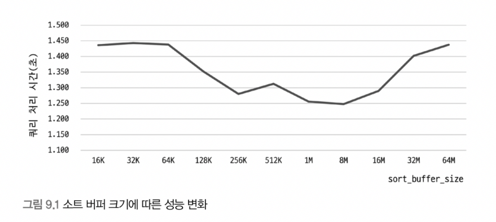
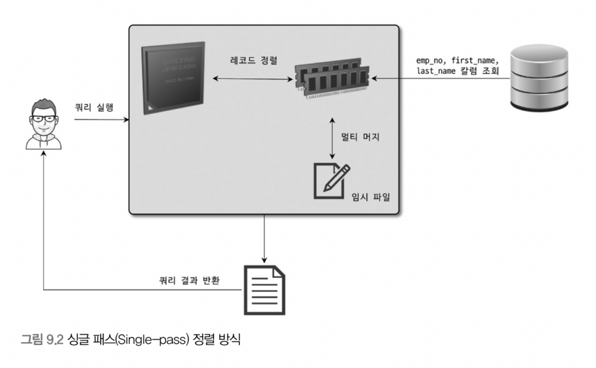
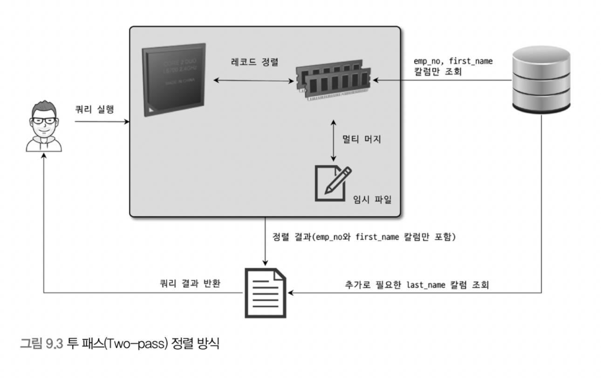
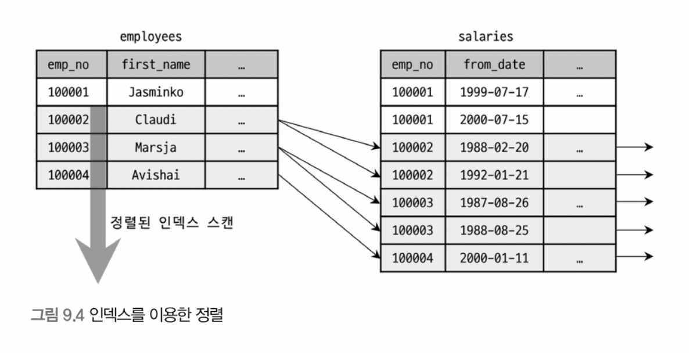
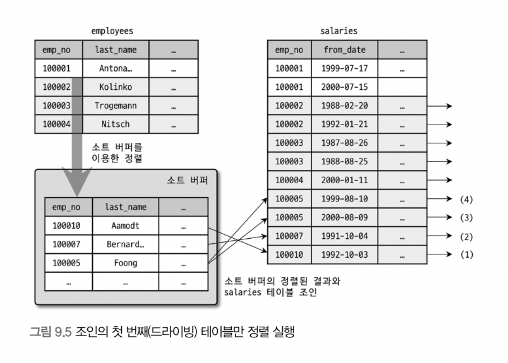
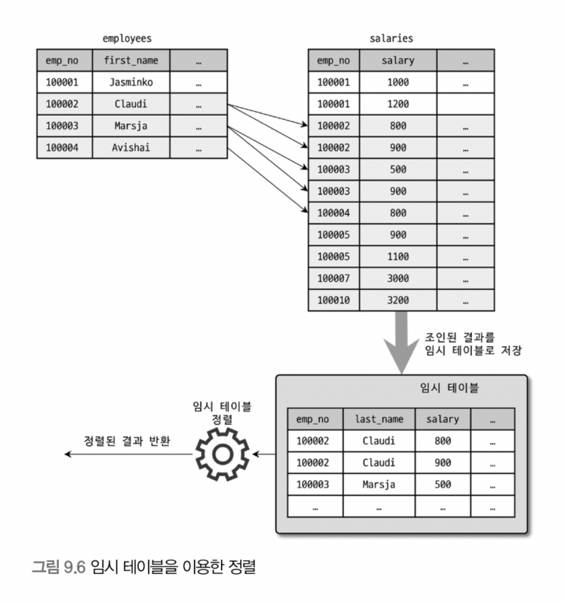
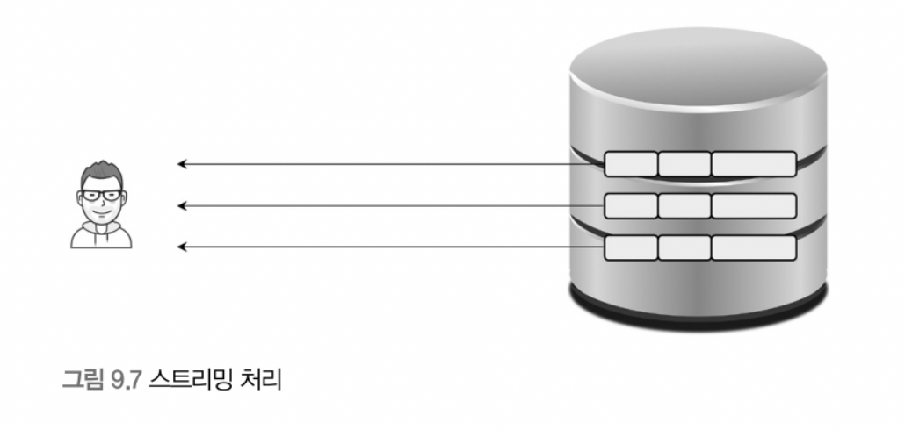
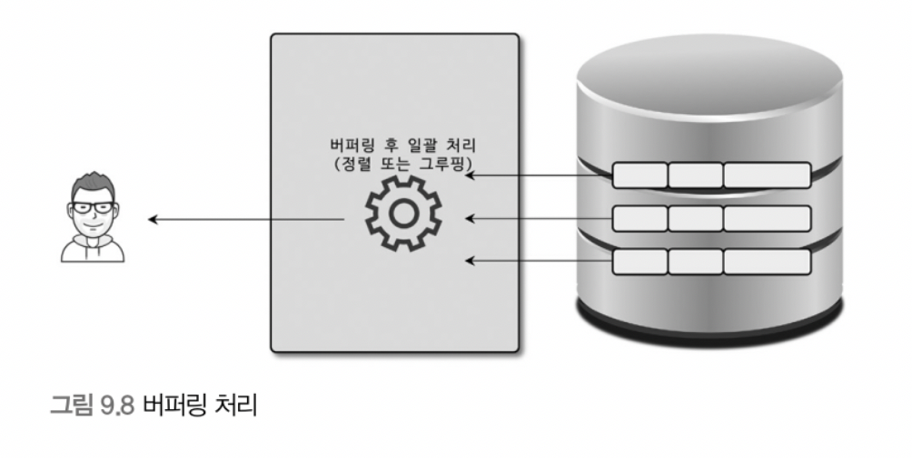

# 9. 옵티마이저와 힌트

> [9.1 개요](#9.1-개요)
>
> - 쿼리 실행 절차
>   - parsing -> 최적화 및 실행계획 수립 -> 데이터 읽기 및 처리
> - 옵티마이저의 종류
>   - 규칙 기반 최적화
>   - 비용 기반 최적화
>
> [9.2 기본 데이터 처리](#9.2-기본-데이터-처리)
>
> - full table scan, full index scan
>
> - 병렬 처리
>
> - order by 처리(index or filesort)
>
> - 소트 버퍼
>
> - 정렬 알고리즘
>
>   - 싱글 패스 정렬 방식
>   - 투 패스 정렬 방식
>
> - 정렬 처리 방법
>
>   - 인덱스를 이용한 정렬
>
>   - 조인의 드라이빙 테이블만 정렬
>   - 임시 테이블을 이용한 정렬
>   - 정렬 처리 방법의 성능 비교
>     - 스트리밍 방식
>     - 버퍼링 방식
>
> - 정렬 관련 상태 변수
>
> - GROUP BY 처리
>
>   - 인덱스 스캔 이용하는 group by(타이트 인덱스 스캔)
>   - 루스 인덱스 스캔 이용하는 group by
>   - 임시 테이블 사용하는 group by
>
> - DISTINCT 처리
>
>   - select distinct ...
>
>   - 집합 함수와 함께 사용된 distinct
>
> - 내부 임시 테이블 활용
>
>   - 메모리 임시 테이블과 디스크 임시 테이블
>
>   - 임시 테이블이 필요한 쿼리
>   - 임시 테이블이 디스크에 생성되는 경우
>   - 임시 테이블 관련 상태 변수
>

<br>

## 9.1 개요

### 9.1.1 쿼리 실행 절차

- 3단계
  - SQL Parsing(SQL 파서 모듈)
    - 사용자로부터 요청된 SQL 문장을 쪼개 MySQL 서버가 이해할 수 있는 수준으로 분리(parse tree)
    - SQL 파서 모듈이 처리
    - 문법 오류는 이 단계에서 걸러짐
    - MySQL 서버는 SQL 문장 그 자체가 아니라 파스 트리를 이용해 쿼리 실행
  - 최적화 및 실행 계획 수립(옵티마이저)
    - SQL 파싱 정보를 확인하면서 어떤 테이블부터 읽고 어떤 인덱스를 이용해 테이블을 읽을지 선택
    - 불필요 조건 제거 및 복잡한 연산 단순화
    - 여러 테이블 조인 있는 경우 어떤 순서로 테이블 읽을지 결정
    - 각 테이블에 사용된 조건과 인덱스 통계 정보를 이용해 사용할 인덱스 결정
    - 가져온 레코드들을 임시 테이블에 넣고 다시 한 번 가공해야 하는지 결정
    - 완료되면 실행 계획이 만들어짐
  - 두번째 단계에서 결정된 테이블의 읽기 순서나 선택된 인덱스를 이용해 스토리지 엔진으로부터 데이터를 가져옴
    - MySQL 엔진과 스토리지 엔진이 동시 참여해 처리

### 9.1.2 옵티마이저의 종류

##### 규칙 기반 최적화(Rule-based optimizer, RBO)

- 대상 테이블 레코드 건수나 선택도 등 고려하지 않고 옵티마이저 내장 우선순위에 따라 실행 계획 수립
- 통계 정보(테이블 레코드 건수나 컬럼값의 분포도)를 조사하지 않고 실행 계획 수립되므로 같은 쿼리에 대해 거의 항상 같은 실행 방법을 만듦
- 사용자 데이터 분포도가 매우 다양하므로 DBMS에서 거의 사용되지 않음

##### 비용 기반 최적화(Cost-based optimizer, CBO)

- 쿼리 처리가 가능한 여러가지 방법을 만들고 각 단위 작업의 비용(부하) 정보와 대상 테이블의 예측된 통계 정보를 이용해 실행 계획별 비용 산출
- 산출된 실행 방법별로 비용이 최소로 소요되는 처리 방식을 선택해 쿼리 실행
- 대부분의 DBMS가 채택하는 방식

<br>

## 9.2 기본 데이터 처리

### 9.2.1 풀 테이블 스캔과 풀 인덱스 스캔

##### 풀 테이블 스캔

- 인덱스 사용하지 않고 테이블 데이터를 처음부터 끝까지 읽어 요청 작업 처리하는 방법

- 옵티마이저가 full table scan 선택하는 경우

  - 테이블 레코드 건수가 너무 적어서 인덱스 보다 풀 테이블 스캔이 더 빠른 경우(일반적으로 테이블이 페이지 1개로 구성된 경우)
  - WHERE 절이나 ON 절에 인덱스 이용할 적절한 조건 없는 경우
  - index range scan 사용할 수 있는 쿼리더라도 옵티마이저가 판단한 조건 일치 레코드 건수가 너무 많은 경우(인덱스 B-Tree 샘플링해서 조사한 통계 정보 기준)

- Read ahead

  - full table scan은 디스크로부터 페이지를 하나씩 읽어와서 느릴 것이라고 생각하지만 오해임

  - InnoDB 스토리지 엔진은 특정 테이블의 연속된 데이터 페이지가 읽히면 백그라운드 스레드에 의해 read ahead 작업 시작

  - 어떤 영역의 데이터가 앞으로 필요할 것을 예측해서 요청이 오기 전에 미리 디스크에서 읽어 InnoDB 버퍼 풀에 가져다 두는 것

  - full table scan 실행 시 처음 몇개의 데이터 페이지는 foreground thread가 페이지 읽기 실행하지만, 특정 시점부터는 읽기 작업을 background thread로 넘김

  - background thread는 한 번에 4개 또는 8개씩 페이지 읽으면서 계속 그 수를 증가시킴

    (한 번에 최대 64개까지 데이터 페이지 읽어서 버퍼 풀에 저장)

  - forground thread는 미리 버퍼 풀에 준비된 데이터 가져다 사용만 하면 되므로 쿼리가 빨리 처리됨

  - Read ahead 시스템 변수
    - `innodb_read_ahead_threshold=56` (max 64)
    - 일반적으로 default 56이면 충분하지만 데이터 웨어하우스용으로 사용한다면 더 낮은 값으로 설정해서 더 빨리 read ahead가 시작되게 유도하는 것도 좋은 방법

<br>

##### 풀 인덱스 스캔

- 인덱스를 풀 스캔하므로 read ahead 동일하게 사용

- 예시

  ```sql
  SELECT COUNT(*) FROM employees;
  ```

  - full table scan 보다는 실행 계획에서 full index scan 가능성이 더 높음
  - 단순히 레코드 건수만 필요하므로 용량이 작은 인덱스를 선택하는 것이 디스크 읽기 횟수 줄일 수 있음

<br>

### 9.2.2 병렬 처리

- 시스템 변수
  - `innodb_parallel_read_threads=4` (1~64)
- MySQL에서는 아직까진 힌트나 옵션이 없고, where 조건 없이 단순히 테이블 전체 건수 가져오는 쿼리만 병렬로 처리 가능
- 병렬 처리용 스레드 갯수 늘리면 보통은 시간이 줄어들지만, CPU 코어 갯수 넘어서는 경우에는 오히려 성능 떨어질 수 있으니 주의

<br>

### 9.2.3 ORDER BY 처리(using filesort)

##### 정렬방법 2가지

- 인덱스
  - 장점
    - insert, update, delete 쿼리가 실행될 때 이미 인덱스가 정렬되어 있어 순서대로 읽기만 하면 되므로 매우 빠름
  - 단점
    - insert, update, delete 작업 시 부가적 인덱스 추가/삭제 작업이 필요해 느림
    - 인덱스 때문에 디스크 공간이 더 많이 필요
    - 인덱스 갯수 늘어날수록 InnoDB 버퍼 풀을 위한 메모리 많이 필요
- Filesort
  - 장점
    - 인덱스 생성하지 않아도 되므로 인덱스 이용의 단점이 장점이 됨
    - 정렬할 레코드가 많지 않으면 메모리에서 Filesort가 처리되므로 충분히 빠름
  - 단점
    - 정렬 작업이 쿼리 실행 시 처리되므로 레코드 대상 건수가 많아질수록 쿼리 응답속도 느림

##### 모든 정렬을 인덱스 이용하도록 튜닝하기 어려운 이유

- 정렬 기준이 너무 많아 요건별로 모두 인덱스 생성하는 것이 불가능한 경우
- group by 결과 또는 distinct 처리 결과 정렬해야 하는 경우
- union 결과와 같이 임시 테이블의 결과를 다시 정렬해야 하는 경우
- 랜덤하게 결과 레코드 가져와야 하는 경우

<br>

##### 소트 버퍼(Sort Buffer)

- 개요

  - 정렬이 필요한 경우에만 별도 메모리 공간 할당
  - 버퍼의 크기는 정렬해야 할 레코드 크기에 따라 가변적으로 증가하지만 최대 사용 가능 소트 버퍼 공간은 `sort_buffer_size=262144`로 조정
  - 소트 버퍼 메모리 공간은 쿼리 실행이 완료되면 즉시 시스템 반납

- **문제1**(정렬해야 할 레코드 건수가 소트 버퍼로 할당된 공간보다 크다면?)

  - 정렬 필요한 레코드를 여러 조각으로 나눠서 처리하며, 이 과정에서 디스크 사용

  - 멀티 머지(Multi-merge)

    - 메모리 소트 버퍼 정렬 -> 디스크 임시 기록 과정을 반복해서 병합
    - 이 작은 디스크 I/O 유발

  - 예시

    ```sql
    SELECT * FROM salareis
    ORDER BY to_date;
    ```

    

    <br>

    - 소트 버퍼 크기 256KB ~ 8MB 사이에서 최적
    - 어떤 데이터 정렬할지, 테스트 서버나 메모리, 디스크 특성에 따라 결과 달라짐

  - 소트 버퍼는 세션 메모리 영역에 해당하므로, 커넥션과 정렬 작업이 많으면 많을수록 소트 버퍼로 소비;되는 메모리 공간이 커짐. 이로 인해 프로세스 강제 종료나 OOME 등 문제 발생 가능

##### <br>

##### 정렬 알고리즘

> 정렬 모드 확인 방법
>
> ```sql
> -- optimizer trace 활성화
> SET OPTIMIZER_TRACE="enabled=on",END_MARKERS_IN_JSON=on;
> SET OPTIMIZER_TRACE_MAX_MEM_SIZE=1000000;
> 
> -- 쿼리 실행
> SELECT * FROM employees ORDER BY last_name;
> 
> -- 트레이스 내용 확인
> SELECT * FROM INFORMATION_SCHEMA.OPTIMIZER_TRACE;
> ```
>
> - `<sort_key, rowid>` 정렬 키와 레코드의 로우 아이디만 가져와 정렬하는 방식
> - `<sort_key, additional_fields>` 정렬 키와 레코드 전체 가져와서 정렬, 레코드 컬럼은 고정 사이즈로 메모리 저장
> - `<sort_key, packed_additional_fields>` 정렬 키와 레코드 전체 가져와서 정렬, 레코드 컬럼은 가변 사이즈로 메모리 저장

- 싱글 패스 정렬 방식

  ```sql
  SELECT emp_no, first_name, last_name
    FROM employees
  ORDER BY first_name;
  ```

  

  <br>

  - 소트 버퍼에 정렬 기준 컬럼을 포함해 SELECT 대상 되는 컬럼 전부를 담아서 정렬 수행하는 방식

- 투 패스 정렬 방식

  

  <br>

  - 정렬 대상 컬럼과 PK 값만 소트 버퍼에 담아서 정렬 수행하고, 정렬된 순서대로 다시 PK로 테이블 읽어서 값을 가져오는 정렬 방식

- 장단점

  - 투 패스 방식은 테이블을 두 번 읽어야 해서 불합리하지만, 새로운 정렬 방식은 싱글 패스는 이런 불합리가 없음

  - 하지만 싱글 패스 정렬 방식은 더 많은 소트 버퍼 공간이 필요. 소트 버퍼 공간의 크기와 레코드 크기에 의존적

    (128KB 정렬 버퍼 사용하면 투 패스 정렬에서는 7,000건 정렬 가능 하지만, 싱글 패스는 반 밖에 못함)

  - 최신 버전에서는 일반적으로 싱글 패스 정렬 방식 주로 사용

  - 하지만 투 패스 정렬 방식을 아래 상황에서는 사용

    - 레코드 크기가 max_length_for_sort_data 시스템 변수에 설정된 값보다 클 때
    - BLOG, TEXT 타입 컬럼이 조회 대상일 때

  - 모든 컬럼(*) 가져오도록 개발하지만, 이는 정렬 버퍼를 몇 배에서 몇십 배까지 비효율적으로 사용할 가능성이 높음. 특히 정렬이 필요한 select는 불필요 컬럼을 가져오지 않는 것이 효율적.


<br>

##### 정렬 처리 방법

| 정렬 처리 방법                                  | 실행 계획의 Extra 컬럼 내용            |
| ----------------------------------------------- | -------------------------------------- |
| 인덱스 사용 정렬                                | 별도 표기 없음                         |
| 조인에서 드라이빙 테이블만 정렬                 | "Using filesort" 표기                  |
| 조인에서 조인 결과를 임시 테이블로 저장 후 정렬 | "Using temporary; Using filesort" 표기 |

- 인덱스를 이용한 정렬

  

  <br>

  - order by에 명시된 컬럼이 제일 먼저 읽는 테이블(조인이 사용된 경우 드라이빙 테이블)에 속해야 함
  - order by 순서대로 생성된 인덱스가 있어야 함
  - where 절에 첫 번째로 읽는 테이블의 컬럼에 대한 조건이 있다면, 그 조건과 order by는 같은 인덱스를 사용할 수 있어야 함
  - B-Tree 계열의 인덱스가 아닌 해시 인덱스나 전문 검색 인덱스 등에서는 인덱스를 이용한 정렬 사용할 수 없음
  - 여러 테이블 조인되는 경우 Nested-loop 방식 조인에서만 가능
  - MySQL 엔진에서 별도 정렬을 위한 추가 작업 수행하지 않음
  - 조인 버퍼(Join Buffer)가 사용되면 순서가 안 맞을 수 있으므로, 정렬이 필요할 때는 인덱스더라도 order by절 명시하는 것이 좋음

- 조인의 드라이빙 테이블만 정렬

  

  <br>

  - 일반적으로 조인 수행되면 레코드 건수가 몇 배로 불어나고, 레코드 하나하나의 크기도 늘어나므로, 조인 실행 전 첫 번째 테이블 레코드 먼저 정렬 후 조인하는 것이 정렬의 차선책
  - 드라이빙 테이블 선택 조건
    - driving table의 PK를 이용해 검색하면 작업량 줄일 수 있음
    - driven table의 조인 컬럼에 인덱스가 있음

  - 그림 9-5
    - 인덱스 이용해 인덱스 조건 만족하는 9건 검색
    - 검색 결과를 last_name 컬럼으로 정렬 수행(Filesort)
    - 정렬 결과를 순서대로 읽으면서 salaries 테이블과 조인을 수행해 86건의 최종 결과 가져옴

- 임시 테이블을 이용한 정렬

  

  <br>

  - 2개 이상의 테이블 조인해서 결과 정렬해야 하면 임시 테이블 필요할 수도 있음
  - 정렬의 3가지 방법 중 정렬해야 할 레코드 건수가 가장 많으므로 가장 느린 정렬 방법

- 정렬 처리 방법의 성능 비교

  order by, group by는 작업 실행해야만 LIMIT으로 건수 제한 가능하므로 쿼리 느려지는 경우 자주 발생

  - 스트리밍 방식

    

    <br>

    - 서버 쪽에서 처리할 데이터가 얼마인지에 관계 없이 조건에 일치하는 레코드가 검색될 때마다 바로바로 클라이언트로 전송해주는 방식
    - 웹 서비스 같은 OLTP 환경에서는 쿼리 요청에서부터 첫 번째 레코드 전달받게 되기까지의 응답 시간이 중요한데, 스트리밍 처리 쿼리는 빠른 응답시간 보장
    - LIMIT 처럼 결과 건수 제한하는 조건은 쿼리 전체 실행 시간을 상당히 줄요줄 수 있음

  - 버퍼링 방식

    

    <br>

    - order by, group by는 모든 레코드 가져온 후 정렬하거나 그룹핑해서 차례대로 보내야 하므로 스트리밍 불가능
    - 결과 모아서 MySQL 서버에서 일괄 가공해야 하므로 모든 결과를 스토리지 엔진으로부터 가져올 때까지 기다려야 함
    - 버퍼링 방식으로 처리되는 쿼리는 LIMIT 처럼 결과 건수를 제한하는 조건이 있어도 성능 향상에 별로 도움이 되지 않음

<br>

##### 정렬 관련 상태 변수

```sql
FLUSH STATUS;
SHOW STATUS LIKE 'Sort%';

-- 예시
-- Sort_merge_parses 13
-- Sort_range 0
-- Sort_rows 300024
-- Sort_scan 1
```

- 몇 건의 레코드 정렬 처리 수행했는지, 소트 버퍼 간의 병합 작업(멀티 머지)은 몇 번 발생했는지 확인 가능

- 종류
  - `Sort_merge_parses` multi merge 처리 횟수
  - `Sort_range` index range scan 통해 검색된 결과에 대한 정렬 작업 누적 횟수
  - `Sort_scan` full table scan 통해 검색된 결과에 대한 정렬 작업 누적 횟수
  - `Sort_rows` 지금까지 정렬한 전체 레코드 건수


