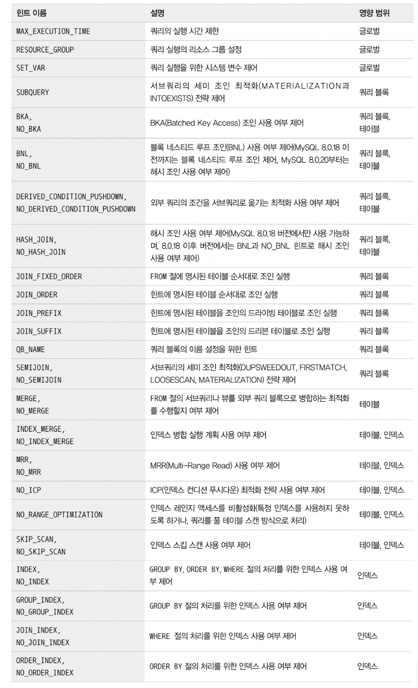

# 9.4 쿼리 힌트

인덱스의 사용법이나 좋은 실행 계획이 어떤 것인지 판단하기 힘든 상황이라면 힌트를 사용해 강제로 옵티마이저의 실행 계획에 영향을 미치는 것은 피하는 것이 좋음

지금 PK를 사용하는 것이 좋은 계획이었다고 하더라도 내일은 달라질 수 있으므로 그때그때 옵티마이저가 당시 통계 정보를 가지고 선택하게 하는 것이 가장 좋음

가장 훌륭한 최적화는 그 쿼리를 서비스에서 없애 버리거나 튜닝할 필요가 없게 데이터를 최소화하는 것, 그것이 어렵다면 데이터 모델의 단순화를 통해 쿼리를 간결하게 만들고 힌트가 필요치 않게 하는 것.

> [9.4.1 인덱스 힌트](#9.4.1-인덱스-힌트)
>
> - STRAIGHT_JOIN
> - USE INDEX / FORCE INDEX / IGNORE INDEX
> - SQL_CALC_FOUND_ROWS
>
> [9.4.2 옵티마이저 힌트](#9.4.2-옵티마이저-힌트)
>
> - 종류
> - 사용법
> - MAX_EXECUTION_TIME
> - SET_VAR
> - SEMIJOIN & NO_SEMIJOIN
> - SUBQUERY
> - BNL / NO_BNL / HASHJOIN / NO_HASHJOIN
> - JOIN_FIXED_ORDER / JOIN_ORDER / JOIN_PREFIX / JOIN_SUFFIX
> - MERGE / NO_MERGE
> - INDEX_MERGE / NO_INDEX_MERGE
> - NO_ICP
> - SKIP_SCAN / NO_SKIP_SCAN
> - INDEX / NO_INDEX

<br>

## 9.4.1 인덱스 힌트

- 단점
  - 인덱스 힌트는 MySQL 서버에 옵티마이저 힌트가 도입되기 전 사용되던 기능으로, SQL 문법에 맞게 사용해야 하므로 사용할 때 ANSI-SQL 표준 문법을 준수하지 못함
  - select, update 명령에서만 사용
- MySQL 5.6 부터 옵티마이저 힌트 도입
  - MySQL 서버 제외 RDBMS에서는 주석으로 해석하며르 ANSI-SQL 표준 준수
- 가급적 인덱스 힌트 보다는 옵티마이저 힌트 사용 추천

### STRAIGHT_JOIN

> 여러 테이블 조인 시 조인 순서 고정

```sql
-- original query
EXPLAIN
SELECT *
FROM employees e, dept_emp de, departments d
WHERE e.emp_no = de.emp_no AND d.dept_no = de.dept_no;
```

```sql
-- index hint 사용
SELECT STRAIGHT_JOIN
	e.first_name, e.last_name, d.dept_name
FROM employees e, dept_emp de, departments d
WHERE e.emp_no = de.emp_no
  AND d.dept_no = de.dept_no
;
SELECT /*! STRAIGHT_JOIN */
	e.first_name, e.last_name, d.dept_name
FROM employees e, dept_emp de, departments d
WHERE e.emp_no = de.emp_no
  AND d.dept_no = de.dept_no
;
```

- straight join 조정 필요 경우

  - 임시 테이블(인라인 뷰 또는 파생 테이블)과 일반 테이블의 조인
    - 거의 일반적으로 임시 테이블을 드라이빙 테이블로 선정하는 것이 좋음
    - 일반 테이블의 조인 컬럼에 인덱스가 없는 경우 레코드 건수가 작은 쪽을 먼저 읽도록 드라이빙 테이블로 선택하는 것이 좋음
    - 대부분 옵티마이저가 적절한 조인 순서로 선택하므로 쿼리 작성 시부터 힌트 사용할 필요는 없고, 옵티마이저가 실행 계획 제대로 수립하지 못해서 심각한 성능 저하가 있을 경우 사용
  - 임시 테이블끼리 조인
    - 임시 테이블(서브쿼리로 파생된 테이블)은 항상 인덱스가 없으므로, 어느 테이블을 먼저 드라이빙 테이블로 읽어도 무관하므로 크키가 작은 테이블을 드라이빙으로 선택
  - 일반 테이블끼리 조인
    - 양쪽 모두 인덱스 있거나 모두 없으면 레코드 건수가 적은 테이블을 드라이빙 테이블로 선택하는 것이 좋음
    - 이 외에는 조인 컬럼에 인덱스가 없는 테이블을 드르아빙 테이블로 선택

- 언급한 레코드 건수는 인덱스를 사용할 수 있는 WHERE 조건까지 만족하는 건수를 의미

  (무조건 전체 레코드 건수를 의미하는 것이 아님)

  - 예시

    ```sql
    SELECT /*! STRAIGHT_JOIN */
    	e.first_name, e.last_name, d.dept_name
    FROM employees e, dept_emp de, departments d
    WHERE e.emp_no = de.emp_no
      AND d.dept_no = de.dept_no
      AND e.emp_no = 10001;
    ;
    ```

    - employees 테이블 건수가 훨씬 많지만 조건 만족하는 employees 테이블 레코드 건수가 훨씬 적은 경우
    - 옵티마이저가 실행 계획을 잘못 수립하면 STRAIGHT_JOIN 힌트 이용해 employees 테이블을 드라이빙되게 하는 것이 좋음

- STRAIGHT_JOIN과 비슷한 역할을 하는 옵티마이저 힌트

  - JOIN_FIXED_ORDER
  - JOIN_ORDER
  - JOIN_PREFIX
  - JOIN_SUFFIX

<br>

### USE INDEX / FORCE INDEX / IGNORE INDEX

> 어떤 인덱스를 사용하거나 사용하지 말아야 할지 결정
>
> - 조인의 순서를 변경하는 것 다음으로 자주 사용
> - 사용하려는 인덱스를 가지는 테이블 뒤에 힌트 명시해야 함

```sql
SELECT * FROM employees WHERE emp_no = 10001;
SELECT * FROM employees FORCE INDEX(primary) WHERE emp_no = 10001;
SELECT * FROM employees FORCE INDEX(ix_firstname) WHERE emp_no = 10001;
```

- 3~4개 이상 컬럼 포함하는 비슷한 인덱스 여러 개 존재하는 경우 가끔 옵티마이저가 실수하는데 이 때 강제로 특정 인덱스를 사용하도록 힌트 추가
- 종류(3가지)
  - USE INDEX
    - 가장 자주 사용되는 인덱스 힌트
    - MySQL 옵티마이저에게 특정 테이블 인덱스 사용하도록 권장하는 힌트
    - 대부분 힌트에 주어진 인덱스를 사용하지만, 옵티마이저가 항상 그 인덱스를 사용하는 것은 아님
  - FORCE INDEX
    - use index와 같지만 옵티마이저에게 미치는 영향이 더 강함
    - (대체로 use index 힌트 부여 시 해당 인덱스를 사용하지 않는다면 force index로도 처리하지 못했음)
  - IGNORE INDEX
    - 특정 인덱스를 사용하지 못하게 하는 용도
    - 옵티마이저가 풀 테이블 스캔을 사용하도록 유도하기 위해 사용하기도 함
- 기타
  - USE INDEX FOR JOIN
    - join은 테이블 간 조인, 레코드 검색 용도까지 포함
    - 하나의 테이블로부터 데이터를 검색하는 작업다 JOIN이라 하기 때문에 FOR JOIN이란 이름 붙음
  - USE INDEX FOR ORDER BY
    - 명시된 인덱스를 order by 용도로만 사용
  - USE INDEX FOR GROUP BY
    - 명시된 인덱스를 group by 용도로만 사용
- 옵티마이저는 다른 일반 보조 인덱스(B-Tree 인덱스)를 사용할 수 있는 상황이더라도, 전문 검색 인덱스를 선택하는 경우가 많기도 함.(PK, 전문 검색 인덱스는 선택 시 가중치를 두고 실행 계획 수립하기 때문)

<br>

### SQL_CALC_FOUND_ROWS

> limit 사용 시 레코드 모두 찾더라도 모두 검색 수행
>
> - 개발자의 편의를 위해 만들어진 힌트

- FOUND_ROWS() 함수를 통해 레코드가 전체 몇 건인지 알아내는데, 이 힌트는 사용하지 않는 것이 좋음

- sql_calc_found_rows 힌트 사용

  ```sql
  SELECT SQL_CALC_FOUND_ROWS *
  FROM employees
  WHERE first_name = 'Georgi'
  LIMIT 0, 20
  ;
  SELECT FOUND_ROWS() AS total_record_count;
  ```

  - ix_firstname 인덱스를 통해 실제 데이터 레코드를 찾아가는 작업을 최종 결과인 n번 실행하며 랜덤 I/O도 n번 일어남

- 기존 2개 쿼리로 쪼개어 실행하는 방법

  ```sql
  SELECT COUNT(*) FROM employees WHERE fisrt_name = 'George';
  SELECT * FROM employees WHERE first_name = 'Georgi' LIMIT 0, 20;
  ```

  - 쿼리 2번 실행하지만 count 쿼리는 실제 데이터가 아니라 건수만 가져오므로 랜덤 I/O 발생하지 않음

    (covering index 쿼리이기 때문)

  - 두번째 쿼리는 랜덤 I/O 발생하지만 20번만 실행

<br>

## 9.4.2 옵티마이저 힌트

### 종류

- 인덱스: 특정 인덱스 이름을 사용할 수 있는 옵티마이저 힌트
- 테이블: 특정 테이블의 이름을 사용할 수 있는 옵티마이저 힌트
- 쿼리 블록: 특정 쿼리 블록에서 사용할 수 있는 옵티마이저 힌트로서, 특정 쿼리 블록의 이름을 명시하는 것이 아니라 힌트가 명시된 쿼리 블록에 대해서만 영향을 미치는 옵티마이저 힌트
- 글로벌(쿼리 전체): 전체 쿼리에 대해 영향 미치는 힌트



<br>

### 사용법

- 모든 인덱스 수준의 힌트는 반드시 테이블명이 선행되어야 함

  (옵티마이저 힌트가 문법에 맞지 않는 경우 경고 메시지 출력)

  ```sql
  EXPLAIN
  SELECT /*+ INDEX(employees ix_firstname) */
  	*
  FROM employees
  WHERE first_name = 'Matt';
  ```

- 특정 쿼리 블록을 외부 쿼리 블록에서 사용할 때 `QB_NAME()` 힌트 이용해 쿼리 블록에 이름 부여

  ```sql
  EXPLAIN
  SELECT /*+ JOIN_ORDER(e, s@subq1) */
  	COUNT(*)
  FROM employees e
  WHERE e.first_name = 'Matt'
    AND e.emp_no IN (SELECT /*+ QB_NAME(subq1) */ s.emp_no
                       FROM salaries s
                      WHERE s.salary BETWEEN 50000 AND 50500);
  ```

  - 위 예시는 서브쿼리에 사용된 salaries 테이블이 세미 조인 최적화를 통해 조인으로 처리될 것을 예상하고, JOIN_ORDER 힌트를 사용한 것
  - 조인의 순서로 외부 쿼리 블록의 employees 테이블과 서브 쿼리 블록의 salaries 테이블 순서대로 조인하게 힌트를 사용

<br>

### MAX_EXECUTION_TIME

> 지정 시간 초과 시 쿼리 실패(ms 단위)
>
> - 옵티마이저 힌트 중에서 유일하게 쿼리 실행 계획에 영향을 미치지 않는 힌트
>
> - 단순히 쿼리 최대 실행 시간을 설정하는 힌트

```sql
SELECT /*+ MAX_EXECUTION_TIME(100) */ *
FROM employees
ORDER BY last_name LIMIT 1;

-- ERROR 3024 (HY000): Query execution was interrupted, maximum statement execution time exceeded.
```

<br>

### SET_VAR

> 시스템 변수 조정하는 힌트

```sql
EXPLAIN
SELECT /*+ SET_VAR(optimizer_switch='index_merge_intersection=off') */ *
FROM employees
WHERE first_name = 'Georgi' AND emp_no BETWEEN 10000 AND 20000;
```

- SET_VAR 힌트는 실행 계획을 바꾸는 용도 뿐만 아니라 조인 버퍼나 정렬용 버퍼(소트 버퍼)의 크기를 일시적으로 증가시켜 대용량 처리 쿼리 성능을 향상시키는 용도로도 사용 가능
- 다만, 모든 시스템 변수를 SET_VAR로 조정할 수는 없음

<br>

### SEMIJOIN & NO_SEMIJOIN

> 어떤 세미 조인 세부 전략을 사용할지 제어
>
> - 9.3.1.9절 '세미 조인(semijoin)' 참조

|최적화 전략|힌트|
|------|---|
|Duplicate Weed-out|SEMIJOIN(DUPSWEEDOUT)|
|First Match|SEMIJOIN(FIRSTMATCH)|
|Loose Scan|SEMIJOIN(LOOSESCAN)|
|Materialization|SEMIJOIN(MATERIALIZATION)|
|Table Pull-out|없음|

- Table Pull-out
  - 선택할 수 있다면 항상 더 나은 성능을 보장하므로 별도 힌트 사용 못함

- 예시

  ```sql
  -- Fisrt Match
  SELECT *
  FROM departments d
  WHERE d.dept_no IN
  			(SELECT de.dept_no FROM dept_emp de);
  			
  -- materialization
  SELECT *
  FROM departments d
  WHERE d.dept_no IN
  			(SELECT /*+ SEMIJOIN(MATERIALIZATION) */ de.dept_no 
         FROM dept_emp de);
         
  -- NO_SEMIJOIN >> 특정 최적화 전략 사용하지 않게 하는 방법
  SELECT *
  FROM departments d
  WHERE d.dept_no IN
  			(SELECT /*+ NO_SEMIJOIN(DUPSWEEDOUT, FIRSTMATCH) */ de.dept_no 
         FROM dept_emp de);
  ```

  - 옵티마이저에 의한 Fisrt Match -> materialization

    - 조건이 서브쿼리밖에 없으므로 이 힌트가 없으면 departments table 풀 스캔하므로 Fisrt Match 최적화가 별 도움이 되지 않음
    - dept_no 읽는 서브쿼리가 먼저 실행되어 결과로 임시테이블이 만들어지고, 최종적으로 서브쿼리가 구체화된 임시 테이블과 departments 테이블 조인해서 결과 반환

  - 세미 조인 최적화 힌트는 외부 쿼리가 아니라 서브쿼리에 명시해야 함


<br>

### SUBQUERY

> 세미 조인 최적화가 사용되지 못할 때 사용하는 최적화 방법
>
> IN-to-EXISTS `SUBQUERY(INTOEXISTS)`
>
> Materialization `SUBQUERY(MATERIALIZATION)`

- 세미 조인 최적화는 주로 IN(subquery) 형태의 쿼리에 사용하지만, 안티 세미 조인(Anti Semi-Join) 최적화에는 사용될 수 없음
- 이 때 subquery 최적화 사용

<br>

### BNL / NO_BNL / HASHJOIN / NO_HASHJOIN

> hash join algorithm을 사용하게 하는 힌트
>
> 대부분은 Nested Loop Join이 사용됨

- Block Nested Loop(8.0.19) -> Hash Join Algorithm(8.0.20) 대체
- 8.0.18부터 해시 조인 알고리즘이 도입되었고, 8.0.20부터는 블록 네스티드 루프 조인은 MySQL 서버에서 더 이상 사용되지 않음

- BNL / NO_BNL

  - 8.0.20 이후 버전에서 사용하는 힌트로, 해시 조인을 사용하도록 유도하는 힌트로 용도 변경

- HASHJOIN / NO_HASHJOIN

  - 8.0.18 버전에서만 유효

- 예시

  ```sql
  SELECT /*+ BNL(e, de) */ *
  FROM employees e
  INNER JOIN dept_emp de
  ON de.emp_no = e.emp_no;
  ```

- but, **Nested Loop Join**이 주로 사용됨

  - 조인 조건이 되는 컬럼의 인덱스가 적절히 준비되어 있다면 해시 조인은 거의 사용되지 않음
  - 위의 예제에서도 힌트를 사용했지만, 실제 실행 계획에서는 해시 조인 대신 네스티드 루프 조인을 실행하게 될 것
  - 해시 조인 알고리즘이 사용되게 하려면 조인 조건이 되는 emp_no 컬럼의 인덱스를 employees 테이블과 dept_emp 테이블에서 모두 제거하거나 사용하지 못하게 해야 함

<br>

### JOIN_FIXED_ORDER / JOIN_ORDER / JOIN_PREFIX / JOIN_SUFFIX

> join 순서를 결정하는 힌트

- STRAIGHT JOIN 힌트의 단점

  - from 절에 사용된 테이블 순서를 조인 순서에 맞게 변경해야 함
  - straight_join은 한 번 사용되면 from 절에 명시된 모든 테이블의 조인 순서가 결정되므로, 일부는 조인 순서 강제하고 나머지는 옵티마이저에게 순서를 결정하게 맡기는 것이 불가능했음

- JOIN_FIXED_ORDER

  ```sql
  SELECT /*+ JOIN_FIXED_ORDER() */ *
  FROM employees e
  INNER JOIN dept_emp de ON de.emp_no = e.emp_no
  INNER JOIN departments d ON d.dept_no = de.dept_no;
  ```

  - straight_join 힌트와 동일하게 from 절의 테이블 순서대로 조인 실행

- JOIN_ORDER

  ```sql
  SELECT /*+ JOIN_ORDER(d, de) */ *
  FROM employees e
  INNER JOIN dept_emp de ON de.emp_no = e.emp_no
  INNER JOIN departments d ON d.dept_no = de.dept_no;
  ```

  - from 절에 사용된 테이블의 순서가 아니라 힌트에 명시된 테이블 순서대로 조인 실행

- JOIN_PREFIX

  ```sql
  SELECT /*+ JOIN_PREFIX(e, de) */ *
  FROM employees e
  INNER JOIN dept_emp de ON de.emp_no = e.emp_no
  INNER JOIN departments d ON d.dept_no = de.dept_no;
  ```

  - 조인에서 드라이빙 테이블만 강제

- JOIN_SUFFIX

  ```sql
  SELECT /*+ JOIN_SUFFIX(de, e) */ *
  FROM employees e
  INNER JOIN dept_emp de ON de.emp_no = e.emp_no
  INNER JOIN departments d ON d.dept_no = de.dept_no;
  ```

  - 조인에서 드리븐 테이블(가장 마지막에 조인되어야 할 테이블들)만 강제

<br>

### MERGE / NO_MERGE

> from 절의 서브쿼리를 외부 쿼리와 병합하는 최적화 제공
>
> - 옵티마이저가 내부 쿼리를 외부 쿼리와 병합하거나, 때로는 내부 임시 테이블 생성하는 것이 더 나을 수도 있는데, 최적의 방법 선택하지 못할 때 사용

- 내부 임시 테이블(파생 테이블, Derived table)

  - 예전 버전에서는 from 절에서 사용한 서브쿼리를 항상 derived table로 생성하여 불필요한 자원 소모 유발
  - 5.7, 8.0 버전에서는 가능하면 임시 테이블을 사용하지 않게 from 절의 서브쿼리를 외부 쿼리와 병합하는 최적화 도입

- 예시

  ```sql
  SELECT /*+ MERGE(sub) */ *
  FROM (SELECT *
          FROM employees
         WHERE first_name = 'Matt') sub
  ;
  
  SELECT /*+ NO_MERGE(sub) */ *
  FROM (SELECT *
          FROM employees
         WHERE first_name = 'Matt') sub
  ;
  ```

<br>

### INDEX_MERGE / NO_INDEX_MERGE

> 하나의 테이블에 대해 여러 개의 인덱스를 동시 사용하는 힌트

- MySQL 서버는 가능하다면 테이블당 하나의 인덱스만을 이용해 쿼리 처리하지만, 인덱스만으로 검색 대상 범위를 충분히 좁힐 수 없으면 옵티마이저는 사용 가능한 다른 인덱스 이용
- 여러 인덱스를 통해 검색된 레코드로부터 교집합 또는 합집합 구해서 결과 반환

- 예시

  ```sql
  -- index_merge
  SELECT /*+ INDEX_MERGE(employees ix_firstname, PRIMARY) */ *
  FROM employees
  WHERE first_name = 'Georgi'
    AND emp_no BETWEEN 10000 AND 20000
  ;
  
  -- no_index_merge
  SELECT /*+ NO_INDEX_MERGE(employees PRIMARY) */ *
  FROM employees
  WHERE first_name = 'Georgi'
    AND emp_no BETWEEN 10000 AND 20000
  ;
  ```

<br>

### NO_ICP

> ICP(Index Condition Pushdown)
>
> - 5.5 버전까지는 인덱스를 범위 제한 조건으로 사용하지 못하는 조건은 MySQL 엔진이 스토리지 엔진으로 아예 전달해주지 않았지만, 인덱스에 포함된 컬럼의 조건이 있다면 모두 모아서 스토리지 엔진으로 전달할 수 있게 해주는 hadler API 기능
> - 인덱스를 이용해 최대한 필터링까지 완료하는 방법

- ICP 최적화는 사용 가능하다면 항상 성능 향상에 도움이 되므로 옵티마이저는 ICP를 사용하는 방향으로 계획 수립

- 예시

  ```sql
  SELECT /*+ NO_ICP(employees ix_lastname_fisrtname) */ *
  FROM employees
  WHERE last_name = 'Action' AND first_name LIKE '%sal';
  ```

<br>

### SKIP_SCAN / NO_SKIP_SCAN

> 인덱스 선행 컬럼에 대한 조건이 없어도 옵티마이저가 해당 인덱스를 사용할 수 있게 해줌

- 조건 누락된 선행 컬럼이 가지는 유니크한 값의 갯수가 많아지면 인덱스 스킵 스캔의 성능은 오히려 더 떨어짐

- MySQL 옵티마이저가 유니크한 값의 갯수를 제대로 분석하지 못하거나 잘못된 경로로 인해 비효율적인 인덱스 스킵 스캔을 선택하면 NO_SKIP_SCAN 이용

- 예시

  ```sql
  SELECT /*+ NO_SKIP_SCAN(employees ix_gender_birthdate) */ 
      gender, birth_date
  FROM employees
  WHERE birth_date >= '1965-02-01';
  ```

<br>

### INDEX / NO_INDEX

> 예전 버전에서 사용되던 인덱스 힌트를 대체하는 옵티마이저 힌트 제공

| 인덱스 힌트            | 옵티마이저 힌트 |
| --------------------- | --------------- |
| USE INDEX                 | INDEX           |
| USE INDEX FOR GROUP BY    | GROUP_INDEX     |
| USE INDEX FOR ORDER BY    | ORDER_INDEX     |
| IGNORE INDEX              | NO_INDEX        |
| IGNORE INDEX FOR GROUP BY | NO_GROUP_INDEX  |
| IGNORE INDEX FOR ORDER BY | NO_ORDER_INDEX  |

- 인덱스 힌트는 특정 테이블 뒤에 사용하여 별도로 힌트 내에 테이블명 없이 인덱스 이름만 나열했지만, 옵티마이저 힌트는 테이블명과 인덱스 이름을 함께 명시해야 함

- 예시

  ```sql
  -- index hint
  SELECT *
  FROM employees USE INDEX(ix_firstname)
  WHERE first_name = 'Matt';
  
  -- optimizer hint
  SELECT /*+ INDEX(employees ix_firstname) */ *
  FROM employees
  WHERE first_name = 'Matt';
  ```