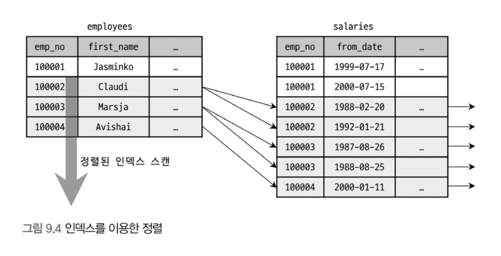
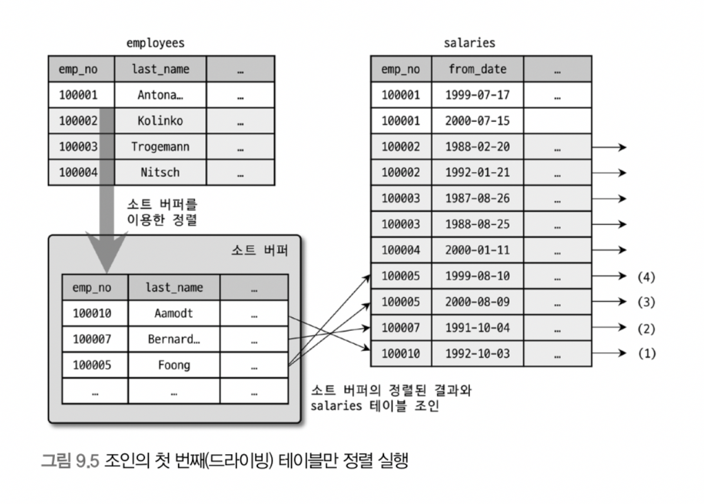
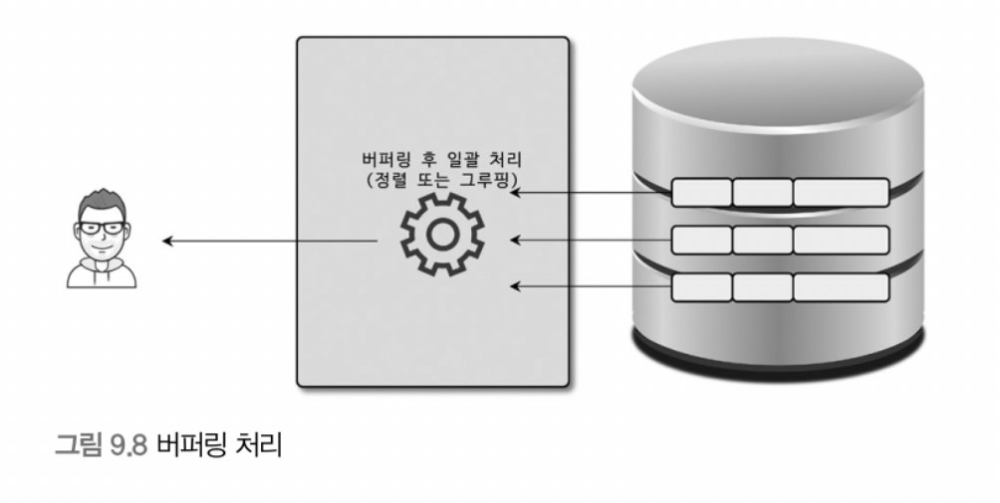

# 9.1 옵티마이저 개요
쿼리를 최적으로 실행하기 위해 각 테이블의 데이터가 어떤 분포로 저장되어 있는지 통계 정보를 참조해 최적의 실행 계획을 수립한다. 이러한 작업을 **옵티마이저**가 담당하고 있다.

MYSQL에서는 `EXPLAIN` 명령으로 쿼리의 실행 계획을 확인할 수 있는데, 실행 계획에 표시된 내용을 제대로 이해하기 위해서 옵티마이저가 실행하는 최적화에 대한 지식이 필요하다.

## 9.1.1 쿼리 실행 절차
쿼리가 실행되는 과정은 크게 세 단계로 나눌 수 있다.
1. 요청된 SQL 문장을 쪼개서 MYSQL 서버가 이해할 수 있는 수준으로 분리(파스 트리)
    - SQL 파싱 단계
    - MYSQL 서버의 SQL 파서라는 모듈로 처리
    - SQL 문법 오류가 이 단계에서 걸러짐
    - 1단계가 완료되면 SQL 파스 트리가 만들어짐
2. SQL의 파싱 정보(파스 트리)를 확인하면서 어떤 테이블을 읽을지, 어떤 인덱스를 이용할지 선택
   - 최적화 및 실행 계획 수립 단계
   - MYSQL 서버의 옵티마이저에서 처리
   - MYSQL 서버는 SQL 파스 트리를 사용해 쿼리를 실행함
   - 불필요한 조건 제거 및 복잡한 연산 단순화
   - 테이블 조인의 경우 어떤 순서로 테이블 읽을지 결정
   - 각 테이블에 사용된 조건과 인덱스 통계 정보를 이용해 사용할 인덱스 결정
   - 가져온 레코드들을 임시 테이블에 넣고 재가공해야 하는지 결정
   - 2단계가 완료되면 실행 계획이 수립됨
3. 결정된 테이블의 읽기 순서나 선택된 인덱스를 이용해 스토리지 엔진으로부터 데이터를 가져옴
   - 2단계에서 만들어진 실행 계획대로 스터리지 엔진이 레코드를 가져오도록 함
   - 스토리지 엔진으로부터 받은 레코드를 조인하거나 정렬하는 작업 수행

## 9.1.2 옵티마이저의 종류
현재 대부분의 RDBMS는 비용 기반 최적화 방법을 사용하고 있다.
- 규칙 기반 최적화
  - 옵티마이저에 내장된 우선순위에 따라 실행 계획을 수립하는 방식.
  - 같은 쿼리에 대해서는 거의 항상 같은 실행 방법을 선택한다.
- 예전 초기 버전으로 이제는 거의 사용되지 않는다.
- 비용 기반 최적화
  - 쿼리를 처리하기 위한 여러 방법을 만들고, 각 단위 작업의 비용과 예측된 통계 정보를 이용해 실행 계획별 비용을 산출한다.
  - 최소로 소요되는 처리 방식을 선택해 최종적으로 쿼리를 실행한다.
  - 현재 대부분의 DBMS가 사용중이다.

<br>

# 9.2 옵티마이저의 기본 데이터 처리
### 9.2.1 풀 테이블 스캔과 풀 인덱스 스캔
풀 테이블 스캔은 인덱스를 사용하지 않고 테이블의 데이터를 처음부터 끝까지 읽어 처리하는 작업을 의미한다. MYSQL 옵티마이저는 다음과 같은 조건일 때 주로 풀 테이블 스캔을 선택한다.
- 레코드 건수가 너무 작은 경우(테이블이 페이지 1개로 구성된 경우)
  - 인덱스를 통해 읽는 것보다 풀 테이블 스캔을 하는 편이 더 빠름
- WHERE절이나 ON절에 인덱스를 이용할 수 있는 적절한 조건이 없는 경우
- 인덱스를 쓸 수 있더라도 조건 일치 레코드 건수가 너무 많은 경우

대부분의 DBMS는 풀 테이블 스캔 시 한꺼번에 여러 개의 블록이나 페이지를 읽어오는 기능을 내장하고 있다. (MYSQL은 InnoDB 스토리지 엔진에서만 지원됨)

InnoDB에서는 특정 테이블의 연속된 데이터 페이지가 읽히면 **백그라운드 스레드에 의해 리드 어헤드 작업이 자동으로 실행된다.**  
리드 어헤드(Read ahead)란 어떤 영역의 데이터가 앞으로 필요해질 것을 예측해서 미리 디스크로부터 데이터를 읽어와 InnoDB 버퍼 풀에 담아두는 것을 의미한다.

**풀 테이블 스캔이 일어나면 포그라운드 스레드가 페이지 읽기를 실행하지만 특정 시점부터는 해당 읽기 작업을 백그라운드 스레드로 넘긴다.** 
백그라운드 스레드는 한번에 최대 64개의 데이터 페이지를 읽어서 버퍼 풀에 저장해둔다. 
**포그라운드 스레드는 미리 버퍼 풀에 준비된 데이터를 가져다 사용하면 되므로 쿼리가 빠르게 처리될 수 있다.**

```sql
mysql> SELECT COUNT(*) FROM employees;
```
위와 같은 쿼리문은 풀 인덱스 스캔을 하게 될 가능성이 높다. 
MYSQL 입장에서는 단순히 레코드의 건수만 필요로 하는 쿼리라면 용량이 작은 인덱스를 선택하는 것이 디스크 읽기 횟수를 줄일 수 있기 때문이다.
```sql
mysql> SELECT * FROM employees;
```
하지만 다음과 같이 레코드에만 있는 컬럼이 필요한 쿼리의 경우에는 풀 인덱스 스캔을 사용하지 못하고 풀 테이블 스캔을 하게 된다.

### 9.2.2 병렬 처리
MYSQL 8.0부터는 용도가 한정되어 있긴 하지만 하나의 쿼리를 여러 스레드가 나누어 동시에 처리할 수 있는 병렬 처리가 가능해졌다.

`innodb_parallel_read_threads`라는 시스템 변수를 이용해 하나의 쿼리를 최대 스레드 몇 개를 이용해서 처리할지 변경할 수 있다. 
아직 MYSQL에서는 아무런 WHERE 조건 없이 단순히 테이블 전체 건수를 가져오는 쿼리만 병렬로 처리할 수 있다.

### 9.2.3 ORDER BY 처리(Using filesort)
정렬을 처리하는 방법은 인덱스를 이용하는 방법과 쿼리가 실행될 때 Filesort라는 별도의 처리를 이용하는 방법으로 나눌 수 있다.

- 인덱스 이용
  - 장점
    - DML 쿼리(SELECT 제외)가 실행될 때 이미 인덱스가 정렬되어 있으므로, 읽을 때(DML 쿼리의 조건절을 검색할 때) 매우 빠르다.
  - 단점
    - 부가적인 인덱스 추가/삭제 작업이 필요하므로 실제로 데이터를 INSERT/UPDATE/DELETE 작업을 할 때 느리다.
    - 인덱스 때문에 디스크 공간이 더 많이 필요하다.
    - 인덱스 수가 늘어날수록 버퍼 풀을 위한 메모리가 많이 필요하다.
- Filesort 이용
  - 장점
    - 인덱스가 필요 없으므로 인덱스의 단점이 장점으로 바뀐다.
    - 정렬해야 할 레코드가 적을수록 메모리에서 Filesort가 처리되므로 빠르다.
  - 단점
    - 정렬 작업이 쿼리 실행 시에 처리되므로, 레코드 건수가 많아질수록 쿼리 속도가 느려진다.

정렬 처리를 할 때 인덱스를 이용하면 좋겠지만 모든 정렬에 인덱스를 이용하도록 튜닝하는 것은 불가능하다.
- 정렬 기준이 너무 많아 요건별로 인덱스를 생성할 수 없는 경우
- GROUP BY의 결과 또는 DISTINCT 같은 처리 결과를 정렬해야 하는 경우
- UNION의 결과와 같이 임시 테이블의 결과를 재정렬하는 경우
- 랜덤하게 결과 레코드를 가져와야하는 경우

위와 같은 4가지 경우는 인덱스를 이용하지 못하므로 Filesort 정렬 작업을 거칠 수밖에 없다.

MYSQL 서버가 인덱스를 사용하지 않고 별도의 정렬 처리를 수행하게 되면, 실행 계획의 Extra 컬럼에 "Using filesort"라는 메시지가 표시된다. 
이를 통해 MySQL 서버가 어떤 정렬 처리 방법을 사용했는지 판단할 수 있다.

<br>

### 9.2.3.1 소트 버퍼
소트버퍼란 정렬을 수행하기 위해 할당받은 별도의 메모리 공간을 말한다. 
소트 버퍼는 정렬이 경우에만 정렬해야 할 레코드의 크기에 따라 가변적으로 할당된다. 소트 버퍼를 위한 메모리 공간은 쿼리 실행이 끝나면 즉시 시스템으로 반납된다.

하지만 정렬해야 할 레코드의 건수가 소트 버퍼에 할당된 공간보다 클 수 있다. 이럴 때는 레코드를 여러 조각으로 나누어 처리하고 이때 임시 저장을 위해 디스크를 사용한다. 
각 버퍼 크기만큼 정렬된 레코드를 다시 병합하면서 정렬을 수행하는데, 이 작업을 **멀티 머지(Multi-merge)** 라고 한다. 이 작업은 모두 디스크 I/O를 유발하며, 레코드가 많을수록 반복 작업의 횟수도 많아진다.

### 9.2.3.2 정렬 알고리즘
레코드를 정렬할 때, 소트 버퍼에 어떤 레코드를 담을지 그 기준에 따라 2가지 정렬 모드로 나눌 수 있다. 정렬 수행 쿼리가 어떤 정렬 모드를 사용하는지는 옵티마이저 트레이스 기능으로 확인 가능하다.

- 싱글 패스(Single-pass)
  - 정렬 키와 레코드 전체를 가져와 정렬하는 방식
  - 레코드 전체를 가져오기 떄문에 더 많은 소트 버퍼 공간이 필요하다.
  - 정렬 대상 레코드의 크기나 건수가 작은 경우 효율적이다.
  - 최신 버전에서는 일반적으로 싱글 패스 정렬 방식을 주로 사용한다.
  - additional_fields : 레코드 컬럼들은 고정 사이즈로 메모리 저장
  - packed_additional_fields : 레코드의 컬럼들은 가변 사이즈로 메모리 저장

- 투 패스(Two-pass)
  - 정렬 키와 rowid만 가져와 정렬하는 방식
  - 정렬 대상 컬럼과 프라이머리 키 값만 소트 버퍼에 담아 정렬하고, 정렬된 순서대로 프라이머리 키로 다시 테이블을 조회해 컬럼을 가져온다.
  - 테이블을 2번 조회해야하므로 비효율적이다.
  - 정렬 대상 레코드의 크기나 건수가 많은 경우 효율적이다.

#### [중요] 정렬이 필요한 SELECT는 불필요한 컬럼을 SELECT하지 않게 쿼리를 작성하는 것이 좋다! 
#### >> 모든 컬럼(*) 보단, 필요한 컬럼을 명시적으로 작성하여 SELECT하자.

<br>

### 9.2.3.3 정렬 처리 방법
쿼리에 ORDER BY가 사용되면 아래와 같은 3가지 방법 중 하나로 처리가 되는데, 아래로 내려갈수록 처리 속도가 느려진다.

1. 인덱스를 사용한 정렬
2. 조인에서 드라이빙 테이블만 정렬 : "Using filesort" 메시지 표시
3. 조인에서 조인 결과를 임시 테이블로 저장 후 정렬 : "Using temporary; Using filesort" 메시지 표시

MYSQL 옵티마이저가 정렬 대상 레코드를 최소화하기 위해, 다음과 같은 두가지 방법 중 하나를 선택한다.
- 조인의 드라이빙 테이블만 정렬한 다음 조인을 수행
- 조인이 끝나고 일치하는 레코드를 모두 가져온 후 정렬을 수행

조인이 수행되면서 레코드 건수, 크기는 크게 불어나기 때문에 가능하다면 **드라이빙 테이블만 정렬한 다음 조인을 수행하는 것이 효율적이다.**

1. 인덱스를 이용한 정렬
- 반드시 ORDER BY에 명시된 컬럼이 제일 먼저 읽는 테이블(조인이 사용된 경우 드라이빙 테이블)이어야 한다.
- **ORDER BY 순서대로 생성된 인덱스가 있어야 한다.**
- WHERE절에서 '첫 번째로 읽는 테이블의 컬럼'에 대한 조건이 있다면, 그 조건과 ORDER BY는 같은 인덱스를 사용할 수 있어야 한다.
- 해시 인덱스, 전문 검색 인덱스, R-Tree 등에서는 해당 정렬 처리 방법을 사용할 수 없다.
- 스트리밍 방식으로 쿼리가 처리된다.


#### [중요] 정렬이 필요한 조회 쿼리라면 무조건 ORDER BY 를 명시해라!
#### >> 인덱스를 이용한 정렬을 사용하면, ORDER BY를 넣지 않아도 자동으로 정렬된다. 또한 MYSQL 서버에서 인덱스로 정렬이 처리될 때 ORDER BY가 명시되었다고 해서 부가적으로 불필요한 정렬 작업 수행하지 않아, 작업량이 더 늘지 않는다.
#### >> 만약 ORDER BY가 명시되지 않은 쿼리가 어떤 이유로 인해 실행 계획이 변경된다면 정렬이 되지 않은 결과를 가져와 버그로 연결될 수 있다.

2. 조인에서 드라이빙 테이블만 정렬
- 조인을 실행하기 전 1번째로 읽히는 테이블(드라이빙 테이블)의 레코드를 먼저 정렬한 다음 조인을 실행한다.
- **드라이빙 테이블의 컬럼만으로 ORDER BY 절을 작성해야만** 이 방법으로 정렬 처리가 된다.
- 버퍼링 방식으로 쿼리가 처리된다.


3. 조인에서 조인 결과를 임시 테이블로 저장 후 정렬
- 위의 경우를 뺀 나머지 경우의 쿼리에서는, 항상 조인 결과를 임시 테이블에 저장하고, 다시 정렬하는 과정을 거친다.
- 정렬해야 할 레코드 건수가 가장 많기 때문에 가장 느린 정렬 방법이다.
- 버퍼링 방식으로 쿼리가 처리된다.


<br>

3가지 정렬 처리 방법이 왜 성능 차이가 나는지를 알기 위해서 쿼리가 처리되는 방법을 살펴볼 필요가 있다. 
쿼리가 처리되는 방법에는 "스트리밍 처리" 와 "버퍼링 처리" 방법이 있다.

1. 스트리밍 처리 방식
- 서버 쪽에서 처리할 데이터가 얼마인지 상관없이, 조건에 일치하는 레코드가 검색될 때마다 바로 클라이언트로 전송해주는 방식
- 얼마나 많은 레코드를 조회하는지 상관없이 곧바로 첫 번째 레코드를 클라이언트에 보낸다. (빠른 응답 보장)
- LIMIT 과 같이 결과 건수를 제한하는 조건을 사용하면 가져오는 레코드의 레코드 건수가 줄어들어 쿼리의 전체 실행 시간을 상당히 줄일 수 있다.


1. 버퍼링 처리 방식
- ORDER BY, GROUP BY 같은 처리는 쿼리 결과가 스트리밍되는 것을 불가능하게 한다.
  - WHERE 조건에 일치하는 레코드를 모두 가져온 후, 정렬하거나 그루핑해서 차례대로 보내야하기 때문

1. 버퍼링 방식으로 처리되는 쿼리는 먼저 결과를 모은다.
2. MYSQL 서버에서 일괄 가공해야 하므로 모든 결과를 스토리지 엔진으로부터 가져올 때까지 기다린다.
3. 정렬 작업을 하는 동안 클라이언트는 결과를 기다려야 하므로 응답 속도가 느려진다.
4. 결과 건수를 제한하는 조건을 사용해도 성능 형상에 도움이 되지 않는다.


<br>

## 9.2.4 GROUP BY 처리
GROUP BY 또한 ORDER BY처럼 스트리밍 처리를 할 수 없다. 
HAVING 절(GROUP BY에 사용된 조건)은 **인덱스를 사용해 처리될 수 없어 HAVING 절을 튜닝하려고 인덱스를 생성하거나 다른 방법을 고민할 필요는 없다.**

GROUP BY 작업은 인덱스를 사용하는 경우와 그렇지 못한 경우로 나눌 수 있다.
1. 인덱스를 사용하는 경우
- 인덱스를 차례대로 읽는 인덱스 스캔 방법(타이트 인덱스 스캔)
- 인덱스를 건너뛰면서 읽는 루스 인덱스 스캔 방법
2. 인덱스를 사용하지 못하는 경우
- 임시 테이블 이용

### 1-1. 인덱스 스캔을 이용하는 GROUP BY (타이트 인덱스 스캔)
1. 조인의 드라이빙 테이블에 속한 컬럼만 이용해 그루핑할 때, GROUP BY 컬럼으로 이미 인덱스가 있다면 
2. 해당 인덱스를 차례대로 읽으면서 
3. 그루핑 작업을 수행하고 
4. 그 결과로 조인을 수행한다.

이미 정렬된 인덱스를 읽는 것이기 때문에 쿼리 실행 시점에 추가 정렬 작업이나 임시 테이블은 필요하지 않다.

### 1-2. 루스 인덱스 스캔을 이용하는 GROUP BY
루스 인덱스 스캔 방식은 인덱스의 레코드를 건너뛰면서 필요한 부분만 읽어서 가져오는 것을 말한다. 이 스캔방식을 사용할 때는 실행 계획의 Extra 컬럼에 **Using index for group-by** 코멘트가 표시된다. 
또한, 루스 인덱스 스캔으로 처리되는 쿼리에서는 별도의 임시 테이블이 필요하지 않다는 점도 기억하자.

```sql
mysql> EXPLAIN
        SELECT emp_nᄋ
        FROM salaries
        WHERE from_date='1985-03-01' 
        GROUP BY emp_no;

+----+----------+-------+---------+---------------------------------------+
| id | table    | type  | key     | Extra                                 |
+----+----------+-------+---------+---------------------------------------+
|  1 | salaries | range | PRIMARY | Using where; Using index for group-by |
+----+----------+-------+---------+---------------------------------------+
```
해당 쿼리는 루스 인덱스 스캔으로 처리되는데 쿼리의 실행 순서는 다음과 같다.
1. (emp_no, from_date) 인덱스를 차례로 스캔하면서 emp_no의 첫 번째 유일한 값 10001을 찾아낸다.
2. emp_no가 10001인 것 중에서 from_date가 ‘1985-03-01’인 레코드만 가져온다.
3. emp_no의 그 다음 유니크한 값을 가져온다.
4. 3번의 결과가 없으면 처리를 종료하고, 결과가 있다면 2번 과정을 반복 수행한다.

#### MYSQL의 루스 인덱스 스캔 방식은 단일 테이블의 GROUP BY 처리에만 사용할 수 있다! 
#### 또한 컬럼 값의 앞쪽 일부만으로 생성된 프리픽스 인덱스는 루스 인덱스 스캔을 사용할 수 없다.
#### 인덱스 레인지 스캔에서는 인덱스의 유니크한 값이 많을수록 성능이 향상되었지만, 루스 인덱스 스캔에서는 유니크한 값이 적을수록 성능이 향상된다!

### 2-1. 임시 테이블을 사용하는 GROUP BY
GROUP BY의 기준 컬럼이 드라이빙 테이블이든 드리븐 테이블이든 관계없이 인덱스를 전혀 사용하지 못할 때는 임시 테이블을 사용하여 처리된다.

MYSQL 8.0에서는 GROUP BY가 필요한 경우 내부적으로 GROUP BY 절의 컬럼들로 구성된 유니크 인덱스를 가진 임시 테이블을 만들어 중복 제거와 집합 함수 연산을 수행한다.
- 임시테이블을 만들고, 조인의 결과를 한 건씩 가져와 임시 테이블에서 중복 체크를 하면서 INSERT/UPDATE를 수행한다.
- 즉, 별도의 작업없이 GROUP BY가 처리된다.

실행 계획의 Extra 컬럼에 **Using temporary** 코멘트가 표시되며, MYSQL 8.0부터는 묵시적 정렬을 수행하지 않으므로 Using filesort 코멘트는 표시되지 않는다.

하지만, MYSQL 8.0에서도 GROUP BY와 ORDER BY가 같이 사용되면 명시적으로 정렬 작업을 수행한다. 이때는 실행 계획에서 Using temporary 와 함께 Using filesort 코멘트도 표시된다.

<br>

## 9.2.5 DISTINCT 처리
특정 컬럼의 유니크한 값을 조회하기 위해 SELECT 쿼리에 DISTINCT를 사용한다. 
DISTINCT는 1) 집합 함수와 함께 사용되는 경우와 2) 사용되지 않는 경우에 따라 영향을 미치는 범위가 달라지기 때문에 구분하여 살펴봐야 한다.

### 1) 집합 함수와 함께 사용되지 않은 경우 (SELECT DISTINCT ...)
- GROUP BY와 동일한 방식으로 처리된다. 
- DISTINCT는 특정 컬럼을 유니크하게 조회하는 것이 아니라 **SELECT하는 레코드를 유니크하게 조회**해오는 것이다.
- 즉, SELECT 절에 사용된 DISTINCT 키워드는 조회되는 모든 컬럼에 영향을 미친다.
- MYSQL 서버는 DISTINCT 뒤에 괄호가 오면 의미없이 사용된 걸로 해석하여 제거해버린다.

```sql
-- 해당 쿼리는 (first_name, last_name) 의 조합을 SELECT해올 때 해당 조합 전체가 유니크한 레코드를 가져오는 것이다.

mysql> SELECT DISTINCT first_name, last_name FROM employees;
```

### 2) 집합 함수와 함께 사용되는 경우 ( COUNT(DISTINCT ), MIN(DISTINCT ) ...)
- 그 집합 함수의 인자로 전달된 컬럼 값이 유니크한 값들을 가져온다.

```sql
mysql> SELECT COUNT(DISTINCT s.salary)
        FROM employees e, salaries s 
        WHERE e.emp_no=s.emp_no
        AND e.emp_no BETWEEN 100001 AND 100100;
```
- 내부적으로 `COUNT(DISTINCT s.salary)`를 처리하기 위해 임시 테이블을 사용한다.
  - employees 와 salaries 테이블을 조인한 결과에서 salary 컬럼의 값만 저장하기 위해 임시 테이블이 필요하다.
- 임시 테이블의 salary 컬럼은 유니크 인덱스가 생성되기 때문에, 레코드 수가 많아진다면 상당히 느려질 수 있다.
- 인덱스된 컬럼에 대해 DISTINCT 처리를 수행할 때, 인덱스 풀 스캔이나 레인지 스캔하면서 임시 테이블 없이 최적화된 처리를 수행할 수 있다.

<br>

## 9.2.6 내부 임시 테이블 활용
스토리지 엔진으로부터 받아온 레코드를 정렬하거나 그루핑할 때, 내부적인 임시 테이블을 사용한다. 

MYSQL 엔진이 일반적으로 사용하는 임시 테이블은
- 사용자가 생성함. ("CREATE TEMPORARY TABLE")
- 처음에는 메모리에 생성되었다가 테이블의 크기가 커지면 디스크로 옮겨짐.
- 예외 케이스에는 바로 디스크에 임시 테이블이 생성됨.

MYSQL 엔진이 내부적인 가공을 위해 만드는 임시 테이블은
- 다른 세션이나 다른 쿼리에서는 볼 수 없으며 사용도 불가능함.
- 쿼리의 처리가 완료되면 자동으로 삭제됨.

### 9.2.6.1 메모리 임시 테이블과 디스크 임시 테이블
1. MYSQL 8.0 이전에는
- 메모리에 저장하는 임시 테이블
  - MEMORY 스토리지 엔진 사용
  - 가변 길이 타입을 지원하지 않아 메모리 낭비가 심해지는 문제점
- 디스크에 저장하는 임시 테이블
  - MYISAM 스토리지 엔진 사용
  - 트랜잭션을 지원하지 않는 문제점

2. MYSQL 8.0 부터
- 메모리에 저장하는 임시 테이블
  - TempTable 스토리지 엔진 사용
  - 가변 길이 타입 지원
- 디스크에 저장하는 임시 테이블
  - InnoDB 스토리지 엔진 사용
  - 트랜잭션 지원

### 9.2.6.2 임시 테이블이 필요한 쿼리
다음과 같은 작업을 수행하는 쿼리는 MYSQL 엔진에서 별도의 데이터 가공 작업이 필요하므로 내부 임시 테이블을 생성한다.
- ORDER BY와 GROUP BY에 명시된 컬럼이 다른 쿼리
- ORDER BY나 GROUP BY에 명시된 컬럼이 조인의 순서상 첫 번째 테이블이 아닌 쿼리
- DISTINCT와 ORDER BY가 동시에 존재하는 쿼리 또는 DISTINCT가 인덱스로 처리되지 못하는 쿼리
- UNION이나 UNION DISTINCT가 사용된 쿼리
- 쿼리의 실행 계획에서 select_type이 DERIVED인 쿼리

1 ~ 4번째 쿼리는 유니크 인덱스를 가지는 내부 임시 테이블이 생성되며, 마지막 쿼리는 유니크 인덱스가 없는 내부 임시 테이블이 생성된다. 

cf) 일반적으로 유니크 인덱스가 있는 내부 임시 테이블은 상대적으로 처리 성능이 느리다.


### 9.2.6.3 임시 테이블이 디스크에 생성되는 경우
내부 임시 테이블은 기본적으로 메모리상에 만들어지지만, 다음과 같은 조건에서는 디스크를 사용하는 내부 임시 테이블을 사용한다.
- UNION이나 UNION ALL에서 SELECT되는 컬럼 중에서 길이가 512바이트 이상인 크기의 컬럼이 있는 경우
- GROUP BY나 DISTINCT 컬럼에서 512바이트 이상인 크기의 컬럼이 있는 경우
- 메모리 임시 테이블의 크기가 시스템 변수 값보다 큰 경우
    - MEMORY 스토리지 엔진에서의 시스템 변수명: `tmp_table_size` 또는 `max_heap_table_size`
    - TempTable 스토리지 엔진에서의 시스템 변수명: `temptable_max_ram`