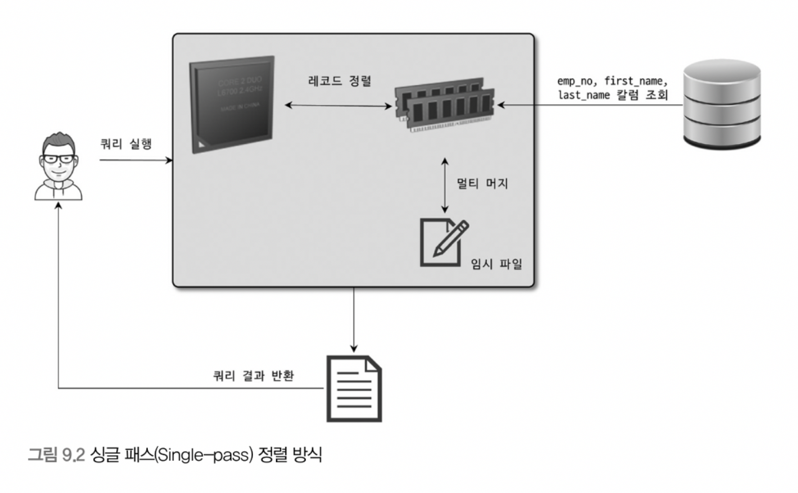
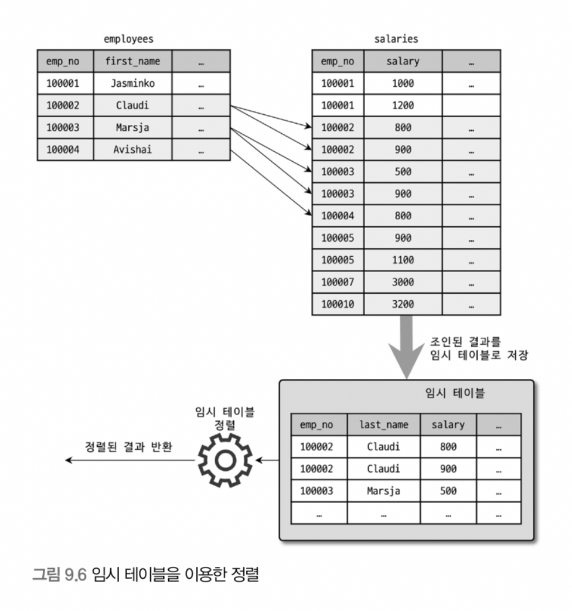
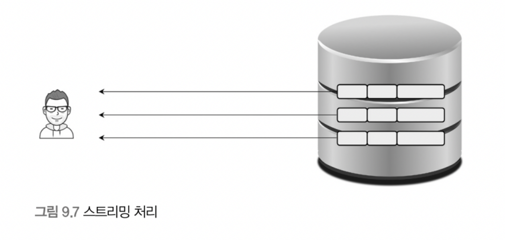

# 9장 옵티마이저와 힌트

MySQL 서버로 요청된 쿼리는 결과는 동일하지만 내부적인 동작 방식은 매우 다양할 수 있다. 다양한 방법들 중에서 최소의 비용으로 수행할 수 있는 최적인 방법을 선택해야 한다. 쿼리를 최적으로 실행하기 위해서는 각 테이블에 대한 통계 정보를 참조하여 최적의 실행 계획을 수립하는 작업이 필요하다. MySQL 서버와, 다른 대부분의 DBMS 에서 옵티마이저가 이런 기능을 담당한다.

## 9.1 개요

옵티마이저가 수립하는 실행 계획을 이해할 수 있어야 실행 계획의 불리한 부분을 찾고, 더 최적인 방법으로 실행 계획을 수립하도록 유도할 수 있다.

### 9.1.1 쿼리 실행 절차

쿼리가 실행되는 과정은 크게 3단계로 나눌 수 있다.

1. 쿼리 문장을 잘게 쪼개서 MySQL 서버가 이해할 수 있는 수준으로 분해한다.
2. 1단계에서 분해된 정보를 이용하여, 테이블의 읽는 순서와 테이블을 읽을 때 사용할 인덱스 등을 선택한다.
3. 2단계에서 선택한 정보를 이용해 스토리지 엔진에 데이터를 요청한다.

첫 번째를 `SQL 파싱` 이라고 하며, `SQL 파서` 를 통해 처리한다. 파싱 과정에서 쿼리의 문법적인 오류도 체크하며, 결과물로 `SQL 파스 트리` 가 생성된다. SQL 서버는 파스 트리를 이용해 쿼리를 실행한다.

두 번째 단계는 파스 트리를 이용해 다음 내용을 처리한다.

- 불필요한 조건 제거 및 복잡한 연산의 단순화
- 여러 테이블을 조인하는 경우 테이블 읽는 순서 결정
- 각 테이블에 사용된 조건과 인덱스 통계 정보를 이용해 사용할 인덱스 결정
- 가져온 레코드를 임시 테이블에 넣고 재가공해야 하는지 결정

두 번째 단계는 `최적화 및 실행 계획 수립` 이라고 하며, `옵티마이저` 에서 처리한다. 결과물로 `실행계획` 이 생성된다.

세 번째 단계는 생성된 실행 계획대로 스토리지 엔진에 데이터를 요청하고, 받은 레코드를 조인하거나 정렬하는 작업을 수행한다. 첫 번째와 두 번째 작업은 MySQL 엔진에서 주로 처리하고, 세 번째 단계는 MySQL 엔진과 스토리지 엔진이 동시에 참여하여 처리한다.

### 9.1.2 옵티마이저의 종류

옵티마이저는 DBMS 서버의 두뇌 역할을 한다. 옵티마이저는 비용 기반 최적화와 규칙 기반 최적화로 나눌 수 있다.

- 규칙 기반 최적화는 테이블에 대한 통계 정보를 고려하지 않고, 옵티마이저 내부의 우선순위에 따라 실행계획을 수립한다. 따라서 같은 쿼리는 거의 항상 같은 실행 계획을 만들어낸다. 그러나 사용자 데이터는 분포도가 매우 다양해서 규칙 기반 최적화는 거의 사용하지 않는다.
- 비용 기반 최적화는 쿼리를 처리하는 여러 방법을 만들고, 각 단위 작업의 비용 정보와 대상 테이블의 통계 정보를 이용해 실행 계획별 비용을 계산한다. 이렇게 계산된 비용을 기반으로 최소 비용의 방식을 선택하여 쿼리를 수행한다.

## 9.2 기본 데이터 처리

모든 RDBMS 는 데이터를 정렬하거나 그루핑 등의 기본 데이터 가공 기능을 가지고 있다. 이런 가공 기능을 제공하는 알고리즘은 RDBMS 별로 천차만별이다.

### 9.2.1 풀 테이블 스캔과 풀 인덱스 스캔

풀 테이블 스캔은 테이블의 데이터를 처음부터 끝까지 읽고 요청된 작업을 처리한다. MySQL 옵티마이저는 다음 조건에서 풀 테이블 스캔을 선택한다.

- 테이블 레코드 건수가 너무 작아서 풀 테이블 스캔이 더 빠른 경우 ( 일반적으로 테이블이 페이지 1개로 구성된 경우 )
- `WHERE` 절이나 `ON` 절에 인덱스를 이용할 수 있는 적절한 조건이 없는 경우
- 인덱스 레인지 스캔이 가능하더라도, 조건 일치 레코드 건수가 너무 많은 경우

풀 테이블 스캔은 상당히 많은 디스크 읽기가 필요하다. 그래서 대부분 DBMS는 풀 테이블 스캔 실행 시에 한꺼번에 여러 개의 블록이나 페이지를 읽어온다.

대상 테이블의 연속된 페이지가 읽히면 백그라운드 스레드에 의해 리드 어헤드 작업이 시작된다. 리드 어헤드는 특정 영역의 데이터가 요청될 것을 예측해서 미리 읽어서 버퍼 풀에 로드하는 작업이다. 즉, 풀 테이블 스캔 수행시에 처음 몇 개의 페이지는 포그라운드 스레드가 읽고 특정 시점부터는 백그라운드 스레드가 읽어온다. 포그라운드 스레드는 백그라운드 스레드가 읽어둔 버퍼 풀에서 데이터를 사용하면 되므로 쿼리가 빠르게 처리된다.

### 9.2.2 병렬 처리

MySQL 8.0 부터는 쿼리의 병렬 처리가 가능하다. ( 여러 개의 쿼리를 동시에 수행할 수 있다는 의미의 병렬이 아니라, 하나의 쿼리를 여러 개의 스레드가 나눠서 처리한다는 의미의 병렬 처리 )

MySQL 8.0 에서는 `innodb_parallel_read_threads` 시스템 변수를 이용해 하나의 쿼리를 최대 몇 개의 스레드를 이용해 처리할 지 설정할 수 있다. 아직 쿼리를 병렬 처리하게 하는 힌트나 옵션은 없고, WHERE 조건없이 단순히 테이블 전체 건수를 가져오는 쿼리만 병렬 처리가 가능하다.

```sql
SET SESSION innodb_parallel_read_threads={병렬 처리에 사용할 스레드 개수};
```

병렬 처리에 이용할 스레드가 많아질 수록 처리에 걸리는 시간이 줄어든다. 하지만 비례하게 증가하지 않고, 서버에 장착된 CPU의 물리적인 코어 갯수를 넘어가는 경우 오히려 성능이 떨어질 수 있다.

### 9.2.3 ORDER BY 처리 ( Using filesort )

대부분의 SELECT 쿼리는 정렬을 필수적으로 사용한다. 정렬을 처리하는 방법은 다음과 같다.

|  | 장점 | 단점 |
| --- | --- | --- |
| 인덱스 이용 | INSERT, UPDATE, DELETE 쿼리 수행 시에 인덱스가 정렬된 상태이므로 매우 빠르다. | INSERT, UPDATE, DELETE 수행 시에 부가적인 인덱스 작업이 필요하다. 
인덱스를 위한 디스크 공간이 필요하다.
인덱스의 갯수가 늘어날 수록 버퍼 풀에 사용하는 메모리가 늘어난다. |
| Filesort 이용 | 인덱스가 필요하지 않아서, 상대적으로 디스크 공간도 여유롭고 버퍼 풀의 사용량도 줄어든다.
정렬 대상 레코드 건수가 적으면 메모리 내부에서 정렬이 처리되어 충분히 빠르다. | 정렬 작업이 쿼리 수행 시 처리되어 대상 레코드 건수가 많아질 수록 쿼리 응답 속도가 느려진다. |

레코드 정렬을 위해 항상 `Filesort` 과정이 필요한 것은 아니다. 하지만 모든 정렬에 인덱스를 이용하도록 튜닝하는 것은 불가능하다.

- 정렬 기준이 너무 많은 경우
- `GROUP BY` 혹은 `DISTINCT` 같은 처리 결과를 정렬하는 경우
- 임시 테이블의 결과를 정렬하는 경우
- 랜덤하게 레코드를 가져오는 경우

실행 계획의 `Extra` 컬럼에서 `Using filesort` 메시지가 표시되면 인덱스를 이용하지 않도 별도의 정렬 처리를 수행했음을 확인할 수 있다.

### 1) 소트 버퍼

MySQL 서버는 정렬을 위해 별도의 메모리 공간을 할당받는 데, 이 공간을 소트 버퍼라고 한다. 버퍼의 크기는 대상 레코드의 크기에 따라 가변적이지만 최대 공간은 `sort_buffer_size` 변수로 설정할 수 있다. 이 공간은 쿼리 수행 완료 즉시 반납된다.

정렬 대상 레코드 건수가 소트 버퍼에 할당된 공간보다 클 경우 레코드를 여러 조각으로 나눠서 처리하는 데, 이 과정에서 임시 저장을 위해 디스크를 사용한다.

1. 소트 버퍼에서 정렬 수행
2. 임시로 디스크에 기록
3. 다음 레코드를 가져와서 1번, 2번 작업을 수행

각 버퍼 크기만큼 레코드를 병합하면서 정렬을 수행한다. 이 과정은 디스크 I/O 를 유발하고, 레코드가 많을 수록 반복 작업의 횟수가 많아진다. 소트 버퍼를 크게 설정하면 디스크 사용량이 줄어서 빨라질 것으로 기대할 수 있지만 실제로는 그렇지 않다.


정렬 대상 데이터의 종류, 레코드를 정렬하는 서버의 메모리나 디스크의 특성에 따라서도 결과가 달라질 수 있다. 리눅스 계열의 운영체제에서는 너무 큰 버퍼 사이즈를 사용할 경우, 큰 메모리 할당으로 성능이 훨씬 떨어질 수 있다. 소트 버퍼는 세션 메모리 영역에 해당돼서 커넥션이 많을수록, 정렬 작업이 많을수록 소트 버퍼로 소비되는 메모리 공간이 많아진다. 이 경우 운영체제가 메모리 부족 현상을 겪을 수 있다. 메모리 여유 공간이 없을 경우 운영체제의 OOM-Killer가 메모리 확보를 위해 메모리를 가장 많이 사용하는 프로세스인 MySQL 서버를 강제 종료할 수 있다.

### 2) 정렬 알고리즘

레코드를 정렬할 때 레코드 전체를 소트 버퍼에 담을지 정렬 기준 칼럼만 소트 버퍼에 담을지에 따라 `싱글 패스` 와 `투 패스` 두 가지 정렬 모드로 나눌 수 있다. 옵티마이저 트레이스 기능을 사용하여 어떤 정렬 모드를 사용하는 지 확인할 수 있다.

MySQL 의 정렬 방식은 다음 3가지가 있다.

- <sort_key, rowid>: 정렬 키와 레코드의 로우 아이디
- <sort_key, additional_fields>: 정렬 키와 레코드 전체. 레코드 칼럼은 고정 사이즈
- <sort_key, packed_additional_fields>: 정렬 키와 레코드 전체. 레코드 칼럼은 가변 사이즈

첫 번째 방식은 투 패스 방식이고, 두 번째와 세 번째는 싱글 패스 방식이다.

**2-1) 싱글 패스 정렬 방식**

소트 버퍼에 SELECT 대상 칼럼을 전부 담는 정렬 방식



정렬에 필요하지 않는 칼럼까지 전부 읽어서 버퍼에 담는다. SELECT 대상 칼럼이 전부 포함되어 정렬 즉시 결과를 반환한다.

**2-2) 투 패스 정렬 방식**

정렬 대상 칼럼과 프라이머리 키 값만 소트 버퍼에 담아서 정렬을 수행한 후, 정렬된 순서대로 프라이머리 키 값을 이용해 나머지 SELECT 대상 칼럼을 가져오는 방식이다.


투 패스 방식은 테이블을 두 번 읽어야 해서 상당히 비효율적으로 보인다. 하지만 싱글 패스는 정렬에는 불필요한 소트 버퍼 공간까지 필요하다.

최신 버전은 일반적으로 싱글 패스를 사용하지만 다음의 경우 투 패스 방식을 사용한다.

- 레코드의 크기가 `max_length_for_sort_data` 변수값보다 클 때
- `BLOB` 이나 `TEXT` 타입이 SELECT 대상에 포함될 때

싱글 패스는 정렬 대상 레코드의 크기나 건수가 작은 경우, 투 패스 방식은 정렬 대상 레코드의 크기나 건수가 많은 경우 효율적이라고 볼 수 있다.

> SELECT 쿼리에서 꼭 필요한 칼럼만 조회하는 것을 권장한다. 특히 정렬이 필요한 경우 더더욱 필요한 칼럼만 조회하는 것이 효율적이다. SELECT * 를 이용해 모든 칼럼을 가져올 경우 정렬 버퍼를 몇 배에서 몇십 배까지 비효율적으로 사용할 가능성이 크다.
>

### 3) 정렬 처리 방법

쿼리에 ORDER BY 가 사용되면 다음 3가지 방법 중 하나로 정렬된다.

| 정렬 처리 방법 | 실행 계획의 Extra 칼럼 내용 |
| --- | --- |
| 인덱스 사용 | 별도 표기 없음 |
| 조인에서 드라이빙 테이블만 정렬 | “Using filesort” |
| 조인에서 조인 결과를 임시 테이블로 저장 후 정렬 | “Using temporary; Using filesort" |

일반적으로 조인이 수행되면서 레코드 건수와 레코드 크기는 배수로 불어나기 때문에 드라이빙 테이블만 정렬한 후 조인을 수행하는 방법이 효율적이다.

**3-1) 인덱스를 이용한 정렬**

인덱스를 이용한 정렬을 위해서는 반드시 ORDER BY에 명시된 칼럼이 제일 먼저 읽는 테이블에 속하고, ORDER BY의 순서대로 생성된 인덱스가 필요하다. 또한 WHERE 절에 첫 번째 테이블의 칼럼에 대한 조건이 있다면 ORDER BY 와 같은 인덱스를 사용할 수 있어야 한다. 해시 인덱스나 전문 검색 인덱스는 인덱스를 이용한 정렬을 사용할 수 없다. 또한, R-Tree 또한 이 방식을 사용할 수 없다. 여러 테이블이 조인되는 경우는 네스티드-루프 방식의 조인에서만 이 방식을 사용할 수 있다.


ORDER BY 절이 없어도 인덱스를 이용하는 경우 정렬된 결과를 반환한다. 하지만, 정렬된 결과를 원하는 경우 ORDER BY 절을 명시해야 한다. 쿼리의 실행 계획에 조인 버퍼가 사용되는 등 어떠한 이유로 실행 계획이 변경된다면 기대하는 정렬 순서를 반환하지 않을 수 있고, 이로 인해 서비스 결함이 발생할 수 있다. 인덱스의 사용 등으로 정렬이 불필요할 경우 MySQL 서버가 불필요한 정렬 작업을 수행하지 않는다.

**3-2) 조인의 드라이빙 테이블만 정렬**

조인을 실행하기 전에 먼저 정렬을 처리하기 위해서는 조인에서 첫 번째로 읽히는 테이블 ( 드라이빙 테이블 ) 의 칼럼 만으로 ORDER BY 절을 작성해야 한다.

예제 쿼리

```sql
SELECT *
FROM employees e, salaries s
WHERE s.emp_no=e.emp_no
	AND e.emp_no BETWEEN 100002 AND 100010
ORDER BY e.last_name;
```

위 쿼리는 WHERE 절의 다음 2가지 조건으로 옵티마이저는 employees 테이블을 드라이빙 테이블로 선택한다.

- WHERE 절의 검색 조건 `emp_no BETWEEN 100002 AND 100010` 은 employees 테이블의 PK를 이용하면 작업량을 줄일 수 있다.
- 드리븐 테이블 ( salaries ) 의 조인칼럼인 emp_no 칼럼에 인덱스가 있다.

ORDER BY 에 명시된 칼럼은 employees 테이블의 PK 과 연관이 없으므로 정렬에 인덱스를 이용할 수 없다. 그러나 드라이빙 테이블에 포함된 칼럼임을 알 수 있다.


**3-3) 임시 테이블을 이용한 정렬**

2개 이상의 테이블을 조인해서 그 결과를 정렬하는 경우 임시 테이블이 필요할 수 있다. 앞의 예제 쿼리에서 ORDER BY 절의 칼럼이 드리븐 테이블 ( salaries ) 에 있는 경우 salaries 테이블을 읽어야 하므로 조인된 결과를 임시 테이블에 저장한 후 정렬 할 수 밖에 없다.

```sql
SELECT *
FROM employess e, salaries s
WHERE s.emp_no=e.emp_no
	AND e.emp_no BETWEEN 100002 AND 100010
ORDER BY s.salary;
```



**3-4) 정렬 처리 방법의 성능 비교**

WHERE 조건이 아무리 인덱스를 잘 활용해도 잘못된 ORDER BY 나 GROUP BY 때문에 쿼리가 느려지는 경우가 자주 발생한다. 쿼리가 처리되는 방법을 “스트리밍 처리” 와 “버퍼링 처리” 두 가지 방식으로 나누어서 인덱스를 사용하지 못하는 정렬이나 그루핑 작업이 느리게 작동하는 이유를 알아보자

**1) 스트리밍 방식**

아래의 그림과 같이 조건에 일치하는 레코드가 검색될때마다 클라이언트로 전송해주는 방식이다. 이 경우 클라이언트는 쿼리를 요청하고 바로 원하는 첫 번째 레코드를 응답 받는다.



스트리밍 방식 쿼리는 빠른 응답 시간을 보장한다. 또한 LIMIT 처럼 결과 건수를 제한하는 조건들은 쿼리 전체의 실행 시간을 상당히 줄여준다.

**2) 버퍼링 방식**

ORDER BY 나 GROUP BY 같은 쿼리는 결과의 스트리밍이 불가능하다. MySQL 서버에서 레코드를 검색하고 정렬 작업하는 동안 클라이언트는 기다리기 때문에 응답 속도가 느려진다.

아래 그림처럼 쿼리 결과를 모아서 일괄 가공하므로 LIMIT 같이 결과 건수를 제한하는 조건 또한 스트리밍 방식과는 다르게 성능 향샹에 도움이 되지 않는다. 네트워크로 전송되는 레코드의 건수는 줄이더라도 MySQL 서버의 작업량 자체는 변화가 없기 때문이다.


인덱스를 이용한 정렬 방식은 스트리밍 형태의 처리이며, 나머지는 모두 버퍼링 형태로 처리된다.

조인과 함께 ORDER BY 절과 LIMIT 절이 사용될 경우 정렬 처리 방법별로 차이가 있는지 확인해보자.

```sql
SELECT *
FROM tb_test1 t1, tb_test2 t2
WHERE t1.col1=t2.col1
ORDER BY t1.col2
LIMIT 10;
// tb_test1 레코드: 100건
// tb_test2 레코드: 1000건 (t1:t2=1:10)
// 조인 결과: 1000건
```

- tb_test1이 드라이빙 테이블인 경우

| 정렬 방법 | 읽어야 할 건수 | 조인 횟수 | 정렬 대상 건수 |
| --- | --- | --- | --- |
| 인덱스 | tb_test1: 1건
tb_test2: 10건 | 1회 | 0건 |
| 조인의 드라이빙 테이블 정렬 | tb_test1: 100건
tb_test2: 10건 | 1회 | 100건
(tb_test1 레코드 건수) |
| 임시 테이블 사용 후 정렬 | tb_test1: 100건
tb_test2: 1000건 | 100회
(tb_test1 레코드 건수만큼) | 1000건
(조인 결과 전부) |
- tb_test2가 드라이빙 테이블인 경우

| 정렬 방법 | 읽어야 할 건수 | 조인 횟수 | 정렬 대상 건수 |
| --- | --- | --- | --- |
| 인덱스 | tb_test2: 10건
tb_test1: 10건 | 10회 | 0건 |
| 조인의 드라이빙 테이블 정렬 | tb_test2: 1000건
tb_test1: 10건 | 10회 | 1000건
(tb_test2 레코드 건수) |
| 임시 테이블 사용 후 정렬 | tb_test2: 1000건
tb_test1: 100건 | 1000회
(tb_test2 레코드 건수만큼) | 1000건
(조인 결과 전부) |

어떤 테이블이 드라이빙 테이블로 선택되는지도 중요하지만 어떤 정렬 방식으로 처리되는지는 더 큰 성능 차이를 발생한다. 인덱스 사용 정렬로 유도하거나 최소한 드라이빙 테이블만 정렬되도록 유도하는 것이 좋다.

### 4) 정렬 관련 상태 변수

MySQL 서버는 주요 작업의 경우 실행 횟수를 상태 변수로 저장한다. 정렬 관련 작업의 경우 정렬 처리 레코드 건수, 소트 버퍼 간의 병합 작업 횟수 등을 확인할 수 있다.

```sql
FLUSH STATUS;
SHOW STATUS LIKE 'Sort%';
```

- Sort_merge_passes: 소트 버퍼 병합 횟수 (멀티 머지 처리 횟수)
- Sort_range: 인덱스 레인지 스캔을 통해 검색된 결과에 대한 정렬 횟수
- Sort_scan: 풀 테이블 스캔을 통해 검색된 결과에 대한 정렬 횟수
- Sort_rows: 정렬한 전체 레코드 건수