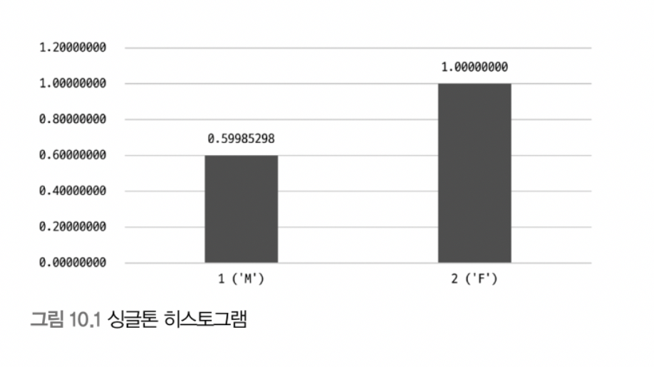
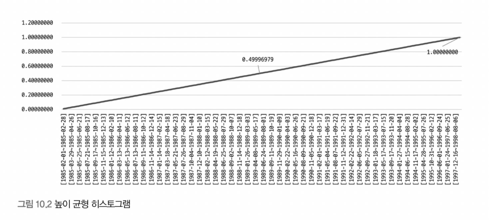

# 10. 실행계획

> [10.1 통계 정보](#10.1-통계-정보)
>
> - 테이블 및 인덱스 통계 정보
>
> - 히스토그램

<br>

## 10.1 통계 정보

### 10.1.1 테이블 및 인덱스 통계 정보

- 비용 기반 최적화에서 가장 중요한 것이 통계 정보

##### 10.1.1.1 MySQL 서버의 통계 정보

- 5.6 이전

  - 메모리에서만 관리, show index 명령으로만 테이블 인덱스 컬럼 분표도 볼 수 있었음

- 5.6 이후

  - InnoDB 스토리지 엔진 사용 테이블에 대한 통계 정보 영구 저장하도록 개선

  - 확인

    ```sql
    SHOW TABLES LIKE '%_stats';
    ```

    - `stats_persistent=0`
      - 테이블 통계 정보를 5.5 이전 방식대로 관리
      - innodb_index_stats, innodb_table_stats 테이블에 저장하지 않음
    - `stats_persistent=1` default
      - innodb_index_stats, innodb_table_stats 테이블에 저장
    - `stats_persistent=2`
      - innodb_stats_persistent 시스템 변수 값으로 결정

- 통계 정보
  - `innodb_index_stats.stat_name='n_diff_pfx%'` 인덱스가 가진 유니크한 값의 개수
  - `innodb_index_stats.stat_name='n_leaf_pages'` 인덱스 리프 노드 페이지 개수
  - `innodb_index_stats.stat_name='size'` 인덱스 트리 전체 페이지 개수
  - `innodb_index_stats.n_rows` 테이블 전체 레코드 건수
  - `innodb_index_stats.clustered_index_size` PK 크기(InnoDB 페이지 개수)
  - `innodb_index_stats.sum_of_other_index_sizes` PK 제외한 인덱스 크기(InnoDB 페이지 개수)

<br>

### 10.1.2 히스토그램

> 5.7 이전까지는 단순히 인덱스된 컬럼 유니크 값 갯수 정도만 가지고 있어 최적 실행 계획 수립하기 부족
>
> 옵티마이저는 이에 실행 계획 수립 시 실제 인덱스의 일부 페이지를 랜덤으로 가져와 참조하는 방식 사용
>
> 8.0 부터 컬럼의 데이터 분포도 참조할 수 있는 Histogram 정보 활용 가능

##### 10.1.2.1 히스토그램 정보 수집 및 삭제

```sql
ANALYZE TABLE ... UPDATE HISTOGRAM
```

- 히스토그램 정보는 컬럼 단위로 관리
- 위 명령어 통해 수동으로 수집 및 관리
- 수집된 히스토그램 정보는 딕셔너리에 함께 저장되고, 서버 시작 시 딕셔너리의 히스토그램 정보를 information_schema DB의 column_statistics 테이블로 로드
- 실제 조회 시 column_statistics 테이블 select
- Bucket 단위로 구분되어 레코드 건수나 컬럼값 범위 관리

- 종류

  - Singleton(싱글톤 히스토그램)

    

    <br>

    - 컬럼값 개별로 레코드 건수 관리
    - Value-Based 히스토그램 또는 도수 분포라고 불림
    - 컬럼이 가지는 값별로 버킷이 할당
    - 버킷 정보(컬럼의 값, 발생 빈도 비율)

  - Equi_Height(높이 균형 히스토그램)

    

    <br>

    - 컬럼값 범위를 균등한 개수로 구분해서 관리
    - Height-Balanced 히스토그램으로 불림
    - 높이 균형 히스토그램은 개수 균등한 컬럼값의 범위별로 하나의 버킷 할당
    - 버킷 정보(범위 시작 값/마지막 값, 발생빈도율, 각 버킷에 포함된 유니크한 값의 개수)

- `information_schema.column_statistics` 필드들

  - sampling-rate

    - 히스토그램 정보 수집하기 위해 스캔한 페이지 비율 저장
    - 샘플링 비율이 0.35면 전체 데이터 페이지의 35% 스캔하여 정보 수집되었다는 것을 의미
    - 샘플링 비율이 높을수록 정확하지만, 전부 스캔하는 것은 부하가 높고 자원 많이 소모
    - `histogram_generation_max_mem_size=20MB` 시스템 변수 설정 메모리 크기에 맞게 적절히 샘플링 함

  - histogram-type

    - 히스토그램 종류 저장

  - number-of-buckets-specified

    - 히스토그램 생성 시 설정했던 버킷 개수 저장

    - default 100, max 1,024

      (일반적으로 100개면 충분)