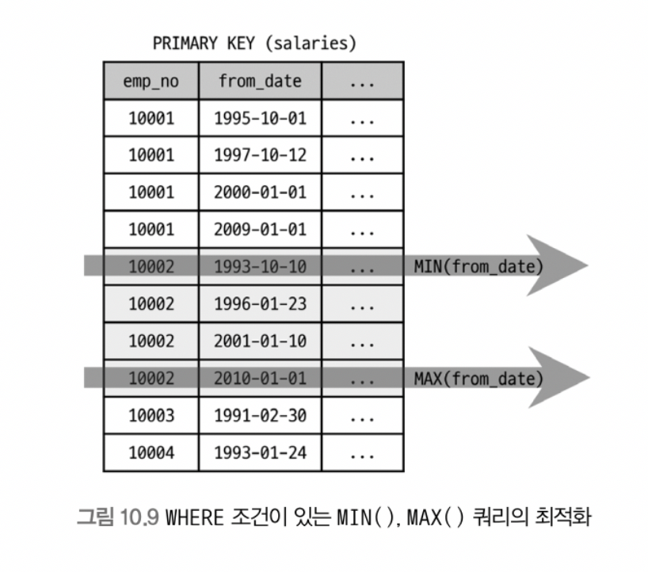
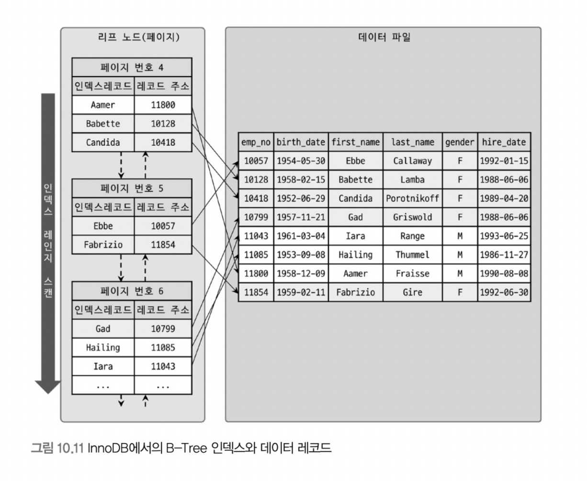
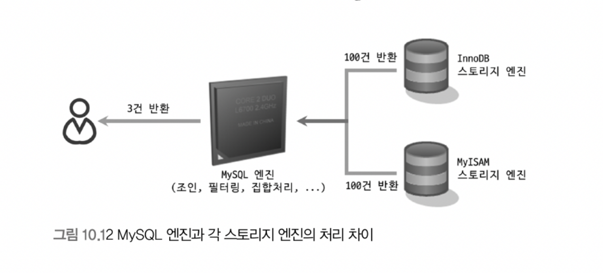

# 10. 실행계획

> 10.3 실행 계획 분석
>
> - 10.3.1 id 칼럼
> - 10.3.2 select type 칼럼
>   - 10.3.2.1 SIMPLE
>   - 10.3.2.2 PRIMARY
>   - 10.3.2.3 UNION
>   - 10.3.2.4 DEPENDENT UNION
>   - 10.3.2.5 UNION RESULT
>   - 10.3.2.6 SUBQUERY
>   - 10.3.2.7 DEPENDENT SUBQUERY
>   - 10.3.2.8 DERIVED
>   - 10.3.2.9 DEPENDENT DERIVED
>   - 10.3.2.10 UNCACHEABLE SUBQUERY
>   - 10.3.2.11 UNCACHEABLE UNION
>   - 10.3.2.12 MATERIALIZED
> - 10.3.3 table 칼럼
> - 10.3.4 partitions 칼럼
> - 10.3.5 type 칼럼
>   - 10.3.5.1 system
>   - 10.3.5.2 const
>   - 10.3.5.3 eq_ref
>   - 10.3.5.4 ref
>   - 10.3.5.5 fulltext
>   - 10.3.5.6 ref_or_null
>   - 10.3.5.7 unique_subquery
>   - 10.3.5.8 index_subquery
>   - 10.3.5.9 range
>   - 10.3.5.10 index_merge
>   - 10.3.5.11 index
>   - 10.3.5.12 ALL
> - 10.3.6 possible_keys 칼럼
> - 10.3.7 key 칼럼
> - 10.3.8 key_len 칼럼
> - 10.3.9 ref 칼럼
> - 10.3.10 rows 칼럼
> - 10.3.11 filtered 칼럼

<br>

> 10.3.12 Extra 칼럼
>
> - 10.3.12.1 const row not found
> - 10.3.12.2 Deleting all rows
> - 10.3.12.3 Distinct
> - 10.3.12.4 FirstMatch
> - 10.3.12.5 Full scan on NULL key
> - 10.3.12.6 Impossible Having
> - 10.3.12.7 Impossible Where
> - 10.3.12.8 LooseScan
> - 10.3.12.9 No matching min/max row
> - 10.3.12.10 no matching row in const table
> - 10.3.12.11 No matching rows after partition pruning
> - 10.3.12.12 No tables used
> - 10.3.12.13 Not exists
> - 10.3.12.14 Plan isn’t ready yet
> - 10.3.12.15 Range checked for each record(index map: N)
> - 10.3.12.16 Recursive
> - 10.3.12.17 Rematerialize
> - 10.3.12.18 Select tables optimized away
> - 10.3.12.19 Start temporary, End Temporary
> - 10.3.12.20 unique row not found
> - 10.3.12.21 Using filesort
> - 10.3.12.22 Using index(커버링 인덱스)
> - 10.3.12.23 Using index condition
> - 10.3.12.24 Using index for group-by
> - 10.3.12.25 Using index for skip scan
> - 10.3.12.26 Using join buffer(Block Nested Loop), Using join buffer(Batched Key Access), Using join buffer(hash join)
> - 10.3.12.27 Using MRR
> - 10.3.12.28 Using sort_union(…), Using union(…), Using intersect(…)
> - 10.3.12.29 Using temporary
> - 10.3.12.30 Using Where
> - 10.3.12.31 Zero Limit

<br>

## 10.3 실행 계획 분석

##### 10.3.12.15 Range checked for each record(index map: N)

```sql
EXPALIN
SELECT *
FROM employees e1, employees e2
WHERE e2.emp_no >= e1.emp_no
```

- 조인 조건에 모두 변수만 있는 경우

- 테이블을 매 레코드 단위로 인덱스를 사용할지 말지를 결정

- e1 테이블의 emp_no이 작을 때는 full scan, 클 때는 range scan이 효율적

- index map: N
  - N은 16진수로 표시되는데, 각 비트맵 값에 따라 후보군으로 고려되는 인덱스를 표시하고 사용할 수도 안 할 수도 있음

  - type 컬럼에는 ALL로 표시되는데, 인덱스 후보가 도움이 되지 않는다고 판단하면 풀 스캔하기 때문에 ALL로 표시되는 것


<br>

##### 10.3.12.16 Recursive

- CTE(Common Table Expression) 사용해 재귀 쿼리 작성 가능

- 예시

  ```sql
  WITH RECURSIVE cte (n) AS
  (
  	SELECT 1
      UNION ALL
      SELECT n + 1 FROM cte WHERE n < 5
  )
  SELECT * FROM cte;
  ```

  - 'n'이라는 컬럼 하나를 가진 cte라는 이름의 내부 임시 테이블 생성

  - 레코드 5건을 만들어 cte 내부 임시 테이블 저장

<br>

##### 10.3.12.17 Rematerialize

```sql
EXPLAIN
SELECT * FROM employees e
  LEFT JOIN LATERAL (SELECT *
                       FROM salaries s
                      WHERE s.emp_no = e.emp_no
                     ORDER BY s.from_date DESC
                      LIMIT 2
                    ) s2 ON s2.emp_no = e.emp_no
WHERE e.first_name = 'Matt';
```

- LATERAL JOIN 되는 테이블은 선행 테이블의 레코드별로 서브쿼리 실행해서 그 결과를 임시 테이블에 저장하는데, 이 과정을 'rematerializing'이라 함
- 서브 쿼리가 e.emp_no에 해당하는 레코드마다 매번 임시 테이블로 생성됨
- lateral join
  - from 절에 사용된 서브 쿼리가 외부 쿼리의 칼럼을 참조하기 위해서는 'lateral' 키워드 필요
  - 위 예시에서는 서브쿼리에서 e.emp_no 쿼리를 참조하여 조인함

<br>

##### 10.3.12.18 Select tables optimized away

```sql
EXPLAIN
SELECT MAX(emp_no), MIN(emp_no) FROM employees;

EXPLAIN
SELECT MAX(from_date), MIN(from_date) FROM salaries WHERE emp_no = 10002;
```

- min()/max()만 select 절에서 사용되거나 group by로 min()/max() 조회하는 쿼리가 인덱스를 오름/내림차순으로 1건만 읽는 형태의 최적화가 적용될 때



<br>

##### 10.3.12.19 Start temporary, End Temporary

```sql
EXPLAIN
SELECT * FROM employees e
WHERE e.emp_no IN (SELECT s.emp_no FROM salaries WHERE s.salary > 150000);
```

- 세미 조인 최적화 중에서 Duplicate Weed-Out 최적화 전략 사용될 때
- 조인의 첫 번째 테이블에 start, 끝나는 부분에 end
  - 위 경우에는 salaries 테이블에 start, employees에 end
  - salaries 테이블부터 싲가해서 employees 테이블까지 내용을 임시테이블에 저장한다는 의미

- Duplicate Weed-Out
  - 불필요한 중복 건 제거를 위해 내부 임시 테이블 사용

<br>

##### 10.3.12.20 unique row not found

- 두 개의 테이블이 각각 유니크(pk 포함) 컬럼으로 outer join 수행 시 outer table에 일치하는 레코드가 없을 경우

<br>

##### 10.3.12.21 Using filesort

- order by 처리가 인덱스를 사용하지 못할 때만 'Using filesort' 표시
  - order by 시 인덱스 제대로 사용 못하면 MySQL 서버가 조회된 레코드를 다시 정렬해야 하는데, 조회된 레코드를 정렬용 메모리 버퍼(Sort Buffer)에 복사해 quick or heap sort 수행하여 정렬함
- using filesort 쿼리는 부하가 크므로 쿼리 튜닝 or 인덱스 생성 추천

<br>

##### 10.3.12.22 Using index(커버링 인덱스)



<br>

- 데이터 파일을 전혀 읽지 않고 인덱스만 읽어서 쿼리를 모두 처리할 수 있을 때
- 인덱스 이용 쿼리의 부하
  - 인덱스 검색에서 일치하는 키 값들의 레코드를 읽을 때 데이터 파일을 검색하는 작업이 부하가 큼
  - 최악의 경우에는 인덱스를 통해 검색된 결과 레코드 건마다 랜덤I/O 해야 할 수도 있음

- 예시(full table scan)

  ```sql
  EXPLAIN
  SELECT first_name, birth_date
  FROM employees
  WHERE first_name BETWEEN 'Babette' AND 'Gad';
  ```

  - where 조건절에 일치하는 것이 5만 건이라고 해보자
  - ix_firstname 인덱스를 사용하면 레코드 5만 건 검색 후 birth_date 컬럼 값 읽기 위해서 각 레코드 저장 데이터 페이지를 5만 번 읽어야 함
  - 따라서 옵티마이저는 인덱스 보다 full table scan을 선택하기도 함

- 예시(index range scan)

  ```sql
  EXPLAIN
  SELECT first_name
  FROM employees
  WHERE first_name BETWEEN 'Babette' AND 'Gad';
  ```

  - 조회 컬럼이 인덱스만 있는 경우(covering index)에는 index range scan이 효율적
  - 레코드 데이터를 읽을 필요 없고, 디스크에서 30~40개 페이지만 읽으면 되므로 매우 빨리 처리됨

- index range scan 사용하지만 쿼리 선응이 만족스럽지 못하다면, 인덱스에 있는 컬럼만 사용하도록 쿼리를 변경하면 성능 향상을 볼 수 있음

- InnoDB의 모든 테이블은 클러스터링 인덱스로 구성되어 있음

  ```sql
  SELECT emp_no, first_name
  FROM employees
  WHERE first_name BETWEEN 'Babette' AND 'Gad';
  ```

  - secondary index는 데이터 레코드의 주소값으로 pk를 가짐
  - first_name 컬럼만으로 인덱스를 만들어도 결국 그 인덱스에 emp_no 컬럼이 저장되는 효과를 냄
  - emp_no이 이미 pk로 인덱스 테이블에 저장되어 있으므로 추가 I/O 없음

- Using index

  - 접근 방법(type 컬럼)이 eq_ref, ref, range, index_merge, index 등과 같이 인덱스 사용하는 실행계획에서는 모두 Extra 컬럼에 'Using index' 표시될 수 있음
  - index range scan이든 index full scan이든 커버링 인덱스로 처리될 수 있음
  - Extra 컬럼의 'Using index'와 type 컬럼의 'index'는 성능상 반대되는 개념이므로 구분해야 함(type 컬럼의 index는 index full scan)

<br>

##### 10.3.12.23 Using index condition

```sql
SELECT * FROM employees WHERE last_name = 'Action' AND first_name LIKE '%sal';
```

- 옵티마이저가 index condition pushdown 최적화 사용 시

<br>

##### 10.3.12.24 Using index for group-by

- group by 처리

  - grouping 기준 컬럼 이용 정렬 -> 정렬된 결과를 다시 grouping하는 고부하 작업 필요

- 인덱스를 이용한다면 별도의 추가 정렬 없이 grouping만 수행하여 효율적

- tight index scan을 통한 group by 처리

  - AVG(), SUM(), COUNT()처럼 조회 값이 모든 인덱스를 다 읽어야 할 때는 필요한 레코드만 읽을 수 없음
  - 이 쿼리는 group by를 위해 인덱스를 사용하지만, loose index scan이라고 하지 않음
  - Extra 컬럼에 Using index for group-by 미출력

- loose index scan을 통한 group by 처리

  - 단일 컬럼 인덱스에서 그룹핑 컬럼만 조회하는 쿼리
  - 다중 컬럼 인덱스에서 인덱스 사용하고 min()/max() 처럼 첫번째 또는 마지막 레코드만 읽어도 되는 쿼리

  - where / index 사용 여부에 따른 loose index scan
    - where 조건절 없으면 인덱스 사용하기만 하면 가능
    - where 조건절 있는데 인덱스 사용 못하면, group by에서는 인덱스 읽고 where 조건절 맞는지 비교해야 하므로 루스 인덱스 못함
    - where 조건절 있고 인덱스도 사용하면 조건이 까다로워짐
      - 보통은 옵티마이저가 group by 보다는 where 조건절 인덱스 사용
      - where 조건에 의해 검색된 레코드 건수가 적으면 루스 인덱스 사용하지 않을 수도 있음

<br>

##### 10.3.12.25 Using index for skip scan

```sql
-- ix_gender_birthdate
EXPLAIN
SELECT gender, birth_date
FROM employees
WHERE birth_date >= '1965-02-01';
```

- 옵티마이저가 index skip scan 사용 시

<br>

##### 10.3.12.26 Using join buffer(Block Nested Loop), Using join buffer(Batched Key Access), Using join buffer(hash join)

- 조인

  - 일반적으로 빠른 쿼리 실행을 위해 조인되는 컬럼은 인덱스 생성

  - 조인에 필요한 인덱스는 driven table 쪽에 생성

    (driven table은 검색 위주로 사용되므로 인덱스 없으면 성능에 미치는 영향이 매우 큼)

- driven 테이블의 조인 컬럼에 적절한 인덱스가 없을 때

  - MySQL 서버는 block nested loop join 또는 hash join 사용
  - 두 join을 사용하면 join buffer 사용(이 때 Extra 'Using join buffer' 표시)

<br>

##### 10.3.12.27 Using MRR

- MRR(Multi Ragne Read) 최적화 시
  - 여러 개의 키 값을 한 번에 스토리지 엔진으로 전달하고, 스토리지 엔진은 키 값 정렬해서 최소한의 페이지 접근만으로 필요한 레코드 읽을 수 있게 최적화
  - 스토리지 엔진은 디스크 접근 최소화 가능
  - MRR 최적화 활용한 BKA 조인

<br>

##### 10.3.12.28 Using sort_union(…), Using union(…), Using intersect(…)

- index_merge 접근 방법에서 2개 이상의 인덱스가 동시 사용될 때, 두 인덱스로부터 읽은 결과를 어떻게 병합했는지 더 상세하게 설명
- 종류
  - Using intersect: 인덱스 사용 조건이 and로 연결된 경우 각 처리 결과에서 교집합 추출
  - Using union
    - 인덱스 사용 조건이 or로 연결되어 각 처리 결과에서 합집합 추출
    - 대체로 동등 비교(equal)처럼 일치 레코드 건수가 많지 않은 경우 사용
  - Using sort_union
    - Using union과 같은 작업이지만, Using union으로 처리될 수 없는 경우(or로 연결된 상대적으로 대량의 range 조건들)
    - Using sort_union은 PK만 먼저 읽어서 정렬하고 병합한 이후 비로소 레코드 읽어서 반환할 수 있음
    - 동등 비교 보다는 각 조건의 크고 작음 등 상대적으로 많은 레코드에 일치하는 조건이 사용될 경우 사용

<br>

##### 10.3.12.29 Using temporary

- 메모리 또는 디스크에 임시 테이블 생성하는 경우
- 실제로는 Using temporary가 표시되지 않더라도 내부적으로는 임시 테이블 사용할 경우도 많음
  - from 절의 서브쿼리(derived table)
  - COUNT(DISTINCT column1) 포함 쿼리가 인덱스 사용하지 못하는 경우
  - UNION, UNION DISTINCT
  - 인덱스 사용하지 못하는 정렬 작업

<br>

##### 10.3.12.30 Using Where



<br>

- MySQL 엔진 레이어에서 별도의 가공을 통해 필터링 작업을 처리한 경우

- 예시

  ```sql
  SELECT * FROM employees
  WHERE emp_no BETWEEN 10001 AND 10100
    AND gender = 'F';
  ```

  - emp_no 조건은 작업범위 결정 조건, gender = 'F'는 체크 조건
  - 스토리지 엔진은 emp_no 작업범위 결정 조건의 100건을 모두 MySQL 엔진에 넘기고, MySQL 엔진은 그 중에서 63건의 레코드 필터링해서 버림
  - Using where 란 63건의 레코드를 버리는 처리를 의미함

<br>

##### 10.3.12.31 Zero Limit

- Limit 0 사용 쿼리
- 데이터 값이 아닌 쿼리 결과값의 메타데이터만 필요한 경우 'limit 0' 쿼리를 사용
  - 컬럼이 몇개 인지, 컬럼 타입은 무엇인지 등의 정보만 필요한 경우