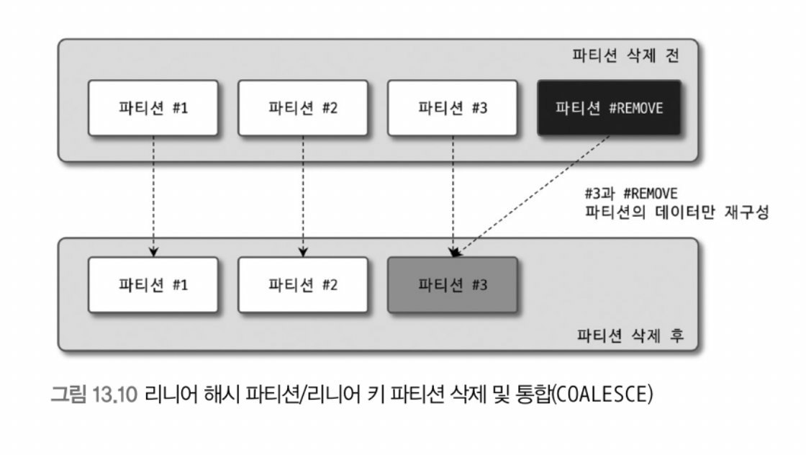

# 13. 파티션

> [13.1 개요](#13.1-개요)
>
> - [13.1.1 파티션을 사용하는 이유](#13.1.1-파티션을-사용하는-이유)
>   - 단일 insert와 단일 또는 범위 select의 빠른 처리
>   - 데이터의 물리적인 저장소를 분리
>   - 이력 데이터의 효율적인 관리
> - [13.1.2 MySQL 파티션의 내부 처리](#13.1.2-MySQL-파티션의-내부-처리)
>
> [13.2 주의사항](#13.2-주의사항)
>
> [13.3 파티션의 종류](#13.3-파티션의-종류)
>
> - [레인지 파티션](#레인지-파티션)
> - [리스트 파티션](#리스트-파티션)
> - [해시 파티션](#해시-파티션)
> - [키 파티션](#키-파티션)
> - [리니어 해시 파티션 / 리니어 키 파티션](#리니어-해시-파티션-/-리니어-키-파티션)
>
> [파티션 테이블의 쿼리 성능](#파티션-테이블의-쿼리-성능)

<br>

## 13.1 개요

### 13.1.1 파티션을 사용하는 이유

- 테이블 데이터가 많아진다고 무조건 파티션을 적용하는 것이 효율적이진 않음
- 효율적일 경우
  - 하나의 테이블이 너무 커서 인덱스의 크기가 물리 메모리보다 훨씬 클 때
  - 데이터 특성상 주기적인 삭제 작업이 필요한 경우 등

##### 단일 insert와 단일 또는 범위 select의 빠른 처리

- 인덱스는 일반적으로 select을 위한 것으로 보이지만 update / delete 쿼리를 위해 필요할 때도 많음

  - update, delete cㅓ리를 위해 대상 레코드를 검색하려면 인덱스가 필수적
  - 레코드 변경 시 인덱스 변경을 위한 부가적 작업 발생
  - 인덱스가 커질수록 select, insert, update, delete 작업도 함께 느려짐

- 한 테이블의 인덱스 크기가 물리적으로 MySQL이 사용 가능한 메모리 공간보다 크다면 영향이 더 심각

  - 데이터는 물리 메모리보다 큰 것이 일반적이지만, 인덱스의 Working Set이 실질적인 물리 메모리보다 크다면 쿼리 처리가 상당히 느려짐

  - 아래 그림처럼 데이터와 인덱스를 조각화하여 물리 메모리를 효율적으로 사용할 수 있게 함

    - 예를 들어 데이터가 10GB, 인덱스가 3GB

    - 대부분의 테이블은 13GB 전체를 항상 사용하지 않고 일정 부분만 활발하게 사용함

      (게시물이 100만 건이라도 최신 20~30% 게시물이 활발하게 조회될 것)

    - 활발하게 사용되는 데이터를 'Working Set'이라고 표현함

    

    <br>

    

    <br>

<br>

##### 데이터의 물리적인 저장소를 분리

- 데이터, 인덱스 파일이 파일시스템에서 차지하는 공간이 크다면 백업, 관리 작업도 어려워짐

  (데이터, 인덱스를 파일 단위로 관리하는 MySQL에서는 더 치명적일 수도)

- 파티션을 통해 파일의 크기를 조절하거나 파티션별 파일들이 저장될 위치와 디스크를 구분해서 저장해 해결할 수도 있음

- (MySQL은 테이블의 파티션 단위로 인덱스를 생성하거나 파티션별로 다른 인덱스를 가지는 형태는 미지원)

<br>

##### 이력 데이터의 효율적인 관리

- 로그 데이터

  - 단기간에 대량으로 누적되고 일정 기간 지나면 쓸모가 없어짐
  - 시간이 지나면 별도로 아카이빙하거나 백업한 후 삭제하는 것이 일반적
  - 다른 데이터에 비해 라이프 사이클이 상당히 짧음

- 불필요해진 로그 데이터를 백업하거나 삭제하는 작업은 일반 테이블에서 상당히 고부하의 작업에 속함

- 파티션 테이블로 효율적 관리 가능

  - 불필요 데이터 삭제 작업은 단순히 파티션을 추가/삭제 함으로써 간단하고 빠르게 해결 가능

    

<br>

### 13.1.2 MySQL 파티션의 내부 처리

```sql
CREATE TABLE tb_article (
  article_id INT NOT NULL,
  reg_date DATETIME NOT NULL,
  ...
  PRIMARY KEY(article_id, reg_date)
) PARTITION BY RANGE ( YEAR(reg_date) ) (
    PARTITION p2009 VALUES LESS THAN (2010),
    PARTITION p2010 VALUES LESS THAN (2011),
    PARTITION p2011 VALUES LESS THAN (2012),
    PARTITION p9999 VALUES LESS THAN MAXVALUE,
);
```

<br>

##### INSERT

- insert 되는 컬럼의 값 중에서 파티션 키인 reg_date 컬럼의 값을 이용해 파티션 표현식을 평가
- 그 결과를 이용해 레코드가 저장될 적절한 파티션을 결정
- 이후에는 일반 테이블과 동일하게 처리

<br>


<br>

##### UPDATE

- 변경 대상 레코드가 어느 파티션에 저장되어 있는지 찾아야 함
- where 조건에 파티션 키 컬럼 존재
  - 파티션 키를 이용해 해당 파티션에서 빠르게 대상 레코드 검색 가능
- where 조건에 파티션 키 컬럼 미존재
  - 테이블 모든 파티션을 검색해야 함
  - 실제 레코드 변경하는 작업의 절차는 update 쿼리가 어떤 컬럼의 값을 변경하느냐에 따라 큰 차이가 생김
- update 컬럼에 따른 분류
  - 파티션 키 이외의 컬럼 변경 시 일반 테이블과 마찬가지로 컬럼 값만 변경
  - 파티션 키 컬럼이 변경될 시 기존의 레코드가 저장된 파티션에서 해당 레코드 삭제 -> 변경되는 파티션 키 컬럼 표현식 평가 -> 새로운 파티션 정해서 새로 저장

<br>


<br>

##### SELECT

- 성능에 영향을 미치는 조건
  - where 절의 조건으로 검색해야 할 파티션을 선택할 수 있는가?
  - where 절의 조건이 인덱스를 효율적으로 사용(index range scan)할 수 있는가?
- 4가지 경우의 수(3,4번 방법은 가급적 피해야 함)
  - 파티션 선택 가능 + 인덱스 효율적 사용 가능
    - 가장 효율적으로 처리됨
    - 파티션 갯수와 상관 없이 검색을 위해 꼭 필요한 파티션의 인덱스만 range scan
  - 파티션 선택 불가 + 인덱스 효율적 사용 가능
    - 모든 파티션 대상으로 검색해야 함
    - 각 파티션에 대해서 index range scan 가능
    - 파티션 갯수만큼 index range scan 후에 결과 병합
  - 파티션 선택 가능 + 인덱스 효율적 사용 불가
    - 해당 파티션에 대해 full table scan
    - 각 파티션 레코드가 많다면 느리게 처리
  - 파티션 선택 불가 + 인덱스 효율적 사용 불가
    - 모든 파티션에 대해 full table scan

<br>

##### 인덱스 스캔과 정렬

- local index vs global index

  - local index는 파티션 단위로 인덱스가 생성됨
  - 파티션별로 서로 다른 인덱스를 생성할 수 있다는 것을 의미하진 않음

- 예시

  ```sql
  SELECT *
  FROM tb_article
  WHERE reg_userid BETWEEN 'brew' AND 'toto'
    AND reg_date BETWEEN '2009-01-01' AND '2010-12-31'
  ORDER BY reg_userid;
  ```

  ```tex
  | id | table      | partitions  | type  | key          | Extra                    |
  |----+------------+-------------+-------+--------------+--------------------------|
  |  1 | tb_article | p2009,p2010 | range | ix_reguserid | Using where; Using index |
  ```

  - 별도 정렬 작업을 의미하는 'Using filesort' 미표시
    - 2009, 2010 파티션에서 일치 레코드 가져온 후 파티션 결과를 병합하여 reg_userid 컬럼 값으로 다시 정렬해야 할 것처럼 보이지만 아님
    - 여러 파티션에 대해 인덱스 스캔 수행 시 각 파티션으로부터 조건에 일치하는 레코드를 정렬된 순서대로 읽으면서 우선순위 큐(Priority Queue)에 임시로 저장
    - 우선순위 큐에서 필요한 순서(인덱스의 정렬 순서)대로 데이터를 가져가는 것
    - 이는 각 파티션에서 읽은 데이터가 이미 정렬되어 있는 상태라서 가능한 방법

<br>


<br>

##### 파티션 프루닝(partion pruning)

- 위 그림 13.6처럼 옵티마이저에 의해 3개의 파티션 가운데 2개만 읽어도 된다고 판단되면 불필요한 파티션에 전혀 접근하지 않음
- 최적화 단계에서 필요한 파티션만 골라내고 불필요한 것은 실행 계획에서 배제하는 것을 파티션 프루닝이라 함
- 실행계획 partitions 컬럼에 어떤 파티션만 사용했는지 표시됨

<br>

## 13.2 주의사항

##### 파티션의 제약사항

- 용어

  ```sql
  CREATE TABLE tb_article (
    article_id INT NOT NULL,
    reg_date DATETIME NOT NULL,
    ...
    PRIMARY KEY(article_id, reg_date)
  ) PARTITION BY RANGE ( YEAR(reg_date) ) (
      PARTITION p2009 VALUES LESS THAN (2010),
      PARTITION p2010 VALUES LESS THAN (2011),
      PARTITION p2011 VALUES LESS THAN (2012),
      PARTITION p9999 VALUES LESS THAN MAXVALUE,
  );
  ```

  - `PARTITION BY RANGE` 레인지 파티션 사용
  - `reg_date` reg_date가 파티션 컬럼
  - `YEAR(reg_date)` 파티션 표현식
  - 즉 tb_article 테이블은 reg_date 컬럼에서 YEAR() 내장 함수를 이용해 연도만 추출하고, 그 연도를 이용해 테이블을 연도 범위별로 파티션하고 있음

- 제약사항

  - 스토어드 루틴, UDF, 사용자 변수 등을 파티션 표현식에 사용할 수 없음

  - 파티션 표현식은 일반적으로 컬럼 그 자체 또는 MySQL 내장 함수 사용

    (일부 함수는 파티션 생성은 가능하지만 파티션 프루닝 지원하지 않을 수도 있음)

  - PK 포함 unique index는 파티션 키 컬럼을 포함해야 함
  - 인덱스는 모두 로컬 인덱스이며, 동일 테이블에 소속된 모든 파티션은 같은 구조의 인덱스만 가질 수 있음. 파티션 개별로 인덱스를 변경하거나 추가할 수 없음
  - 동일 테이블에 속한 모든 파티션은 동일 스토리지 엔진만 가질 수 있음
  - 최대(서브 파티션까지 포함해서) 8192개의 파티션을 가질 수 있음
  - 파티션 생성 이후 MySQL 서버의 sql_mode 시스템 변수 변경은 데이터 파티션의 일관성을 깨뜨릴 수 있음
  - 외래키 사용 불가
  - 전문 검색 인덱스 생성 불가, 전문 검색 쿼리 사용 불가
  - 공간 데이터 저장하는 컬럼 타입(POINT, GEOMETRY, ...) 사용 불가
  - 임시 테이블은 파티션 기능 사용 불가

- 주요 제약사항

  - 모든 unique index에 파티션 키 컬럼이 포함되어야 함
    - 위 예시에서 article_id가 auto_increment라 단일 pk로 사용해도 되지만, reg_date 파티션 키 컬럼이 pk의 일부로 들어가야 한다는 제약사항 때문에 (article_id, reg_date) PK 선정
  - 기본 산술 연산자(+, -, *), 내장 함수 사용 가능
    - 사용 가능한 내장 함수는 [매뉴얼](https://dev.mysql.com/doc/refman/8.0/en/partitioning-limitations-functions.html) 참조

<br>

##### 파티션 사용 시 주의사항

- 파티션과 유니크 키(PK 포함)

  - 종류와 관계없이 테이블에 유니크 인덱스(프라이머리 키 포함)가 있으면 파티션 키는 모든 유니크 인덱스의 일부 또는 모든 컬럼을 포함해야 함

  - 유니크 키에 대해 파티션 키가 제대로 설정되었는지 확인하려면 각 유니크 키에 대해 값이 주어졌을 때 해당 레코드가 어느 파티션에 저장되어 있는지 계산할 수 있어야 한다는 점을 기억하자

  - 예시(파티션 생성 불가)

    ```sql
    CREATE TABLE tb_partiton (
      fd1 INT NOT NULL,
      fd2 INT NOT NULL,
      fd3 INT NOT NULL,
      UNIQUE KEY (fd1, fd2)
    ) PARTITION BY HASH (fd3)
      PARTITIONS 4;
    ```

    - 유니크 키와 파티션 키가 전혀 연관이 없어서 불가능

    ```sql
    CREATE TABLE tb_partiton (
      fd1 INT NOT NULL,
      fd2 INT NOT NULL,
      fd3 INT NOT NULL,
      UNIQUE KEY (fd1),
      UNIQUE KEY (fd2)
    ) PARTITION BY HASH (fd1 + fd2)
      PARTITIONS 4;
    ```

    - 첫번째 유니크 키 컬럼인 fd1만으로 파티션 결졍이 되지 않음
    - fd1, fd2 컬럼값 모두 있어야 파티션의 위치를 판단할 수 있음

    ```sql
    CREATE TABLE tb_partiton (
      fd1 INT NOT NULL,
      fd2 INT NOT NULL,
      fd3 INT NOT NULL,
      PRIMARY KEY (fd1),
      UNIQUE KEY (fd2, fd3)
    ) PARTITION BY HASH (fd1 + fd2)
      PARTITIONS 4;
    ```

    - PK 컬럼인 fd1 값만으로 파티션 판단이 되지 않음
    - 유니크 키 fd2, fd3 로도 파티션 위치 결정할 수 없음

  - 예시(파티션 생성 가능)

    ```sql
    CREATE TABLE tb_partiton (
      fd1 INT NOT NULL,
      fd2 INT NOT NULL,
      fd3 INT NOT NULL,
      UNIQUE KEY (fd1, fd2, fd3)
    ) PARTITION BY HASH (fd1)
      PARTITIONS 4;
      
    CREATE TABLE tb_partiton (
      fd1 INT NOT NULL,
      fd2 INT NOT NULL,
      fd3 INT NOT NULL,
      UNIQUE KEY (fd1, fd2)
    ) PARTITION BY HASH (fd1 + fd2)
      PARTITIONS 4;
    
    CREATE TABLE tb_partiton (
      fd1 INT NOT NULL,
      fd2 INT NOT NULL,
      fd3 INT NOT NULL,
      UNIQUE KEY (fd1, fd2, fd3),
      UNIQUE KEY (fd3)
    ) PARTITION BY HASH (fd3)
      PARTITIONS 4;
    ```

- open_files_limit 시스템 변수 설정

  - MySQL에서 일반적으로 테이블을 파일 단위로 관리하므로 동시 오픈된 파일 갯수가 상당히 많아질 수 있음

  - 이를 제한하기 위해 `open_files_limit` 시스템 변수 사용

  - open_files 갯수

    - 파티션되지 않은 테이블은 테이블 1개당 2~3개 수준

    - 파티션 테이블 = 파티션의 갯수 * (2~3개)

  - 쿼리가 적절히 파티션 프루닝으로 최적화되어 일부 파티션만 접근해도 된다고 하더라도 일단 동시에 모든 파티션의 데이터 파일을 오픈해야 함

  - 파티션을 많이 사용하는 경우에는 해당 시스템 변수를 적절히 높은 값으로 다시 설정해야 함

<br>

## 13.3 파티션의 종류

> 레인지 파티션, 리스트 파티션, 해시 파티션, 키 파티션(+@ 리니어 파티션 기법)
>
> 장점
>
> - 큰 테이블을 작은 크기의 파티션으로 분리
> - 필요한 파티션만 접근(쓰기, 읽기 모두)

### 레인지 파티션

- 가장 일반적으로 사용되는 파티션

- MAXVALUE 키워드로 명시되지 않은 범위의 키 값을 저장 가능

- 용도

  - 날짜 기반 데이터 누적, 월/일 단위로 분석하고 삭제해야 할 때
  - 범위 기반으로 데이터를 여러 파티션에 균등하게 나눌 수 있을 때
  - 파티션 키 위주로 검색이 자주 실행될 때

- 레인지 파티션 테이블 생성

  ```sql
  CREATE TABLE employees (
    id INT NOT NULL,
    first_name VARCHAR(30),
    last_name VARCHAR(30),
    hired DATE NOT NULL DEFAULT '1970-01-01',
    ...
  ) PARTITION BY RANGE( YEAR(hired) ) (
    PARTITION p0 VALUES LESS THAN (1991),
    PARTITION p1 VALUES LESS THAN (1996),
    PARTITION p2 VALUES LESS THAN (2001),
    PARTITION p3 VALUES LESS THAN MAXVALUE
  );
  ```

- 레인지 파티션의 분리와 병합

  - 단순 파티션 추가

    ```sql
    -- less tahn maxvalue 때문에 에러 발생
    ALTER TABLE employees
    ADD PARTITION (PARTITION p4 VALUES LESS THAN(2011));
    
    -- 정상
    ALTER TABLE employees ALGORITHM=INPLACE, LOCK=SHARED,
      REORGANIZE PARTITION p3 INTO (
        PARTITION p3 VALUES LESS THAN (2011),
        PARTITION p4 VALUES LESS THAN MAXVALUE
      );
    ```

    - `LESS THAN MAXVALUE` 를 이미 가지고 있으므로 `MAXVALUE can only be used in last partition definition` 에러 발생
    - 하나의 레코드는 반드시 하나의 파티션에만 저장되어야 한다는 기본 조건 벗어나는 경우

    - reorganize partition 명령어는 p3 파티션의 레코드를 모두 새로운 두 개의 파티션으로 복사하는 작업을 필요로 함. p3 파티션의 레코드가 매우 많다면 이 작업은 매우 오랜 시간이 걸릴 것
    - 레인지 파티션에는 일반적으로 LESS THAN MAXVALUE 절은 추가하지 않고 미래에 사용될 파티션을 미리 2-3개 만들어 두는 형태로 테이블 생성
    - 배치 스크립트를 이용해 주기적으로 파티션 테이블의 여유 기간을 판단해서 파티션을 자동으로 추가하는 방법 사용
      - 배치 스크립트 오류로 파티션이 추가되지 못할 수도 있는 단점

  - 파티션 삭제

    ```sql
    ALTER TABLE employees DROP PARTITION p0;
    ```

    - 파티션 삭제 시 항상 가장 오래된 파티션 순서로만 삭제 가능

  - 기존 파티션의 분리

    ```sql
    ALTER TABLE employees ALGORITHM=INPLACE, LOCK=SHARED,
     REORGANIZE PARTITION p3 INTO (
       PARTITION p3 VALUES LESS THAN (2011),
       PARTITION p4 VALUES lESS THAN MAXVALUE
     );
    ```

    - 온라인 DDL로 실행할 수 있게 algorithm과 lock 절을 사용
    - shared lock을 사용하면 쓰기 불가능하므로 서비스 점검 시간대나 쿼리 처리 많지 않은 시간대에 진행하는 것이 좋음

  - 기존 파티션 병합

    ```sql
    ALTER TABLE employees ALGORITHM=INPLACE, LOCK=SHARED,
      REORGANIZE PARTITION p2, p3 INTO (
        PARTITION p23 VALUES LESS THAN (2011)
      );
    ```

<br>

## 리스트 파티션

- 용도

  - 파티션 키 값이 코드 값이나 카테고리와 같이 고정적일 때

  - 키 값이 연속되지 않고 정렬 순서와 관계없이 파티션 해야 할 때

  - 파티션 키 값을 기준으로 레코드의 건수가 균일하고 검색 조건에 파티션 키가 자주 사용 될 때

- 차이점

  - 레인지 파티션은 파티션 키 값의 범위로 파티션 구성할 수 있지만 리스트 파티션은 파티션 키 값 하나하나를 리스트로 나열해야 함
  - 만들 때 `LESS THAN`아니라 `VALUES IN` 씀

- 생성

  ```sql
  CREATE TABLE product (
    id INT NOT NULL,
    name VARCHAR(30),
    category_id INT NOT NULL,
    ...
  ) PARTITION BY LIST (category_id) (
    PARTITION p_appliance VALUES IN (3),
    PARTITION p_computer VALUES IN (1,9),
    PARTITION p_sports VALUES IN (2,6,7),
    PARTITION p_etc VALUES IN (4,5,8,NULL)
  );
  ```

  - 정수나 문자열 타입 사용

- 분리와 병합

  - values in 키워드 쓰는 것 외에는 레인지 파티션과 동일

- 주의사항

  - 명시되지 않은 나머지 값을 저장하는 MAXVALUE 파티션 정의할 수 없음
  - 레인지 파티션과는 달리 NULL 저장하는 파티션 별도 생성 가능

<br>

### 해시 파티션

- 용도

  - 레인지/리스트 파티션으로 데이터를 균등하게 나누는 것이 어려울 때

  - 테이블의 모든 레코드가 비슷한 사용 빈도를 보이지만 테이블이 너무 커서 파티션 적용해야 할 때

  - 대표적으로 회원 테이블 들 수 있음

    (데이터가 특정 컬럼의 값에 영향을 받지 않고, 전체적으로 비슷한 사용 빈도 보일 때 적합한 방법)

- 내용

  - MySQL에서 정의한 해시 함수에 의해 레코드가 저장될 파티션 결정하는 방법
  - 파티션 표현식의 결과값을 파티션의 개수로 나눈 나머지로 저장될 파티션을 결정하는 방식
  - 해시 파티션의 파티션 키는 항상 정수 타입의 컬럼이거나 정수를 반환하는 표현식만 사용될 수 있음
  - 파티션의 개수는 레코드를 각 파티션에 할당하는 알고리즘과 연관되기 때문에 파티션을 추가/삭제하는 작업에는 테이블 전체적으로 레코드를 재분배하는 작업이 필요

- 생성

  ```sql
  -- 파티션의 개수만 지정할 때
  CREATE TABLE employees (
    id INT NOT NULL,
    fisrt_name VARCHAR(30),
    last_name VARCHAR(30),
    hired DATE NOT NULL DEFAULT '1970-01-01',
    ...
  ) PARTITION BY HASH(id) PARTITIONS 4;
  
  -- 파티션 이름 별도 지정할 때
  CREATE TABLE employees (
    id INT NOT NULL,
    fisrt_name VARCHAR(30),
    last_name VARCHAR(30),
    hired DATE NOT NULL DEFAULT '1970-01-01',
    ...
  ) PARTITION BY HASH(id)
    PARTITIONS 4 (
      PARTITION p0 ENGINE=INNODB,
      PARTITION p1 ENGINE=INNODB,
      PARTITION p2 ENGINE=INNODB,
      PARTITION p3 ENGINE=INNODB
    );
  ```

- 분리와 병합

  - 레인지/리스트 파티션과 달리 대상 테이블의 모든 파티션에 저장된 레코드 재분배 작업 필요
  - 파티션 분리나 병합으로 파티션의 갯수가 변경되면 해시 함수의 알고리즘을 변경하는 것이므로 전체 파티션이 영향을 받는 것은 피할 수 없음

- 파티션 추가

  ```sql
  -- 파티션 1개만 추가하면서 파티션 이름 부여하는 경우
  ALTER TABLE employees ALGORITHM=INPLACE, LOCK=SHARED,
    ADD PARTITION(PARTITION p5 ENGINE=INNODB);
  
  -- 동시에 6개의 파티션을 별도의 이름 없이 추가하는 경우
  ALTER TABLE employees ALGORITHM=INPLACE, LOCK=SHARED,
    ADD PARTITION PARTITIONS 6;
  ```

  - 해시 파티션 추가 작업은 INPLACE 알고리즘으로 실행되더라도 레코드 리빌드 작업이 필요해 읽기 잠금이 필요
  - 해시 파티션에 파티션 추가하거나 생성하는 작업은 많은 부하 발생시킴
  - 다른 트랜잭션에서 동일 테이블에 데이터를 변경(insert, update, delete)하는 작업 허용하지 않음

  

<br>

- 파티션 삭제

  - 해시나 키 파티션은 파티션 단위로 레코드 삭제하는 방법 없음
  - MySQL 서버가 지정한 파티션 키 값을 가공해서 데이터를 각 파티션으로 분산한 것이므로 각 파티션에 저장된 레코드가 어떤 부류의 데이터인지 사용자가 예측할 수 없음
  - 결국 해시 파티션이나 키 파티션을 사용한 테이블에서 파티션 단위로 데이터를 삭제하는 작업은 의미도 없고 해서도 안됨

- 파티션 분할

  - 해시, 키 파티션에서는 분할 기능 없고 파티션 갯수 늘릴 수만 있음

- 파티션 병합

  - 병합도 안되고, 파티션 갯수 줄이는 것만 가능

    ```sql
    ALTER TABLE employees ALGORITHM=INPLACE, LOCK=SHARED
      COALESCE PARTITION 1;
    ```

    - 줄이고자 하는 파티션 갯수 명시
    - 삭제되는 파티션에 저장되어 있던 레코드가 남은 3개의 파티션으로 복사되는 것이 아니라 테이블의 모든 레코드가 재배치되는 작업이 수행되어야 함
    - 따라서 파티션 삭제와 동일한 작업 필요

  

<br>

- 해시 파티션 주의사항
  - 특정 파티션만 삭제하는 것은 불가능
  - 새로운 파티션 추가 작업은 단순히 파티션을 추가하는 것이 아니라, 기존 모든 데이터의 재배치 작업 필요
  - 레인지/리스트 파티션과 상당히 다른 방식이므로 해시 파티션이 용도에 적합한지 재확인
  - 일반적으로 사용자들에게 익숙한 파티션의 조작이나 특성은 대부분 레인지/리스트 파티션에 해당함. 해시/키 파티션 사용 및 조작 시에는 주의가 필요

<br>

### 키 파티션

- 차이점

  - 키 파티션은 해시 파티션과 사용법과 특성이 거이 같음
  - 해시 파티션은 해시 값을 계산하는 방법을 파티션 키나 표현식에 사용자가 명시하고, MOD 연산은 MySQL 서버가 수행. 키 파티션은 모두 MySQL 서버가 수행

- 생성

  ```sql
  -- 프라이머리 키가 있는 경우 자동으로 프라이머리 키가 파티션 키로 사용
  -- 괄호 내용 비워두면 자동으로 pk의 모든 컬럼이 파티션 키가 됨
  -- 그렇지 않고 pk 일부만 명시할 수도 있음
  CREATE TABLE k1 (
    id INT NOT NULL,
    name VARCHAR(20),
    PRIMARY KEY (id)
  ) PARTITION BY KEY()
    PARTITIONS 2;
  ```

  - pk 있으면 자동으로 설정, 명시적으로도 가능
  - pk 없으면 unique key이 있을 시 파티션 키로 사용
  - pk or uk 컬럼 일부를 파티션 키로 명시적으로 설정도 가능

- 주의사항

  - MySQL 서버가 내부적으로 MD5() 함수를 이용해 파티션하므로 파티션 키가 반드시 정수 타입이 아니어도 됨. 해시 파티션으로 파티션이 어렵다면 키 파티션 적용을 고려해보아야 함
  - pk, uk 구성 컬럼 중 일부만으로 파티션 가능
  - uk를 파티션 키로 사용 시 해당 유니크 키는 반드시 NOT NULL
  - 해시 파티션에 비해 파티션 간의 레코드를 더 균등하게 분할할 수 있기 때문에 키 파티션이 더 효율적

<br>

### 리니어 해시 파티션 / 리니어 키 파티션

- 용도 및 내용

  - 해시/키 파티션은 파티션 추가/통합/삭제 시 테이블 전체 reorg 필요한데, 이 단점을 최소화하기 위한 파티션 알고리즘이 고안된 것이 linear
  - 레코드 분배를 위해 'Power-of-two(2의 승수)' 알고리즘 이용해 파티션 reorg 시 다른 파티션에 미치는 영향 최소화함

- 파티션 추가 및 통합

  - 단순히 MOD 연산으로 저장될 파티션 결정하지 않고 '2의 승수' 분배 방식 사용해서 특정 파티션의 데이터에 대해서만 이동 작업 하면 됨

  - 추가

    - 명령 자체는 해시/키 파티션과 동일

      

  <br>

  - 통합

    - 명령 자체는 해시/키 파티션과 동일

      

<br>

- 주의사항
  - 작업 범위 최소화하는 대신 각 파티션이 가지는 레코드 건수는 일반 해시/키 파티션보다는 덜 균등해질 수 있음
  - 새로운 파티션 추가/삭제할 요건이 적다면 일반 해시/키 파티션 적용하는 것이 좋음

<br>

### 파티션 테이블의 쿼리 성능

- 파티션 프루닝(pruning)

  - 쿼리 실행 계획 수립 시 불필요한 파티션은 모두 배제하고 꼭 필요한 파티션만 걸러내는 과정

- 쿼리 성능은 테이블에서 얼마나 많은 파티션을 프루닝할 수 있는지가 관건

- 테이블 갯수

  - 레인지/리스트 파티션은 파티션을 만들 때 개별 파티션을 명시해야 하므로 10~20개 내외로 적은 편

  - 해시/키 파티션은 갯수만 지정하면 되어서 갯수가 많을 수 있음

    - 예시(키 파티션 1024개라면)

      ```sql
      select * from user where name = 'toto';
      ```

      - name에 index 걸려 있으면 B-Tree 한 번만 lookup 해서 toto 레코드만 스캔하면 되지만, 파티션이 1,024개면 내부적으로 파티션마다 1,024번 B-Tree lookup 필요
      - 물론 파티션된 개별 인덱스의 크기가 작다면 크게 부담되지 않을 수 있지만, 애초에 테이블이 작아서 부담되지 않아쓰면 파티션 없이 하나의 테이블로 구성했었을 것

- 성능 향상

  - 테이블을 10개로 파티션해서 10개의 파티션 중에서 주로 1-3개 정도의 파티션만 읽고 쓴다면 파티션 기능이 성능 향상에 도움이 됨
  - 하지만 10개로 파티션하고 10개를 아주 균등하게 사용한다면, 이는 성능 향상 보다는 오히려 오버헤드만 심해지는 결과 가져올 수 있음
    - 대용량 테이블을 10개로 쪼개서 서로 다른 MySQL 서버에 저장(샤딩) 한다면 매우 효율적일 것
    - 하지만 MySQL 서버의 파티션은 샤딩이 아니라는 것에 주의해야 함