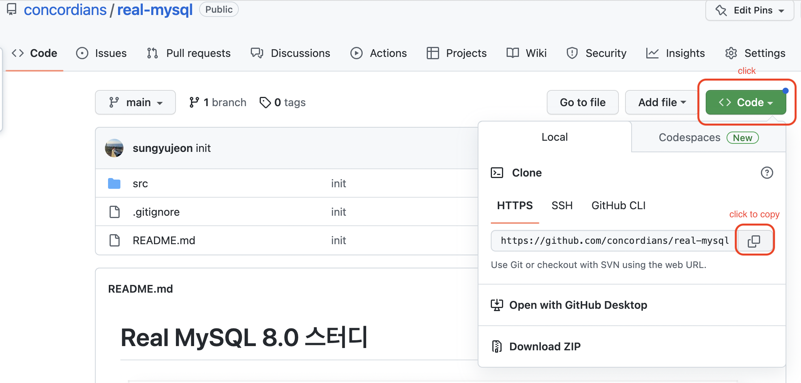
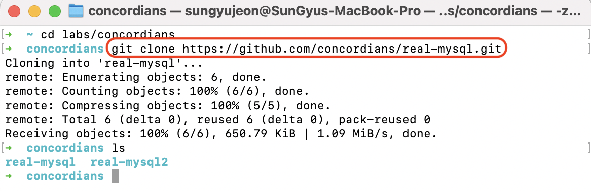
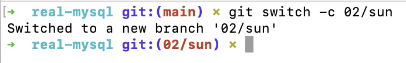
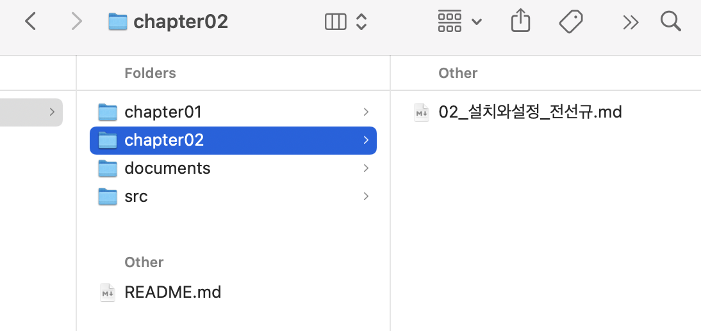
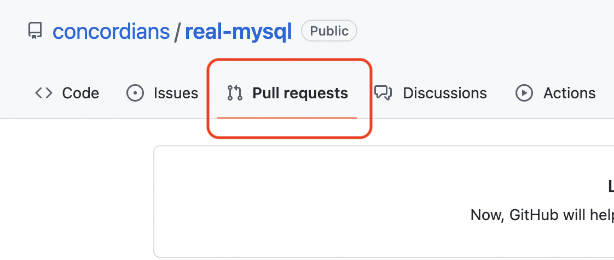
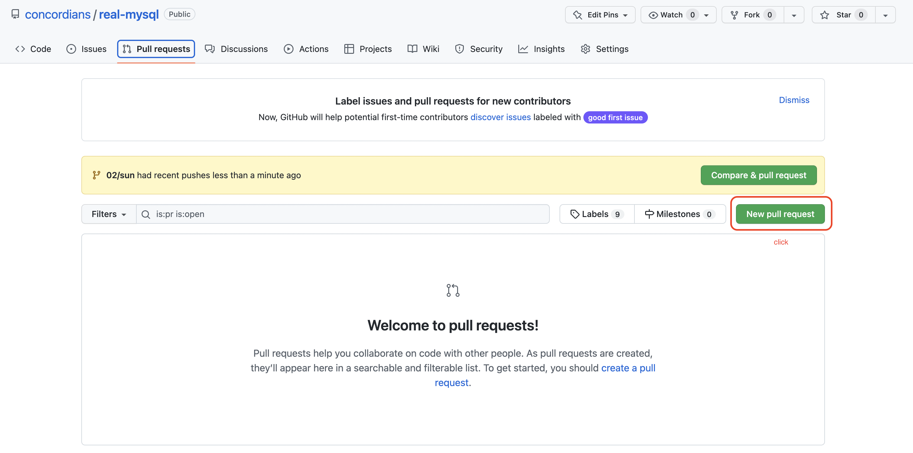
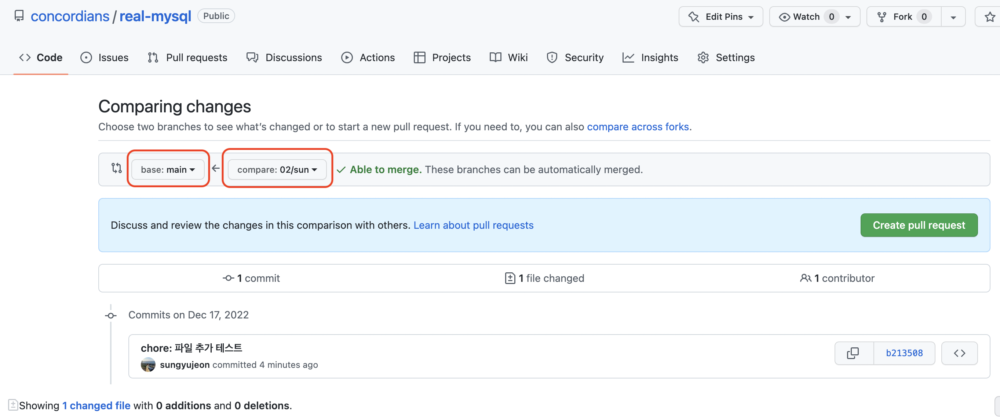
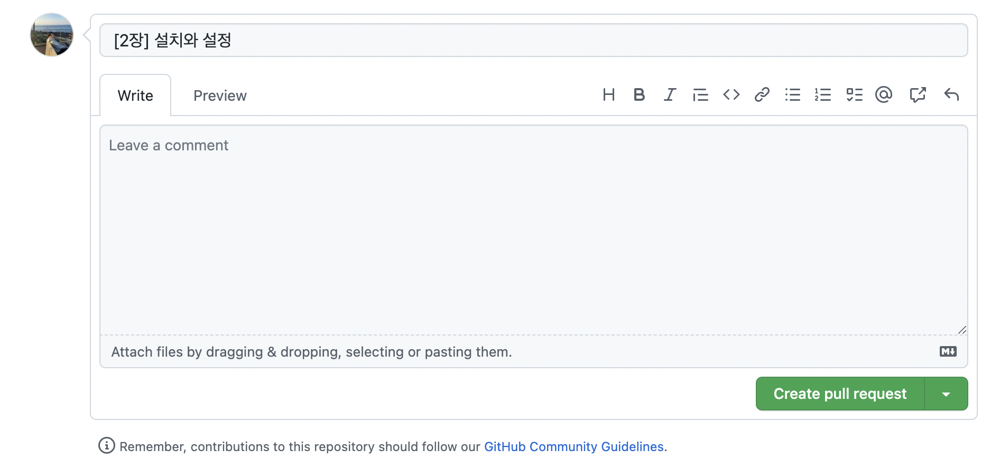
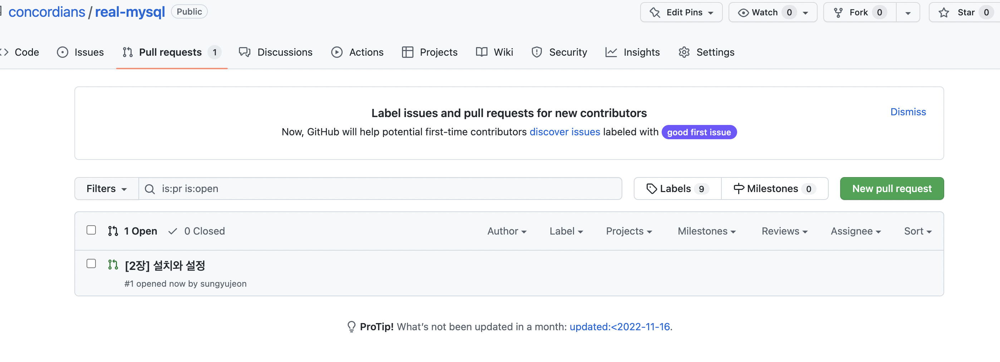
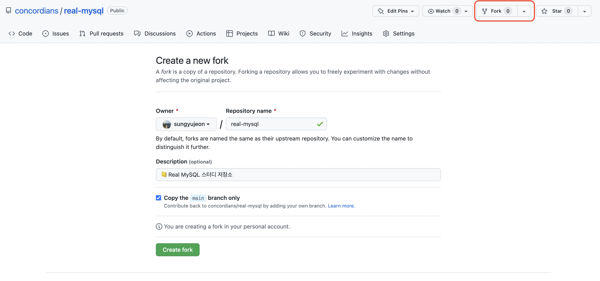

# git-basic

 

## 시작하기에 앞서

##### 스터디 용어 통일

> concordians 스터디에서만 사용하는 용어를 통일합니다. 

- 저장소(repository)를 `global`, `fork`, `local` 로 나눕니다.
  - global: concordians 그룹의 my-sql 저장소 [link](https://github.com/concordians/real-mysql)
  - fork: 각자 github repository로 fork한 저장소
  - local: git clone을 통해 로컬PC에 존재하는 폴더
- 브랜치(branch)는 `main`, `feature`만 존재하고, develop은 제외합니다.
  - feature 브랜치에서 작업한 내용을 main 브랜치에 바로 PR을 요청합니다.

##### 학습 범위

- 학습 범위는 이론 정리와 실습으로 나뉩니다. 이론 정리는 필수이며, 실습은 선택입니다.

- global 저장소에는 실습 자료가 아닌, 이론을 정리한 markdown 파일만을 PR & merge 하는 것을 원칙으로 합니다.

- global 저장소를 fork 한 `fork` 저장소에서는 자유롭게 실습하고, 어떠한 규칙도 적용받지 않습니다.

  - 리뷰를 받고 싶을 때만 global 저장소의 `review` branch에 PR을 날려주세요.

    (해당 PR은 merge 되지 않고 리뷰가 종료되면 closed 됩니다)

##### 질문

- 학습 도중 궁금한 것이 있으면 `issues` 탭을 이용합니다.

  - 다음 링크를 참조해주세요.
  - [issues 탭 이용하기]()

  (discussion 탭이 있지만 issues 탭 활성화 여부에 따라 추후 결정합니다)

 

## global 저장소 PR 방법

> 아래 내용은 git을 처음 사용하는 분들을 위한 내용입니다.
>
> 이미 git 사용법을 아시는 분은 아래 규칙을 지켜 PR 해주시기 바랍니다.
>
> 규칙
>
> - 브랜치명: `챕터번호/닉네임`(e.g. 02/sun)
> - 파일명: `my-sql/chapter{N}/` 경로의 `N_제목_이름` (e.g. my-sql/chapter02/02\_설치와설정_전선규.md)
> - PR: main 브랜치로 직접 pr (e.g. 02/sun -> main)
> - PR명: 제목 앞에 `[N장]` 포함, 이외 자유(e.g. [2장] 설치와 설정)

##### git 다운받기

- windows OS 사용자: [git for windows](https://gitforwindows.org/)
- mac OS 사용자
  - [xcode로 git 설치하기](http://bkcarrier.tistory.com/35)
  - [homebrew로 git 설치하기](https://hanco.tistory.com/14)

##### global 저장소 clone받기

- clone받기

  `git clone https://github.com/concordians/real-mysql.git`

  - url 복사

    

  - repository를 저장할 폴더 경로에서 clone 명령어 실행

    

 

##### 작업하기

- feature 브랜치 생성하기

  - 생성규칙

    - feature 브랜치명은 각 장의 숫자로 대체한다.
    - 2장의 경우 `02/{nickname}` 처럼 생성하며, 각 장을 나누어 진행하는 주에는 해당 브랜치를 계속 사용한다. (e.g. `02/sun`)

  - 브랜치 생성

    `git switch -c 02/sun`

    

  - 브랜치 확인

    `git branches`

  - 브랜치 이동

    `git switch {branch_name}`

  - 기타 명령어는 [홈페이지](https://git-scm.com/docs/git)를 참조한다.

- 파일 만들기

  - 파일은 `my-sql/chapter{N}/` 경로의 `N_제목_이름` 형식으로 생성한다.

  - markdown 파일을 기본으로 하며, 필요 시 다른 포맷을 사용하여도 무방하다.

    [무료 마크다운 에디터 추천](https://lynmp.com/en/article/be811c9dc501)

  

- 정리하기
  - 파일에 내용을 정리한다.

 

##### stage & commit하기

- 파일 수정이 완료되면 stage 영역에 올린다.

  `git add {file_name or command} `

- 커밋한다.

  `git commit` or `git commit -m "{message}"`

  - 커밋 메시지는 [커밋메시지컨벤션](https://gist.github.com/stephenparish/9941e89d80e2bc58a153)을 참고해 log를 남려고 노력한다.

 

##### remote branch push하기

`git push origin` or `git push origin 02/sun` 

 

##### PR

- pull request 탭 이동

  

- pull request 만들기

  - Compare & pull request 또는 New pull request 클릭

  

- (new pull request의 경우) source-target 브랜치 설정

  

- PR 및 확인

  - PR 제목에는 반드시 앞에 `[N장]` 을 붙인다.
  - 이외 제목 및 내용은 자유롭게 입력한다.

  

  

 

## 실습용 fork 및 리뷰요청 방법

##### fork

- global 저장소의 fork 버튼을 클릭해 개별 github 레포로 가져간다.

##### 리뷰 요청

- 리뷰는 main이 아닌 `review` 브랜치에 요청한다.
- PR 시 Reviewers에 멤버들을 추가한다.
- 해당 PR은 리뷰 완료 후 closed 된다.